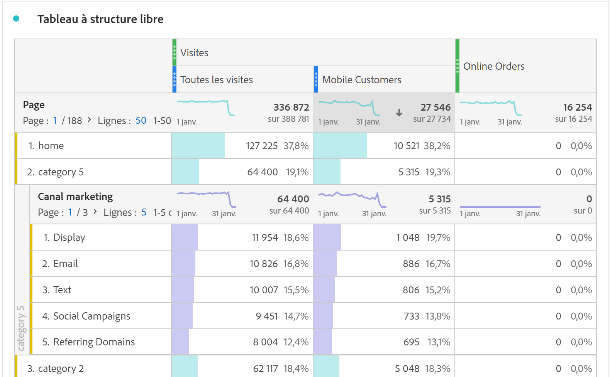
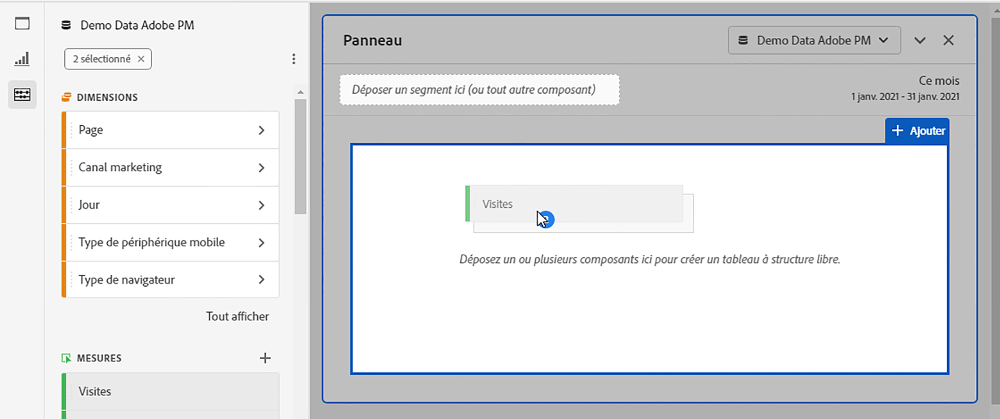
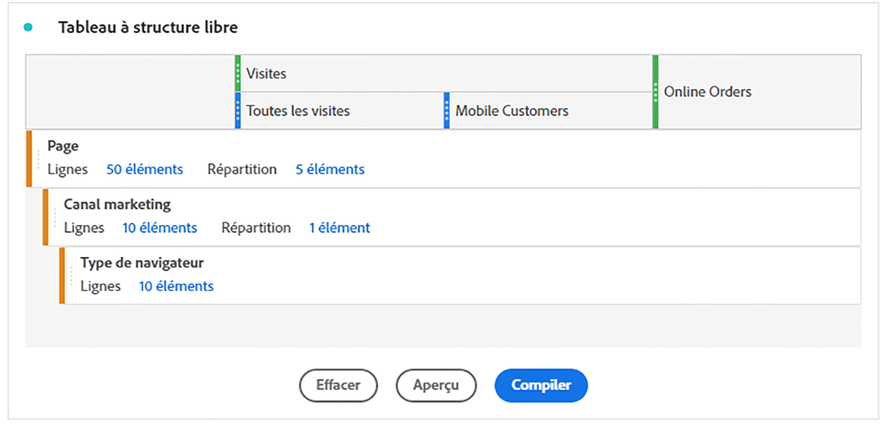

# Présentation du tableau à structure libre {#freeform-table-overview}

<!-- markdownlint-disable MD034 -->

>[!CONTEXTUALHELP]
>id="cja_workspace_freeformtable_button"
>title="Tableau à structure libre"
>abstract="Créez une visualisation de tableau à structure libre vide que vous pouvez créer à l’aide de dimensions, de segments, de mesures et de périodes. Vous pouvez utiliser le tableau à structure libre comme base pour d’autres visualisations."

<!-- markdownlint-enable MD034 -->

Dans Analysis Workspace, une visualisation  **[!UICONTROL Tableau à structure libre]** est la base de l’analyse de données interactive. Vous pouvez faire glisser et déposer un ensemble de [composants](https://experienceleague.adobe.com/en/docs/analytics/analyze/analysis-workspace/components/analysis-workspace-components) dans les lignes et les colonnes afin de créer un tableau personnalisé pour votre analyse. Lorsque chaque composant est déposé, le tableau est mis à jour immédiatement afin que vous puissiez rapidement analyser et creuser plus en détail.

Pour créer et configurer une [!UICONTROL table à structure libre] :

* Ajoutez une visualisation  **[!UICONTROL Tableau à structure libre]** . Voir [Ajout d’une visualisation à un panneau](../freeform-analysis-visualizations.md#add-visualizations-to-a-panel).

## Tableaux automatisés

Le moyen le plus rapide de créer un tableau consiste à déposer les composants directement dans un projet, un panneau ou un tableau à structure libre vierge. Un tableau à structure libre est créé pour vous dans un format recommandé. [Regarder le tutoriel](https://experienceleague.adobe.com/en/docs/analytics-learn/tutorials/analysis-workspace/building-freeform-tables/auto-build-freeform-tables-in-analysis-workspace).

## Créateur de tableau à structure libre

Si vous préférez d’abord ajouter plusieurs composants à votre table, puis effectuer le rendu des données, vous pouvez sélectionner **[!UICONTROL Activer le générateur de tableau]**. Une fois le créateur activé, vous pouvez faire glisser et déposer des dimensions, des ventilations, des mesures et des filtres afin de créer des tableaux qui répondent à des questions plus complexes. Mises à jour des données une fois que vous avez sélectionné **[!UICONTROL Build]**.

## Interactions

Vous pouvez interagir et personnaliser un tableau à structure libre de différentes manières :

### Filtrage et tri

* Vous pouvez [filtrer et trier](filter-and-sort.md) les données d&#39;un tableau.

### Lignes

* Vous pouvez rapidement [créer une visualisation](../freeform-analysis-visualizations.md#visualize) à partir d’une ou de plusieurs lignes à l’aide de .
* Vous pouvez afficher davantage de lignes sur un seul écran en réglant la [densité d’affichage](https://experienceleague.adobe.com/en/docs/analytics/analyze/analysis-workspace/build-workspace-project/view-density) du projet.
* Chaque ligne de dimension peut afficher jusqu’à 400 lignes avant la pagination. Sélectionnez le nombre situé en regard de **[!UICONTROL Lignes]** dans l’en-tête de la première colonne pour afficher davantage de lignes sur une page. Accédez à une autre page à l’aide de  dans l’en-tête de la première colonne.
* Vous pouvez ventiler des lignes par composants supplémentaires. Pour ventiler plusieurs lignes à la fois, sélectionnez plusieurs lignes, puis faites glisser le composant suivant au-dessus des lignes sélectionnées. En savoir plus sur la [répartition](https://experienceleague.adobe.com/en/docs/analytics/analyze/analysis-workspace/components/dimensions/t-breakdown-fa).
* Les lignes peuvent être [filtrées](https://experienceleague.adobe.com/en/docs/analytics/analyze/analysis-workspace/visualizations/freeform-table/filter-and-sort) pour n’afficher que certains éléments. D’autres paramètres sont disponibles dans les [Paramètres des lignes](https://experienceleague.adobe.com/en/docs/analytics/analyze/analysis-workspace/visualizations/freeform-table/column-row-settings/table-settings).

### Colonnes

* Les composants peuvent être empilés dans des colonnes afin de créer des mesures filtrées, des analyses sur plusieurs onglets, etc.
* La vue de chaque colonne peut être ajustée dans les [Paramètres des colonnes](https://experienceleague.adobe.com/en/docs/analytics-platform/using/cja-workspace/visualizations/freeform-table/column-row-settings/column-settings).
* Plusieurs actions sont disponibles via le [menu contextuel](https://experienceleague.adobe.com/en/docs/analytics-learn/tutorials/analysis-workspace/navigating-workspace-projects/right-click-for-workspace-efficiency). Le menu propose différentes actions selon que vous sélectionnez l’en-tête, les lignes ou les colonnes du tableau.

## Paramètres

Sélectionnez  pour afficher les **[!UICONTROL paramètres de table]**. Les [settings](../freeform-analysis-visualizations.md#settings) de visualisation spécifique suivants sont disponibles :

### Source de données

| Option | Description |
|---|---|
| **[!UICONTROL Visualisations liées]**. | Répertorie toutes les visualisations liées. |
| **[!UICONTROL Afficher la source de données]** | Lorsque cette option est désactivée, le tableau à structure libre qui fonctionne comme source de données pour la visualisation est masqué dans Workspace. |

### Paramètres

| Option | Description |
|---|---|
| **[!UICONTROL Harmonisez les dates de chaque colonne pour qu&#39;elles commencent toutes sur la même ligne]** | Pour aligner ou non les dates de chaque colonne afin qu’elles commencent toutes sur la même ligne. |

## Menu contextuel

Les options [menu contextuel](../freeform-analysis-visualizations.md#context-menu) suivantes sont disponibles dans l’en-tête de la visualisation :

| Option | Description |
| --- | --- |
| **[!UICONTROL Insérer une visualisation copiée]**n | Collez (insérez) une visualisation copiée à un autre emplacement du projet ou dans un projet complètement différent. |
| **[!UICONTROL Copier des données dans le Presse-papiers]** | Copiez les données de la visualisation dans le Presse-papiers. |
| **[!UICONTROL Copier la sélection dans le Presse-papiers]** | Copiez la sélection de la visualisation dans le Presse-papiers. |
| **[!UICONTROL Télécharger des éléments au format CSV (*nom de dimension*)]** | Téléchargez immédiatement les éléments de dimension (jusqu’à 50 000 au maximum) de la visualisation sur votre appareil local. 50 000 éléments de dimension au maximum pour la dimension sélectionnée. |
| **[!UICONTROL Copier la visualisation]** | Copiez la visualisation afin de pouvoir insérer la visualisation à un autre emplacement du projet ou dans un projet complètement différent. |
| **[!UICONTROL Télécharger des données CSV]** | Téléchargez immédiatement les données affichées de la visualisation sur votre appareil local. |
| **[!UICONTROL Exporter la table complète..]** | Exportez le tableau complet vers des emplacements cloud désignés. Voir [Exporte des rapports de Customer Journey Analytics vers le cloud](../../export/export-cloud.md) |
| **[!UICONTROL Dupliquer la visualisation]** | Effectuez un double exact de la visualisation. |
| **[!UICONTROL Modifier la description]** | Ajoutez (ou modifiez) une description textuelle pour la visualisation. Voir [Texte](../text.md). |
| **[!UICONTROL Obtenir le lien de visualisation]** | Copiez et partagez un lien directement vers la visualisation. Une boîte de dialogue Partager le lien s’affiche. Sélectionnez Copier pour copier le lien dans le presse-papiers. |
| **[!UICONTROL Recommencer]** | Supprimez la configuration de la visualisation actuelle pour pouvoir la reconfigurer entièrement. |

>[!MORELIKETHIS]
>
>[Ajouter une visualisation à un panneau](/help/analysis-workspace/visualizations/freeform-analysis-visualizations.md#add-visualizations-to-a-panel)
>[Paramètres de visualisation](/help/analysis-workspace/visualizations/freeform-analysis-visualizations.md#settings)
>[Menu contextuel de visualisation](/help/analysis-workspace/visualizations/freeform-analysis-visualizations.md#context-menu)
>
