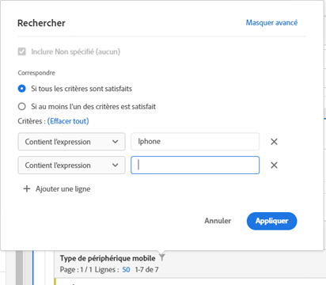
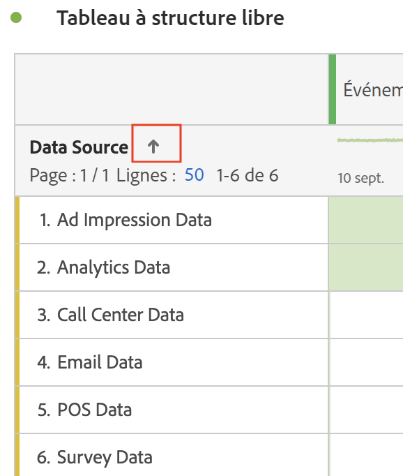

# Pagination, filtrage et tri des tables

Pour une présentation de la pagination, du filtrage et du tri des tableaux dans Analysis Workspace, regardez ce tutoriel vidéo :

>[!VIDEO](https://video.tv.adobe.com/v/23968)

## Options de filtrage avancé {#section_36E92E31442B4EBCB052073590C1F025}

Cliquer sur l’icône de filtrage, puis sur **[!UICONTROL Afficher les options avancées]** à côté d’une dimension dans un tableau à structure libre permet de filtrer les informations selon les critères suivants. Vous pouvez appliquer plusieurs règles de filtrage.

* Contient
* Ne contient pas
* Contient tous les termes
* Contient n’importe quel terme
* Contient l’expression
* Ne contient aucun terme
* Ne contient pas l’expression
* Est égal à
* N’est pas égal à
* Commence par
* Se termine par

## Tri des dimensions dans les tableaux à structure libre

>[!NOTE]
>
>Le tri des dimensions s’applique uniquement aux tableaux à structure libre dans Customer Journey Analytics et non dans la version traditionnelle d’Adobe Analytics. Le tri des mesures peut être effectué dans les deux versions d’Analytics.

1. Dans n’importe quel tableau à structure libre d’un projet, cliquez sur la flèche située à côté du nom de la dimension :

* La flèche de déplacement vers le bas trie par ordre descendant et la flèche vers le haut (par défaut) par ordre ascendant.
* Vous pouvez trier les dimensions par ordre alphabétique ou numérique. Par exemple, vous pouvez avoir des étapes numérotées dans un workflow et vouloir trier par numéro d’étape. Vous pouvez trier une dimension liée à la date en fonction de la date. Ou vous pouvez trier les sources de données par ordre alphabétique, comme dans la capture d’écran ci-dessus.
