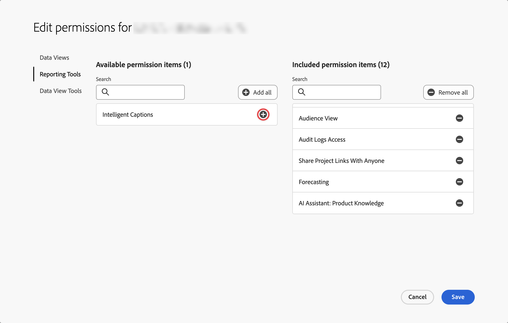

# Légendes intelligentes {#intelligent-captions}

>[!CONTEXTUALHELP]
>id="workspace_intelligentcaptions"
>title="Légendes intelligentes"
>abstract="Générez des informations en langage naturel pour faciliter la compréhension et l’interprétation des données pour cette visualisation."

La fonctionnalité de légendes intelligentes utilise l’IA générative avancée pour fournir des informations essentielles sur les visualisations Workspace les plus utilisées en langage naturel.

Les légendes intelligentes sont conçues pour les personnes suivantes :

* Les analystes, qui ont besoin de récits à partager avec d’autres personnes. Les analystes ont besoin de ces informations pour pouvoir fournir un contexte à leurs utilisateurs et utilisatrices.
* Les utilisateurs et utilisatrices professionnels, qui souhaitent découvrir rapidement des points à retenir de haut niveau.

>[!BEGINSHADEBOX]

Consultez  [Légendes intelligentes](https://video.tv.adobe.com/v/3443140/?captions=fre_fr&quality=12&learn=on){target="_blank"} pour une vidéo de démonstration.

>[!ENDSHADEBOX]

## Lancer les légendes intelligentes {#launch}

Pour lancer des légendes intelligentes générées automatiquement pour une visualisation, sélectionnez  en haut à droite de la visualisation. Cette sélection génère des informations en langage naturel.

Gardez les éléments suivants à l’esprit :

* Vous avez besoin d’au moins 3 points de données pour générer des légendes avec succès. Dans le cas contraire, vous pourriez obtenir une erreur telle que **[!UICONTROL Pas assez de données à analyser]**.

* Les légendes sont générées chaque fois que les données sélectionnées sous-jacentes sont modifiées dans le tableau qui alimente la visualisation.

* S’il existe plusieurs mesures dans un tableau à structure libre associé, les légendes ne sont générées que pour la première mesure ou la mesure actuellement sélectionnée par l’utilisateur ou l’utilisatrice. Cependant, des légendes peuvent être générées pour plusieurs mesures dans les visualisations Ligne et Surface.

* Si vous enregistrez le projet à un moment donné et que vous le rechargez ultérieurement, les légendes sont automatiquement mises à jour avec les nouvelles données. Il en va de même pour les projets planifiés et les fichiers PDF exportés à partir d’un projet.

## Visualisations {#visualizations}

Les légendes intelligentes sont prises en charge sur les visualisations suivantes :

* [Ligne](line.md) (y compris multiligne)
* [Barre](bar.md)
* [Barres horizontales](horizontal-bar.md)
* [Surface](area.md) (y compris les lignes de surface multiples)
* [Anneau](donut.md)
* [Abandons](fallout/fallout-flow.md)
* [Flux](c-flow/flow.md)

<!--
Here is an example of what intelligent captions could look like:

-->

## Actions

Vous pouvez effectuer les actions suivantes sur les légendes intelligentes :

### Copier dans le presse-papiers {#copy}

Vous pouvez copier les légendes dans un presse-papiers et les coller dans un fichier PowerPoint ou dans d’autres outils. Vous pouvez copier des légendes individuelles dans la vue détaillée ou copier toutes les légendes à la fois dans la vue de légende développée.

* Pour copier les légendes, sélectionnez  en haut à droite de la boîte de dialogue des légendes.

### Afficher toutes les légendes intelligentes ou des légendes intelligentes individuelles  {#show-all-or-individual}

Vous pouvez choisir d’afficher toutes les légendes intelligentes en même temps dans une vue développée ou d’afficher des légendes intelligentes individuelles dans une vue détaillée.

* Pour afficher toutes les légendes intelligentes, sélectionnez .
* Pour afficher individuellement les légendes intelligentes, sélectionnez .

### Modifier l’affichage {#edit}

Vous pouvez modifier l’affichage des légendes, par exemple en masquant ou en affichant une catégorie particulière d’informations.

1. Sélectionnez  dans la boîte de dialogue Légendes intelligentes.

1. Basculez entre  pour afficher une information spécifique (comme **[!UICONTROL Min]**) ou  pour masquer une information spécifique (comme **[!UICONTROL Pic]**).

   

1. Sélectionnez **[!UICONTROL Appliquer]**.

### Fournir des commentaires

Vous pouvez commenter les légendes intelligentes générées (les commentaires ne peuvent être fournis que dans la vue de légende développée).

1. Sélectionnez  dans la boîte de dialogue Légendes intelligentes.

1. Sélectionnez  **[!UICONTROL Bonne réponse]**,  **[!UICONTROL Mauvaise réponse]** ou  **[!UICONTROL Rapport]**.

1. Dans la boîte de dialogue **[!UICONTROL Merci pour vos commentaires]**, saisissez vos commentaires et sélectionnez **[!UICONTROL Envoyer]** pour envoyer les commentaires.

### Exporter {#export}

Vous pouvez exporter des légendes intelligentes dans le cadre d’un PDF, à condition que le projet soit enregistré avec les légendes intelligentes générées.

### Désactiver {#toggle}

Si vous préférez ne pas afficher de légendes intelligentes, vous pouvez désactiver la fonction.

1. Accédez aux [préférences des visualisations](/help/analysis-workspace/user-preferences.md#visualizations-preferences).
1. Décochez **[!UICONTROL Afficher les légendes intelligentes]**.

   

1. Sélectionnez **[!UICONTROL Enregistrer]** pour enregistrer la préférence.

## Légendes intelligentes des cartes de performance mobiles

Les légendes intelligentes sont également disponibles dans les [cartes de performance mobiles](https://experienceleague.adobe.com/fr/docs/analytics-platform/using/cja-dashboards/manage-scorecard#captions) de Customer Journey Analytics.

## Accès aux fonctionnalités

Les paramètres suivants régissent l’accès aux légendes intelligentes :

* **Accès à la solution** : la fonctionnalité de légendes intelligentes est disponible dans Customer Journey Analytics, mais pas dans Adobe Analytics.

* **Accès contractuel** : si vous ne pouvez pas utiliser de légendes intelligentes, contactez l’administrateur ou l’administratrice de votre entreprise ou le représentant ou la représentante de compte Adobe (Admin). Avant de pouvoir utiliser des légendes intelligentes dans votre organisation, vous devez accepter certaines conditions juridiques liés à l’IA générative.

* **Autorisations** : dans [!UICONTROL Adobe Admin Console], l’autorisation [!UICONTROL Outils de création de rapports] **[!UICONTROL Légendes intelligentes]** détermine l’accès. Un [administrateur ou une administratrice de profil de produit](https://helpx.adobe.com/fr/enterprise/using/manage-product-profiles.html) doit suivre les étapes suivantes dans l’[!UICONTROL Admin Console] :
   1. Accédez à **[!UICONTROL Admin Console]** > **[!UICONTROL Produits et services]** > **[!UICONTROL Customer Journey Analytics]** > **[!UICONTROL Profils de produit]**.
   1. Sélectionnez le titre du profil de produit pour lequel vous souhaitez fournir un accès aux légendes intelligentes.
   1. Dans le profil de produit spécifique, sélectionnez **[!UICONTROL Autorisations]**.
   1. Sélectionnez  pour modifier les **[!UICONTROL Outils de création des rapports]**.
   1. Sélectionnez  pour ajouter des **Légendes intelligentes** aux **[!UICONTROL Éléments d’autorisation inclus]**.

      

   1. Sélectionnez **[!UICONTROL Enregistrer]** pour enregistrer les autorisations.

Pour plus d’informations, consultez [Contrôle d’accès](/help/technotes/access-control.md#access-control).
