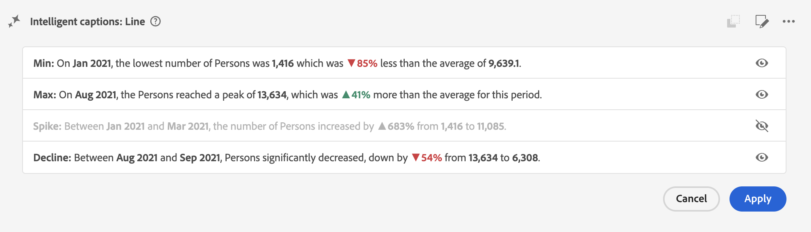

# Légendes intelligentes {#intelligent-captions}

<!-- markdownlint-disable MD034 -->

>[!CONTEXTUALHELP]
>id="workspace_intelligentcaptions_area"
>title="Légendes intelligentes : Zone"
>abstract="Générez des informations en langage naturel pour faciliter la compréhension et l’interprétation des données pour cette visualisation."

<!-- markdownlint-enable MD034 -->

<!-- markdownlint-disable MD034 -->

>[!CONTEXTUALHELP]
>id="workspace_intelligentcaptions_bar"
>title="Légendes intelligentes : Barre"
>abstract="Générez des informations en langage naturel pour faciliter la compréhension et l’interprétation des données pour cette visualisation."

<!-- markdownlint-enable MD034 -->

<!-- markdownlint-disable MD034 -->

>[!CONTEXTUALHELP]
>id="workspace_intelligentcaptions_donut"
>title="Légendes intelligentes : Anneau"
>abstract="Générez des informations en langage naturel pour faciliter la compréhension et l’interprétation des données pour cette visualisation."

<!-- markdownlint-enable MD034 -->

<!-- markdownlint-disable MD034 -->

>[!CONTEXTUALHELP]
>id="workspace_intelligentcaptions_horizontalbar"
>title="Légendes intelligentes : barre horizontale"
>abstract="Générez des informations en langage naturel pour faciliter la compréhension et l’interprétation des données pour cette visualisation."

<!-- markdownlint-enable MD034 -->

<!-- markdownlint-disable MD034 -->

>[!CONTEXTUALHELP]
>id="workspace_intelligentcaptions_line"
>title="Légendes intelligentes : Ligne"
>abstract="Générez des informations en langage naturel pour faciliter la compréhension et l’interprétation des données pour cette visualisation."

<!-- markdownlint-enable MD034 -->

<!-- markdownlint-disable MD034 -->

>[!CONTEXTUALHELP]
>id="workspace_intelligentcaptions_fallout"
>title="Légendes intelligentes : abandon"
>abstract="Générez des informations en langage naturel pour faciliter la compréhension et l’interprétation des données pour cette visualisation."

<!-- markdownlint-enable MD034 -->

<!-- markdownlint-disable MD034 -->

>[!CONTEXTUALHELP]
>id="workspace_intelligentcaptions_flow"
>title="Légendes intelligentes : Flux"
>abstract="Générez des informations en langage naturel pour faciliter la compréhension et l’interprétation des données pour cette visualisation."

<!-- markdownlint-enable MD034 -->

Les sous-titres intelligents utilisent le machine learning avancé et l’IA générative pour fournir des informations précieuses en langage naturel aux visualisations Workspace. La version initiale fournit des informations générées automatiquement pour la visualisation [Ligne](line.md). D’autres visualisations suivront.

Les sous-titres intelligents sont conçus pour :

* Les analystes, qui ont besoin de récits à partager avec d&#39;autres utilisateurs. Les analystes ont besoin de ces informations pour pouvoir fournir un contexte à leurs utilisateurs.
* Les utilisateurs professionnels, qui souhaitent découvrir rapidement des points à retenir de haut niveau.

## Lancer les légendes intelligentes {#launch}

Pour lancer des légendes générées automatiquement pour une visualisation en ligne, sélectionnez  **[!UICONTROL Légendes intelligentes]** en haut à droite de la visualisation.

Des informations en langage naturel sont maintenant générées.

Gardez les éléments suivants à l’esprit :

* Vous avez besoin d’au moins 3 points de données pour générer des sous-titres avec succès. Dans le cas contraire, vous pourriez obtenir une erreur telle que **[!UICONTROL Pas assez de données à analyser]**.

* Les légendes sont générées chaque fois que les données sélectionnées sous-jacentes sont modifiées dans le tableau qui alimente la visualisation.

* Si le tableau contient plusieurs mesures, les légendes ne sont générées que pour la première mesure ou la mesure actuellement sélectionnée par l’utilisateur ou l’utilisatrice.

* Si vous enregistrez le projet à un moment donné et que vous le rechargez ultérieurement, les sous-titres sont automatiquement mis à jour avec les nouvelles données. Il en va de même pour les projets planifiés et les fichiers de PDF exportés à partir d’un projet.

Voici un exemple de ce à quoi pourraient ressembler les légendes intelligentes :

## Actions

Vous pouvez effectuer les actions suivantes sur les légendes intelligentes :

### Copier dans le presse-papiers {#copy}

Vous pouvez copier les légendes dans un presse-papiers et les coller dans un fichier PowerPoint ou dans d’autres outils. Sélectionnez  en haut à droite de la boîte de dialogue des légendes.

### Modifier l’affichage {#edit}

Vous pouvez modifier l’affichage des légendes, par exemple en masquant ou en affichant une catégorie particulière d’informations.

1. Sélectionnez  dans la boîte de dialogue Légendes intelligentes .

1. Basculez entre  pour afficher une information spécifique (comme **[!UICONTROL Min]**) ou  pour masquer une information spécifique (comme **[!UICONTROL Pic]**).

   

1. Sélectionnez **[!UICONTROL Appliquer]**.

### Fournir des commentaires

Vous pouvez fournir des commentaires sur les légendes intelligentes générées.

1. Sélectionnez  dans la boîte de dialogue Légendes intelligentes .

1. Sélectionnez  **[!UICONTROL Bonne réponse]**,  **[!UICONTROL Mauvaise réponse]** ou  **[!UICONTROL Report]**.

1. Dans la boîte de dialogue **[!UICONTROL Merci pour vos commentaires]**, saisissez vos commentaires et sélectionnez **[!UICONTROL Envoyer]** pour envoyer les commentaires.

### Exporter {#export}

Vous pouvez exporter des légendes intelligentes dans le cadre d’un PDF, à condition que le projet soit enregistré avec les légendes intelligentes générées.

### Basculer vers désactivé {#toggle}

Si vous préférez ne pas afficher de légendes intelligentes, vous pouvez désactiver la fonction.

1. Accédez à [Préférences de visualisation](/help/analysis-workspace/user-preferences.md#visualizations-preferences).
1. Décochez **[!UICONTROL Afficher les légendes intelligentes]**.

   

1. Sélectionnez **[!UICONTROL Enregistrer]** pour enregistrer la préférence.

## Légendes intelligentes dans les cartes de performance mobiles

Les légendes intelligentes sont également disponibles dans le Customer Journey Analytics [cartes de performance mobiles](https://experienceleague.adobe.com/fr/docs/analytics-platform/using/cja-dashboards/manage-scorecard#captions).

## Accès aux fonctionnalités

Les paramètres suivants régissent l’accès aux légendes intelligentes :

* **Accès à la solution** : la fonctionnalité de légendes intelligentes est disponible dans Customer Journey Analytics, mais pas dans Adobe Analytics.

* **Accès contractuel** : si vous ne pouvez pas utiliser de légendes intelligentes, contactez l’administrateur ou l’administratrice de votre entreprise ou le représentant ou la représentante de compte d’Adobe. Avant de pouvoir utiliser des sous-titres intelligents dans votre organisation, vous devez accepter certains termes juridiques liés à GenAI.

* **Autorisations** : dans [!UICONTROL Adobe Admin Console], l’autorisation [!UICONTROL Outils de création de rapports] **[!UICONTROL Légendes intelligentes]** détermine l’accès. Un [administrateur de profil de produit](https://helpx.adobe.com/fr/enterprise/using/manage-product-profiles.html) doit suivre les étapes suivantes dans l’Admin Console  :
   1. Accédez à **[!UICONTROL Admin Console]** > **[!UICONTROL Produits et services]** > **[!UICONTROL Customer Journey Analytics]** > **[!UICONTROL Profils de produit]**.
   1. Sélectionnez le titre du profil de produit pour lequel vous souhaitez fournir un accès aux sous-titres intelligents.
   1. Dans le profil de produit spécifique, sélectionnez **[!UICONTROL Autorisations]**.
   1. Sélectionnez  pour modifier **[!UICONTROL Outils de reporting]**.
   1. Sélectionnez  pour ajouter **Légendes intelligentes** aux **[!UICONTROL Éléments d’autorisation inclus]**.

      

   1. Sélectionnez **[!UICONTROL Enregistrer]** pour enregistrer les autorisations.

Voir [Contrôle d’accès](/help/technotes/access-control.md#access-control) pour plus d’informations.
