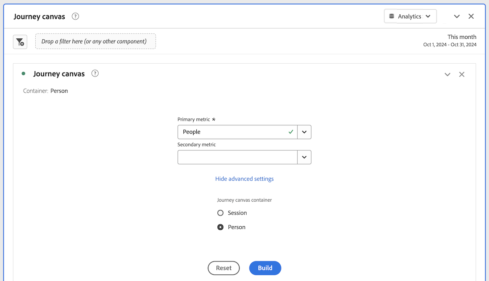
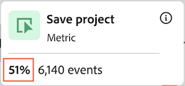

# Configurer une visualisation de la zone de travail du parcours

La visualisation de la zone de travail des Parcours vous permet d’analyser les parcours que vous fournissez à vos utilisateurs et clientes, et d’obtenir des informations détaillées à leur sujet.

## Vue d’ensemble de Zone de travail de parcours

Voir la présentation de la zone de travail de Parcours [&#128279;](/help/analysis-workspace/visualizations/journey-canvas/journey-canvas.md) pour en savoir plus sur la zone de travail de Parcours, notamment :

* Principales fonctionnalités

* Informations potentielles

* Différences entre la zone de travail Parcours et l’abandon

* Détails sur l’analyse des parcours Journey Optimizer

* Et en plus

## Commencer à créer une visualisation de zone de travail de Parcours

1. Ajoutez un panneau vierge à votre projet, sélectionnez l’icône [!UICONTROL **Visualisations**] dans le rail de gauche, puis faites glisser la visualisation  [!UICONTROL **Parcours de la zone de travail**] dans le panneau.

   Ou

   Ajoutez une visualisation de zone de travail de Parcours de l’une des manières décrites dans la section [Ajouter des visualisations à un panneau](/help/analysis-workspace/visualizations/freeform-analysis-visualizations.md#add-visualizations-to-a-panel) dans [Vue d’ensemble des visualisations](/help/analysis-workspace/visualizations/freeform-analysis-visualizations.md).

   Configuration de la zone de travail de Parcours 

1. Spécifiez les informations de base suivantes pour configurer la zone de travail du Parcours :

   | Champ | Fonction |
   |---------|----------|
   | [!UICONTROL **Mesure principale**] | Détermine la mesure utilisée lors du calcul des valeurs de pourcentage et de nombre sur chaque nœud du parcours.
**Remarque** : la portée des données incluses dans chaque valeur de pourcentage et de nombre est déterminée par la mesure que vous choisissez dans le champ **[!UICONTROL Conteneur de zone de travail de Parcours]**. Par exemple, si **[!UICONTROL Personne]** est défini comme conteneur, les statistiques affichées dans le parcours s’étendent sur plusieurs sessions pour une personne donnée. Si **[!UICONTROL Session]** est défini comme conteneur, les statistiques affichées dans le parcours sont limitées à une seule session définie pour une personne donnée.

Examinons les exemples suivants illustrant l’impact de la mesure principale sur les valeurs de pourcentage et de nombre de chaque nœud :
<ul><li>Si _Personnes_ est la mesure principale et _Personne_ le conteneur, alors seules les personnes disposant d’un événement correspondant aux critères de chaque nœud successif du parcours se déplacent dans le parcours. L’abandon se produit sur un nœud lorsqu’une personne n’est jamais arrivée à l’un des nœuds suivants immédiats du parcours. Il se peut qu’il ait effectué d’autres actions sur le site, mais il ne répondait aux critères définis par aucun des nœuds qui suivent immédiatement.</li><li>Si _Personnes_ est la mesure principale et _Session_ le conteneur, alors seules les personnes disposant d’un événement correspondant aux critères de chaque nœud du parcours dans une seule session se déplacent dans le parcours. L’abandon se produit sur un nœud lorsqu’une personne n’est jamais arrivée à l’un des nœuds suivants immédiats du parcours au cours d’une seule session. Il se peut qu’ils aient effectué d’autres actions sur le site au cours de la session, mais ils ne répondaient pas aux critères définis par l’un des nœuds qui suivent immédiatement.</li></ul> 
La mesure principale affecte les aspects suivants de la visualisation de la zone de travail du Parcours :
<ul><li>Nombre total affiché sur chaque nœud.  
Par exemple, si la mesure Principale est Événements , chaque nœud indique le nombre de personnes qui ont eu un événement correspondant aux critères de ce nœud (et de chaque nœud précédent qui y mène dans le parcours).
</li><li>Pourcentage affiché sur chaque nœud. (Une fois la visualisation créée, vous pouvez utiliser le menu déroulant **[!UICONTROL Valeur de pourcentage]** pour choisir d’afficher le pourcentage du total, le pourcentage du nœud précédent ou le pourcentage du nœud de départ.)
Par exemple, si la mesure Principale est Événements , chaque nœud affiche le pourcentage de personnes qui ont eu un événement correspondant aux critères de ce nœud (et de chaque nœud précédent y menant dans le parcours).
</li><li>Lorsqu’une dimension est ajoutée à la visualisation, les 3 premiers nœuds de la visualisation sont ajoutés, en fonction de la mesure principale.</li></ul> |
   | [!UICONTROL **Mesure secondaire**] | Détermine la mesure secondaire utilisée lors du calcul des valeurs de pourcentage et de nombre sur chaque nœud du parcours. La mesure secondaire est facultative. 
**Remarque** : la portée des données incluses dans chaque valeur de pourcentage et de nombre est déterminée par la mesure que vous choisissez dans le champ **[!UICONTROL Conteneur de zone de travail de Parcours]**. Par exemple, si **[!UICONTROL Personne]** est défini comme conteneur, les statistiques affichées dans le parcours s’étendent sur plusieurs sessions pour une personne donnée. Si **[!UICONTROL Session]** est défini comme conteneur, les statistiques affichées dans le parcours sont limitées à une seule session définie pour une personne donnée.

Lorsqu’une mesure secondaire est configurée, elle affecte les aspects suivants de la visualisation de la zone de travail du Parcours :
<ul><li>Nombre total affiché sur chaque nœud sous la mesure principale. 
Par exemple, si Comptes est la mesure secondaire, le nombre de comptes s’affiche sur le nœud pour toutes les personnes qui ont atteint ce nœud dans le parcours.
</li><li>Pourcentage affiché sur chaque nœud sous la mesure principale. (Une fois la visualisation créée, vous pouvez choisir d’afficher le pourcentage du total ou le nœud de départ.)</li>
Par exemple, si la mesure Sessions est la mesure secondaire, chaque nœud affiche le pourcentage de sessions qui ont atteint ce nœud dans le parcours (le pourcentage du total ou du nœud de départ).
</li></ul> |
   | [!UICONTROL **parcours Journey Optimizer**]<!-- name? --> | Sélectionnez le parcours Journey Optimizer à utiliser comme base pour votre analyse dans la zone de travail du Parcours. Les parcours avec l’un des statuts suivants sont disponibles : Actif, Arrêté ou Terminé 
Vous pouvez également laisser cette option vide si vous souhaitez une zone de travail vide à partir de laquelle créer votre analyse dans Analysis Workspace.
 
Lorsque vous analysez un parcours Journey Optimizer dans la zone de travail du Parcours, le parcours s’affiche dans le même ordre, la même séquence et la même structure que dans Journey Optimizer. Pour plus d’informations, consultez [Analyse des parcours Journey Optimizer](/help/analysis-workspace/visualizations/journey-canvas/journey-canvas.md#analyze-journey-optimizer-journeys) dans la présentation de la zone de travail de Parcours [&#128279;](/help/analysis-workspace/visualizations/journey-canvas/journey-canvas.md).

**Remarque** : cette option s’affiche uniquement lorsque des données Journey Optimizer sont détectées dans la même vue de données que celle sélectionnée dans le panneau Analysis Workspace où vous ajoutez la visualisation. Pour plus d’informations sur la modification de la vue de données d’un panneau dans Analysis Workspace, consultez [Présentation d’Analysis Workspace](/help/analysis-workspace/home.md).
 |

1. (Facultatif) Sélectionnez [!UICONTROL **Afficher les paramètres avancés**], puis spécifiez les informations suivantes :

   | Champ | Fonction |
   |---------|----------|
   | Conteneur de zone de travail de Parcours [!UICONTROL **&#x200B;**] | Choisissez le conteneur sur lequel vous souhaitez placer le focus tout au long du parcours. Le conteneur que vous choisissez détermine la portée des données capturées dans le parcours. Cela affecte les statistiques affichées dans la visualisation. (Si les noms de vos conteneurs diffèrent des noms par défaut affichés ci-dessous, ils ont été personnalisés dans votre vue de données.)<ul><li>**Session :** limite les statistiques de la visualisation à une seule session définie pour une personne donnée. Cela signifie que les nombres et les pourcentages qui apparaissent sur chaque nœud (en fonction des mesures principales et secondaires) doivent se produire au cours d’une seule session pour chaque personne. En d’autres termes, une personne peut être représentée plusieurs fois dans un seul parcours.
Ce conteneur utilise la mesure Sessions .
</li><li>**Personne :** (par défaut) permet aux statistiques de la visualisation d’étendre plusieurs sessions pour une personne donnée. Cela signifie que les nombres et les pourcentages qui apparaissent sur chaque nœud (qui sont basés sur les mesures principales et secondaires) peuvent survenir sur un nombre illimité de sessions, à condition que celles-ci appartiennent à la même personne. En d’autres termes, une personne ne peut être représentée qu’une seule fois dans un seul parcours.
Ce conteneur utilise la mesure Personnes .
</li></ul> |

1. Sélectionnez la [!UICONTROL **Version**].

   Si vous avez sélectionné un parcours Journey Optimizer, le parcours s’affiche dans le même ordre, la même séquence et la même structure que dans Journey Optimizer. (Seuls les utilisateurs ayant accès à l’optimiseur de Parcours peuvent sélectionner un parcours Journey Optimizer.)

   <!-- add screen shot -->

   Si vous n’avez pas sélectionné de parcours Journey Optimizer, une zone de travail vierge s’affiche et vous pouvez commencer à ajouter des nœuds au parcours. (Seuls les utilisateurs ayant accès à l’optimiseur de Parcours peuvent sélectionner un parcours Journey Optimizer.)

   <!-- add screen shot -->

1. Que vous créiez une analyse à partir d’une zone de travail vierge ou que vous analysiez un parcours Journey Optimizer, vous pouvez configurer le parcours comme décrit dans la section [Configurer les paramètres de visualisation](#configure-visualization-settings).

## Configurer les paramètres de visualisation

Plusieurs options de configuration sont disponibles dans l’en-tête de la zone de travail du Parcours.

Pour configurer les paramètres de la visualisation de la zone de travail du Parcours :

1. Dans Analysis Workspace, ouvrez une visualisation de zone de travail de Parcours existante ou [commencez à en créer une nouvelle](#begin-building-a-journey-canvas-visualization).

   Les options permettant de configurer la visualisation de la zone de travail du Parcours sont disponibles dans l’en-tête :

   

1. Configurez l’un des paramètres suivants qui s’affichent en haut de la visualisation :

   | Paramètre | Fonction |
   |---------|----------|
   | [!UICONTROL **Valeur de pourcentage**] | Valeur de pourcentage affichée sur chaque nœud du parcours.

 
Tenez compte des points suivants lors de la configuration des valeurs de pourcentage affichées sur les nœuds du parcours :
<ul><li>Un pourcentage est affiché sur chaque nœud pour la mesure principale. Un pourcentage s’affiche également pour la mesure secondaire si l’une d’elles est configurée. (Pour plus d’informations sur les paramètres des mesures principales et secondaires, voir [Commencer à créer une visualisation de zone de travail de Parcours &#x200B;](#begin-building-a-journey-canvas-visualization).)</li><li>Les pourcentages incluent toutes les personnes ou sessions incluses dans la vue de données au sein de la période du panneau. L’utilisation du _personnes_ ou _sessions_ dépend du paramètre de conteneur. (Pour plus d’informations sur le paramètre de conteneur, voir [Commencer à créer une visualisation de zone de travail de Parcours &#x200B;](#begin-building-a-journey-canvas-visualization).)</li></ul> 
Choisissez l’une des options suivantes :
 <ul><li>[!UICONTROL **Pourcentage du nœud de départ**] : calcule les pourcentages affichés sur chaque nœud par rapport au nœud de départ. Les pourcentages sont basés sur les mesures principale et secondaire que vous avez sélectionnées. 
Un _nœud de démarrage_ est un nœud qui n’est précédé d’aucun nœud connecté.

Un parcours peut contenir plusieurs nœuds de début. Cependant, le paramètre [!UICONTROL **Pourcentage du total**] est utilisé si le parcours contient 2 nœuds de début ou plus menant à un nœud commun. Si vous souhaitez utiliser [!UICONTROL **Pourcentage du nœud de début**], mettez à jour le parcours afin que chaque nœud du parcours puisse être retracé jusqu’à un seul nœud de début.
</li><li>[!UICONTROL **Pourcentage du nœud précédent**] : calcule les pourcentages affichés sur chaque nœud par rapport au nœud précédent. Les pourcentages sont basés sur les mesures principale et secondaire que vous avez sélectionnées.</li><li>[!UICONTROL **Pourcentage du total**] : calcule les pourcentages affichés sur chaque nœud par rapport à toutes les données de la vue de données. Les pourcentages sont basés sur les mesures principale et secondaire que vous avez sélectionnées.</li></ul> |
   | [!UICONTROL **Paramètres des flèches**] | Les flèches qui s’affichent entre les nœuds dans la zone de travail du Parcours peuvent être configurées pour afficher des libellés et des valeurs personnalisés. 

Les _libellés_ sont des noms personnalisés qui apparaissent sur les flèches. Une flèche donnée n’affiche qu’un seul libellé. Les étiquettes peuvent être de l’un des types suivants et sont affichées dans cet ordre de préférence :
<ol><li>Nom personnalisé ajouté à partir de la zone de travail du Parcours (comme décrit dans [Ajouter ou mettre à jour un libellé sur une flèche](#add-or-update-a-label-on-an-arrow))</li><li>Un libellé Journey Optimizer</li><li>Une condition Journey Optimizer</li></ol>
_Valeurs_ sont les nombres et les pourcentages qui apparaissent sur les flèches et ils indiquent les personnes ou les sessions qui ont été déplacées d’un nœud à l’autre dans le parcours. (En d’autres termes, ceux qui ne sont pas tombés du parcours à une étape donnée.) 

Les options suivantes sont disponibles pour les parcours qui ne proviennent pas de Journey Optimizer et pour les parcours Journey Optimizer qui n’ont pas été modifiés de manière significative dans la zone de travail du Parcours : (Les modifications importantes incluent l’ajout ou la suppression de nœuds, l’ajout ou la suppression de flèches ou la modification des composants d’un nœud.)
<ul><li>[!UICONTROL **Aucun libellé**] : aucun libellé n’est affiché sur les flèches du parcours.   Cette option est disponible uniquement si le parcours a été modifié dans </li><li>[!UICONTROL **Libellés uniquement**] : les libellés s’affichent sur les flèches du parcours.</li></ul>
Les options suivantes sont disponibles pour les parcours Journey Optimizer qui ont été considérablement modifiés dans la zone de travail du Parcours : (Les modifications importantes incluent l’ajout ou la suppression de nœuds, l’ajout ou la suppression de flèches, ou la modification des composants d’un nœud.)(**Remarque** : ces options s’affichent uniquement lorsque des données Journey Optimizer sont détectées dans la même vue de données que celle sélectionnée dans le panneau Analysis Workspace où vous ajoutez la visualisation. Pour plus d’informations sur la modification de la vue de données d’un panneau dans Analysis Workspace, consultez [Présentation d’Analysis Workspace](/help/analysis-workspace/home.md).)
<ul><li>[!UICONTROL **Aucun libellé ou valeur**] : aucun libellé ou valeur n’est affiché sur les flèches du parcours.</li><li>[!UICONTROL **Libellés uniquement**] : seuls les libellés sont affichés sur les flèches du parcours. Les valeurs ne sont pas affichées.</li><li>[!UICONTROL **Valeurs uniquement**] : seules les valeurs sont affichées sur les flèches du parcours. Les libellés ne s’affichent pas.</li><li>[!UICONTROL **Valeurs et libellés**] : les libellés et les valeurs sont affichés sur les flèches du parcours.</li></ul> |
   | [!UICONTROL **Afficher les abandons**] | Les données sur les abandons affichent un pourcentage et un nombre correspondant à chaque nœud du parcours. Les données sur les abandons sont basées sur la mesure associée aux paramètres du conteneur du parcours. Elles ne sont pas basées sur la mesure principale ou secondaire. 

Par défaut, le conteneur est _Personne_, la mesure utilisée pour les données d’abandons est donc _Personnes_. Si le conteneur est remplacé par _Session_, la mesure utilisée pour les données d’abandon est _Sessions_, etc.

Par exemple, avec le paramètre de conteneur _Personne_, l’abandon affiche le pourcentage et le nombre de personnes sur chaque nœud du parcours qui ne sont jamais arrivées aux nœuds suivants immédiats. Il se peut qu’il ait effectué d’autres actions sur le site, mais il ne répondait aux critères définis par aucun des nœuds qui suivent immédiatement.
 
Pour plus d’informations sur le paramètre de conteneur de zone de travail de Parcours, consultez [Commencer à créer une visualisation de zone de travail de Parcours &#x200B;](#begin-building-a-journey-canvas-visualization). |
   | **Contrôles de zoom** | Les commandes de zoom suivantes sont disponibles dans le coin supérieur droit de la zone de travail :<ul><li>**Zoom avant**  : permet d’agrandir des zones spécifiques de la visualisation.
Vous pouvez également utiliser les commandes de la souris, par exemple pour pincer un pavé tactile.
</li><li>**Zoom arrière**  : réduit la visualisation pour laisser plus de place à la zone de travail.
Vous pouvez également utiliser les commandes de la souris, par exemple pour pincer un pavé tactile.
</li><li>**Ajuster l’écran**  : permet d’ajuster les paramètres de zoom et de panoramique actuels pour remplir l’écran avec la visualisation complète.</li></ul>
Pour effectuer un panoramique sur la zone de travail après un zoom avant ou arrière, cliquez avec la souris et faites glisser jusqu’à l’emplacement souhaité.
 |

1. Continuez avec [&#x200B; Ajouter des nœuds &#x200B;](#add-nodes).

## Ajouter des nœuds

Les nœuds dans une visualisation de zone de travail de Parcours représentent les événements ou les actions d’un parcours utilisateur.

Pour créer des nœuds, procédez comme suit : en faisant glisser les composants Workspace du rail de gauche vers la zone de travail ; en permettant à la zone de travail de Parcours de choisir les nœuds précédents ou suivants en fonction des nœuds existants ; ou en dupliquant des nœuds existants.

### Faites glisser des composants à partir du rail de gauche.

1. Dans Analysis Workspace, ouvrez une visualisation de zone de travail de Parcours existante ou [commencez à en créer une nouvelle](#begin-building-a-journey-canvas-visualization).

1. Faites glisser des mesures, des dimensions, des éléments de dimension, des segments ou des périodes du rail de gauche vers la zone de travail. Les mesures basées sur un champ [&#x200B; dérivé &#x200B;](/help/data-views/derived-fields/derived-fields.md) sont prises en charge. Toutefois, les mesures calculées, ainsi que les mesures ou dimensions basées sur un [jeu de données de résumé](/help/data-views/summary-data.md) ne sont pas prises en charge.

   Vous pouvez sélectionner plusieurs composants dans le rail de gauche en maintenant la touche Maj enfoncée ou en maintenant la touche Commande (sous Mac) ou Ctrl (sous Windows) enfoncée.

   La visualisation est mise à jour en fonction de la mesure principale, comme suit (en fonction du type de composant et de la zone de travail dans laquelle vous le placez) :

   | Type de composant | Placement du composant | Mises à jour des visualisations après l’ajout du nœud |
   |---------|----------|----------|
   | Mesure | Zone vierge de la zone de travail | Le nœud affiche l’emplacement où le composant a été déposé, déconnecté de tout nœud existant. |
   | Mesure | Un nœud existant | Le composant est automatiquement combiné avec le nœud existant. (Voir [Combiner des nœuds](#combine-nodes) pour plus d’informations.)
 |
   | Mesure | Une flèche entre 2 nœuds existants | Le nœud s’affiche entre les deux nœuds existants sur lesquels le composant a été déposé et est connecté aux deux nœuds existants. (Voir [Connecter des nœuds](#connect-nodes) pour plus d’informations.)
 |
   | Dimension | Zone vierge de la zone de travail | 3 nœuds sont créés pour les 3 principaux éléments de dimension où le composant a été abandonné, sans être connectés à un nœud existant. (**Remarque :** si 1 ou 2 nœuds uniquement s’affichent, cela signifie que les données ne sont disponibles que pour 1 ou 2 des éléments de dimension. Si aucun nœud ne s’affiche, cela signifie que les données ne sont disponibles pour aucun des éléments de dimension. Dans ce cas, essayez de l’ajouter à un autre point du parcours, d’ajuster la période de la visualisation ou de choisir une autre dimension.)
Maintenez la touche Maj enfoncée lorsque vous déposez la dimension sur la zone de travail pour l’ajouter en tant que nœud unique avec 3 éléments de dimension.

 |
   | Dimension | Un nœud existant | Une répartition est automatiquement appliquée au nœud avec les 5 principaux éléments de dimension affichés.<!--what happens if you hold Shift?-->
Pour afficher la répartition dans une nouvelle visualisation de tableau à structure libre, sélectionnez le lien [!UICONTROL **Ouvrir dans un tableau à structure libre**] sur le nœud .
 |
   | Dimension | Une flèche qui connecte 2 nœuds existants | 3 nœuds sont créés pour les 3 principaux éléments de dimension qui suivent le premier événement après le premier nœud (de personnes/sessions qui atteignent finalement le deuxième nœud). Les nœuds s’affichent entre les deux nœuds existants sur lesquels le composant a été supprimé et chaque nœud est connecté aux deux nœuds existants. (**Remarque :** si 1 ou 2 nœuds uniquement s’affichent, cela signifie que les données ne sont disponibles que pour 1 ou 2 des éléments de dimension. Si aucun nœud ne s’affiche, cela signifie que les données ne sont disponibles pour aucun des éléments de dimension. Dans ce cas, essayez de l’ajouter à un autre point du parcours, d’ajuster la période de la visualisation ou de choisir une autre dimension.)
Maintenez la touche Maj enfoncée lorsque vous déposez la dimension sur la zone de travail pour l’ajouter en tant que nœud unique avec 3 éléments de dimension. (Voir [Connecter des nœuds](#connect-nodes) pour plus d’informations.)
 |
   | Élément de dimension | Zone vierge de la zone de travail | Le nœud affiche l’emplacement où le composant a été déposé, déconnecté de tout nœud existant. |
   | Élément de dimension | Un nœud existant | Le composant est automatiquement combiné avec le nœud existant. |
   | Élément de dimension | Une flèche qui connecte 2 nœuds existants | Le nœud s’affiche entre les deux nœuds existants sur lesquels le composant a été déposé et est connecté aux deux nœuds existants. (Voir [Connecter des nœuds](#connect-nodes) pour plus d’informations.)
 |
   | Segment | Zone vierge de la zone de travail | Le nœud affiche l’emplacement où le composant a été déposé, sans être connecté à un autre nœud.
Le nombre et le pourcentage qui apparaissent sur le nœud incluent le total de la mesure principale, segmentée par le segment que vous avez sélectionné.
 
Par exemple, si la mesure Personnes est sélectionnée en tant que mesure principale pour le parcours, l’ajout d’un segment Aujourd’hui à une zone vierge de la zone de travail affiche toutes les personnes qui ont eu un événement aujourd’hui.
 |
   | Segment | Un nœud existant | Applique le segment au nœud existant. |
   | Segment | Une flèche qui connecte 2 nœuds | Le nœud s’affiche entre les deux nœuds existants sur lesquels le composant a été déposé et est connecté aux deux nœuds existants. (Voir [Connecter des nœuds](#connect-nodes) pour plus d’informations.)

Applique le segment au point du chemin d’accès où le composant a été déposé.
 |
   | Période | Zone vierge de la zone de travail | Le nœud affiche l’emplacement où le composant a été déposé, sans être connecté à aucun autre nœud.
Le nombre et le pourcentage qui apparaissent sur le nœud incluent le total de la mesure principale, segmentée par la période que vous avez sélectionnée.
 
Par exemple, si la mesure Personnes est sélectionnée en tant que mesure principale pour le parcours, l’ajout d’une période Ce mois-ci à une zone vierge de la zone de travail affiche toutes les personnes qui ont eu un événement au cours du mois en cours.
 |
   | Période | Un nœud existant | Applique la période au nœud existant. |
   | Période | Une flèche qui connecte 2 nœuds | Le nœud s’affiche entre les deux nœuds existants sur lesquels le composant a été déposé et est connecté aux deux nœuds existants. (Voir [Connecter des nœuds](#connect-nodes) pour plus d’informations.)

Applique la période au point du chemin d’accès où le composant a été déposé.
 |
   | Composants multiples | Zone vierge de la zone de travail | **Si aucun des composants n’est une dimension :**
Chaque composant s’affiche sous la forme d’un nœud distinct dans lequel les composants ont été déposés, sans être connectés à un nœud existant.

Maintenez la touche Maj enfoncée lorsque vous déposez les composants sur la zone de travail pour les ajouter en tant que nœud combiné. 

**Si l’un des composants que vous ajoutez est une dimension :**

Chaque composant s’affiche sous la forme d’un nœud distinct dans lequel les composants ont été déposés, sans être connectés à un nœud existant.

Une seule dimension peut être ajoutée à la fois. Lorsque la dimension est ajoutée, 3 nœuds sont créés pour les 3 principaux éléments de dimension dans lesquels le composant a été déposé.

Maintenez la touche Maj enfoncée lorsque vous déposez les composants sur la zone de travail pour les ajouter en tant que nœud combiné. Les 3 principaux éléments de dimension sont combinés à chaque nœud. (Voir [Combiner des nœuds](#combine-nodes) pour plus d’informations.)
 |
   | Composants multiples | Un nœud existant | Tous les composants sont combinés avec le nœud existant.
Si l’un des composants que vous ajoutez est une dimension, les 3 principaux éléments de dimension sont combinés avec le nœud .
 
Une seule dimension peut être ajoutée à la fois.
 |
   | Composants multiples | Une flèche qui connecte 2 nœuds existants | **Si aucun des composants n’est une dimension :**
Chaque composant s’affiche sous la forme d’un nœud distinct dans lequel les composants ont été supprimés et chaque nœud est connecté aux deux nœuds existants. (Voir [Connecter des nœuds](#connect-nodes) pour plus d’informations.)

Maintenez la touche Maj enfoncée lorsque vous déposez les composants sur la zone de travail pour les ajouter en tant que nœud combiné. (Les composants doivent être du même type pour être combinés en un seul nœud.) (Voir [Combiner des nœuds](#combine-nodes) pour plus d’informations.)

**Si l’un des composants que vous ajoutez est une dimension :**

Chaque composant s’affiche sous la forme d’un nœud distinct dans lequel les composants ont été supprimés et chaque nœud est connecté aux deux nœuds existants.

Une seule dimension peut être ajoutée à la fois. Lorsque la dimension est ajoutée, 3 nœuds sont créés pour les 3 principaux éléments de la dimension qui suivent le premier événement après le premier nœud (de personnes ou de sessions qui atteignent finalement le deuxième nœud). Chaque nœud est connecté aux deux nœuds existants. (Voir [Connecter des nœuds](#connect-nodes) pour plus d’informations.)

Maintenez la touche Maj enfoncée lorsque vous déposez les composants sur la zone de travail pour les ajouter en tant que nœud combiné. Les 3 principaux éléments de dimension sont combinés à chaque nœud, et chaque nœud est connecté aux deux nœuds existants. (Voir [Combiner des nœuds](#combine-nodes) pour plus d’informations.)
 |

   Les nœuds s’affichent sous la forme d’une zone rectangulaire avec les informations suivantes :

   * Nom du composant

   * Type de composant (mesure ou dimension, par exemple)

   * Statistiques sur les mesures de Principal (total et pourcentage)

   * Statistiques de mesures Secondaire (total et pourcentage)

   Un nœud de pulsation ou de rougeur indique que les données sont en cours de chargement pour ce nœud.

1. Répétez ce processus pour continuer à ajouter des nœuds afin de créer votre parcours.

1. Continuez à personnaliser le parcours comme décrit dans les sections ci-dessous. Vous pouvez connecter des nœuds, renommer des nœuds, appliquer des répartitions, créer des audiences, ajouter des contraintes de temps, etc.

### Afficher les principaux nœuds en fonction des nœuds existants

Vous pouvez afficher automatiquement les principaux nœuds immédiats en fonction des nœuds qui se trouvent déjà sur la zone de travail. Vous pouvez ajouter les nœuds principaux à la zone de travail du Parcours ou les afficher dans un tableau à structure libre.

La zone de travail de parcours utilise la mesure principale lors de la détermination des nœuds à afficher.

Cette option est disponible pour les objets suivants sur la zone de travail :

* Nœuds individuels

* Flèche entre les nœuds

#### Afficher les nœuds principaux après un nœud existant

Vous pouvez sélectionner un nœud et afficher dans le parcours les principaux éléments de dimension qui le suivent immédiatement. Vous pouvez ajouter les 3 principaux éléments de dimension à la zone de travail du Parcours sous la forme de nœuds distincts ou vous pouvez afficher tous les 3 principaux éléments de dimension dans un tableau à structure libre.

1. Cliquez avec le bouton droit sur le nœud où vous souhaitez afficher les principaux éléments de dimension qui le suivent dans le parcours.

   Le nœud ne peut pas comporter de nœuds existants qui en sortent dans le parcours.

1. Sélectionnez [!UICONTROL **Afficher les nœuds supérieurs après ce nœud**].

1. Sélectionnez l’emplacement où vous souhaitez afficher les éléments de dimension :

   * [!UICONTROL **Dans la zone de travail de Parcours**] : ajoute les 3 principaux nœuds à la zone de travail qui se trouvent après ce nœud du parcours. Chaque nœud est connecté au nœud que vous avez sélectionné en tant que branche distincte sur la zone de travail.

   * [!UICONTROL **Dans un tableau à structure libre**] : crée une visualisation de tableau à structure libre présentant tous les principaux éléments de dimension qui se trouvent après ce nœud dans le parcours.

1. Sélectionnez la dimension souhaitée dans la liste des dimensions.

   Selon ce que vous avez choisi à l’étape précédente, les 3 principaux éléments de dimension sont ajoutés à la zone de travail sous la forme de 3 nœuds distincts, ou tous les principaux éléments de dimension sont affichés dans un tableau à structure libre.

#### Afficher les nœuds principaux avant un nœud existant

Vous pouvez sélectionner un nœud et afficher les principaux éléments de dimension juste avant dans le parcours. Vous pouvez ajouter les 3 principaux éléments de dimension à la zone de travail du Parcours sous la forme de nœuds distincts ou vous pouvez afficher tous les 3 principaux éléments de dimension dans un tableau à structure libre.

1. Cliquez avec le bouton droit sur le nœud où vous souhaitez afficher les principaux éléments de dimension qui le précèdent dans le parcours.

   Ce nœud ne peut pas contenir de nœuds existants dans le parcours.

1. Sélectionnez [!UICONTROL **Afficher les nœuds principaux avant ce nœud**].

1. Sélectionnez l’emplacement où vous souhaitez afficher les éléments de dimension :

   * [!UICONTROL **Dans la zone de travail de Parcours**] : ajoute les 3 premiers nœuds à la zone de travail qui se trouvent avant ce nœud du parcours. Chaque nœud est connecté au nœud que vous avez sélectionné en tant que branche distincte sur la zone de travail.

   * [!UICONTROL **Dans un tableau à structure libre**] : crée une visualisation de tableau à structure libre présentant tous les principaux éléments de dimension placés avant ce nœud dans le parcours.

1. Sélectionnez la dimension souhaitée dans la liste des dimensions.

   Selon ce que vous avez choisi à l’étape précédente, les 3 principaux éléments de dimension sont ajoutés à la zone de travail sous la forme de 3 nœuds distincts, ou tous les principaux éléments de dimension sont affichés dans un tableau à structure libre.

#### Afficher les nœuds principaux entre les nœuds existants

Vous pouvez sélectionner une flèche et afficher les principaux éléments de dimension compris entre 2 nœuds existants dans le parcours. Vous pouvez ajouter les 3 principaux éléments de dimension à la zone de travail du Parcours sous la forme de nœuds distincts ou vous pouvez afficher tous les 3 principaux éléments de dimension dans un tableau à structure libre.

1. Cliquez avec le bouton droit sur la flèche entre les 2 nœuds où vous souhaitez afficher les principaux éléments de dimension.

1. Sélectionnez [!UICONTROL **Afficher les nœuds principaux entre ces nœuds**].

1. Sélectionnez l’emplacement où vous souhaitez afficher les éléments de dimension :

   * [!UICONTROL **Dans la zone de travail de Parcours**] : ajoute les 3 premiers nœuds de la zone de travail qui se trouvent entre les 2 nœuds existants. Chaque nœud est connecté aux nœuds environnants sous la forme d’une branche distincte sur la zone de travail.

   * [!UICONTROL **Dans un tableau à structure libre**] : crée une visualisation de tableau à structure libre présentant tous les principaux éléments de dimension qui se trouvent entre les 2 nœuds existants.

1. Sélectionnez la dimension souhaitée dans la liste des dimensions.

   Selon ce que vous avez choisi à l’étape précédente, les 3 principaux éléments de dimension sont ajoutés à la zone de travail sous la forme de 3 nœuds distincts, ou tous les principaux éléments de dimension sont affichés dans un tableau à structure libre.

### Nœuds en double

L’option de duplication est disponible pour les objets suivants sur la zone de travail :

* Nœuds individuels

* Plusieurs nœuds

Pour dupliquer des nœuds :

1. Sélectionnez un ou plusieurs nœuds à dupliquer.

   Pour sélectionner plusieurs nœuds, maintenez la touche Commande (sous Mac) ou Ctrl (sous Windows) enfoncée.

1. Cliquez avec le bouton droit sur l’un des nœuds sélectionnés, puis sélectionnez [!UICONTROL **Dupliquer**].

## Concevoir le parcours

L’ordre des nœuds et les connexions entre eux affectent les données de la zone de travail du Parcours. Les parcours doivent refléter visuellement et précisément la séquence d’événements sur laquelle vous souhaitez créer des rapports.

Une fois les nœuds ajoutés à la zone de travail, vous pouvez les réorganiser, les combiner, les connecter et ajouter des contraintes de temps entre eux.

### Réorganiser les nœuds

Les parcours de la zone de travail du Parcours se composent d’un graphique flexible de nœuds et de flèches représentant toute combinaison d’événements, d’éléments de dimension et de segments.

Vous pouvez faire glisser des nœuds sur la zone de travail pour réorganiser les événements et les conditions du parcours.

À mesure que vous réorganisez l’ordre des nœuds dans le parcours, les données sont mises à jour en conséquence.

### Combinaison de nœuds

Un nœud combiné dans la zone de travail du Parcours est un point unique dans le parcours utilisateur (nœud) qui contient 2 composants ou plus reliés entre eux par une logique.

#### Créer des nœuds combinés

Vous pouvez effectuer l’une des opérations suivantes pour combiner des nœuds dans la zone de travail du Parcours :

* Dans le rail de gauche, faites glisser un seul composant sur un nœud de la zone de travail.

* Dans le rail de gauche, faites glisser plusieurs composants simultanément sur un nœud de la zone de travail.

* Dans le rail de gauche, faites glisser plusieurs composants simultanément sur une zone vierge de la zone de travail tout en maintenant la touche Maj enfoncée.

<!-- * On the canvas, select the nodes that you want to combine, right-click one of the selected nodes, then select **Combine**. Is there a limit on how many you can combine? -->

#### Logique lors de la combinaison de nœuds

La logique appliquée aux nœuds lorsqu’ils sont combinés diffère selon les types de composants que vous combinez, comme suit :

>[!TIP]
>
>Vous pouvez afficher la logique d’un nœud combiné en cliquant avec le bouton droit sur le nœud, puis en sélectionnant [!UICONTROL **Créer un segment à partir du nœud**]. La logique est présentée dans la section [!UICONTROL **Définition**].

| Types de composants à combiner | Logique (opérateur) utilisée |
|---------|----------|
| Mesure + Mesure | Rejoint par OU |
| Élément Dimension + élément Dimension (de la même dimension parent) | Rejoint par OU |
| Élément Dimension + Élément Dimension (à partir de différentes dimensions parentes) | A rejoint avec ET |
| Segment + Segment | A rejoint avec ET |
| Dimension + Mesure, Période ou Segment | A rejoint avec ET |
| Période + Mesure, Segment ou Dimension | A rejoint avec ET |
| Segment + mesure, période ou Dimension | A rejoint avec ET |

### Connecter des nœuds

Vous pouvez connecter des nœuds qui se trouvent déjà sur la zone de travail ou vous pouvez connecter un nœud lors de son ajout à la zone de travail.

Vous connectez des nœuds pour définir la séquence d’événements du parcours.

#### Flèches entre les nœuds

Les nœuds sont connectés par une flèche. La direction de la flèche et la largeur ont toutes deux une importance :

* **Direction** : indique la séquence des événements du parcours

* **Largeur** : indique le pourcentage de volume d’un nœud à un autre

  

#### Logique lors de la connexion des nœuds

Lorsque vous connectez des nœuds dans la zone de travail du Parcours, ils sont connectés à l’aide de l’opérateur THEN. On parle également de [segmentation séquentielle](/help/components/segments/seg-sequential-build.md).

Les nœuds sont connectés en tant que « chemin éventuel », ce qui signifie que les visiteurs sont comptabilisés tant qu’ils passent finalement d’un nœud à l’autre, quels que soient les événements qui se produisent entre les 2 nœuds. Le temps imparti aux utilisateurs pour se déplacer sur le chemin est déterminé par le paramètre du conteneur. <!-- It can also be controlled by [adding a time constraint](#add-a-time-constraint-between-nodes). -->

Vous pouvez afficher la logique des nœuds connectés en cliquant avec le bouton droit sur le nœud, puis en sélectionnant [!UICONTROL **Créer un segment à partir du nœud**]. La logique est présentée dans la section [!UICONTROL **Définition**].

#### Connecter les nœuds existants

Les parcours ne peuvent pas être circulaires, en rebouclant vers des nœuds précédemment connectés.

Pour connecter des nœuds dans la zone de travail du Parcours :

1. Dans une visualisation de zone de travail de Parcours, passez la souris sur le nœud qui vient en premier dans la séquence de parcours que vous souhaitez connecter à un autre nœud.

   4 points bleus apparaissent de chaque côté du nœud sélectionné.

1. Faites glisser l’un des 4 points bleus vers l’un des 4 côtés du nœud auquel vous souhaitez vous connecter.

   Une flèche s’affiche, reliant les 2 nœuds. Voir [Flèches entre les nœuds](#arrows-between-nodes) pour plus d’informations.

#### Connecter des nœuds lors de l’ajout d’un nœud

Lors de l’ajout d’un nœud à la zone de travail, vous pouvez le placer entre deux nœuds connectés. Le nœud est ajouté au flux du parcours entre les 2 nœuds existants.

Pour plus d’informations, voir [Ajouter des nœuds](#add-nodes).

<!--

### Add a time constraint between nodes

>[!AVAILABILITY]
>
>This feature is not yet available.

You can set a time constraint between nodes. When a time constraint is in place, people are considered to have fallen out of the journey if they follow the defined journey but take longer than the allotted time period to move between the nodes.

The option to add a time constraint is available for the following objects on the canvas:

* The arrow between nodes

To add a time constraint:

1. In a Journey canvas visualization, right-click the arrow between 2 nodes, then select [!UICONTROL **Add time constraint**].

from Travis: You can set time to be within X amount of time or after X amount of time (those are the only two options I think, but we can check with Brandon). 
1. Choose from the following options: 

-->

## Gestion des nœuds ou des flèches

<!--

### Change the color of a node or arrow

>[!AVAILABILITY]
>
>This feature is not yet available.

You can visually customize a journey by changing the color of any node or arrow on the canvas. For example, you could adjust colors to indicate a desirable or undesirable event.

The option to change the color is available for the following objects on the canvas:

* Individual nodes

* The arrow between nodes

To change the color of a node or arrow:

1. In a Journey canvas visualization, right-click the node or arrow whose color you want to change.

1. Select [!UICONTROL **Change color**]. 

1. Select the desired color. 

   The following colors are available: 

-->

### Renommer un nœud

Lorsque vous faites glisser un composant vers une visualisation de zone de travail de Parcours, un nœud portant le même nom que le nom du composant est créé. Vous pouvez renommer le nœud pour qu’il corresponde mieux à l’étape du parcours qu’il représente.

L’option permettant de renommer est disponible pour les objets suivants sur la zone de travail :

* Nœuds individuels

Pour renommer un nœud :

1. Dans une visualisation de zone de travail de Parcours, cliquez avec le bouton droit sur le nœud à renommer.

1. Sélectionnez [!UICONTROL **Renommer**].

1. Spécifiez un nouveau nom, puis appuyez sur Entrée.<!--is that right?-->

### Ajouter ou mettre à jour un libellé sur une flèche

Les flèches qui s’affichent entre les nœuds dans la zone de travail du Parcours peuvent être configurées pour afficher des libellés et des valeurs personnalisés.

Les libellés sont des noms personnalisés qui apparaissent sur les flèches. Une flèche donnée n’affiche qu’un seul libellé.

Pour plus d’informations sur les libellés et les valeurs qui apparaissent sur les flèches, consultez « Paramètres des flèches » dans [Configurer les paramètres de visualisation](#configure-visualization-settings).

L’option permettant d’ajouter ou de mettre à jour un libellé est disponible pour les objets suivants sur la zone de travail :

* Flèche entre les nœuds

Pour ajouter un libellé à une flèche :

1. Dans une visualisation de zone de travail de Parcours, cliquez avec le bouton droit sur la flèche à l’endroit où vous souhaitez ajouter un libellé.

1. Sélectionnez **[!UICONTROL Ajouter une étiquette]**.

1. Indiquez un nom pour le libellé, puis appuyez sur Entrée.

   Si les paramètres de flèche sont actuellement configurés pour masquer les libellés, un message s’affiche, vous invitant à afficher les libellés.

Pour mettre à jour un libellé existant sur une flèche :

1. Dans une visualisation de zone de travail de Parcours, cliquez avec le bouton droit sur la flèche à l’endroit où vous souhaitez ajouter un libellé.

1. Sélectionnez **[!UICONTROL Mettre à jour le libellé]**.

1. Indiquez un nom pour le libellé, puis appuyez sur Entrée.

   Si les paramètres de flèche sont actuellement configurés pour masquer les libellés, un message s’affiche, vous invitant à afficher les libellés.

### Appliquer une répartition

L’option permettant d’appliquer une répartition à vos données est disponible pour les objets suivants sur la zone de travail :

* Nœuds individuels

* Plusieurs nœuds

* Flèche entre les nœuds

* Plusieurs flèches entre les nœuds

Tenez compte des points suivants lors de l’application d’une répartition :

* Les répartitions sont appliquées à la mesure principale. La mesure secondaire n’est pas affectée.

* L’application d’une répartition ne modifie pas le parcours. Il affiche simplement une répartition des données pour le nœud sur lequel elles sont appliquées.

* Si un nœud comporte déjà une répartition, l’application d’une nouvelle répartition remplace la répartition existante.

* Les données de répartition sont mises à jour si des modifications sont apportées plus tôt dans le parcours.

#### Appliquez une répartition à un ou plusieurs nœuds ou flèches

1. Dans une visualisation de zone de travail de Parcours, sélectionnez un ou plusieurs nœuds auxquels vous souhaitez appliquer une répartition, puis cliquez avec le bouton droit sur l’un des nœuds sélectionnés.

   Ou

   Dans une visualisation de zone de travail de Parcours, sélectionnez une ou plusieurs flèches comprises entre 2 nœuds auxquels vous souhaitez appliquer la répartition, puis cliquez avec le bouton droit sur l’une des flèches sélectionnées.

   Pour sélectionner plusieurs nœuds ou flèches, maintenez la touche Commande (sous Mac) ou Ctrl (sous Windows) enfoncée.

1. Sélectionnez [!UICONTROL **Répartition**].

1. Choisissez où vous souhaitez afficher la répartition :

   * [!UICONTROL **Dans la zone de travail du Parcours**]

   * [!UICONTROL **Dans un tableau à structure libre**]

1. Sélectionnez la dimension à utiliser pour la répartition.

   Si vous choisissez d’afficher la répartition dans la zone de travail du Parcours, les 5 principaux éléments de dimension s’affichent sur le nœud . Une option est disponible sur le nœud pour ouvrir la répartition dans un tableau à structure libre.

   Si vous choisissez d’afficher la répartition dans un tableau à structure libre, les principaux éléments de dimension s’affichent dans un nouveau tableau à structure libre immédiatement au-dessus de la visualisation de la zone de travail du Parcours.

#### Application d’une répartition à un nœud individuel

Vous pouvez faire glisser une dimension du rail de gauche sur le nœud de la zone de travail où vous souhaitez appliquer la répartition.

Pour plus d’informations, voir [Ajouter des nœuds](#add-nodes).

#### Supprimer une répartition

Pour supprimer une répartition qui a été appliquée :

1. Cliquez avec le bouton droit sur le nœud sur lequel la répartition est appliquée.

1. Sélectionnez **[!UICONTROL Supprimer la répartition]**.

### Créer une audience

L’option permettant de créer une audience est disponible pour les objets suivants sur la zone de travail :

* Nœuds individuels

* Plusieurs nœuds

* Flèche entre les nœuds

* Plusieurs flèches entre les nœuds

Lorsque vous créez une audience à partir de plusieurs nœuds ou flèches, ils sont associés à l’opérateur OR.

Pour créer une audience :

1. Dans une visualisation de zone de travail de Parcours, sélectionnez un ou plusieurs nœuds où vous souhaitez créer une audience, puis cliquez avec le bouton droit sur l’un des nœuds sélectionnés.

   Ou

   Dans une visualisation de zone de travail de Parcours, sélectionnez une ou plusieurs flèches entre 2 nœuds où vous souhaitez créer une audience, puis cliquez avec le bouton droit sur l’une des flèches sélectionnées.

   Pour sélectionner plusieurs nœuds ou flèches, maintenez la touche Commande (sous Mac) ou Ctrl (sous Windows) enfoncée.

   >[!NOTE]
   >
   >Les audiences ne peuvent pas inclure de mesures calculées ou de mesures basées sur un [jeu de données de résumé](/help/data-views/summary-data.md). Si vous tentez de créer une audience à partir d’une zone de travail de Parcours contenant une mesure calculée ou une mesure basée sur un jeu de données de résumé, la mesure calculée ne sera pas incluse dans la définition de l’audience.

1. Sélectionnez [!UICONTROL **Créer une audience à partir du nœud**] ou [!UICONTROL **Créer une audience à partir de la flèche**].

1. Poursuivez la création et la publication de l’audience, comme décrit dans la section [Création et publication d’audiences](/help/components/audiences/publish.md).

### Afficher les données de tendance

Vous pouvez afficher les données de tendance dans un graphique linéaire pour les objets dans la zone de travail du Parcours. <!--, with some prebuilt anomaly detection data (this is the definition in Fallout) -->

L’option Tendance est disponible pour les objets suivants sur la zone de travail :

* Nœuds individuels

* Plusieurs nœuds

* Les flèches entre les nœuds

* Plusieurs flèches entre les nœuds

Pour afficher les données de tendance :

1. Dans une visualisation de zone de travail de Parcours, sélectionnez un ou plusieurs nœuds pour lesquels vous souhaitez afficher les données de tendance, puis cliquez avec le bouton droit sur l’un des nœuds sélectionnés.

   Ou

   Dans une visualisation de zone de travail de Parcours, sélectionnez une ou plusieurs flèches entre 2 nœuds pour lesquels vous souhaitez afficher les données de tendance, puis cliquez avec le bouton droit sur l’une des flèches sélectionnées.

   Pour sélectionner plusieurs nœuds ou flèches, maintenez la touche Commande (sous Mac) ou Ctrl (sous Windows) enfoncée.

1. Sélectionnez [!UICONTROL **Tendance**].

### Créer un segment en fonction d’un nœud ou d’une flèche

Vous pouvez créer un segment à partir d’un nœud ou d’une flèche dans un parcours. Une fois le segment créé, vous pouvez l’utiliser n’importe où dans Analysis Workspace.

Les segments créés à partir de la zone de travail de Parcours utilisent la [segmentation séquentielle](/help/components/segments/seg-sequential-build.md). Cela signifie que le segment utilise l’opérateur ALORS pour lier la séquence d’événements (le parcours) par laquelle les personnes ont transité, menant au nœud ou à la flèche sélectionné. Tous les événements correspondant au nœud ou à la flèche sélectionné sont inclus dans le segment.

Si vous créez un segment basé sur un nœud qui contient plusieurs chemins d’accès, tous les chemins d’accès sont inclus dans le segment. Des chemins distincts sont associés à l’opérateur OR.

Pour créer un segment :

1. Dans une visualisation de zone de travail de Parcours, cliquez avec le bouton droit sur le nœud ou la flèche que vous souhaitez utiliser pour créer le segment.

1. Sélectionnez [!UICONTROL **Créer un segment à partir du nœud**] ou [!UICONTROL **Créer un segment à partir de la flèche**].

   Le créateur de segments s’affiche. Dans la section [!UICONTROL **Définition**], la définition de segment est créée en fonction du nœud ou de la flèche que vous avez sélectionné et de son contexte dans le parcours.

1. Indiquez un titre pour le segment et apportez toute autre modification. Pour plus d’informations sur la création d’un segment, voir [Créateur de segments](/help/components/segments/seg-builder.md).

1. Sélectionnez [!UICONTROL **Enregistrer**] pour enregistrer le segment.

### Supprimer des nœuds

Vous pouvez supprimer un ou plusieurs nœuds à la fois dans un parcours. Lorsque vous supprimez un nœud connecté entre 2 nœuds dans le parcours, les 2 nœuds restants deviennent directement connectés.

Pour supprimer des nœuds dans la zone de travail du Parcours :

1. Dans une visualisation de zone de travail de Parcours, sélectionnez un ou plusieurs nœuds à supprimer, puis cliquez avec le bouton droit sur l’un des nœuds sélectionnés.

1. Sélectionnez [!UICONTROL **Supprimer**].

### Supprimer les flèches entre les nœuds

Vous pouvez supprimer une ou plusieurs flèches à la fois dans un parcours. Lorsque vous supprimez une flèche entre 2 nœuds, ceux-ci ne sont plus connectés. Si la flèche faisait partie d’un chemin plus long, le chemin est déconnecté.

Pour supprimer des flèches entre les nœuds dans la zone de travail du Parcours :

1. Dans une visualisation de zone de travail de Parcours, sélectionnez une ou plusieurs flèches comprises entre 2 nœuds à supprimer, puis cliquez avec le bouton droit sur l’une des flèches sélectionnées.

1. Sélectionnez [!UICONTROL **Supprimer**].

## Ouverture d’un parcours à partir de Journey Optimizer

Lors de l’affichage d’un parcours dans Journey Optimizer, vous pouvez choisir de l’afficher dans la zone de travail du Parcours.

1. Dans Journey Optimizer, ouvrez le parcours que vous souhaitez analyser dans la zone de travail du Parcours.

1. Sélectionnez [!UICONTROL **Analyser dans CJA**]. <!-- ?? -->
