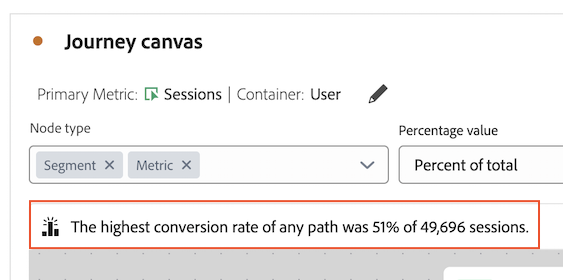
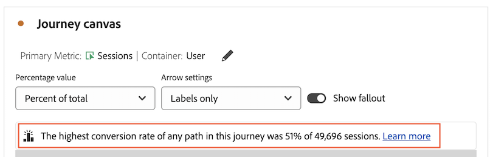
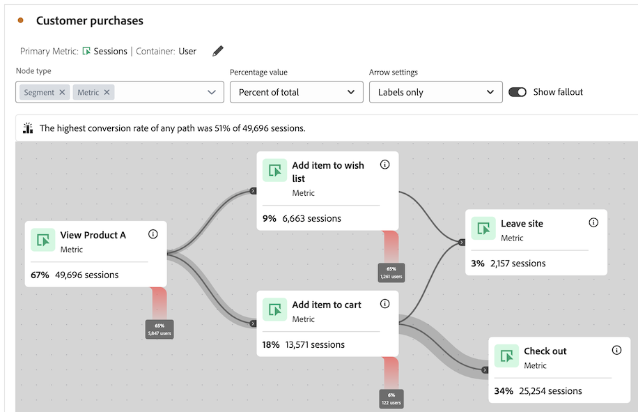
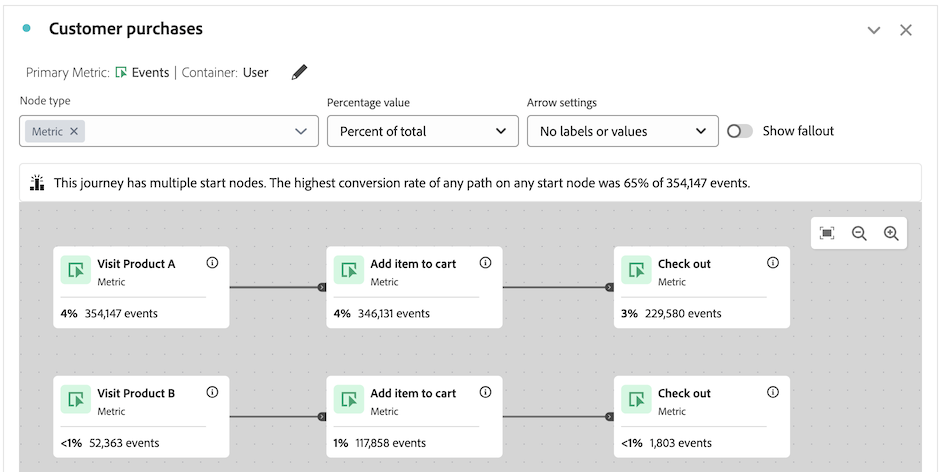
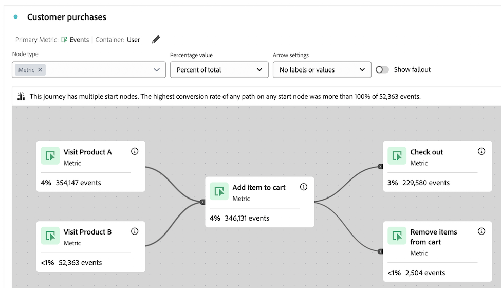

# Vue d’ensemble de la zone de travail de parcours {#journey-canvas-overview}

<!-- markdownlint-disable MD034 -->

>[!CONTEXTUALHELP]
>id="cja_journeycanvas_button"
>title="Zone de travail de parcours"
>abstract="Indique comment les personnes passent par une série de points de contact ou en sortent. À utiliser pour les parcours comportant plusieurs points et chemins d’entrée, ou pour analyser les parcours créés dans Journey Optimizer."

<!-- markdownlint-enable MD034 -->

<!-- markdownlint-disable MD034 -->

>[!CONTEXTUALHELP]
>id="cja_journeycanvas_panel"
>title="Zone de travail de parcours"
>abstract="Analysez la façon dont les personnes passent par un parcours défini ou en sortent. Créez des analyses de parcours d’utilisation en créant un graphique flexible de nœuds et de flèches représentant n’importe quelle combinaison d’événements, d’éléments de dimension et de segments. Faites glisser des nœuds sur la zone de travail pour réorganiser les événements et les conditions du parcours. Les données sont mises à jour en conséquence.   Les clientes et clients qui ont accès à Adobe Journey Optimizer peuvent analyser les parcours Journey Optimizer existants."

<!-- markdownlint-enable MD034 -->

<!-- markdownlint-disable MD034 -->

>[!CONTEXTUALHELP]
>id="journeycanvas_button"
>title="Zone de travail de parcours"
>abstract="Indique comment les personnes passent par une série de points de contact ou en sortent. À utiliser pour les parcours comportant plusieurs points et chemins d’entrée, ou pour analyser les parcours créés dans Journey Optimizer."

<!-- markdownlint-enable MD034 -->

<!-- markdownlint-disable MD034 -->

>[!CONTEXTUALHELP]
>id="journeycanvas_panel"
>title="Zone de travail de parcours"
>abstract="Analysez la façon dont les personnes passent par un parcours défini ou en sortent. Créez des analyses de parcours d’utilisation en créant un graphique flexible de nœuds et de flèches représentant n’importe quelle combinaison d’événements, d’éléments de dimension et de segments. Faites glisser des nœuds sur la zone de travail pour réorganiser les événements et les conditions du parcours. Les données sont mises à jour en conséquence.   Les clientes et clients qui ont accès à Adobe Journey Optimizer peuvent analyser les parcours Journey Optimizer existants."

<!-- markdownlint-enable MD034 -->

>[!BEGINSHADEBOX]

_Cet article présente la visualisation de la zone de travail de Parcours dans_  _&#x200B;**Customer Journey Analytics**._ _Consultez la [Présentation de la zone de travail de Parcours &#x200B;](https://experienceleague.adobe.com/fr/docs/analytics/analyze/analysis-workspace/visualizations/journey-canvas/journey-canvas) pour la version_  _&#x200B;**Adobe Analytics** de cet article._

>[!ENDSHADEBOX]

La visualisation Zone de travail de parcours vous permet d’analyser les parcours que vous fournissez à vos utilisateurs et utilisatrices et à votre clientèle, et d’obtenir des informations détaillées à leur sujet. Elle vous permet de définir un parcours à partir de zéro ou d’en afficher un depuis Journey Optimizer, puis de voir comment les personnes ont quitté le parcours (abandon) ou l’ont poursuivi (progression).

Vous pouvez [créer des analyses de parcours d’utilisation](/help/analysis-workspace/visualizations/journey-canvas/configure-journey-canvas.md) en utilisant n’importe quelle combinaison d’événements, d’éléments de dimension, de segments et de périodes pour créer des nœuds de parcours. Connectez les nœuds pour créer le flux du parcours et inclure plusieurs chemins et points de décision. Faites glisser des nœuds sur la zone de travail pour réorganiser les événements et les conditions du parcours. Les données sont mises à jour en temps réel au fur et à mesure des modifications.

[&#x200B; Les nœuds sont connectés &#x200B;](/help/analysis-workspace/visualizations/journey-canvas/configure-journey-canvas.md#logic-when-connecting-nodes) en tant que « chemin éventuel », ce qui signifie que les visiteurs sont comptabilisés tant qu’ils passent finalement d’un nœud à l’autre, quels que soient les événements qui se produisent entre les deux nœuds. Le temps imparti aux utilisateurs et utilisatrices pour se déplacer sur le chemin est déterminé par le paramètre du conteneur.

## Principales fonctionnalités

Les principales fonctionnalités de la visualisation Canevas de parcours sont les suivantes :

* Analyse approfondie des abandons et de la progression, adaptée aux parcours utilisateur les plus complexes.

* Canevas permettant le mappage et la visualisation des différents points d’entrée, nœuds et chemins d’un parcours utilisateur.

* Interactions par glisser-déposer pour l’ajout de composants à la zone de travail et le repositionnement de nœuds existants.

* Option permettant de créer des analyses de parcours utilisateur dans le canevas de parcours ou de les générer automatiquement à partir de parcours Journey Optimizer.

## Informations potentielles

La visualisation Canevas de parcours fournit des informations exploitables pour les parcours les plus complexes.

### Chemin avec le taux de conversion le plus élevé {#conversion-rate-caption}

Les informations les plus importantes de la visualisation Canevas de parcours s’affichent sous la forme d’une légende en haut du canevas.

Cette légende récapitule les chemins du parcours qui ont le taux de conversion le plus élevé.

Lorsque le parcours contient plusieurs nœuds de début, la légende ressemble à ceci :

Lorsque le parcours contient un seul nœud de début, la légende est la suivante :

Tenez compte des points suivants lorsque vous interprétez cette légende :

* Un _chemin_ est défini comme un nœud de début connecté par des flèches à un nœud de fin, avec un nombre illimité de nœuds connectés entre eux.

* Le calcul du taux de conversion dépend du type de parcours (le nombre de nœuds de début et de fin contenus dans le parcours, et si les chemins d’accès comportent des intersections).

  Le tableau suivant décrit le mode de calcul des taux de conversion en fonction du type de parcours :

  | Type de parcours | Calcul du taux de conversion | Exemple |
  |---------|----------|---------|
  | **Un seul nœud de début et un seul nœud de fin** | Le taux de conversion est calculé en divisant le nombre du nœud de fin par celui du nœud de début. |  |
  | **Un seul nœud de début et plusieurs nœuds de fin** | Le taux de conversion est calculé en recherchant le nœud de fin avec le nombre le plus élevé et en divisant ce nombre par celui du nœud de début. |  |
  | **Plusieurs chemins d’accès autonomes, chaque chemin contenant un seul nœud de début et un seul nœud de fin** | Le taux de conversion est calculé en divisant le nombre du nœud de fin par celui du nœud de début. Le chemin présentant le taux de conversion le plus élevé est décrit dans la légende. |  |
  | **Plusieurs nœuds de début convergeant à tout moment dans le parcours vers un nœud commun** | Le taux de conversion est calculé en recherchant le nœud de fin ayant le nombre le plus élevé et en divisant ce nombre par celui du nœud de début ayant le nombre le plus bas. |  |

### Progression, abandon et plus encore

Voici quelques exemples d’autres informations que le canevas de parcours peut vous aider à obtenir. Vous pouvez choisir si ces informations sont basées sur toutes les personnes de la vue de données, sur toutes les personnes qui ont démarré le parcours ou sur toutes les personnes du nœud précédent du parcours.

#### Diminution

* Nombre et pourcentage de personnes ayant terminé le parcours (arrivées au nœud de fin)

* Nombre et pourcentage de personnes arrivées à un nœud donné du parcours

* Étape la plus courante qui s’est produite après ou avant un nœud donné du parcours

#### Abandons

* Nœuds du parcours ayant provoqué le plus d’abandons du parcours par les personnes (jamais d’accès aux nœuds suivants immédiats)

#### Données supplémentaires pour chaque nœud

* Ajouter une dimension de répartition sur n’importe quel nœud du parcours pour afficher les données supplémentaires pour ce nœud spécifique

## Choisir entre les visualisations Canevas de parcours, Abandon ou Flux

La visualisation Zone de travail de parcours présente des similitudes avec la [visualisation Abandons](/help/analysis-workspace/visualizations/fallout/fallout-flow.md) et la [visualisation Flux](/help/analysis-workspace/visualizations/c-flow/flow.md), mais avec des différences importantes.

### Comprendre les différences

<!-- Information in this snippet is shared between Journey canvas, Fallout, and Flow visualization docs -->

{{journey-visualization-comparisons}}

### Quand utiliser le canevas de parcours

Le canevas de parcours est particulièrement indiqué pour les cas suivants :

* Analyse des abandons dans les parcours comportant plusieurs points d’entrée et chemins.

* Parcours non linéaires avec plusieurs points d’entrée et chemins d’accès, avec une séquence prédéfinie de pages.

* Analyse exploratoire ad hoc basée sur un parcours prédéfini.

* Analyse qui nécessite une mesure principale autre que Session, Personne ou Occurrences.

* Analyse plus approfondie des parcours provenant d’Adobe Journey Optimizer.

Utilisez [le tableau ci-dessus](#understand-the-differences) pour comprendre les différences entre les visualisations Zone de travail de parcours, Abandons et Flux.

## Analyser des parcours Journey Optimizer

>[!NOTE]
>
>Si votre organisation n’a pas accès à Journey Optimizer, vous pouvez tout de même [créer des analyses dans la zone de travail de parcours](#build-analyses-in-customer-journey-analytics).

L’analyse des parcours Journey Optimizer dans le canevas de parcours fournit des informations détaillées et exploitables sur la manière dont les personnes interagissent avec un parcours.

Lorsque vous analysez un parcours Journey Optimizer dans le canevas de parcours, celui-ci est affiché dans le même ordre et avec la même séquence et la même structure que dans Journey Optimizer. Si vous apportez des modifications importantes à un parcours dans la zone de travail de parcours, [les modifications ne sont plus synchronisées à partir de Journey Optimizer](#synchronization-between-journey-optimizer-and-journey-canvas).

### Avantages de l’analyse des parcours Journey Optimizer avec le canevas de parcours

Le canevas de parcours permet d’effectuer une analyse approfondie et complète qui n’est pas possible dans Journey Optimizer.

L’utilisation du canevas de parcours pour analyser les parcours créés dans Journey Optimizer présente plusieurs avantages :

* Créez des événements à l’aide des dimensions, des mesures, des segments ou des périodes de Customer Journey Analytics.

  Dans Journey Optimizer, un utilisateur ou une utilisatrice technique doit créer un événement avant de pouvoir l’ajouter à un parcours.

* Créez des audiences en fonction d’un nœud personnalisé (lance le créateur d’audiences Customer Journey Analytics).

  Dans Journey Optimizer, vous ne pouvez créer des audiences que pour des activités prédéfinies.

* Analyser la progression et les abandons

* Ventiler les événements selon n’importe quelle dimension

* Combiner des événements

* Connecter des événements

* Renommer et supprimer des événements

* Bien plus

### Synchronisation entre Journey Optimizer et le canevas de parcours

Tenez compte des comportements suivants pour comprendre la synchronisation entre Journey Optimizer et le canevas de parcours :

* **La synchronisation des données est unidirectionnelle.**

  Après avoir créé une analyse d’un parcours Journey Optimizer dans le canevas de parcours, les données ne sont synchronisées que dans un seul sens, de Journey Optimizer vers le canevas de parcours. Cela signifie que les modifications apportées à un parcours dans le canevas de parcours ne sont jamais répercutées dans Journey Optimizer.

* **La modification d’un parcours dans la zone de travail du parcours entraîne l’arrêt de la synchronisation.**

  Les modifications apportées à un parcours dans Journey Optimizer sont synchronisées avec la zone de travail du parcours [uniquement si le parcours n’a pas été modifié de manière significative dans la zone de travail du parcours](#differences-after-modifying-a-journey-in-journey-canvas). Une fois que vous avez modifié un parcours dans le canevas de parcours, toute modification apportée ultérieurement au parcours dans Journey Optimizer n’est pas répercutée dans le canevas de parcours. Pour que les modifications soient répercutées dans la zone de travail de parcours, vous pouvez supprimer et [recréer le parcours dans la zone de travail de parcours &#x200B;](/help/analysis-workspace/visualizations/journey-canvas/configure-journey-canvas.md).

* **Pour utiliser un lien « Partager avec tout le monde », le projet doit être enregistré dans Customer Journey Analytics une fois les modifications apportées dans Journey Optimizer**.

  Lorsque vous utilisez un lien « Partager avec tout le monde », les modifications effectuées dans Journey Optimizer ne sont répercutées dans le canevas de parcours qu’une fois le projet enregistré dans Customer Journey Analytics.

  Pour plus d’informations sur les liens « Partager avec tout le monde », voir [Partager un projet avec tout le monde (aucune connexion requise)](/help/analysis-workspace/curate-share/share-projects.md#share-a-project-with-anyone-no-login-required) dans [Partager des projets](/help/analysis-workspace/curate-share/share-projects.md).

### Différences après modification d’un parcours dans le canevas de parcours {#differences-after-modifying}

Après avoir modifié un parcours Journey Optimizer dans le canevas de parcours, des changements peuvent intervenir au niveau du traitement des données, des fonctionnalités disponibles et du comportement de synchronisation.

Si vous apportez une modification importante à un parcours Journey Optimizer dans le canevas de parcours, des changements peuvent intervenir au niveau du traitement des données, des fonctionnalités disponibles et du comportement de synchronisation. Une modification significative comprend l’un des éléments suivants :

* Ajout ou suppression d’un nœud

* Ajout ou suppression d’une flèche entre des nœuds

* Modification des composants sur un nœud

Si vous apportez d’autres modifications à un parcours Journey Optimizer dans le canevas de parcours, par exemple en faisant glisser un nœud ou en ajoutant une répartition, les différences décrites dans les sections suivantes ne s’appliquent pas.

>[!NOTE]
>
>Pour rétablir le parcours dans son état d’origine, vous pouvez appuyer sur Ctrl+Z après avoir effectué votre première modification dans le canevas de parcours. Vous pouvez également supprimer et [recréer le parcours dans la zone de travail de parcours](/help/analysis-workspace/visualizations/journey-canvas/configure-journey-canvas.md).

#### Différences de traitement des données

Après avoir modifié un parcours Journey Optimizer dans le canevas de parcours, vous remarquerez peut-être des changements dans vos données si votre parcours contient des mesures auxquelles sont appliqués des modèles d’attribution autres que ceux par défaut.

Cela s’explique par le fait que, contrairement à Journey Optimizer, le canevas de parcours permet d’appliquer plusieurs dimensions au sein d’un même parcours. Cette fonctionnalité signifie que l’[attribution des mesures](/help/data-views/component-settings/attribution.md) n’est pas prise en charge.

#### Différences de fonctionnalités

Après avoir modifié un parcours Journey Optimizer dans la zone de travail du parcours, les options disponibles dans le champ déroulant [!UICONTROL **Paramètres de la flèche**] changent en fonction de vos modifications. Pour plus d’informations, consultez [Configuration des paramètres](/help/analysis-workspace/visualizations/journey-canvas/configure-journey-canvas.md).

Le champ [!UICONTROL **Type de nœud**] est disponible uniquement dans Journey Optimizer. Il n’est pas disponible lorsque vous consultez un parcours Journey Optimizer dans le canevas de parcours, indépendamment des modifications que vous pouvez y apporter.

#### Différences de synchronisation

Les modifications apportées à un parcours dans Journey Optimizer ne sont synchronisées avec le canevas de parcours que si le parcours n’est pas modifié dans ce dernier.

Une fois que vous avez modifié un parcours Journey Optimizer dans le canevas de parcours, les modifications que vous apportez ensuite au parcours dans Journey Optimizer ne sont pas répercutées dans le canevas de parcours. Pour que les modifications soient répercutées dans la zone de travail de parcours, vous pouvez supprimer et [recréer le parcours dans la zone de travail de parcours](/help/analysis-workspace/visualizations/journey-canvas/configure-journey-canvas.md).

### Différences terminologiques entre Journey Optimizer et Customer Journey Analytics

Certains termes qui signifient une chose dans Journey Optimizer signifient autre chose dans Customer Journey Analytics. Lorsque vous utilisez le canevas de parcours, la terminologie de Customer Journey Analytics est utilisée.

| Terme | Zone de travail de parcours | Journey Optimizer |
|---------|----------|---------|
| **Événement** | Une des mesures standard disponibles dans Customer Journey Analytics. Cette mesure comptabilise des éléments tels que les revenus, les abonnements ou les prospects générés. | Catégorie d’activité qui déclenche un parcours personnalisé, tel qu’un achat en ligne. |

### Analyser un parcours Journey Optimizer dans le canevas de parcours

Pour plus d’informations sur l’analyse d’un parcours Journey Optimizer dans la zone de travail de parcours, consultez [Configuration d’une visualisation Zone de travail de parcours](/help/analysis-workspace/visualizations/journey-canvas/configure-journey-canvas.md).

## Créer des analyses dans le canevas de parcours

Vous pouvez créer dans le canevas de parcours des analyses basées sur n’importe quelle dimension ou mesure disponible dans Analysis Workspace. Vous pouvez également analyser les parcours créés dans Journey Optimizer. Pour plus d’informations, consultez [Configuration d’une visualisation Zone de travail de parcours](/help/analysis-workspace/visualizations/journey-canvas/configure-journey-canvas.md).

>[!MORELIKETHIS]
>
> * [Guide pour la visualisation de la zone de travail de parcours dans Adobe Customer Journey Analytics](https://experienceleaguecommunities.adobe.com/t5/adobe-analytics-blogs/a-guide-to-journey-canvas-visualization-in-adobe-customer/ba-p/737857?profile.language=fr)

