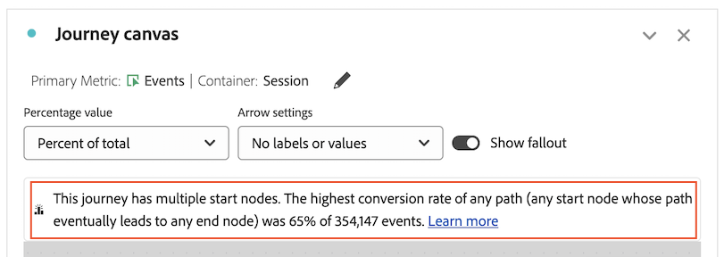

# Vue d’ensemble de Zone de travail de parcours {#journey-canvas-overview}

<!-- markdownlint-disable MD034 -->

>[!CONTEXTUALHELP]
>id="cja_journeycanvas_button"
>title="Zone de travail de parcours"
>abstract="Indique comment les personnes passent par une série de points de contact ou en sortent. À utiliser pour les parcours comportant plusieurs points d’entrée et chemins d’accès, ou pour analyser les parcours créés dans Journey Optimizer."

<!-- markdownlint-enable MD034 -->

<!-- markdownlint-disable MD034 -->

>[!CONTEXTUALHELP]
>id="cja_journeycanvas_panel"
>title="Zone de travail de parcours"
>abstract="Analysez la façon dont les personnes passent par un parcours défini ou en sortent. Créez des analyses de parcours d’utilisateurs et d’utilisatrices en créant un graphique flexible de nœuds et de flèches représentant n’importe quelle combinaison d’événements, d’éléments de dimension et de segments. Faites glisser des nœuds sur la zone de travail pour réorganiser les événements et les conditions du parcours. Les données sont mises à jour en conséquence.   Les clientes et clients ayant accès à Adobe Journey Optimizer peuvent analyser les parcours Journey Optimizer existants."

<!-- markdownlint-enable MD034 -->

<!-- markdownlint-disable MD034 -->

>[!CONTEXTUALHELP]
>id="journeycanvas_button"
>title="Zone de travail de parcours"
>abstract="Indique comment les personnes passent par une série de points de contact ou en sortent. À utiliser pour les parcours comportant plusieurs points d’entrée et chemins d’accès, ou pour analyser les parcours créés dans Journey Optimizer."

<!-- markdownlint-enable MD034 -->

<!-- markdownlint-disable MD034 -->

>[!CONTEXTUALHELP]
>id="journeycanvas_panel"
>title="Zone de travail de parcours"
>abstract="Analysez la façon dont les personnes passent par un parcours défini ou en sortent. Créez des analyses de parcours d’utilisateurs et d’utilisatrices en créant un graphique flexible de nœuds et de flèches représentant n’importe quelle combinaison d’événements, d’éléments de dimension et de segments. Faites glisser des nœuds sur la zone de travail pour réorganiser les événements et les conditions du parcours. Les données sont mises à jour en conséquence.   Les clientes et clients ayant accès à Adobe Journey Optimizer peuvent analyser les parcours Journey Optimizer existants."

<!-- markdownlint-enable MD034 -->

>[!BEGINSHADEBOX]

_Cet article présente la visualisation Zone de travail de parcours dans_  _**Customer Journey Analytics**. Il n’existe aucune visualisation équivalente dans **Adobe Analytics**._

>[!ENDSHADEBOX]

La visualisation Zone de travail de parcours vous permet d’analyser les parcours que vous fournissez à vos utilisateurs et utilisatrices et à votre clientèle, et d’obtenir des informations détaillées à leur sujet. Elle vous permet de définir entièrement un parcours ou d’en afficher un depuis Journey Optimizer, puis de voir comment les personnes l’ont quitté (abandonné) ou ont continué à le parcourir (diminution).

Vous pouvez [créer des analyses de parcours utilisateur](/help/analysis-workspace/visualizations/journey-canvas/configure-journey-canvas.md) en utilisant n’importe quelle combinaison d’événements, d’éléments de dimension, de segments et de périodes pour créer des nœuds de parcours. Connectez les nœuds pour créer le flux du parcours et inclure plusieurs chemins et points de décision. Faites glisser des nœuds sur la zone de travail pour réorganiser les événements et les conditions du parcours. Les données sont mises à jour en temps réel au fur et à mesure des modifications.

[Les nœuds sont connectés](/help/analysis-workspace/visualizations/journey-canvas/configure-journey-canvas.md#logic-when-connecting-nodes) en tant que « chemin définitif », ce qui signifie que les visiteurs et visiteuses sont comptabilisés tant qu’ils passent finalement d’un nœud à l’autre, quels que soient les événements qui se produisent entre les 2 nœuds. Le temps imparti aux utilisateurs et utilisatrices pour se déplacer sur le chemin est déterminé par le paramètre du conteneur.

## Principales fonctionnalités

Les principales fonctionnalités de la visualisation Zone de travail de parcours sont les suivantes :

* Analyse approfondie des abandons et des diminutions pour prendre en compte les parcours d’utilisateur ou d’utilisatrice les plus complexes.

* Zone de travail permettant de mapper et de visualiser les différents points d’entrée, nœuds et chemins d’accès d’un parcours d’utilisateur ou d’utilisatrice.

* Interactions par glisser-déposer pour l’ajout de composants à la zone de travail et le repositionnement de nœuds existants.

* Option permettant de créer des analyses de parcours d’utilisateur ou d’utilisatrice dans Zone de travail de parcours ou de les créer automatiquement en fonction des parcours Journey Optimizer.

## Informations potentielles

La visualisation Zone de travail de parcours fournit des informations exploitables pour les parcours les plus complexes.

### Chemin avec le taux de conversion le plus élevé {#conversion-rate-caption}

Les informations les plus importantes dans la visualisation Zone de travail de parcours s’affichent sous la forme d’une légende dans la partie supérieure de la zone de travail elle-même.

Cette légende récapitule les chemins du parcours qui ont le taux de conversion le plus élevé.

Lorsque le parcours contient plusieurs nœuds de début, la légende ressemble à ceci :

Lorsque le parcours contient un seul nœud de début, la légende est la suivante :

Tenez compte des points suivants lorsque vous interprétez cette légende :

* Un _chemin_ est défini comme un nœud de début connecté par des flèches à un nœud de fin, avec un nombre illimité de nœuds connectés entre eux.

* Le calcul du taux de conversion dépend du type de parcours (le nombre de nœuds de début et de fin contenus dans le parcours, et si les chemins d’accès comportent des intersections).

  Le tableau suivant décrit le mode de calcul des taux de conversion en fonction du type de parcours :

  | Type de parcours | Calcul du taux de conversion | Exemple |
  |---------|----------|---------|
  | **Un seul nœud de début et un seul nœud de fin** | Le taux de conversion est calculé en divisant le nombre du nœud de fin par celui du nœud de début. |  |
  | **Un seul nœud de début et plusieurs nœuds de fin** | Le taux de conversion est calculé en recherchant le nœud de fin avec le nombre le plus élevé et en divisant ce nombre par celui du nœud de début. |  |
  | **Plusieurs chemins d’accès autonomes, chaque chemin contenant un seul nœud de début et un seul nœud de fin** | Le taux de conversion est calculé en divisant le nombre du nœud de fin par celui du nœud de début. Le chemin présentant le taux de conversion le plus élevé est décrit dans la légende. |  |
  | **Plusieurs nœuds de début convergeant à tout moment dans le parcours vers un nœud commun** | Le taux de conversion est calculé en recherchant le nœud de fin ayant le nombre le plus élevé et en divisant ce nombre par celui du nœud de début ayant le nombre le plus bas. |  |

### Diminution, abandons, etc.

Voici quelques exemples d’autres informations que la zone de travail de parcours peut vous aider à fournir. Vous pouvez choisir si ces informations sont basées sur toutes les personnes de la vue de données, sur toutes les personnes qui ont démarré le parcours ou sur toutes les personnes du nœud précédent du parcours.

#### Diminution

* Nombre et pourcentage de personnes ayant terminé le parcours (arrivées au nœud de fin)

* Nombre et pourcentage de personnes arrivées à un nœud donné du parcours

* Étape la plus courante qui s’est produite après ou avant un nœud donné du parcours

#### Abandons

* Nœuds du parcours ayant provoqué le plus d’abandons du parcours par les personnes (jamais d’accès aux nœuds suivants immédiats)

#### Données supplémentaires pour chaque nœud

* Ajouter une dimension de répartition sur n’importe quel nœud du parcours pour afficher les données supplémentaires pour ce nœud spécifique

## Choisissez entre les visualisations Zone de travail de parcours, Abandons ou Flux.

La visualisation Zone de travail de parcours présente des similitudes avec la [visualisation Abandons](/help/analysis-workspace/visualizations/fallout/fallout-flow.md) et la [visualisation Flux](/help/analysis-workspace/visualizations/c-flow/flow.md), mais avec des différences importantes.

### Comprendre les différences

<!-- Information in this snippet is shared between Journey canvas, Fallout, and Flow visualization docs -->

{{journey-visualization-comparisons}}

### Quand utiliser la zone de travail de parcours

La zone de travail parcours est essentielle pour ce qui suit :

* Analyse des abandons impliquant des parcours avec plusieurs points d’entrée et chemins d’accès.

* Parcours non linéaires avec plusieurs points d’entrée et chemins d’accès, avec une séquence prédéfinie de pages.

* Analyse exploratoire ad hoc basée sur un parcours prédéfini.

* Analyse qui nécessite une mesure principale autre que Session, Personne ou Occurrences.

* Analyse plus approfondie des parcours provenant d’Adobe Journey Optimizer.

Utilisez [le tableau ci-dessus](#understand-the-differences) pour comprendre les différences entre les visualisations Zone de travail de parcours, Abandons et Flux.

## Analyser des parcours Journey Optimizer

>[!NOTE]
>
>Si votre organisation n’a pas accès à Journey Optimizer, vous pouvez tout de même [créer des analyses dans la zone de travail de parcours](#build-analyses-in-customer-journey-analytics).

L’analyse des parcours Journey Optimizer dans la zone de travail de parcours fournit des informations détaillées et exploitables sur la manière dont les utilisateurs et utilisatrices interagissent avec un parcours.

Lorsque vous analysez un parcours Journey Optimizer dans la zone de travail de parcours, le parcours s’affiche dans le même ordre, la même séquence et la même structure que dans Journey Optimizer. Si vous apportez des modifications importantes à un parcours dans la zone de travail de parcours, [les modifications ne sont plus synchronisées à partir de Journey Optimizer](#synchronization-between-journey-optimizer-and-journey-canvas).

### Avantages de l’analyse des parcours Journey Optimizer avec la zone de travail de parcours

La zone de travail de parcours fournit une analyse approfondie et complète qui n’est pas possible dans Journey Optimizer.

L’utilisation de la zone de travail de parcours pour analyser les parcours créés dans Journey Optimizer offre divers avantages :

* Créez des événements à l’aide des dimensions, mesures, segments ou périodes Customer Journey Analytics.

  Dans Journey Optimizer, un utilisateur ou une utilisatrice technique doit créer un événement avant de pouvoir l’ajouter à un parcours.

* Créez des audiences en fonction d’un nœud personnalisé (lance le créateur d’audiences Customer Journey Analytics).

  Dans Journey Optimizer, vous ne pouvez créer des audiences que pour des activités prédéfinies.

* Analyser les diminutions et les abandons

* Répartir les événements selon n’importe quelle dimension

* Combiner des événements

* Connecter des événements

* Renommer et supprimer des événements

* Bien plus

### Synchronisation entre Journey Optimizer et la zone de travail de parcours

Tenez compte des comportements suivants pour comprendre la synchronisation entre Journey Optimizer et la zone de travail de Parcours :

* **La synchronisation des données est unidirectionnelle uniquement**

  Après avoir créé une analyse d’un parcours Journey Optimizer dans la zone de travail de parcours, les synchronisations de données se font dans une seule direction, de Journey Optimizer vers la zone de travail de parcours. Cela signifie que les modifications apportées à un parcours dans la zone de travail de parcours ne sont jamais répercutées dans Journey Optimizer.

* **La modification d’un parcours dans la zone de travail du Parcours arrête la synchronisation**

  Les modifications apportées à un parcours dans Journey Optimizer se synchronisent avec la zone de travail de Parcours [uniquement si le parcours n’a pas été modifié de manière significative dans la zone de travail de Parcours ](#differences-after-modifying-a-journey-in-journey-canvas). Une fois que vous avez modifié un parcours dans la zone de travail de parcours, les modifications que vous apportez au parcours dans Journey Optimizer ne sont pas répercutées dans la zone de travail de parcours. Pour que les modifications soient répercutées dans la zone de travail de parcours, vous pouvez supprimer et [recréer le parcours dans la zone de travail de parcours ](/help/analysis-workspace/visualizations/journey-canvas/configure-journey-canvas.md).

* **L’utilisation d’un lien « Partager avec tout le monde » nécessite que le projet soit enregistré dans Customer Journey Analytics une fois les modifications apportées dans Journey Optimizer**

  Lors de l’utilisation d’un lien « Partager avec tout le monde », les modifications apportées dans Journey Optimizer ne sont pas répercutées dans la zone de travail de Parcours tant que le projet n’est pas enregistré dans Customer Journey Analytics.

  Pour plus d’informations sur les liens « Partager avec tout le monde », consultez [Partager un projet avec tout le monde (n’est plus requis)](/help/analysis-workspace/curate-share/share-projects.md#share-a-project-with-anyone-no-login-required) dans [Partager des projets](/help/analysis-workspace/curate-share/share-projects.md).

### Différences après modification d’un parcours dans la zone de travail de parcours {#differences-after-modifying}

Après avoir modifié un parcours Journey Optimizer dans la zone de travail de parcours, des modifications peuvent se produire dans le traitement des données, les fonctionnalités disponibles et le comportement de synchronisation.

Si vous apportez une modification significative à un parcours Journey Optimizer dans la zone de travail de parcours, des modifications peuvent se produire dans le traitement des données, les fonctions disponibles et le comportement de synchronisation. Une modification significative comprend l’un des éléments suivants :

* Ajout ou suppression d’un nœud

* Ajout ou suppression d’une flèche entre des nœuds

* Modification des composants sur un nœud

Si vous apportez d’autres modifications à un parcours Journey Optimizer dans la zone de travail de parcours, telles que le déplacement d’un nœud ou l’ajout d’une répartition, les différences décrites dans les sections suivantes ne s’appliquent pas.

>[!NOTE]
>
>Pour rétablir le parcours à son état d’origine, vous pouvez appuyer sur Ctrl+Z après avoir effectué votre première modification dans la zone de travail de parcours. Vous pouvez également supprimer et [recréer le parcours dans la zone de travail de parcours](/help/analysis-workspace/visualizations/journey-canvas/configure-journey-canvas.md).

#### Différences de traitement des données

Après avoir modifié un parcours Journey Optimizer dans la zone de travail de parcours, vous remarquerez peut-être des modifications apportées à vos données si votre parcours contient des mesures dont les modèles d’attribution ne sont pas ceux par défaut.

En effet, contrairement à Journey Optimizer, la zone de travail de parcours vous permet d’appliquer plusieurs dimensions au sein d’un seul parcours. Cette fonctionnalité signifie que l’[attribution des mesures](/help/data-views/component-settings/attribution.md) n’est pas prise en charge.

#### Différences de fonctionnalités

Après avoir modifié un parcours Journey Optimizer dans la zone de travail du Parcours, les options disponibles dans le champ déroulant [!UICONTROL **Paramètres des flèches**] changent en fonction de vos modifications. Pour plus d’informations, consultez [Configuration des paramètres](/help/analysis-workspace/visualizations/journey-canvas/configure-journey-canvas.md).

Le champ [!UICONTROL **Type de nœud**] est disponible uniquement dans Journey Optimizer. Il n’est pas disponible lors de l’affichage d’un parcours Journey Optimizer dans la zone de travail de parcours, que vous apportiez ou non des modifications au parcours dans la zone de travail de parcours.

#### Différences de synchronisation

Les modifications apportées à un parcours dans Journey Optimizer ne sont synchronisées avec la zone de travail de parcours que si le parcours n’est pas modifié dans la zone de travail de parcours.

Une fois que vous avez modifié un parcours Journey Optimizer dans la zone de travail de parcours, les modifications que vous apportez au parcours dans Journey Optimizer ne sont pas répercutées dans la zone de travail de parcours. Pour que les modifications soient répercutées dans la zone de travail de parcours, vous pouvez supprimer et [recréer le parcours dans la zone de travail de parcours](/help/analysis-workspace/visualizations/journey-canvas/configure-journey-canvas.md).

### Différences terminologiques entre Journey Optimizer et Customer Journey Analytics

Certains termes qui signifient une chose dans Journey Optimizer signifient autre chose dans Customer Journey Analytics. Lors de l’utilisation de la zone de travail de parcours, les termes Customer Journey Analytics sont utilisés.

| Terme | Zone de travail de parcours | Journey Optimizer |
|---------|----------|---------|
| **Événement** | Une des mesures standard disponibles dans Customer Journey Analytics. Cette mesure comptabilise des éléments tels que les revenus, les abonnements ou les prospects générés. | Catégorie d’activité qui déclenche un parcours personnalisé, tel qu’un achat en ligne. |

### Analyser un parcours Journey Optimizer dans la zone de travail de parcours

Pour plus d’informations sur l’analyse d’un parcours Journey Optimizer dans la zone de travail de parcours, consultez [Configuration d’une visualisation Zone de travail de parcours](/help/analysis-workspace/visualizations/journey-canvas/configure-journey-canvas.md).

## Créer des analyses dans la zone de travail de parcours

Vous pouvez créer des analyses dans la zone de travail de parcours en fonction des dimensions ou des mesures disponibles dans Analysis Workspace. Vous pouvez également analyser les parcours créés dans Journey Optimizer. Pour plus d’informations, consultez [Configuration d’une visualisation Zone de travail de parcours](/help/analysis-workspace/visualizations/journey-canvas/configure-journey-canvas.md).

>[!MORELIKETHIS]
>
> * [Guide de Parcours de la visualisation de la zone de travail dans Adobe Customer Journey Analytics](https://experienceleaguecommunities.adobe.com/t5/adobe-analytics-blogs/a-guide-to-journey-canvas-visualization-in-adobe-customer/ba-p/737857)

