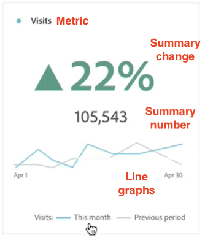

# Synthèse des mesures clés

La visualisation [!UICONTROL de synthèse des mesures clés] vous permet de visualiser le niveau de tendance d’une mesure importante au cours d’une seule période. Il vous permet également de comparer les performances des mesures sur deux périodes. Il offre les avantages de plusieurs visualisations en une seule visualisation :

* Visualisations **[!UICONTROL en ligne]** qui montrent les tendances de la mesure pour les périodes principales et de comparaison

* **[!UICONTROL Synthèse des modifications de pourcentage]** qui affiche une augmentation ou une diminution de la mesure entre les périodes Principale et de comparaison

* Valeur totale actuelle ([!UICONTROL **numéro de synthèse**]) pour la mesure

## Cas d’utilisation

Cette visualisation aborde divers cas d’utilisation courants, notamment :

* Un analyste qui essaie de comprendre à quoi ressemblait la création d’opportunités ce mois-ci par rapport à la même période l’an dernier.

* Un spécialiste du marketing qui explore la manière dont la génération de pistes pour un type de piste spécifique a changé de ce mois-ci au mois dernier.

* Un administrateur qui veut comprendre comment de nouvelles réservations ont changé de ce trimestre au dernier.

## Configuration de la synthèse des mesures clés

1. Faites glisser la visualisation de la **[!UICONTROL synthèse des mesures clés]** du menu **[!UICONTROL Visualisations]** se trouvant dans le rail gauche d’un panneau.

1. Configurez la visualisation en sélectionnant une mesure, une période principale, une période de comparaison et un filtre (le cas échéant) :

   

   | Paramètre de configuration | Définition |
   | --- | --- |
   | **[!UICONTROL Mesure]** | Sélectionnez la mesure à analyser. Toutes les mesures sont prises en charge. |
   | **[!UICONTROL Période principale]** | La période actuelle du tableau à structure libre. |
   | **[!UICONTROL Période de comparaison]** | La période à laquelle vous souhaitez comparer la période principale. |
   | **[!UICONTROL Filtre (facultatif)]** | Tout filtre qui vous intéresse spécifiquement pour ce résumé. |

   {style="table-layout:auto"}

1. Cliquez sur **[!UICONTROL Créer]**.

<!--## How the Key Metric Summary visualization handles the comparison date range

(This will probably release in January. Per Jaden Howell)

* If the primary date range is set to the panel date range, there are 2-6 options that are considered 'relative' to the primary date range. These usually include the previous period (same amount of time immediately proceeding the primary date range), and 52 weeks prior to that date range.

* If the comparison date range is set to one of the 'relative' options, upon updating the primary date range, the comparison date range updates to the period immediate preceding the panel date range.

* If your comparison date range is *not* set to a 'relative' option, then updating the panel date range changes your primary date range, but has no effect on the comparison date range.

**Example 1**

Primary date range is set to the panel's date range: 'Yesterday'
Comparison date range is set to a relative date range, one of: 'Previous day', 'Same day last week', 'Same day 4 weeks prior', 'Same day last month', 'Same day last year', or 'Same day 52 weeks prior'.
When I change the panel's date range to 'This month', the comparison date range will update to 'Previous month'.

**Example 2**
 
Primary date range is set to the panel's date range: 'Yesterday'
Comparison date range is set to a non-relative date range, such as 'Feb 2nd, 2022', 'Highest sales day', 'Last week', etc. 

>[!NOTE]
>
>Last week is relative to the day the project is opened on, but it is not based on the panel's date range of 'Yesterday'. In other cases, such as if the panel's date range was 'This week', it may be relative.

When you change the panel's date range to '4 days ago', the comparison date range remains at the previous selection. -->

## Afficher la sortie

Remarque :

* La **[!UICONTROL Période précédente]** du graphique linéaire (toujours affiché en gris) correspond à la **[!UICONTROL Période de comparaison]** de l’étape de configuration.

* Si aucune période de comparaison n’est spécifiée lors de la configuration ou si elle est masquée dans les paramètres de visualisation, seul le graphique linéaire correspondant à la période principale s’affiche. La synthèse des modifications sera masquée.

* À partir de là, vous pouvez placer le pointeur de la souris sur les graphiques linéaires pour afficher les statistiques pour chaque jour :

## Paramètres de visualisation

La synthèse des mesures clés offre plusieurs paramètres flexibles pour une meilleure communication et création de rapports sur les mesures importantes. Les paramètres sont accessibles par le biais de l’icône d’engrenage dans le coin supérieur droit de la visualisation.

| Paramètre | Description |
| --- | --- |
| **[!UICONTROL Mettre en gras le pourcentage de modification]** | Afficher la synthèse des modifications dans le style gras au centre de la visualisation |
| **[!UICONTROL Mettre en gras la valeur numérique]** | Afficher le numéro de synthèse en caractères gras au centre de la visualisation |
| **[!UICONTROL Légende visible]** | Afficher ou masquer la légende au bas de la visualisation |
| **[!UICONTROL Afficher les annotations]** | Afficher ou masquer les annotations ajoutées par un administrateur |
| **[!UICONTROL Afficher les graphiques sparkline]** | Afficher ou masquer les graphiques en courbes au bas du graphique. Lorsqu’elle est masquée, la légende ne fait plus référence visuellement aux lignes. |
| **[!UICONTROL Afficher les min. et max. sur les graphiques sparkline]** | Afficher ou masquer les valeurs minimales et maximales sur les graphiques en courbes Principal et de comparaison |
| **[!UICONTROL Afficher la comparaison]** | Afficher ou masquer les données de comparaison. Lorsqu’ils sont masqués, les objets de modification de graphique en courbes de comparaison et de modification de synthèse sont hors de vue. |
| **[!UICONTROL Afficher le nombre total]** | Afficher ou masquer la synthèse des chiffres |
| **[!UICONTROL Afficher la différence brute]** | Afficher ou masquer la différence brute entre la valeur totale de la mesure dans la période Principale et la période secondaire |
| **[!UICONTROL Abréger la valeur]** | Abréger les valeurs numériques pour simplifier les informations communiquées (par exemple, 20 000 -> 20K) |

## Modifier la visualisation

Après avoir créé la visualisation, vous pouvez toujours modifier la configuration d’origine.

1. Cliquez sur l’icône en forme de crayon dans le coin supérieur droit de la visualisation (en regard de l’icône d’engrenage des paramètres).

   

   Vous revenez maintenant à la vue de configuration d’origine.

1. Modifiez la mesure, la période principale, la période de comparaison ou le filtre selon vos préférences.
