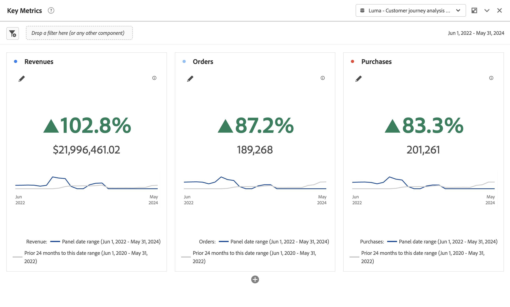

# Synthèse des mesures clés {#key-metric-summary}

<!-- markdownlint-disable MD034 -->

>[!CONTEXTUALHELP]
>id="cja_workspace_keymetricsummary_button"
>title="Synthèse des mesures clés"
>abstract="Créez une visualisation qui combine les graphiques à courbes, de synthèse des changements et de synthèse des nombres. Utilisez cette visualisation pour comparer les tendances des mesures importantes entre deux périodes."

<!-- markdownlint-enable MD034 -->

La visualisation  **[!UICONTROL Résumé de mesure clé]** vous permet de voir comment une mesure importante est en tendance sur une seule période. Il vous permet également de comparer les performances des mesures sur deux périodes. Il offre les avantages de plusieurs visualisations en une seule visualisation :

* La visualisation **[!UICONTROL Ligne]** montre comment la mesure est en tendance pour les périodes principale et de comparaison.

* **[!UICONTROL Résumé du changement de pourcentage]** affiche l’augmentation ou la diminution de la mesure entre les périodes principale et de comparaison.

* Valeur totale actuelle ([!UICONTROL **numéro de synthèse**]) pour la mesure

Cette visualisation aborde divers cas d’utilisation courants, notamment :

* Un analyste qui essaie de comprendre à quoi ressemblait la création d’opportunités ce mois-ci par rapport à la même période l’an dernier.

* Un spécialiste du marketing qui explore la manière dont la génération de pistes pour un type de piste spécifique a changé de ce mois-ci au mois dernier.

* Un administrateur qui veut comprendre comment de nouvelles réservations ont changé de ce trimestre au dernier.

## Sélectionnez l’option  

1. Ajoutez une visualisation  **[!UICONTROL Résumé de mesure clé]**. Voir [Ajout d’une visualisation à un panneau](freeform-analysis-visualizations.md#add-visualizations-to-a-panel).

1. Configurez la visualisation en sélectionnant une **[!UICONTROL mesure]**, une **[!UICONTROL période de Principal]**, une **[!UICONTROL période de comparaison]** (facultatif) et un **[!UICONTROL filtre]** (facultatif)) :

   

   | Option | Description |
   | --- | --- |
   | **[!UICONTROL Mesure]** | Sélectionnez la mesure à analyser. Toutes les mesures sont prises en charge. |
   | **[!UICONTROL Période principale]** | La période actuelle du tableau à structure libre. |
   | **[!UICONTROL Période de comparaison]** | La période à laquelle vous souhaitez comparer la période principale. |
   | **[!UICONTROL Filtre (facultatif)]** | Tout filtre qui vous intéresse spécifiquement pour ce résumé. |

   {style="table-layout:auto"}

1. Sélectionnez la **[!UICONTROL Version]**.

<!--## How the Key Metric Summary visualization handles the comparison date range

(This will probably release in January. Per Jaden Howell)

* If the primary date range is set to the panel date range, there are 2-6 options that are considered 'relative' to the primary date range. These usually include the previous period (same amount of time immediately proceeding the primary date range), and 52 weeks prior to that date range.

* If the comparison date range is set to one of the 'relative' options, upon updating the primary date range, the comparison date range updates to the period immediate preceding the panel date range.

* If your comparison date range is *not* set to a 'relative' option, then updating the panel date range changes your primary date range, but has no effect on the comparison date range.

**Example 1**

Primary date range is set to the panel's date range: 'Yesterday'
Comparison date range is set to a relative date range, one of: 'Previous day', 'Same day last week', 'Same day 4 weeks prior', 'Same day last month', 'Same day last year', or 'Same day 52 weeks prior'.
When I change the panel's date range to 'This month', the comparison date range will update to 'Previous month'.

**Example 2**
 
Primary date range is set to the panel's date range: 'Yesterday'
Comparison date range is set to a non-relative date range, such as 'Feb 2nd, 2022', 'Highest sales day', 'Last week', etc. 

>[!NOTE]
>
>Last week is relative to the day the project is opened on, but it is not based on the panel's date range of 'Yesterday'. In other cases, such as if the panel's date range was 'This week', it may be relative.

When you change the panel's date range to '4 days ago', the comparison date range remains at the previous selection. -->

La sortie de la synthèse des mesures clés ressemble à ce qui suit :

* Le graphique linéaire **[!UICONTROL Période précédente]** (toujours affiché en gris) correspond à la **[!UICONTROL période de comparaison]** dans l’étape de configuration.

* Si aucune période de comparaison n’est spécifiée lors de la configuration ou si elle est masquée dans les paramètres de visualisation, seul le graphique linéaire correspondant à la période principale s’affiche. La modification du résumé est masquée.

* À partir de là, vous pouvez placer le pointeur de la souris sur les graphiques linéaires pour afficher les statistiques pour chaque jour :

## Configuration

Après avoir créé la visualisation, vous pouvez modifier la configuration d’origine.

1. Sélectionnez  **[!UICONTROL Configurer la visualisation]** en haut de la visualisation.

   Vous revenez à la boîte de dialogue de configuration d’origine.

1. Modifiez les paramètres selon vos préférences. Sélectionnez **[!UICONTROL Réinitialiser]** pour réinitialiser les paramètres actuels. Sélectionnez **[!UICONTROL Build]** pour recréer la visualisation.

## Paramètres

Dans le cadre des paramètres de visualisation, des paramètres de résumé des mesures clés spécifiques sont disponibles.

| Paramètre | Description |
|---|---|
| **[!UICONTROL Type d’affichage récapitulatif]** | Choisissez entre **[!UICONTROL Mettre l’accent sur le changement de pourcentage]** ou **[!UICONTROL Mettre l’accent sur la valeur de nombre]**. |
| **[!UICONTROL Afficher les lignes de tendance]** | Afficher les tendances dans la visualisation. |
| **[!UICONTROL Afficher max et min sur les lignes de tendance]** | Afficher la valeur maximale et minimale sur les lignes de tendance. |
| **[!UICONTROL Afficher le pourcentage de comparaison et la courbe de tendance]** | Afficher le pourcentage de comparaison avec la tendance. Si cette option n’est pas sélectionnée, les deux sont masqués. |
| **[!UICONTROL Options de valeur numérique]** | **[!UICONTROL Afficher le nombre total]** ou **[!UICONTROL Afficher la différence brute]** pour la valeur de nombre. |
| **[!UICONTROL Abréger la valeur]** | Sélectionnez **[!UICONTROL Abréger la valeur]** pour abréger intelligemment la valeur numérique. Lorsque cette option est sélectionnée, saisissez un nombre pour définir le montant de l’abréviation. Par exemple : <table><tr><td>**Valeur d’origine**</td><td>**Abréviation**</td><td>**Résultat**</td></tr><tr><td>12 011 141,25 $</td><td>Non sélectionné</td><td  align="right">12 011 141,25 $</td></tr><tr><td>12 011 141,25 $</td><td>Sélectionné, défini sur 1</td><td align="right">$12M</td></tr><tr><td>12 011 141,25 $</td><td>Sélectionné, défini sur 2</td><td  align="right">12,0 M$</td></tr><tr><td>12 011 141,25 $</td><td>Sélectionné, défini sur 2</td><td align="right">12,011M$</td></tr><tr><td>12 011 141,25 $</td><td>Sélectionner, définir sur 3</td><td align="right">12,011M$</td></tr></table> |

>[!MORELIKETHIS]
>
>[Ajouter une visualisation à un panneau](/help/analysis-workspace/visualizations/freeform-analysis-visualizations.md#add-visualizations-to-a-panel)
>[Paramètres de visualisation](/help/analysis-workspace/visualizations/freeform-analysis-visualizations.md#settings)
>[Menu contextuel de visualisation](/help/analysis-workspace/visualizations/freeform-analysis-visualizations.md#context-menu)
>
