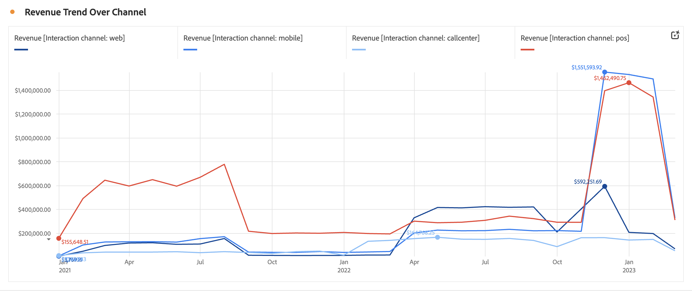

# Ligne {#line}

<!-- markdownlint-disable MD034 -->

>[!CONTEXTUALHELP]
>id="cja_workspace_line_button"
>title="Ligne"
>abstract="Créez une visualisation sous forme de graphe à courbes qui montre l’évolution des valeurs. Pour pouvoir utiliser un graphe à courbes, le temps doit être défini comme une dimension."

<!-- markdownlint-enable MD034 -->

La visualisation  **[!UICONTROL Line]** représente les mesures à l’aide d’une ligne pour montrer l’évolution des valeurs sur une période donnée. Une visualisation en ligne ne peut être utilisée que lorsque le temps est utilisé comme dimension.

<!--
>[!NOTE]
>
>The Line visualization soon feature [intelligent captions](/help/analysis-workspace/visualizations/intelligent-captions.md).

The Line visualization represents metrics using a line to show how values change over a period of time. A line chart can be used only when time is used as a dimension.
-->

## Paramètres

Dans le cadre des [paramètres de visualisation](freeform-analysis-visualizations.md#settings), des paramètres de visualisation en ligne spécifiques sont disponibles.

| Paramètre | Description |
|---|---|
| **[!UICONTROL Granularité]** | Effectuez une sélection dans la liste déroulante de granularité pour passer d’une visualisation de tendance quotidienne à hebdomadaire, à mensuelle, etc. La granularité est également mise à jour dans le tableau de la source de données. |
| **[!UICONTROL Afficher min]**  **[!UICONTROL Afficher max ]** | Vous pouvez superposer un libellé de valeur minimale et maximale pour mettre en surbrillance les valeurs minimale et maximale d’une mesure. Les valeurs min./max. sont dérivées des points de données visibles dans la visualisation, et non du jeu complet de valeurs dans une dimension.  |
| **[!UICONTROL Afficher la courbe de tendance]** | Vous pouvez choisir d’ajouter une régression ou une tendance moyenne glissante à votre série de lignes. Les courbes de tendance permettent de représenter plus clairement un schéma dans les données. Lorsque cette option est sélectionnée, sélectionnez un modèle dans la liste. Voir [Modèles](#models) pour une présentation et une description des modèles disponibles. . |

>[!TIP]
>
>Il est recommandé d’appliquer des tendances aux données qui n’incluent pas de données partielles (données partielles) ni de dates futures. Les dates d&#39;aujourd&#39;hui ou futures faussent la tendance. Toutefois, si vous devez inclure des dates futures, supprimez les zéros des données afin dʼéviter que ces jours ne soient faussés. Accédez au tableau de la source de données de la visualisation, sélectionnez votre colonne de mesures, puis activez l’option **[!UICONTROL Paramètres de colonne]** > **[!UICONTROL Interpréter zéro comme n’étant pas une valeur]**.

### Modèles

Toutes les courbes de tendance des modèles de régression sont ajustées à lʼaide des moindres carrés ordinaires :

| Modèle | Description |
| --- | --- |
| **[!UICONTROL Linéaire]** | Créez une ligne droite adaptée aux jeux de données linéaires simples et est utile lorsque les données augmentent ou diminuent à un rythme régulier. Équation : `y = a + b * x` |
| **[!UICONTROL Logarithmique]** | Créez une courbe adaptée et utile lorsque le taux de changement des données augmente ou diminue rapidement, puis s’ajuste. Une courbe de tendance logarithmique peut utiliser des valeurs négatives et positives. Équation : `y = a + b * log(x)` |
| **[!UICONTROL Exponentiel]** | Créez une courbe qui s’avère utile lorsque les données augmentent ou diminuent à des taux constamment croissants. Cette option ne doit pas être utilisée si vos données contiennent des valeurs nulles ou négatives. Équation : `y = a + e^(b * x)` |
| **[!UICONTROL Puissance]** | Créez une ligne incurvée qui s’avère utile pour les jeux de données qui comparent les mesures qui augmentent à un rythme spécifique. Cette option ne doit pas être utilisée si vos données contiennent des valeurs nulles ou négatives. Équation : `y = a * x^b` |
| **[!UICONTROL Quadratique]** | Trouve la meilleure compatibilité pour un jeu de données en forme de parabole (concave vers le haut ou vers le bas). Équation : `y = a + b * x + c * x^2` |
| **[!UICONTROL Moyenne glissante]** | Créez une courbe de tendance fluide basée sur un ensemble de moyennes. Connue également sous le nom de moyenne mobile, une moyenne glissante utilise un nombre spécifique de points de données (déterminé par votre sélection [!UICONTROL Granularité]), calcule leur moyenne et utilise cette moyenne comme point dans la ligne. Par exemple, une moyenne mobile de sept jours ou une moyenne mobile de quatre semaines. |

>[!MORELIKETHIS]
>
>[Ajouter une visualisation à un panneau](/help/analysis-workspace/visualizations/freeform-analysis-visualizations.md#add-visualizations-to-a-panel)
>[Paramètres de visualisation](/help/analysis-workspace/visualizations/freeform-analysis-visualizations.md#settings)
>[Menu contextuel de visualisation](/help/analysis-workspace/visualizations/freeform-analysis-visualizations.md#context-menu)
>

