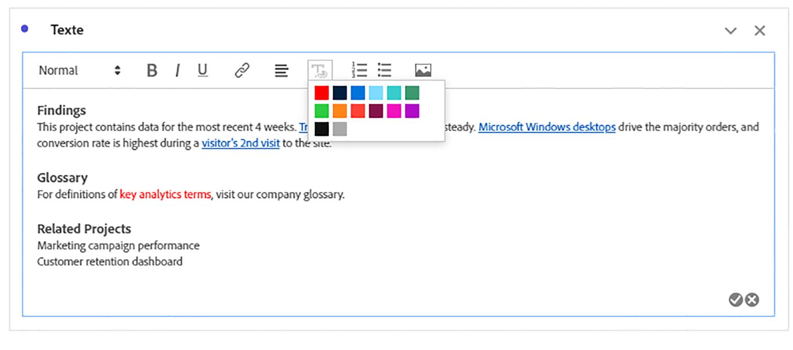
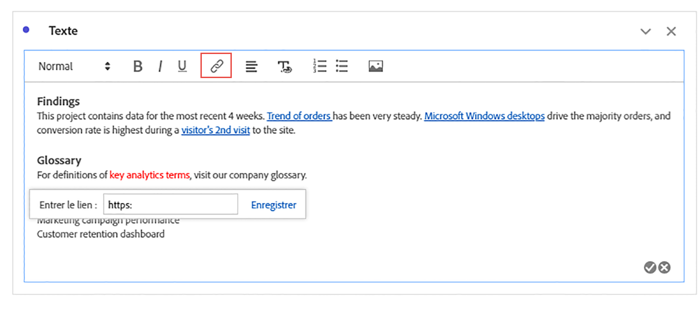
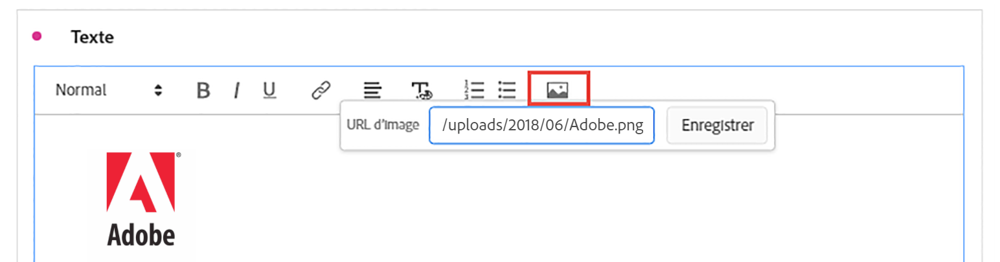

# Texte {#text-visualization}

<!-- markdownlint-disable MD034 -->

>[!CONTEXTUALHELP]
>id="workspace_text_button"
>title="Texte"
>abstract="Ajoutez une visualisation de texte enrichi définie par l’utilisateur ou l’utilisatrice à votre projet."

<!-- markdownlint-enable MD034 -->

>[!BEGINSHADEBOX]

*Cet article présente la visualisation de texte dans **Customer Journey Analytics**. Voir [Texte](https://experienceleague.adobe.com/en/docs/analytics/analyze/analysis-workspace/visualizations/text) pour la version **Adobe Analytics**de cet article.*

>[!ENDSHADEBOX]

Pour ajouter du texte enrichi défini par l’utilisateur à votre projet Workspace, vous pouvez utiliser une visualisation  **[!UICONTROL Texte]** ou des descriptions pour une visualisation et un panneau.

## Utilisation

La visualisation Texte peut être utilisée des manières suivantes :

1. Ajoutez une visualisation  **[!UICONTROL Texte]**. Voir [Ajouter une visualisation à un panneau](freeform-analysis-visualizations.md#add-visualizations-to-a-panel).

1. Dans un panneau ou une visualisation, dans le menu contextuel, sélectionnez **[!UICONTROL Modifier la description]**.

   Sélectionnez  une fois la modification de la description terminée, sélectionnez  pour annuler.

Vous pouvez modifier la mise en forme de votre texte, ajouter des liens hypertexte et ajouter des images.

## Ajustement de la mise en forme {#format}

Lors de la modification de la zone de texte ou de la description, vous pouvez ajuster la taille de la police (niveaux d’en-tête), la couleur, le style (gras, italique, souligné) ainsi que l’alignement du texte sélectionné. Vous pouvez également ajouter des listes numérotées et à puces.

## Ajout de liens hypertextes {#hyperlinks}

Pour ajouter un lien hypertexte, mettez le texte en surbrillance et sélectionnez  dans le menu. Vous pouvez utiliser des liens hypertexte pour apporter une aide supplémentaire aux destinataires de vos projets. Des liens hypertexte peuvent renvoyer vers des sites web externes, des pages de documentation, des projets Workspace  des panneaux ou des visualisations, etc.

## Ajout d’images {#images}

Pour ajouter une image à votre projet, sélectionnez  dans le menu, puis insérez une URL d’image publique. L’URL de l’image doit être accessible publiquement, commencer par `https` et être au format `.png`, `.jpeg`, `.jpg` ou `.gif`. Les images statiques et animées sont prises en charge.

