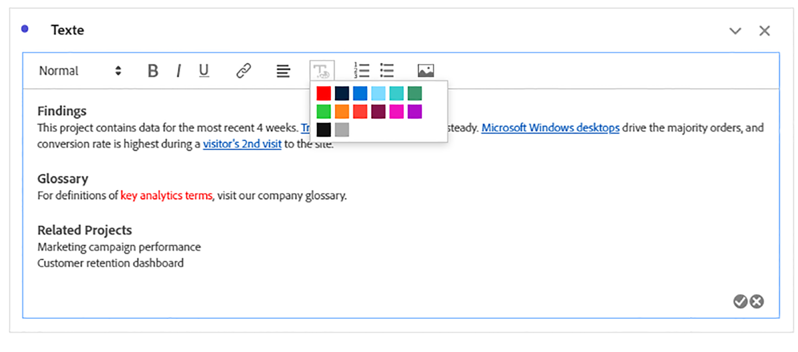
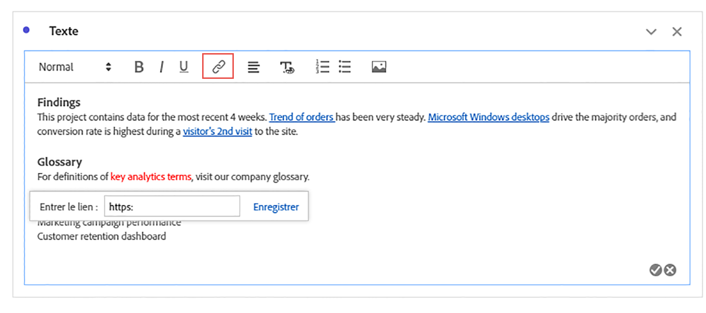

# Texte {#text-visualization}

<!-- markdownlint-disable MD034 -->

>[!CONTEXTUALHELP]
>id="workspace_text_button"
>title="Texte"
>abstract="Ajoutez une visualisation de texte enrichi définie par l’utilisateur ou l’utilisatrice à votre projet."

<!-- markdownlint-enable MD034 -->

>[!BEGINSHADEBOX]

_Cet article présente la visualisation de texte dans_  _&#x200B;**Customer Journey Analytics**._ _Voir [Texte](https://experienceleague.adobe.com/fr/docs/analytics/analyze/analysis-workspace/visualizations/text) pour la_  _&#x200B;**version Adobe Analytics** de cet article._

>[!ENDSHADEBOX]

Pour ajouter du texte enrichi défini par l’utilisateur ou l’utilisatrice à votre projet Workspace, vous pouvez utiliser une visualisation  **[!UICONTROL Texte]** ou des descriptions pour une visualisation et un panneau.

>[!BEGINSHADEBOX]

Voir  [Visualisation textuelle](https://experienceleague.adobe.com/en/docs/customer-journey-analytics-learn/tutorials/analysis-workspace/visualizations/add-text-visualizations){target="_blank"} pour une vidéo de démonstration.

>[!ENDSHADEBOX]

## Utilisation

La visualisation Texte peut être utilisée des manières suivantes :

1. Ajoutez une visualisation  **[!UICONTROL Texte]**. Consultez [Ajouter une visualisation à un panneau](freeform-analysis-visualizations.md#add-visualizations-to-a-panel).

1. Dans un panneau ou une visualisation, dans le menu contextuel, sélectionnez **[!UICONTROL Modifier la description]**.

   Sélectionnez  une fois la modification de la description terminée, sélectionnez  pour annuler.

Vous pouvez également modifier la mise en forme de votre texte, ajouter des liens hypertextes et des images.

## Ajustement de la mise en forme {#format}

Lors de la modification de la zone de texte ou de la description, vous pouvez ajuster la taille de la police (niveaux d’en-tête), la couleur, le style (gras, italique, souligné) ainsi que l’alignement du texte sélectionné. Vous pouvez également ajouter des listes numérotées et à puces.

## Ajout de liens hypertextes {#hyperlinks}

Pour ajouter un lien hypertexte, mettez le texte en surbrillance puis sélectionnez  dans le menu. Vous pouvez utiliser des liens hypertextes pour apporter une aide supplémentaire aux destinataires de vos projets. Des liens hypertextes peuvent renvoyer vers des sites web externes, des pages de documentation, [des projets, panneaux ou visualisations Workspace](/help/analysis-workspace/curate-share/shareable-links.md), etc.

## Ajout d’images {#images}

Pour ajouter une image à votre projet, sélectionnez  dans le menu, spécifiez une URL d’image dans **[!UICONTROL URL de l’image]** (par exemple, `https://www.adobe.com/uploads/2018/06/Adobe.png`) et sélectionnez **[!UICONTROL Enregistrer]**.

L’URL de l’image doit être accessible publiquement, commencer par `https` et être au format `.png`, `.jpeg`, `.jpg` ou `.gif`. Les images statiques et animées sont prises en charge.

Notez que l’insertion par glisser-déposer d’une image n’est pas prise en charge.

