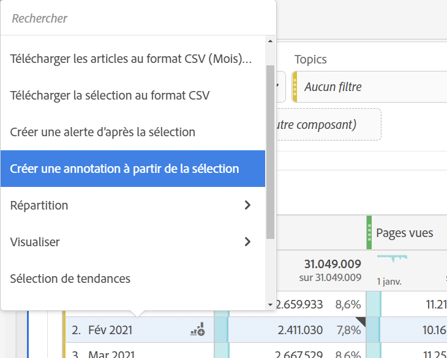

# Création d’annotations

Par défaut, seuls les administrateurs peuvent créer des annotations. Les utilisateurs ont le droit d’afficher les annotations comme ils le font avec d’autres composants d’Analytics (tels que les segments, les mesures calculées, etc.).

Toutefois, les administrateurs peuvent accorder aux utilisateurs l’autorisation de [!UICONTROL Créer des annotations] (outils Analytics) via l’[Adobe Admin Console](https://experienceleague.adobe.com/docs/analytics/admin/admin-console/permissions/analytics-tools.html?lang=fr).

1. Pour créer des annotations, vous disposez de plusieurs moyens pour commencer :

| Méthode de création | Détails |
| --- | --- |
| **Accédez à [!UICONTROL Composants] > [!UICONTROL Annotation].** | La page du gestionnaire d’annotations s’ouvre. Cliquez sur [!UICONTROL Créer une annotation] pour ouvrir le [!UICONTROL créateur d’annotations]. |
| **Cliquez avec le bouton droit de la souris sur un point d’un tableau.** | [!UICONTROL Le créateur d’annotations s’ouvre. ] Notez que, par défaut, les annotations créées de cette manière sont visibles uniquement dans le projet dans lequel elles ont été créées. Mais vous pouvez les rendre accessibles à tous les projets. Remarquez également que la ou les dates et les mesures, etc., ont déjà été remplies.
 |
| **Cliquez avec le bouton droit de la souris sur un point dans un graphique [!UICONTROL linéaire].** | Le [!UICONTROL créateur d’annotations] s’ouvre. Notez que, par défaut, les annotations créées de cette manière sont visibles uniquement dans le projet dans lequel elles ont été créées. Mais vous pouvez les rendre accessibles à tous les projets. Remarquez également que la ou les dates et les mesures, etc., ont déjà été remplies.
 |
| **Dans l’espace de travail, accédez à [!UICONTROL Composants] > [!UICONTROL Créer une annotation].** | Le [!UICONTROL créateur d’annotations] s’ouvre. |
| **Utilisez cette touche rapide** pour ouvrir le créateur d’annotations : (PC) `ctrl` `shift` + o, (Mac) `shift` + `command` + o | Notez qu’en utilisant la touche rapide pour créer une annotation, vous créez une annotation d’un seul jour pour la date actuelle, sans portée présélectionnée (mesures ou dimensions). |
| **Utiliser l’[API d’annotations CJA](https://developer.adobe.com/cja-apis/docs/endpoints/annotations/)** | Les API d’annotations CJA vous permettent de créer, mettre à jour ou récupérer des annotations par programmation via Adobe Developer. Ces API utilisent les mêmes données et méthodes que celles utilisées par Adobe dans l’interface utilisateur du produit. |

1. Renseignez les éléments du [!UICONTROL créateur d’annotations].

   

   | Élément | Description |
   | --- | --- |
   | [!UICONTROL Titre] | Nommez l’annotation, par exemple : « Memorial Day ». |
   | [!UICONTROL Description] | (Facultatif) Fournissez une description de l’annotation, par exemple : « Jour férié observé aux États-Unis ». |
   | [!UICONTROL Balises] | (Facultatif) Organisez les annotations en créant ou en appliquant une balise. |
   | [!UICONTROL Date appliquée] | Sélectionnez la date ou la période qui doit être indiquée pour que l’annotation soit visible. |
   | [!UICONTROL Couleur] | Appliquez une couleur à l’annotation. L’annotation apparaît dans le projet avec la couleur sélectionnée. Vous pouvez utiliser la couleur pour classer les annotations comme les jours fériés, les événements externes, les problèmes de suivi, etc. |
   | [!UICONTROL Portée] | (Facultatif) Faites glisser et déposez les mesures qui déclenchent l’annotation. Faites ensuite glisser et déposez toutes les dimensions ou tous les segments qui servent de filtres (c’est-à-dire avec lesquels l’annotation sera visible). Si vous n’indiquez pas de portée, l’annotation s’applique à toutes vos données.<ul><li>**[!UICONTROL L’une de ces mesures est présente]** : faites glisser et déposez jusqu’à 10 mesures qui déclencheront l’affichage de l’annotation.</li><li>**[!UICONTROL Avec tous ces filtres]** : faites glisser et déposez jusqu’à 10 dimensions ou segments qui filtreront lorsque l’annotation s’affichera.</li></ul>
Cas d’utilisation : une eVar a cessé de collecter des données pour une période spécifique. Faites glisser l’eVar dans la boîte de dialogue **[!UICONTROL L’une de ces mesures est présente]**. Ou votre mesure [!UICONTROL Visites] n’indique aucune donnée. Suivez le même processus.
**Remarque :** toute annotation appliquée à un composant qui est ensuite utilisée dans le cadre d’une mesure calculée ou d’une définition de segment n’hérite PAS automatiquement de l’annotation. La mesure calculée souhaitée doit également être ajoutée à la section de la portée pour afficher l’annotation. Toutefois, une nouvelle annotation doit être créée pour tout segment que vous souhaitez annoter avec les mêmes informations.
Exemple : vous appliquez une annotation à [!UICONTROL Commandes] un jour spécifique. Vous pouvez ensuite utiliser [!UICONTROL Commandes] dans une mesure calculée pour la même période. La nouvelle mesure calculée n’affichera pas automatiquement l’annotation pour les commandes ; la mesure calculée doit également être ajoutée à la section Portée pour que l’annotation s’affiche. |
   | [!UICONTROL Appliquer à toutes les vues de données] | Par défaut, l’annotation s’applique à la vue des données d’origine. En cochant cette case, vous pouvez faire en sorte que l’annotation s’applique à toutes les vues de données de l’entreprise. |
   | [!UICONTROL Appliquer à tous les projets] | Par défaut, l’annotation s’applique au projet en cours. En cochant cette case, vous pouvez faire en sorte que l’annotation s’applique à tous les projets que vous détenez. Notez que cette case à cocher s’affiche uniquement lorsque vous lancez le créateur d’annotations à partir de ce dernier. |

   {style="table-layout:auto"}

1. Cliquez sur **[!UICONTROL Enregistrer]**.
