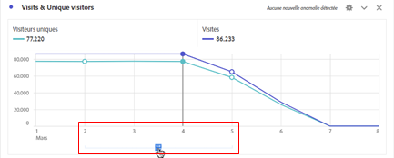
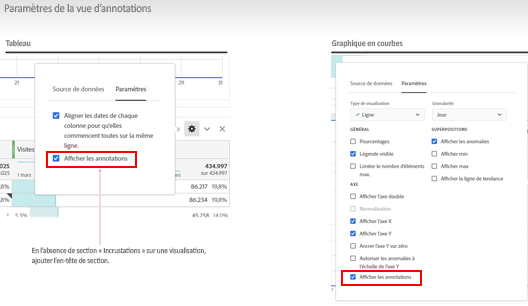
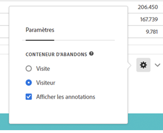

# Aperçu des annotations

Les annotations vous permettent de communiquer efficacement à votre organisation les nuances et informations concernant les données contextuelles. Elles vous permettent de lier les événements du calendrier à des dimensions/mesures spécifiques. Vous pouvez annoter une date ou une période avec des problèmes de données connus, des jours fériés, des lancements de campagne, etc. Vous pouvez ensuite afficher les événements sous forme graphique et voir si les campagnes ou d’autres événements ont affecté le trafic sur votre site, votre utilisation de l’application mobile, votre chiffre d’affaires ou toute autre mesure.

Supposons, par exemple, que vous partagiez des projets avec votre organisation. Si vous constatez un pic de trafic important dû à une campagne marketing, vous pouvez créer une annotation « Date de lancement de la campagne » et l’appliquer à l’ensemble de la vue de données. Lorsque vos utilisateurs et utilisatrices visualisent des jeux de données incluant cette date, ils voient l’annotation dans leurs projets, à côté de leurs données.

Gardez ceci à l’esprit :

* Les annotations peuvent être liées à une seule date ou à une période.

* Elles peuvent s’appliquer à l’ensemble de votre jeu de données ou à des mesures, dimensions ou filtres spécifiques.

* Elles peuvent s’appliquer au projet dans lequel elles ont été créées (par défaut) ou à tous les projets.

* Elles peuvent s’appliquer à la vue de données dans laquelle elles ont été créées (par défaut) ou à toutes les vues de données.

## Autorisations

Par défaut, seuls les administrateurs et administratrices peuvent créer des annotations. Les utilisateurs et utilisatrices ont le droit d’afficher les annotations comme ils le font avec d’autres composants d’Analytics (tels que les filtres, les mesures calculées, etc.).

Toutefois, les administrateurs et administratrices peuvent accorder aux utilisateurs et utilisatrices l’autorisation de [!UICONTROL Créer des annotations] (outils Analytics) via l’[Adobe Admin Console](https://experienceleague.adobe.com/docs/analytics/admin/admin-console/permissions/analytics-tools.html?lang=fr).

## Activation ou désactivation des annotations {#annotations-on-off}

Les annotations peuvent être activées ou désactivées à plusieurs niveaux :

* Au niveau de la visualisation : paramètres de [!UICONTROL Visualisation] > [!UICONTROL Afficher les annotations].

* Au niveau du projet : [!UICONTROL Informations et paramètres du projet] > [!UICONTROL Afficher les annotations].

* Au niveau de l’utilisateur : [!UICONTROL Composants] > [!UICONTROL Préférences utilisateur] > [!UICONTROL Données] > [!UICONTROL Afficher les annotations].

