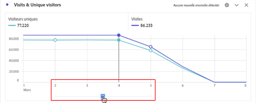

# Affichage des annotations

Les annotations se présentent de manière légèrement différente, selon qu’elles s’étendent sur un seul jour ou sur une période.

## Affichage des annotations dans les graphiques linéaires ou les tableaux

| Date | Apparence |
| --- | --- |
| **Un seul jour** | 
Lorsque vous pointez sur l’annotation, des options permettant dʼafficher les détails, de la modifier (via lʼicône de stylo) ou de la supprimer apparaissent :
  |
| **Période** | L’icône change et lorsque vous pointez dessus, la période s’affiche.

Lorsque vous la sélectionnez dans le graphique linéaire, les métadonnées de l’annotation apparaissent et vous pouvez les modifier ou les supprimer :
Dans un tableau, une icône s’affiche pour chaque date de la période.
 |
| **Annotations qui se chevauchent** | Les jours auxquels plusieurs annotations sont liées comportent une icône de couleur grise.

Lorsque vous pointez sur l’icône grise, toutes les annotations qui se chevauchent s’affichent :
 |

{style="table-layout:auto"}

## Affichage des annotations dans un fichier .pdf

Puisque vous ne pouvez pas pointer sur les icônes dans un fichier .pdf, ce fichier (après l’exportation) fournit des notes d’explication au bas d’un panneau. Voici un exemple :

## Afficher les annotations avec des données qui ne représentent pas de tendance

Parfois, les annotations s’affichent avec des données qui ne représentent pas de tendances, mais qui sont liées à une dimension spécifique. Ces annotations sont affichées sous la forme dʼune annotation sommaire, dans le coin inférieur droit. Voici un exemple :

Le graphique de synthèse s’affiche dans tous les types de visualisation dans le coin, et pas seulement dans les tableaux à structure libre et les nombres de synthèse ne représentant pas de tendance. Il apparaît également dans les visualisations telles que [!UICONTROL Anneau], [!UICONTROL Flux], [!UICONTROL Abandon], [!UICONTROL Cohorte], etc.

