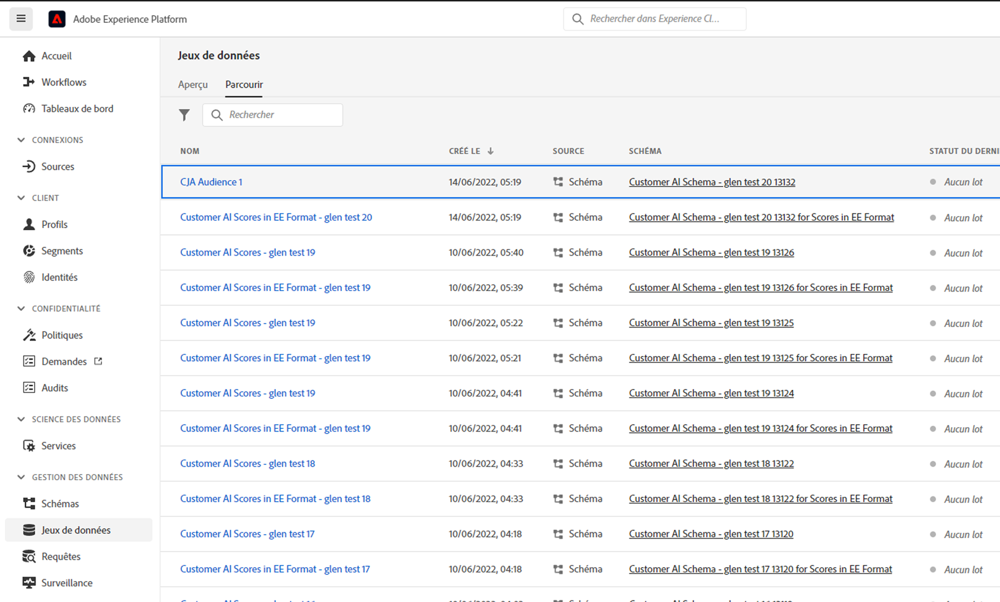

# Gestion des audiences créées dans Customer Journey Analytics

>[!NOTE]
>
>Cette fonctionnalité se trouve actuellement dans [test limité](/help/release-notes/releases.md).

La gestion des audiences créées précédemment permet de

* **Planification ou déplanification** actualisation/mise à jour automatique de l’audience. L’expiration maximale du planning est d’un an.
* **Renouvellement du planning d’actualisation d’une audience** sur le point d’expirer. Les audiences arrivant à expiration sont traitées de la même manière que les rapports planifiés arrivant à expiration : l’administrateur reçoit un courrier électronique un mois avant l’expiration du planning.
* Afficher la variable **dernière mise à jour d’une audience**
* Découvrez les **le temps nécessaire à la production d’une audience ;** de Customer Journey Analytics (CJA) et le temps nécessaire pour que l’audience apparaisse dans Real-time Customer Profile à des fins d’activation.
* Vérifiez si les audiences dans CJA sont **Utilisation active par Real-time Customer Profile** ou (idéalement) toute application Experience Platform qui consomme les audiences créées par CJA.

## Interface utilisateur de gestion

copie dʼécran

| Paramètre de l’interface utilisateur | Définition |
| --- | --- |
| Masquer/afficher les filtres | Permet d’afficher ou de masquer les filtres suivants dans le rail de gauche : <ul><li>Vue de données</li><li>Propriétaire</li><li>Fréquence d’actualisation</li><li>Balises</li></ul> |
| Titre et description |  |
| Vue de données |
| Taille de l’audience |  |
| Propriétaire |  |
| Fréquence d’actualisation |  |
| Balises |  |
| Dernière actualisation |  |
| Dernière modification |  |

{style=&quot;table-layout:auto&quot;}

## Affichage et utilisation des audiences CJA dans Experience Platform

Vous pouvez afficher les audiences CJA dans Platform en accédant à [!UICONTROL Segments] > [!UICONTROL Création de segments] > [!UICONTROL Audiences] onglet > [!UICONTROL Audiences CJA].

Vous pouvez faire glisser les audiences CJA dans la définition de segment pour les segments AEP.

Si vous optez pour l’exportation de cette audience vers le lac de données AEP, elle apparaîtra sous la forme d’un jeu de données conforme à la classe de schéma XDM Individual Profile :

