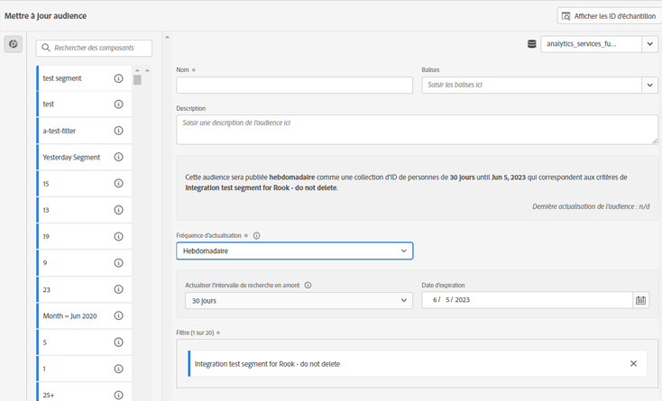
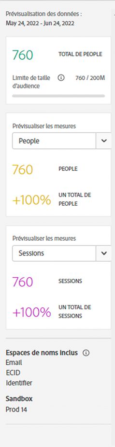
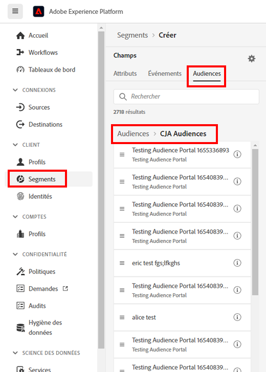

# Créer et publier des audiences

Cette rubrique explique comment créer et publier des audiences identifiées dans Customer Journey Analytics (CJA) dans le [profil client en temps réel](https://experienceleague.adobe.com/docs/experience-platform/profile/home.html?lang=fr) dans Adobe Experience Platform pour le ciblage et la personnalisation des clients.

Lisez cette [présentation](/help/components/audiences/audiences-overview.md) pour vous familiariser avec le concept des audiences CJA.

## Créer une audience {#create}

1. Pour créer des audiences, vous disposez de trois moyens pour commencer :

   | Méthode de création | Détails |
   | --- | --- |
   | À partir du menu **[!UICONTROL Composants] > [!UICONTROL Audiences]** | La page du gestionnaire d’audiences s’ouvre. Cliquez sur **[!UICONTROL Créer une audience]** et le [!UICONTROL créateur d’audiences] s’ouvre. |
   | Dans un tableau à structure libre | Cliquez avec le bouton droit de la souris sur un élément d’un tableau à structure libre, puis sélectionnez **[!UICONTROL Créer une audience d’après une sélection]**. L’utilisation de cette méthode préremplit le filtre avec la dimension ou l’élément de dimension que vous avez sélectionné dans le tableau. |
   | À partir de l’interface utilisateur de création/modification de filtre | Cochez la case qui indique : **[!UICONTROL Créer une audience à partir de ce filtre]**. L’utilisation de cette méthode préremplit le filtre. |

   {style=&quot;table-layout:auto&quot;}

1. Créez l’audience.

   Configurez ces paramètres avant de pouvoir publier l’audience.

   

   | Paramètre | Description |
   | --- | --- |
   | [!UICONTROL Nom] | Nom de l’audience. |
   | [!UICONTROL Balises] | Toutes les balises que vous souhaitez affecter à l’audience à des fins d’organisation. Vous pouvez utiliser une balise préexistante ou en saisir une nouvelle. |
   | [!UICONTROL Description] | Ajoutez une bonne description de l’audience pour la différencier des autres. |
   | [!UICONTROL Fréquence d’actualisation] | Fréquence à laquelle vous souhaitez actualiser l’audience.<ul><li>Vous pouvez choisir de créer une audience unique (par défaut) qui ne doit pas être actualisée. Par exemple, cela peut s’avérer utile pour des campagnes ponctuelles spécifiques.</li><li>Vous pouvez sélectionner d’autres intervalles d’actualisation. Pour la fréquence d’actualisation de 4 heures, il existe une limite de 75 à 150 actualisations d’audience, selon vos droits CJA.</li></ul> |
   | Date d’expiration | Lorsque l’audience cessera de s’actualiser. La valeur par défaut est d’un an à compter de la date de création. Les audiences arrivant à expiration sont traitées de la même manière que les rapports planifiés arrivant à expiration : l’administrateur reçoit un e-mail un mois avant l’expiration de l’audience. |
   | Actualiser l’intervalle de recherche en amont | Indique jusqu’à combien de temps en arrière vous souhaitez remonter dans votre fenêtre de données lors de la création de cette audience. La valeur maximale est de 90 jours. |
   | [!UICONTROL Période pour audience unique] | Période à laquelle vous souhaitez que l’audience unique soit publiée. |
   | [!UICONTROL Filtrer] | Les filtres sont la principale entrée de l’audience. Vous pouvez ajouter jusquʼà 20 filtres. Ces filtres peuvent être joints à l’aide des opérateurs `And` ou `Or`. |
   | [!UICONTROL Afficher les identifiants d’échantillon] | Des identifiants d’échantillon dans cette audience. Utilisez la barre de recherche pour rechercher des ID d’échantillons. |

   {style=&quot;table-layout:auto&quot;}

1. Interpréter l’aperçu des données.

   L’aperçu de l’audience s’affiche dans le rail de droite. Il permet une analyse résumée de l’audience que vous avez créée.

   

   | Paramètre d’aperçu | Description |
   | --- | --- |
   | Fenêtre [!UICONTROL Aperçu des données] | La période de l’audience. |
   | [!UICONTROL Total personnes] | Résumé du nombre total de personnes dans cette audience. Il peut atteindre 20 millions de personnes. Si votre audience dépasse 20 millions de personnes, vous devez réduire la taille de l’audience avant de pouvoir la publier. |
   | [!UICONTROL Limite de taille d’audience] | Indique à quel point cette audience est éloignée de la limite de 20 millions. |
   | [!UICONTROL Retour dʼaudience estimé] | Ce paramètre est utile pour recibler les clients de cette audience qui reviennent sur votre site. (En d’autres termes, qui sont à nouveau affichés dans ce jeu de données.) 
Ici, vous pouvez sélectionner la période (les 7 prochains jours, les 2 prochaines semaines, le mois prochain) pour l’estimation du nombre de clients susceptibles de revenir. |
   | [!UICONTROL Retour estimé] | Ce nombre vous donne une estimation du nombre de clients récurrents sur la période que vous avez sélectionnée dans la liste déroulante. Nous regardons le taux de perte historique pour cette audience afin de prédire ce nombre. |
   | [!UICONTROL Prévisualiser les mesures] | Ce paramètre vous permet de consulter des mesures spécifiques pour déterminer si l’audience contribue à un montant disproportionné à cette mesure, par exemple : ‘[!UICONTROL Recettes]’ ou ‘[!UICONTROL Temps moyen passé sur le site]’. Il vous donne le nombre agrégé de la mesure, ainsi que le pourcentage du total qu’il représente. Vous pouvez sélectionner n’importe quelle mesure disponible dans votre vue de données. |
   | [!UICONTROL Espaces de noms inclus] | Espaces de noms spécifiques associés aux personnes de votre audience. Par exemple, ECID, identifiant CRM, adresses électroniques, etc. |
   | [!UICONTROL Sandbox] | La [sandbox Experience Platform](https://experienceleague.adobe.com/docs/experience-platform/sandbox/home.html?lang=fr) dans laquelle réside cette audience. Lorsque vous publiez cette audience sur Platform, vous ne pouvez l’utiliser que dans les limites de cette sandbox. |

   {style=&quot;table-layout:auto&quot;}

1. Vérifiez deux fois la configuration de votre audience et cliquez sur **[!UICONTROL Publier]**.

   Si tout s’est bien passé, vous recevrez un message de confirmation annonçant que l’audience a été publiée. Il suffit d’une minute ou deux pour que cette audience s’affiche dans Experience Platform. (Même pour les audiences avec des millions de membres, cela devrait prendre moins de 5 minutes.)

1. Cliquez sur **[!UICONTROL Afficher l’audience dans AEP]** dans le même message et vous serez dirigé vers la fonction [Interface utilisateur des segments](https://experienceleague.adobe.com/docs/experience-platform/segmentation/ui/overview.html?lang=fr) dans Adobe Experience Platform. Plus d’informations ci-dessous.

## Que se passe-t-il une fois une audience créée ? {#after-audience-created}

Une fois que vous avez créé une audience, Adobe crée un segment de diffusion en continu Experience Platform pour chaque nouvelle audience CJA. Un segment de diffusion en continu AEP ne sera créé que si votre entreprise est configurée pour la segmentation en continu.

* Le segment AEP partage le même nom/la même description que l’audience CJA, mais le nom sera ajouté avec l’ID d’audience CJA pour s’assurer qu’il est unique.
* Si le nom/la description de l’audience CJA change, le nom/la description du segment AEP reflète également ce changement.
* Si une audience CJA est supprimée par un utilisateur, le segment AEP n’est PAS supprimé. La raison en est que l’audience CJA peut par la suite être annulée.

## Considérations relatives à la latence {#latency}

À plusieurs moments avant, pendant et après la publication de l’audience, des latences peuvent se produire. Voici un aperçu des latences possibles.

| Point de latence | Durée de latence |
| --- | --- |
| Ingestion des données dans le lac de données | Jusqu’à 30 minutes |
| Ingestion de données de l’Experience Platform dans CJA | Jusqu’à 60 minutes |
| Publication d’audiences sur Real-time Customer Profile, y compris la création automatique du segment de diffusion en continu et la possibilité pour le segment d’être prêt à recevoir les données. | Environ 60 minutes |
| Actualisation de la fréquence des audiences | <ul><li>Actualisation ponctuelle (latence inférieure à 5 minutes)</li><li>Actualiser toutes les 4 heures, tous les jours, toutes les semaines, tous les mois (la latence va de pair avec le taux d’actualisation) |
| Création d’une destination dans AEP : Activation du nouveau segment | 1-2 heures |

## Utiliser les audiences CJA dans Experience Platform {#audiences-aep}

CJA récupère toutes les combinaisons d’espace de noms et d’identifiants de l’audience publiée et les diffuse dans Real-time Customer Profile (RTCP). CJA envoie l’audience à l’Experience Platform avec le jeu d’identités Principal, en fonction de ce qui a été sélectionné en tant que [!UICONTROL ID de personne] lorsque la connexion a été configurée.

Le RTCP examine ensuite chaque combinaison espace de noms/ID et recherche un profil dont il peut faire partie. Un profil est essentiellement un groupe d’espaces de noms, d’identifiants et d’appareils liés. S’il trouve un profil, il ajoute l’espace de noms et l’identifiant aux autres identifiants de ce profil en tant qu’attribut d’appartenance à un segment. Désormais, par exemple, « user@adobe.com » peut être ciblé sur tous leurs appareils et canaux. Si aucun profil n’est trouvé, un nouveau profil est créé.

Vous pouvez afficher les audiences CJA dans Platform en accédant à l’onglet **[!UICONTROL Segments]** > **[!UICONTROL Créer des segments]** > **[!UICONTROL Audiences]** > **[!UICONTROL Audiences CJA]**.

Vous pouvez faire glisser les audiences CJA dans la définition de segment pour les segments AEP.

## Questions fréquentes {#faq}

Questions fréquentes sur la publication d’audiences.

+++**Que se passe-t-il si un utilisateur n’est plus membre d’une audience dans CJA ?**

Dans ce cas, un événement de sortie est transmis par CJA à Experience Platform.

+++

+++**Que se passe-t-il si vous supprimez une audience dans CJA ?**

Lorsqu’une audience CJA est supprimée, elle ne s’affiche plus dans l’interface utilisateur Experience Platform. Cependant, aucun profil associé à cette audience n’est supprimé dans Platform.

+++

+++**Si un profil correspondant n’existe pas dans RTCDP, un nouveau profil sera-t-il créé ?**

Oui.

+++

+++**Est-ce que CJA envoie les données d’audience sous la forme d’événements de pipeline ou d’un fichier plat également destiné au lac de données ?**

CJA diffuse les données dans RTCP par pipeline, et ces données sont également collectées dans un jeu de données système dans le lac de données.

+++

+++**Quelles sont les identités envoyées par CJA ?**

Les paires identité/espace de noms utilisées dans [Configuration de la connexion](https://experienceleague.adobe.com/docs/analytics-platform/using/cja-connections/create-connection.html?lang=fr#create-connection). Plus précisément, l’étape à laquelle un utilisateur sélectionne le champ qu’il souhaite utiliser comme &quot;ID de personne&quot;.

+++

+++**Quel ID est choisi comme identité Principale ?**

Voir ci-dessus. Nous n’envoyons qu’une seule identité par « personne » CJA.

+++

+++**Le RTCP traite-t-il également les messages CJA ? Est-ce que CJA peut ajouter des identités à un graphique d’identités de profil par le biais du partage d’audiences ?**

Non. Nous n’envoyons qu’une seule identité par « personne », ainsi le RTCP ne consomme aucune périphérie de graphique.

+++

## Étapes suivantes

* Pour gérer cette audience, accédez à l’[interface utilisateur de gestion](/help/components/audiences/manage.md).
