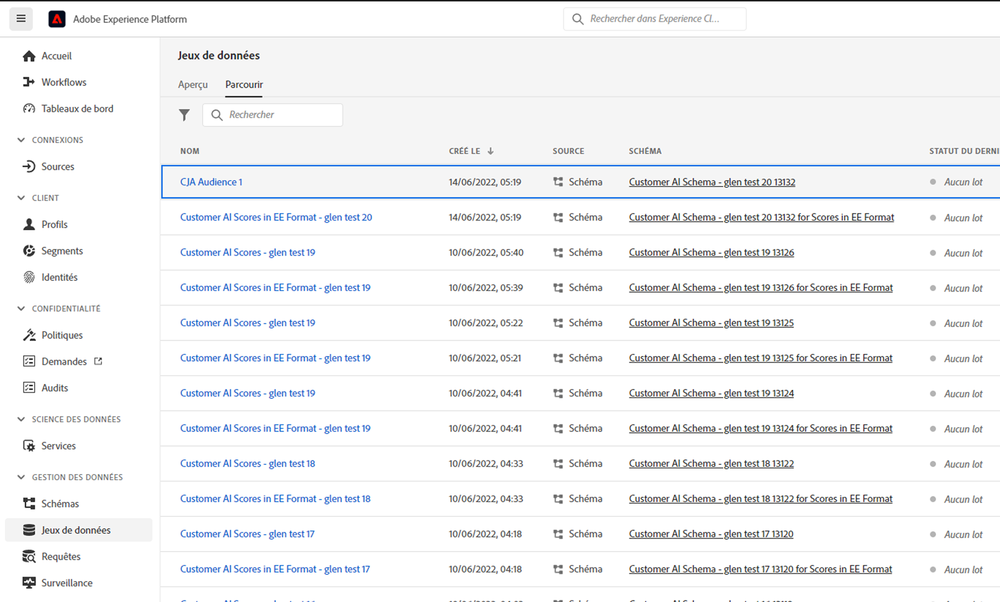

# Création et publication d’audiences

>[!NOTE]
>
>Cette fonctionnalité se trouve actuellement dans [test limité](/help/release-notes/releases.md).

Cette rubrique explique comment créer et publier des audiences identifiées dans Customer Journey Analytics (CJA) sur [Real-time Customer Profile](https://experienceleague.adobe.com/docs/experience-platform/profile/home.html?lang=fr) dans Adobe Experience Platform pour le ciblage et la personnalisation des clients.

Lire ceci [aperçu](/help/components/audiences/audiences-overview.md) pour vous familiariser avec le concept des audiences CJA.

## Créer une audience

1. Pour créer des audiences, vous avez trois façons de commencer :

   | Méthode de création | Détails |
   | --- | --- |
   | À partir de la page principale **[!UICONTROL Composants] > [!UICONTROL Audiences]** menu | La page Audiences Manager s’ouvre. Cliquez sur **[!UICONTROL Créer une audience]** et le [!UICONTROL Audience Builder] s’ouvre. |
   | Dans un tableau à structure libre | Cliquez avec le bouton droit de la souris sur un élément d’un tableau à structure libre, puis sélectionnez **[!UICONTROL Création d’une audience d’après une sélection]**. L’utilisation de cette méthode préremplit le filtre avec la dimension ou l’élément de dimension que vous avez sélectionné dans le tableau. |
   | À partir de l’interface utilisateur de création/modification de filtre | Cochez la case qui indique : **[!UICONTROL Créer une audience à partir de ce filtre]**. L’utilisation de cette méthode préremplit le filtre. |

   {style=&quot;table-layout:auto&quot;}

1. Créez l’audience.

   Configurez ces paramètres avant de pouvoir publier l’audience.

   

   | Paramètre | Description |
   | --- | --- |
   | [!UICONTROL Nom] | Nom de l’audience. |
   | [!UICONTROL Balises] | Toutes les balises que vous souhaitez attribuer à l’audience à des fins d’organisation. Vous pouvez utiliser une balise préexistante ou en saisir une nouvelle. |
   | [!UICONTROL Description] | Ajoutez une bonne description de l’audience pour la différencier des autres. |
   | [!UICONTROL Fréquence d’actualisation] | Fréquence à laquelle vous souhaitez actualiser l’audience.<ul><li>Vous pouvez choisir de créer une audience unique (par défaut) qui ne doit pas être actualisée. Par exemple, cela peut s’avérer utile pour des campagnes ponctuelles spécifiques.</li><li>Vous pouvez sélectionner d’autres intervalles d’actualisation. Pour la fréquence de 4 heures, il existe une limite de 150 audiences, car ce taux d’actualisation est très intensif en traitement. Pour les autres intervalles, il n’y a pas de nombre maximal d’audiences.</li></ul> |
   | Date d’expiration | Lorsque l’audience cessera de s’actualiser. La valeur par défaut est d’un an à compter de la date de création. Les audiences arrivant à expiration sont traitées de la même manière que les rapports planifiés arrivant à expiration : l’administrateur reçoit un courrier électronique un mois avant l’expiration de l’audience. |
   | Actualiser l’intervalle de recherche en amont | Indique le chemin à parcourir dans la fenêtre de données lors de la création de cette audience. La valeur maximale est de 90 jours. |
   | [!UICONTROL Période ponctuelle] | Période à laquelle vous souhaitez que l’audience unique soit publiée. |
   | [!UICONTROL Filtrer] | Les filtres sont la principale entrée de l’audience. Vous pouvez ajouter jusqu’à 20 filtres. Ces filtres peuvent être joints par `And` ou `Or` opérateurs. |
   | [!UICONTROL Afficher les identifiants d’échantillon] | Exemple d’identifiants dans cette audience. Utilisez la barre de recherche pour rechercher des exemples d’ID. |

   {style=&quot;table-layout:auto&quot;}

1. Interpréter l’aperçu des données.

   L’aperçu de l’audience s’affiche dans le rail de droite. Il permet une analyse résumée de l’audience que vous avez créée.

   

   | Paramètre d’aperçu | Description |
   | --- | --- |
   | [!UICONTROL Aperçu des données] window | La période de l’audience. |
   | [!UICONTROL Total personnes] | Nombre total de personnes dans cette audience. Il peut atteindre 100 millions de personnes. Si votre audience dépasse 100 millions de personnes, vous devez réduire la taille de l’audience avant de pouvoir la publier. |
   | [!UICONTROL Limite de taille d’audience] | Indique à quel point cette audience est éloignée de la limite de 100 millions de milliards. |
   | [!UICONTROL Retour dʼaudience estimé] | Ce paramètre est utile pour recibler les clients de cette audience qui reviennent sur votre site. (En d’autres termes, qui sont à nouveau affichés dans ce jeu de données.) 
Ici, vous pouvez sélectionner la période (les 7 prochains jours, les 2 prochaines semaines, le mois prochain) pour l’estimation du nombre de clients susceptibles de revenir. |
   | [!UICONTROL Retour estimé] | Ce nombre vous donne une estimation du nombre de clients récurrents sur la période que vous avez sélectionnée dans la liste déroulante. Nous regardons le taux de perte historique pour cette audience pour prédire ce nombre. |
   | [!UICONTROL Prévisualiser les mesures] | Ce paramètre vous permet de consulter des mesures spécifiques pour déterminer si l’audience contribue à un montant disproportionné à cette mesure, par exemple : &quot;&quot;[!UICONTROL Recettes]&#39; ou &#39;[!UICONTROL Temps moyen passé sur le site]&#39;. Il vous donne le nombre agrégé de la mesure, ainsi que le pourcentage du total qu’il représente. Vous pouvez sélectionner n’importe quelle mesure disponible dans votre vue de données. |
   | [!UICONTROL Espaces de noms inclus] | Espaces de noms spécifiques associés aux personnes de votre audience. Par exemple, ECID, identifiant CRM, adresses électroniques, etc. |
   | [!UICONTROL Environnement de test] | Le [Environnement de test Experience Platform](https://experienceleague.adobe.com/docs/experience-platform/sandbox/home.html?lang=fr) dans laquelle réside cette audience. Lorsque vous publiez cette audience sur Platform, vous ne pouvez l’utiliser que dans les limites de cet environnement de test. |

   {style=&quot;table-layout:auto&quot;}

1. Vérifiez deux fois la configuration de votre audience et cliquez sur **[!UICONTROL Publier]**.

   Si tout s&#39;est bien passé, vous recevrez un message de confirmation que l&#39;audience a été publiée. Il suffit d’une minute ou deux pour que cette audience s’affiche en Experience Platform. (Même pour les audiences avec des millions de membres, cela devrait prendre moins de 5 minutes.)

1. Cliquez sur **[!UICONTROL Affichage de l’audience dans AEP]** dans le même message et vous serez amené à la fonction [Interface utilisateur des segments](https://experienceleague.adobe.com/docs/experience-platform/segmentation/ui/overview.html?lang=fr) dans Adobe Experience Platform. Plus d’informations ci-dessous.

## Utilisation des audiences CJA dans Experience Platform

CJA récupère désormais toutes les combinaisons d’espace de noms et d’identifiants de l’audience publiée et les diffuse dans Real-time Customer Profile (RTCP). Le protocole TCP examine ensuite chaque combinaison namespace/ID et recherche un profil dont il peut faire partie. Un profil est essentiellement un groupe d’espaces de noms, d’identifiants et d’appareils liés. S’il trouve un profil, il ajoute l’espace de noms et l’identifiant aux autres identifiants de ce profil en tant qu’attribut d’adhésion au segment. Désormais, par exemple, &quot;user@adobe.com&quot; peut être ciblé sur tous leurs appareils et canaux. Si aucun profil n’est trouvé, un nouveau profil est créé.

Vous pouvez afficher les audiences CJA dans Platform en accédant à **[!UICONTROL Segments]** > **[!UICONTROL Création de segments]** > **[!UICONTROL Audiences]** onglet > **[!UICONTROL Audiences CJA]**.

Vous pouvez faire glisser les audiences CJA dans la définition de segment pour les segments AEP.

Si vous optez pour l’exportation de cette audience vers le lac de données AEP, elle apparaîtra sous la forme d’un jeu de données conforme à la classe de schéma XDM Individual Profile :

## Étapes suivantes

* Pour gérer cette audience, accédez au [Interface utilisateur de gestion](/help/components/audiences/manage.md).
