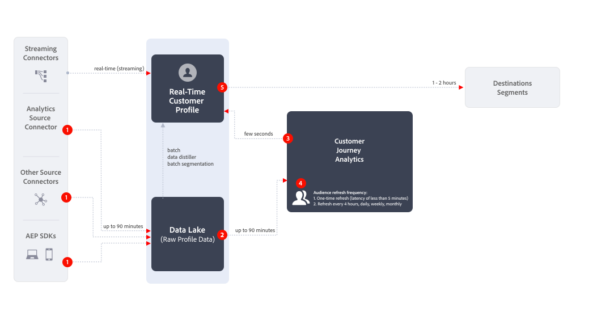

# Créer et publier des audiences {#create-and-publish-audiences}

<!-- markdownlint-disable MD034 -->

>[!CONTEXTUALHELP]
>id="components_audiences_refreshfrequency"
>title="Fréquence d’actualisation"
>abstract="Découvrez la fréquence à laquelle l’appartenance d’une audience est réévaluée. Les audiences uniqes ne sont évaluées qu’une seule fois."

<!-- markdownlint-enable MD034 -->

<!-- markdownlint-disable MD034 -->

>[!CONTEXTUALHELP]
>id="components_audiences_audiencelimit"
>title="Limite d’audience"
>abstract="L’actualisation des audiences est limitée en fonction de la fréquence à laquelle elles s’actualisent."

<!-- markdownlint-enable MD034 -->

<!-- markdownlint-disable MD034 -->

>[!CONTEXTUALHELP]
>id="component_audiences_refreshlookbackwindow"
>title="Actualiser l’intervalle de recherche en amont"
>abstract="Définissez le nombre de jours de recherche en amont à partir desquels une audience est évaluée."

<!-- markdownlint-enable MD034 -->

<!-- markdownlint-disable MD034 -->

>[!CONTEXTUALHELP]
>id="component_audiences_audiencesizelimit"
>title="Limite de taille d’audience"
>abstract="Les audiences ne peuvent pas dépasser 20 millions de membres."

<!-- markdownlint-enable MD034 -->

<!-- markdownlint-disable MD034 -->

>[!CONTEXTUALHELP]
>id="component_audiences_namespacesincluded"
>title="Espaces de noms inclus"
>abstract="Les identités de cette audience sont composées des espaces de noms ci-dessous."

<!-- markdownlint-enable MD034 -->

Cette rubrique explique comment créer et publier des audiences identifiées dans Customer Journey Analytics dans le [profil client en temps réel](https://experienceleague.adobe.com/fr/docs/experience-platform/profile/home) dans Adobe Experience Platform pour le ciblage et la personnalisation des clients.

Lisez cette [présentation](/help/components/audiences/audiences-overview.md) pour vous familiariser avec le concept des audiences Customer Journey Analytics.

## Créer et publier une audience {#create}

1. Pour créer et publier une audience, effectuez l’une des opérations suivantes :

   | Méthode de création | Détails |
   | --- | --- |
   | Depuis l’interface **[!UICONTROL Audiences]** | Sélectionnez **[!UICONTROL Composants]** > **[!UICONTROL Audiences]** dans le menu Customer Journey Analytics principal. L’interface Audiences s’affiche. Sélectionnez **[!UICONTROL Créer une audience]** et le [!UICONTROL Créateur d’audience] s’ouvre. |
   | À partir d’une visualisation dans Analysis Workspace | De nombreuses visualisations dans Analysis Workspace vous permettent de créer une audience à l’aide du menu contextuel. Par exemple, vous pouvez sélectionner **[!UICONTROL Créer une audience]** dans le menu contextuel d’un élément d’un [tableau à structure libre](/help/analysis-workspace/visualizations/freeform-table/freeform-table.md) ou d’un nœud dans la zone de travail de Parcours .
L’utilisation de cette méthode préremplit le filtre dans le créateur d’audiences avec la dimension ou l’élément de dimension que vous avez sélectionné.

Les visualisations suivantes vous permettent de créer une audience à l’aide du menu contextuel :
<ul><li>[Table de cohorte](/help/analysis-workspace/visualizations/cohort-table/cohort-analysis.md)</li><li>[Abandon](/help/analysis-workspace/visualizations/fallout/fallout-flow.md)</li><li>[Flux](/help/analysis-workspace/visualizations/c-flow/flow.md)</li><li>[Tableau à structure libre](/help/analysis-workspace/visualizations/freeform-table/freeform-table.md)</li><li>[Zone de travail de Parcours ](/help/analysis-workspace/visualizations/journey-canvas/journey-canvas.md)</li><li>[Venn](/help/analysis-workspace/visualizations/venn.md)</li></ul>
**Remarque :** les audiences ne peuvent pas inclure de mesures calculées. Si vous essayez de créer une audience qui contient une mesure calculée, la mesure calculée n’est pas incluse dans la définition de l’audience.
 |
   | À partir de l’interface utilisateur de création/modification de filtre | Cochez la case qui indique : **[!UICONTROL Créer une audience à partir de ce filtre]**. L’utilisation de cette méthode préremplit le filtre. Voir [Création de filtres](/help/components/filters/create-filters.md) pour plus d’informations. |

   {style="table-layout:auto"}

1. Créez l’audience à l’aide du [créateur d’audience](#audience-builder).

1. Interprétez les données à l’aide du panneau [Aperçu de la date](#data-preview).

1. Sélectionnez **[!UICONTROL [!UICONTROL Afficher des identifiants d’échantillon]]** pour afficher un échantillon d’identifiants dans cette audience. Dans la boîte de dialogue **[!UICONTROL ID d’échantillon]**, vous pouvez utiliser  [!UICONTROL *Rechercher des ID d’échantillon*] pour rechercher des ID d’échantillon.

1. Vérifiez à nouveau la configuration de votre audience et sélectionnez **[!UICONTROL Publier]**.
Vous recevez un message de confirmation indiquant que l’audience est publiée. La publication ne prend qu’une minute ou deux pour que cette audience s’affiche dans Experience Platform.

1. Sélectionnez **[!UICONTROL Afficher l’audience dans AEP]** dans le même message et vous êtes redirigé(e) vers l’[interface utilisateur des segments](https://experienceleague.adobe.com/fr/docs/experience-platform/segmentation/ui/overview) dans Adobe Experience Platform. Plus d’informations ci-dessous.

## Créateur d’audience

Configurez ces paramètres pour définir ou mettre à jour votre audience.

| Paramètre | Description |
| --- | --- |
|  | Sélectionnez une vue de données à utiliser pour la création de l’audience. |
| **[!UICONTROL Nom]** | Nom de l’audience. Par exemple, `Really Interested in Potential Car Buyers` |
| **[!UICONTROL Balises]** | Toutes les balises que vous souhaitez affecter à l’audience à des fins d’organisation. Vous pouvez sélectionner une ou plusieurs balises préexistantes ou en saisir une nouvelle. |
| **[!UICONTROL Description]** | Description de l’audience afin de la différencier des autres. Par exemple, `Build an audience of really interested potential car buyers` |
| **[!UICONTROL Fréquence d’actualisation]** | Fréquence à laquelle vous souhaitez actualiser l’audience.
Vous pouvez choisir entre <ul><li>**[!UICONTROL Une fois]** audience : audience (par défaut) qui ne doit pas être actualisée. Par exemple, cette option peut s’avérer utile pour des campagnes ponctuelles spécifiques. Vous devez spécifier une **[!UICONTROL Période unique]**. Vous pouvez utiliser  pour saisir une période.</li><li>Une audience rafraichissante. Vous avez les choix suivants :<ul><li>**[!UICONTROL Toutes les 4 heures :]** audience qui s’actualise toutes les 4 heures.</li><li>**[!UICONTROL Quotidien]** : audience qui s’actualise quotidiennement</li><li>**[!UICONTROL Hebdomadaire]** : audience qui s’actualise toutes les semaines.</li><li>**[!UICONTROL Mensuel]** : audience qui s’actualise tous les mois</li></ul></li>Pour actualiser les audiences, vous devez indiquer les informations suivantes :<ul><li>**[!UICONTROL Actualiser l’intervalle de recherche en amont]**. Définissez le nombre de jours de recherche en amont à partir d’aujourd’hui pour l’évaluation d’une audience. Vous pouvez effectuer un choix parmi des options ou définir une heure personnalisée. La durée maximale est de 90 jours.</li><li>**[!UICONTROL Date d’expiration]** : permet de définir à quel moment l’audience cesse d’être actualisée. Vous pouvez utiliser  pour sélectionner une date. La valeur par défaut est d’un an à compter de la date de création. Les audiences arrivant à expiration sont traitées de la même manière que les rapports planifiés arrivant à expiration. L’administrateur reçoit un e-mail un mois avant l’expiration de l’audience.</li></ul> Notez qu’il existe une limite de 75 à 150 actualisations d’audience, selon vos droits Customer Journey Analytics.</li></ul> |
| **[!UICONTROL Filtrer]** | Les filtres sont la principale entrée de l’audience. Effectuez un glisser-déposer d’un ou plusieurs filtres depuis le panneau de gauche  **[!UICONTROL Filtre]** vers la zone Filtre . Vous pouvez utiliser le  [!UICONTROL *Filtres de recherche*] pour rechercher des filtres. Vous pouvez ajouter jusquʼà 20 filtres. Les filtres peuvent être joints avec des opérateurs **[!UICONTROL Et]** ou **[!UICONTROL Ou]**.
Lors de la création d’une audience à partir d’une visualisation dans Analysis Workspace (un tableau à structure libre ou une zone de travail de Parcours, par exemple), tous les filtres appliqués au panneau ou à la colonne sont conservés. Vous pouvez supprimer tous les filtres appliqués automatiquement.
 |
| **[!UICONTROL Aperçu des données]** | Sélectionnez  pour afficher ou masquer l’[Aperçu des données](#data-preview) pour la période sélectionnée. |

## Prévisualisation des données

Le panneau Prévisualisation des données fournit les informations suivantes.

| Élément | Description |
| --- | --- |
| **[!UICONTROL Total personnes]** | Résumé du nombre total de personnes dans cette audience. La taille maximale est de 20 millions de personnes. Si votre audience dépasse 20 millions de personnes, vous devez réduire la taille de l’audience avant de pouvoir publier. |
| **[!UICONTROL Limite de taille d’audience]** | Visualisation permettant de voir à quel point cette audience est éloignée de la limite de 20 millions. |
| **[!UICONTROL Retour dʼaudience estimé]** | Vous pouvez utiliser cette valeur pour recibler les personnes de cette audience qui reviennent sur votre site, application mobile ou autre canal.
Vous pouvez sélectionner la période (**[!UICONTROL 7 prochains jours]**, **[!UICONTROL 2 prochaines semaines]** ou **[!UICONTROL mois prochain]**) pour l’estimation du nombre de clients susceptibles de revenir. |
| **[!UICONTROL Retour estimé]** | Ce nombre vous donne une estimation du nombre de clients récurrents sur la période que vous avez sélectionnée. Ce nombre est prédit à l’aide du taux de résiliation historique pour cette audience. |
| **[!UICONTROL Prévisualiser les mesures]** | Vous pouvez sélectionner une mesure spécifique pour voir la manière dont les données de cette mesure sont basées sur l’audience que vous définissez.  Chaque mesure Aperçu affiche un total pour la mesure en fonction de l’audience. Et un pourcentage de la mesure basée sur l’audience à partir du total global de la mesure, tel que défini par la vue de données. Par exemple, 381 personnes (la mesure que vous avez sélectionnée) sont le résultat de votre définition d’audience, soit 5 % du nombre total de personnes disponibles dans la vue de données. Vous pouvez sélectionner n’importe quelle mesure disponible dans votre vue de données. |
| **[!UICONTROL Espaces de noms inclus]** | Espaces de noms spécifiques associés aux personnes de votre audience. Par exemple, ECID, identifiant CRM, adresses électroniques, etc. |
| **[!UICONTROL Sandbox]** | La [sandbox Experience Platform](https://experienceleague.adobe.com/fr/docs/experience-platform/sandbox/home) dans laquelle réside cette audience. Lorsque vous publiez cette audience sur Platform, vous ne pouvez travailler avec l’audience que dans les limites de ce sandbox. |

{style="table-layout:auto"}

## Que se passe-t-il une fois une audience créée et publiée ? {#after-audience-created}

Une fois que vous avez créé et publié une audience dans Customer Journey Analytics, elle est disponible dans Experience Platform. Un segment de diffusion en continu Adobe Experience Platform est créé uniquement si votre organisation est configurée pour la segmentation en flux continu.

* L’audience dans Platform partage le même nom et la même description que l’audience Customer Journey Analytics. Le nom est ajouté avec l’identifiant d’audience Customer Journey Analytics afin de s’assurer que l’audience est unique.
* Toute modification apportée au nom ou à la description de l’audience dans Customer Journey Analytics est répercutée dans Experience Platform.
* Si une audience est supprimée dans Customer Journey Analytics, elle reste disponible dans Experience Platform jusqu’à l’expiration de son appartenance à un profil. L’appartenance au profil expire après 420 jours pour les audiences à usage unique et après 16 jours pour les audiences récurrentes.

## Considérations relatives à la latence {#latency}

À plusieurs moments avant, pendant et après la publication de l’audience, des latences peuvent se produire. Voici un aperçu des latences possibles.

|  | Point de latence | Durée de latence |
| --- | --- | --- |
| Non affiché | Connecteur source Adobe Analytics vers Analytics (A4T) | Jusqu’à 30 minutes |
| 1 | Ingestion de données dans le lac de données (à partir du connecteur source Analytics ou d’autres sources) | Jusqu’à 90 minutes |
| 2 | Ingestion de données du lac de données d’Experience Platform dans Customer Journey Analytics | Jusqu’à 90 minutes |
| 3 | Publication d’audiences dans le profil client en temps réel, y compris la création automatique du segment de diffusion en continu et la possibilité pour le segment d’être prêt à recevoir les données. | Quelques secondes |
| 4 | Fréquence d’actualisation des audiences | <ul><li>Actualisation ponctuelle (latence inférieure à 5 minutes)</li><li>Actualiser toutes les 4 heures, tous les jours, toutes les semaines, tous les mois (la latence va de pair avec le taux d’actualisation) |
| 5 | Création d’une destination dans Adobe Experience Platform : activation du nouveau segment | 1-2 heures |

{style="table-layout:auto"}

## Utilisation des audiences Customer Journey Analytics dans Experience Platform {#audiences-aep}

Customer Journey Analytics récupère toutes les combinaisons d’espace de noms et d’identifiants de votre audience publiée et les diffuse dans Real-Time Customer Data Platform. Customer Journey Analytics envoie l’audience à Experience Platform avec l’identité principale définie sur l’élément sélectionné en fonction de ce qui a été sélectionné comme [!UICONTROL ID de personne] lors de la configuration de la connexion.

Real-Time Customer Data Platform examine ensuite chaque combinaison espace de noms/ID et recherche un profil dont elle peut faire partie. Un profil est essentiellement un groupe d’espaces de noms, d’identifiants et d’appareils liés. S’il trouve un profil, il ajoute l’espace de noms et l’identifiant aux autres identifiants de ce profil en tant qu’attribut d’appartenance à un segment. Par exemple, les <user@adobe.com> peuvent être ciblés sur tous leurs appareils et canaux. Si aucun profil n’est trouvé, un nouveau profil est créé.

Pour afficher les audiences Customer Journey Analytics dans Platform :

1. Développez **[!UICONTROL Client]** dans le panneau de gauche, puis sélectionnez **[!UICONTROL Audiences]**. <!-- is there a folder called "Customer Journey Analytics? -->

1. Sélectionnez l’onglet **[!UICONTROL Parcourir]**.

1. Pour localiser l’audience que vous avez publiée à partir de Customer Journey Analytics, effectuez l’une des opérations suivantes :

   

   * Triez le tableau selon la colonne **[!UICONTROL Origine]** pour afficher les audiences qui affichent [!UICONTROL **Customer Journey Analytics**] comme origine.

   * Filtrez  sur **[!UICONTROL Origine]** et sélectionnez **[!UICONTROL Customer Journey Analytics]**.

   * Utilisez le champ de recherche .

Pour plus d’informations sur l’utilisation des audiences dans Platform, consultez la section [Audiences](https://experienceleague.adobe.com/en/docs/experience-platform/segmentation/ui/segment-builder) dans le [guide de l’interface utilisateur du créateur de segments](https://experienceleague.adobe.com/en/docs/experience-platform/segmentation/ui/segment-builder) dans la documentation d’Experience Platform.

<!---### Understand discrepancies in audience counts between Customer Journey Analytics and Real-Time Customer Data Platform

Discrepancies in audience counts may occur between Customer Journey Analytics and Real-Time Customer Data Platform. The points below provide a detailed explanation of these differences:

**Probabilistic versus deterministic counts**

The methodology by which audience membership numbers are being calculated differs between the two apps, as described below.

*  **Customer Journey Analytics**: The **[!UICONTROL Total People]** metric in Customer Journey Analytics is an estimated value. This means that the count is an estimate based on the rules of the audience and it can change between refresh intervals.
*  **Real-Time Customer Data Platform**: The count in Real-Time Customer Data Platform is deterministic, based on daily evaluation jobs, and fixed at the time the audience finishes publishing into the audience portal. 

**Publishing interval and rate**

Audiences publish to Real-Time Customer Data Platform at a rate of 1500 records per second (RPS). For example, an audience of 20 million members will take approximately 3.7 hours to fully publish (20M / 1500 RPS / 3600 seconds per hour). During this time, differences in audience membership between the two apps are likely.

**Profile fragmentation**

If profiles imported from Customer Journey Analytics already exist in Real-Time Customer Data Platform, they are not counted as new profiles. This can lead to lower-than-expected profile counts in Real-Time Customer Data Platform.

**Batch versus streaming audiences**

Customer Journey Analytics audiences are not included in the daily batch evaluation job and remain fixed until the next publish interval. In contrast, other batch audiences in Real-Time Customer Data Platform are re-evaluated every 24 hours.

### Key takeaways to remember

* **Estimated counts in Customer Journey Analytics**: Understand that the **[!UICONTROL Total People]** count in Customer Journey Analytics is an estimate and can vary due to streaming data and identity behaviors.
* **Deterministic counts in Real-Time Customer Data Platform**: The count in Real-Time Customer Data Platform is fixed and does not change until the next publish interval.
* **Profile Fragmentation**: Be aware that existing profiles in Real-Time Customer Data Platform may not contribute to new profile counts when importing from Customer Journey Analytics.

By clearly differentiating these aspects, you can better understand and manage your audience data across Customer Journey Analytics and Real-Time Customer Data Platform.--->

## Questions fréquentes {#faq}

Questions fréquentes sur la publication d’audiences.

+++**Que se passe-t-il si un utilisateur ou une utilisatrice n’est plus membre d’une audience dans Customer Journey Analytics ?**

Dans ce cas, un événement de sortie est envoyé à Experience Platform à partir de Customer Journey Analytics.

+++

+++**Que se passe-t-il si vous supprimez une audience dans Customer Journey Analytics ?**

Lorsqu’une audience Customer Journey Analytics est supprimée, elle n’est plus affichée dans l’interface utilisateur d’Experience Platform. Toutefois, les profils associés à cette audience ne sont pas supprimés dans Experience Platform.

+++

+++**Si un profil correspondant n’existe pas dans Real-Time Customer Data Platform, un nouveau profil est-il créé ?**

Oui.

+++

+++**Customer Journey Analytics envoie-t-il les données d’audience sous la forme d’événements de pipeline ou d’un fichier plat également destiné au lac de données ?**

Customer Journey Analytics diffuse les données dans Real-Time Customer Data Platform par pipeline. Ces données sont également collectées dans un jeu de données système dans le lac de données.

+++

+++**Quelles sont les identités envoyées par Customer Journey Analytics ?**

Les paires identité/espace de noms spécifiées dans la [configuration de la connexion](https://experienceleague.adobe.com/fr/docs/analytics-platform/using/cja-connections/create-connection). Plus précisément, l’étape à laquelle un utilisateur sélectionne le champ qu’il souhaite utiliser comme ID de personne.

+++

+++**Quel ID est choisi comme identité principale ?**

Voir ci-dessus. Une seule identité par personne Customer Journey Analytics est envoyée.

+++

+++**Real-Time Customer Data Platform traite-t-il également les messages Customer Journey Analytics ? Customer Journey Analytics peut-il ajouter des identités à un graphique d’identités de profil par le biais du partage d’audience ?**

Non. Une seule identité par personne est envoyée. Real-Time Customer Data Platform n’aurait donc pas à consommer d’périphéries de graphique.

+++

+++**À quel moment de la journée des actualisations quotidiennes, hebdomadaires et mensuelles se produisent-elles ? Quel jour de la semaine les actualisations hebdomadaires ont-elles lieu ?**

Le moment de l’actualisation est basé sur la date de publication de l’audience d’origine et correspond à cette heure de la journée (et à ce jour de la semaine ou du mois).

+++

+++**Pouvez-vous configurer l’heure d’actualisation quotidienne, hebdomadaire et mensuelle ?**

Non, les utilisateurs ne peuvent pas configurer l’heure de l’actualisation.

+++

## Étapes suivantes

* Pour gérer cette audience, accédez à l’[interface utilisateur de gestion](/help/components/audiences/manage.md).
