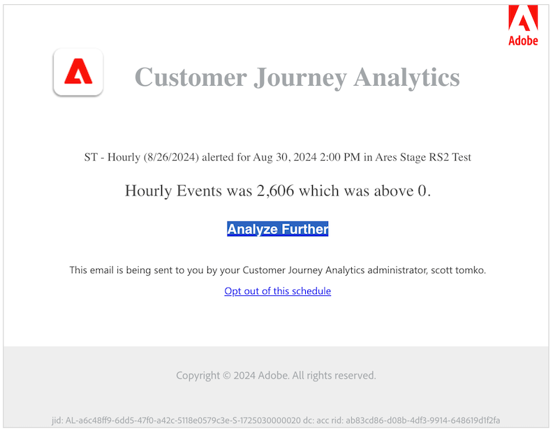

# Créer des alertes {#create-alerts}

<!-- markdownlint-disable MD034 -->

>[!CONTEXTUALHELP]
>id="components_alerts_timegranularity"
>title="Granularité temporelle"
>abstract="La granularité temporelle indique la fréquence de vérification de l’alerte."

<!-- markdownlint-enable MD034 -->

>[!NOTE]
>
>L’utilisation d’alertes avec détection des anomalies (également appelées _Alertes intelligentes_) n’est disponible que pour les organisations qui disposent d’un package Customer Journey Analytics Prime ou Ultimate.

Les alertes dans Customer Journey Analytics envoient un avertissement en fonction de pourcentages ou de points de données spécifiques modifiés. Selon votre package Customer Journey Analytics, vous pouvez également déclencher les alertes en fonction des seuils d’anomalie.

Pour des informations plus détaillées sur les alertes, consultez [Vue d’ensemble des alertes](/help/components/c-intelligent-alerts/intelligent-alerts.md).

Pour créer une alerte, procédez comme suit :

<!-- Note that there are difference in how alerts are created in CJA vs AA. In AA you can create alerts from the Workspace menu and using a shortcut; these are not possible in CJA... -->

1. Dans Customer Journey Analytics, sélectionnez **[!UICONTROL Composants]** > **[!UICONTROL Alertes]**. Dans le [Gestionnaire d’alertes](alert-manager.md), sélectionnez  **[!UICONTROL Ajouter]** pour créer une alerte ou sélectionnez l’une des alertes répertoriées pour modifier une alerte existante.

1. Dans Analysis Workspace, sélectionnez un ou plusieurs éléments de ligne dans un tableau à structure libre, puis sélectionnez **[!UICONTROL Créer une alerte à partir de la sélection]** dans le menu contextuel. Cette action préremplit instantanément le créateur d’alertes pour créer une alerte avec les mesures et segments corrects.

L’interface [Créateur d’alertes](#alert-builder) s’affiche.

## Créateur d’alertes

L’interface du créateur d’alertes est familière avec celle que vous utilisez lorsque vous créez des segments ou des mesures calculées dans Customer Journey Analytics :

Spécifiez les informations suivantes dans le créateur d’alertes pour une alerte :

| Élément | Description |
|---------|----------|
| **[!UICONTROL Titre]** | Spécifiez le nom de l’alerte. Le nom de l’alerte doit contenir le nom du rapport ou le seuil des mesures. |
| **[!UICONTROL Description (facultatif)]** | Spécifiez une description de l’alerte. |
| **[!UICONTROL Granularité temporelle]** | Spécifiez quand vérifier la mesure : chaque jour, chaque semaine ou chaque mois.
<b>Remarque </b> : pour les vues de données avec un [calendrier personnalisé](/help/data-views/create-dataview.md#calendar), la granularité mensuelle n’est pas prise en charge dans le créateur d’alertes.<!--true?-->
 |
| **[!UICONTROL Destinataires]** | Spécifiez où envoyer l’alerte. Une alerte peut être envoyée à un utilisateur ou à un groupe Analytics, à une adresse e-mail brute ou à un numéro de téléphone.
<b>Important</b> : le numéro de téléphone doit être précédé d’un `+` et d’un [indicatif de pays](https://countrycode.org/).

L’e-mail qu’un utilisateur ou une utilisatrice reçoit après une alerte :

 |
| **[!UICONTROL Date d’expiration]** | Définissez la date et l’heure d’expiration de l’alerte. |
| **[!UICONTROL Délai]** | Le temps nécessaire pour que les données soient complètes et disponibles pour faire l’objet de rapports dans Customer Journey Analytics varie selon l’entreprise, allant généralement de 3 à 9 heures après l’heure de l’événement de données. Pour que les alertes soient précises, les données d’événement d’une plage d’événements donnée doivent être complètes, ce qui signifie qu’Adobe ne reçoit plus de données d’événement pour la plage d’événements spécifiée.
Pour tenir compte de ce délai d’ingestion, les alertes sont envoyées avec un délai par défaut de 9 heures.

Vous pouvez régler le délai par défaut de 9 heures sur une valeur comprise entre 0 et 24 heures. Toutefois, si vous réduisez le délai en dessous de 9 heures, cela peut signifier que vous signalez des données incomplètes, ce qui entraîne des informations d’alerte inexactes.

Tenez compte de ce qui suit lors de la configuration du paramètre de délai :
<ul><li>**Comprendre la disponibilité et l’exhaustivité des données** : les données par lots ne sont ingérées dans un jeu de données Experience Platform qu’après une période de 3 à 9 heures. Pour que les alertes soient exactes, l’ingestion des données doit être terminée et toutes les données par lot disponibles dans le jeu de données.</li><li>**Déterminer le temps nécessaire pour que vos données soient complètes et disponibles dans le jeu de données** : les délais d’ingestion des données varient selon l’organisation. Assurez-vous que le délai que vous choisissez pour la diffusion des alertes est identique ou inférieur au temps nécessaire pour que les données par lot soient disponibles dans le jeu de données Platform<!--add link? -->.</li>
**Conseil :** le moyen le plus précis de connaître le temps nécessaire pour que toutes les données par lot soient terminées et ingérées dans le jeu de données Experience Platform est de consulter les ingénieurs de données de votre organisation.

Vous pouvez également obtenir une idée générale du temps nécessaire à la diffusion par lots dans votre organisation pour être disponible dans le jeu de données Platform. Créez le tableau à structure libre suivant dans Analysis Workspace :
<ol><li>Dans un tableau à structure libre d’Analysis Workspace, ajoutez une mesure [!UICONTROL **Événements**] et une dimension [!UICONTROL **Jour**].</li><li>Répartissez la dimension [!UICONTROL **Jour**] à l’aide d’une dimension [!UICONTROL **Heures**].
Les heures qui ne contiennent aucune donnée affichent 0.
</li></ol><li>**Tenir compte des erreurs dans vos calculs** : si vous réduisez le délai par défaut, configurez le délai au moins sur une heure de plus que le temps nécessaire à votre organisation pour que l’ingestion des données soit complète. Par exemple, s’il y a un délai de 3 heures avant la fin de l’ingestion des données, vous devez définir le délai sur 4 heures.</li></ul>
Pour plus d’informations, consultez [Les délais d’ingestion des données varient dans Customer Journey Analytics](/help/components/c-intelligent-alerts/alerts-feature-comparison.md#data-ingestion-times-vary-in-customer-journey-analytics) dans l’article [Comparaison des fonctionnalités d’alertes : Customer Journey Analytics et Adobe Analytics](/help/components/c-intelligent-alerts/alerts-feature-comparison.md). |
| **[!UICONTROL Envoyer une alerte lorsque]** | [!UICONTROL **L’une de ces mesures déclenche**] : <ol><li>Effectuez un glisser-déposer des mesures (y compris des mesures calculées) afin de créer des déclencheurs pour l’alerte.
Un message *composants incompatibles* s’affiche si toutes les mesures, dimensions ou segments de l’alerte ne sont pas compatibles avec la suite de rapports actuellement sélectionnée.

Déterminez le seuil (en cas d’anomalie) que la mesure doit dépasser ou la valeur (en cas de modification ci-dessus, ci-dessous, égale ou en pourcentage) à utiliser avant de définir une alerte.</li><li>Sélectionnez l’une des conditions suivantes :<ul><li>il existe une anomalie</li><li>l’anomalie est supérieure à celle prévue</li><li>l’anomalie est inférieure à celle prévue</li><li>est supérieur ou égal</li><li>est inférieur ou égal</li><li>change de</li></ul></li><li>Sélectionnez une valeur de seuil ou saisissez-en une.</li></ol>[!UICONTROL **Avec tous ces filtres**] : faites glisser et déposez des segments ou des dimensions pour ajouter des filtres sur l’alerte. Par exemple, ajoutez un segment *Appareils mobiles uniquement* afin de signifier que la règle se déclenche uniquement pour les appareils mobiles. Vous pouvez ajouter des filtres supplémentaires à l’aide d’une instruction ET. Pour ajouter des règles AND ou OR, cliquez sur l’icône d’engrenage.

Consultez [Alertes - cas d’utilisation](alerts-use-cases.md) pour des exemples de cas d’utilisation.
 |
| **[!UICONTROL Aperçu]** | Dans l’aperçu interactif des alertes, vous pouvez déterminer à quelle fréquence, approximativement, une alerte est déclenchée en fonction d’une expérience antérieure.
Si, par exemple, vous définissez une granularité temporelle quotidienne, l’aperçu indique que, pour une certaine mesure, l’alerte aurait été déclenchée x fois durant les 30 ou 31 derniers jours.

Si vous trouvez que trop d’alertes sont déclenchées, réglez le seuil dans [Gérer les alertes](/help/components/c-intelligent-alerts/alert-manager.md).

{width="50%"}
 |
