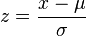

# Référence - fonctions avancées

Accédez à ces fonctions en sélectionnant **[!UICONTROL Tout afficher]** sous la liste  **[!UICONTROL Fonctions]** du panneau Composants. Faites défiler l’écran vers le bas pour afficher la liste des fonctions avancées.

## Fonctions de tableau et fonctions de ligne

Une fonction de tableau consiste à ce que la sortie soit la même pour chaque ligne du tableau. Une fonction de ligne consiste à ce que la sortie soit différente pour chaque ligne du tableau. Le cas échéant, une fonction est annotée avec le type de fonction.

## Que signifie le paramètre d’inclusion de zéros ?

Il indique s’il faut inclure des zéros dans le calcul. Parfois, zéro signifie *rien*, mais parfois, c’est important.

Par exemple, si vous disposez d’une mesure Recettes, puis que vous ajoutez une mesure Pages vues au rapport, vous obtenez soudainement plus de lignes pour vos recettes, qui sont toutes nulles. Vous ne souhaitez probablement pas que cette mesure supplémentaire affecte les [MEAN](cm-functions.md#mean), [MIN](cm-functions.md#row-min), [QUARTILE](cm-functions.md#quartile) et d’autres calculs que vous avez dans la colonne des recettes. Dans ce cas, vous devez vérifier le paramètre `include-zeros` .

Un autre scénario consiste à utiliser deux mesures intéressantes, l’une ayant une moyenne ou un minimum supérieur, car certaines lignes sont des zéros.  Dans ce cas, vous pouvez choisir de ne pas vérifier le paramètre pour inclure des zéros.


## Et

 **[!UICONTROL AND(logical_test)]**


Conjonction. Différent de zéro est considéré comme vrai et égal à zéro est considéré comme faux. La sortie est 0 (false) ou 1 (true).


| Argument | Description |
|---|---|
| logical_test | Nécessite au moins un paramètre, mais peut prendre n’importe quel nombre de paramètres. Toute valeur ou expression qui peut être évaluée sur TRUE ou FALSE |

## Approximate Count Distinct

 **[!UICONTROL APPROXIMATE COUNT DISTINCT(dimension)]**


Renvoie le nombre distinct approximatif d’éléments de dimension pour la dimension sélectionnée.


| Argument | Description |
|---|---|
| dimension | Dimension pour laquelle vous souhaitez calculer le nombre distinct approximatif d’éléments |

### Exemple

Un cas d’utilisation courant de cette fonction est lorsque vous souhaitez obtenir un nombre approximatif de clients.


## Arc cosinus

 **[!UICONTROL ARC COSINE(metric)]**


[!BADGE Ligne]{type="Neutral"}


| Argument | Description |
|---|---|
| mesure | Cosinus de l’angle que vous souhaitez obtenir de -1 à 1 |


## Arc sinus

 **[!UICONTROL ARC SINE(metric)]**


[!BADGE Ligne]{type="Neutral"}


| Argument | Description |
|---|---|
| mesure | Le sinus de l’angle que vous souhaitez obtenir de -1 à 1 |


## Arc tangent

 **[!UICONTROL ARC TANGENT(metric)]**


[!BADGE Ligne]{type="Neutral"}


| Argument | Description |
|---|---|
| mesure | La tangente de l’angle que vous souhaitez obtenir de -1 à 1 |


## Cdf-T

 **[!UICONTROL CDF-T(metric, number)]**


Renvoie la probabilité qu’une variable aléatoire avec une distribution étudiant-t avec n degrés de liberté ait un score centré réduit inférieur à col.


| Argument | Description |
|---|---|
| mesure | Mesure pour laquelle vous souhaitez utiliser la fonction de distribution cumulée de la distribution en t de l’étudiant |
| number | Les degrés de liberté de la fonction de distribution cumulée de la distribution en t étudiante |

### Exemple

```
CDF-T(-∞, n) = 0
CDF-T(∞, n) = 1
CDF-T(3, 5) ? 0.99865
CDF-T(-2, 7) ? 0.0227501
CDF-T(x, ∞) ? cdf_z(x)
```


## Cdf-Z

 **[!UICONTROL CDF-Z(metric, number)]**


Renvoie la probabilité qu’une variable aléatoire avec une distribution normale ait un score centré réduit inférieur à col.


| Argument | Description |
|---|---|
| mesure | Mesure pour laquelle vous souhaitez utiliser la fonction de distribution cumulée de la distribution normale standard |

### Exemples

```
CDF-Z(-∞) = 0
CDF-Z(∞) = 1
CDF-Z(0) = 0.5
CDF-Z(2) ? 0.97725
CDF-Z(-3) ? 0.0013499
```

## Plafond

 **[!UICONTROL CEILING(metric)]**


[!BADGE Ligne]{type="Neutral"}


| Argument | Description |
|---|---|
| mesure | Mesure que vous souhaitez arrondir |


## Degré de confiance (inférieur)

 **[!UICONTROL CONFIANCE(normalizing-container, success-metric, control, signification-treshold)]**

Calculez la confiance **lower** valide à tout moment à l’aide de la méthode WASKR comme décrit dans la [ théorie de limite centrale uniforme par le temps et séquences de confiance asymptotique](http://arxiv.org/pdf/2103.06476).

La confiance est une mesure probabiliste de l&#39;ampleur des preuves qu&#39;une variante donnée est identique à la variante témoin. Un degré de confiance plus élevé indique moins de preuves relatives à l’hypothèse que la variante de contrôle et la variante de non-contrôle ont des performances similaires.

| Argument | Description |
| --- | --- |
| normalizing-container | Base (Personnes, sessions ou événements) sur laquelle un test est exécuté. |
| success-metric | La mesure ou les mesures avec lesquelles un utilisateur compare des variantes. |
| control | La variante avec laquelle sont comparées toutes les autres variantes de l’expérience. Saisissez le nom de l’élément de dimension de variante de contrôle. |
| seuil de signification | Le seuil de cette fonction est défini sur une valeur par défaut de 95 %. |

## Degré de confiance (supérieur)

 **[!UICONTROL CONFIANCE(normalizing-container, success-metric, control, signification-treshold)]**

Calculez la confiance **upper** valide à tout moment à l’aide de la méthode WASKR, comme décrit dans la [théorie de limite centrale uniforme par le temps et séquences de confiance asymptotique](http://arxiv.org/pdf/2103.06476).

La confiance est une mesure probabiliste de l&#39;ampleur des preuves qu&#39;une variante donnée est identique à la variante témoin. Un degré de confiance plus élevé indique moins de preuves relatives à l’hypothèse que la variante de contrôle et la variante de non-contrôle ont des performances similaires.

| Argument | Description |
| --- | --- |
| normalizing-container | Base (Personnes, sessions ou événements) sur laquelle un test est exécuté. |
| success-metric | La mesure ou les mesures avec lesquelles un utilisateur compare des variantes. |
| control | La variante avec laquelle sont comparées toutes les autres variantes de l’expérience. Saisissez le nom de l’élément de dimension de variante de contrôle. |
| seuil de signification | Le seuil de cette fonction est défini sur une valeur par défaut de 95 %. |


## Cosinus

 **[!UICONTROL COSINE(metric)]**

[!BADGE Ligne]{type="Neutral"}

| Argument | Description |
|---|---|
| mesure | Angle en radians pour lequel vous souhaitez obtenir le cosinus |


## Racine cubique

 **[!UICONTROL CUBE ROOT(metric)]**


Renvoie la racine cubique positive d’un nombre. La racine cubique d’un nombre est la valeur de ce nombre élevée à la puissance 1/3.


| Argument | Description |
|---|---|
| mesure | Mesure pour laquelle vous souhaitez calculer la racine cubique |


## Cumulé

 **[!UICONTROL CUMULATIVE(nombre, mesure)]**

Renvoie la somme des n derniers éléments de la colonne x. Si n > 0, additionnez les n derniers éléments ou x. Si n &lt; 0, additionnez les éléments précédents.

| Argument | Description |
| --- | --- |
| number | N dernier nombre de lignes pour lequel la somme doit être renvoyée. Si N &lt;= 0, utilisez toutes les lignes précédentes. |
| mesure | Mesure pour laquelle vous souhaitez obtenir la somme cumulée. |

### Exemples

| Date | Chiffre dʼaffaires | CUMULATIVE(0, Recettes) | CUMULATIVE(2, Recettes) |
|------|------:|--------------:|--------------:|
| Mai | 500 $ | 500 $ | 500 $ |
| Juin | 200 $ | 700 $ | 700 $ |
| Juillet | $400 | 1 100 $ | $600 |


## Cumulé (moyenne)

 **[!UICONTROL MOYENNE CUMULATIVE(nombre, mesure)]**

Renvoie la moyenne des n derniers éléments de la colonne x. Si n > 0, additionnez les n derniers éléments ou x. Si n &lt; 0, additionnez les éléments précédents.

| Argument | Description |
| --- | --- |
| number | N dernier nombre de lignes pour lequel la moyenne doit être renvoyée. Si N &lt;= 0, utilisez toutes les lignes précédentes. |
| mesure | Mesure pour laquelle vous souhaitez obtenir la moyenne cumulée. |

>[!NOTE]
>
>Cette fonction ne fonctionne pas avec des mesures de taux telles que les recettes par personne. La fonction calcule la moyenne des taux au lieu d’additionner les recettes sur le dernier N et les personnes sur le dernier N, puis les diviser. <br/>Utilisez plutôt [**[!UICONTROL CUMULATIVE(revenue)]**](#cumulative)  [**[!UICONTROL CUMULATIVE(person)]**](#cumulative).
>


## equal (égal à)

 **[!UICONTROL EQUAL()]**


Égal à. La sortie est 0 (false) ou 1 (true).


| Argument | Description |
|---|---|
| metric_X | |
| metric_Y | |

### Exemple

`Metric 1 = Metric 2`


## Régression exponentielle : coefficient de corrélation

 **[!UICONTROL RÉGRESSION EXPONENTIELLE : COEFFICIENT DE CORRÉLATION(metric_X, metric_Y, include_zeros)]**


[!BADGE Tableau]{type="Neutral"}


| Argument | Description |
|---|---|
| metric_X | Mesure que vous souhaitez corréler à metric_Y |
| metric_Y | Mesure que vous souhaitez corréler à metric_X |
| include_zeros | Inclure ou non des valeurs nulles dans les calculs |

## Régression exponentielle : Y prédit

 **[!UICONTROL RÉGRESSION EXPONENTIELLE : Y PRÉDIT(metric_X, metric_Y, include_zeros)]**


[!BADGE Ligne]{type="Neutral"}


| Argument | Description |
|---|---|
| metric_X | Mesure que vous souhaitez désigner comme données indépendantes. |
| metric_Y | Mesure que vous souhaitez désigner comme données dépendantes. |
| include_zeros | Inclure ou non des valeurs nulles dans les calculs |


## Régression exponentielle : ordonnée à l’origine

 **[!UICONTROL RÉGRESSION EXPONENTIELLE : INTERCEPT(metric_X, metric_Y, include_zeros)]**


[!BADGE Tableau]{type="Neutral"}

| Argument | Description |
|---|---|
| metric_X | Mesure que vous souhaitez désigner comme données dépendantes |
| metric_Y | Mesure que vous souhaitez désigner comme données indépendantes |
| include_zeros | Inclure ou non des valeurs nulles dans les calculs |


## Régression exponentielle : inclinaison

 **[!UICONTROL RÉGRESSION EXPONENTIELLE : SLOPE(metric_X, metric_Y, include_zeros)]**


[!BADGE Tableau]{type="Neutral"}


| Argument | Description |
|---|---|
| metric_X | Mesure que vous souhaitez désigner comme données dépendantes |
| metric_Y | Mesure que vous souhaitez désigner comme données indépendantes |
| include_zeros | Inclure ou non des valeurs nulles dans les calculs |


## Floor

 ****

[!BADGE Ligne]{type="Neutral"}

| Argument | Description |
|---|---|
| mesure | Mesure que vous souhaitez arrondir. |


## Supérieur à

 **[!UICONTROL SUPÉRIEUR À LA FONCTION]**


La sortie est 0 (false) ou 1 (true).


| Argument | Description |
|---|---|
| metric_X | |
| metric_Y | |

### Exemple

`Metric 1 > Metric 2`

## Supérieur ou égal à

 **[!UICONTROL SUPÉRIEUR À OU ÉGAL()]**


Supérieur ou égal à. La sortie est 0 (false) ou 1 (true).


| Argument | Description |
|---|---|
| metric_X |  |
| metric_Y |  |

### Exemple

`Metric 1 >= Metric 2`


## Cosinus hyperbolique

 **[!UICONTROL COSINE HYPERBOLIQUE(mesure)]**


[!BADGE Ligne]{type="Neutral"}


| Argument | Description |
|---|---|
| mesure | Angle en radians pour lequel vous souhaitez obtenir le cosinus hyperbolique |


## Sinus hyperbolique

 **[!UICONTROL HYPERBOLIQUE SINE(metric)]**


[!BADGE Ligne]{type="Neutral"}


| Argument | Description |
|---|---|
| mesure | Angle en radians pour lequel vous souhaitez obtenir le sinus hyperbolique |


## Tangente hyperbolique

 **[!UICONTROL TANGENT HYPERBOLIQUE(mesure)]**


[!BADGE Ligne]{type="Neutral"}


| Argument | Description |
|---|---|
| mesure | Angle en radians pour lequel vous souhaitez obtenir la tangente hyperbolique |


## Si la variable 

 **[!UICONTROL IF(logical_test, value_if_true, value_if_false){3]**


[!BADGE Ligne]{type="Neutral"}


| Argument | Description |
|---|---|
| logical_test | Obligatoire. Toute valeur ou expression qui peut être évaluée sur TRUE ou FALSE |
| value_if_true | Valeur que vous souhaitez voir renvoyer si l’argument logical_test est évalué sur TRUE. (Cet argument est défini sur la valeur par défaut de 0 si non inclus.) |
| value_if_false | Valeur à renvoyer si l&#39;argument logical_test est évalué sur FALSE. (La valeur par défaut de cet argument est 0 s&#39;il n&#39;est pas inclus.) |


## Inférieur à

 **[!UICONTROL LESS THAN()]**


La sortie est 0 (false) ou 1 (true).


| Argument | Description |
|---|---|
| metric_X | |
| metric_Y | |


### Exemple

`Metric 1 < Metric 2`

## Inférieur ou égal à

 **[!UICONTROL INFÉRIEUR OU ÉGAL()]**

Inférieur ou égal à. La sortie est 0 (false) ou 1 (true).


| Argument | Description |
|---|---|
| metric_X | |
| metric_Y | |

### Exemple

`Metric 1 <= Metric 2`


## Régression linéaire : coefficient de corrélation

 **[!UICONTROL RÉGRESSION LINÉAIRE : COEFFICIENT DE CORRÉLATION(metric_X, metric_Y, include_zeros)]**


[!BADGE Tableau]{type="Neutral"}


| Argument | Description |
|---|---|
| metric_X | Mesure que vous souhaitez corréler à metric_Y |
| metric_Y | Mesure que vous souhaitez corréler à metric_X |
| include_zeros | Inclure ou non des valeurs nulles dans les calculs |


## Régression linéaire : ordonnée à l’origine

 **[!UICONTROL RÉGRESSION LINÉAIRE : INTERCEPT(metric_X, metric_Y, include_zeros)]**


[!BADGE Tableau]{type="Neutral"}


| Argument | Description |
|---|---|
| metric_X | Mesure que vous souhaitez désigner comme données dépendantes |
| metric_Y | Mesure que vous souhaitez désigner comme données indépendantes |
| include_zeros | Inclure ou non des valeurs nulles dans les calculs |


## Régression linéaire : Y prédit

 **[!UICONTROL RÉGRESSION LINÉAIRE : Y PRÉDIT(metric_X, metric_Y, include_zeros)]**


[!BADGE Ligne]{type="Neutral"}


| Argument | Description |
|---|---|
| metric_X | Mesure que vous souhaitez désigner comme données dépendantes |
| metric_Y | Mesure que vous souhaitez désigner comme données indépendantes |
| include_zeros | Inclure ou non des valeurs nulles dans les calculs |


## Régression linéaire : inclinaison

 **[!UICONTROL RÉGRESSION LINÉAIRE : SLOPE(metric_X, metric_Y, include_zeros)]**


[!BADGE Tableau]{type="Neutral"}


| Argument | Description |
|---|---|
| metric_X | Mesure que vous souhaitez désigner comme données dépendantes |
| metric_Y | Mesure que vous souhaitez désigner comme données indépendantes |
| include_zeros | Inclure ou non des valeurs nulles dans les calculs |


## Logarithme de base 10

 **[!UICONTROL BASE DE JOURNAL 10(mesure)]**


[!BADGE Ligne]{type="Neutral"}


| Argument | Description |
|---|---|
| mesure | Nombre réel positif pour lequel vous souhaitez obtenir le logarithme de base 10 |


## Régression logarithmique : coefficient de corrélation

 **[!UICONTROL RÉGRESSION DU JOURNAL : COEFFICIENT DE CORRÉLATION(metric_X, metric_Y, include_zeros)]**


[!BADGE Tableau]{type="Neutral"}


| Argument | Description |
|---|---|
| metric_X | Mesure que vous souhaitez corréler à metric_Y |
| metric_Y | Mesure que vous souhaitez corréler à metric_X |
| include_zeros | Inclure ou non des valeurs nulles dans les calculs |


## Régression logarithmique : ordonnée à l’origine

 **[!UICONTROL RÉGRESSION DU JOURNAL : INTERCEPT(metric_X, metric_Y, include_zeros){3]**


[!BADGE Tableau]{type="Neutral"}


| Argument | Description |
|---|---|
| metric_X | Mesure que vous souhaitez désigner comme données dépendantes |
| metric_Y | Mesure que vous souhaitez désigner comme données indépendantes |
| include_zeros | Inclure ou non des valeurs nulles dans les calculs |


## Régression logarithmique : Y prédit

 **[!UICONTROL RÉGRESSION DE LOG : Y PRÉDIT(metric_X, metric_Y, include_zeros){3]**


[!BADGE Ligne]{type="Neutral"}


| Argument | Description |
|---|---|
| metric_X | Mesure que vous souhaitez désigner comme données dépendantes |
| metric_Y | Mesure que vous souhaitez désigner comme données indépendantes |
| include_zeros | Inclure ou non des valeurs nulles dans les calculs |


## Régression logarithmique : pente

 **[!UICONTROL RÉGRESSION DU JOURNAL : SLOPE(metric_X, metric_Y, include_zeros){3]**


[!BADGE Tableau]{type="Neutral"}


| Argument | Description |
|---|---|
| metric_X | Mesure que vous souhaitez désigner comme données dépendantes |
| metric_Y | Mesure que vous souhaitez désigner comme données indépendantes |
| include_zeros | Inclure ou non des valeurs nulles dans les calculs |


## Logarithme népérien

 **[!UICONTROL JOURNAL NATUREL(mesure)]**


Renvoie le logarithme népérien d’un nombre. Les logarithmes népériens sont basés sur la constante e (2,71828182845904). LN est l’inverse de la fonction EXP.


| Argument | Description |
|---|---|
| mesure | Nombre réel positif pour lequel vous souhaitez obtenir le logarithme népérien |


## Pas

 **[!UICONTROL NOT(logical)]**


Négation en tant que valeur booléenne. La sortie est 0 (false) ou 1 (true).


| Argument | Description |
|---|---|
| logical | Obligatoire. Valeur ou expression qui peut être évaluée sur TRUE ou FALSE |


## Différent de

 **[!UICONTROL NOT EQUAL()]**


Pas égal. La sortie est 0 (false) ou 1 (true).


| Argument | Description |
|---|---|
| metric_X | |
| metric_Y | |

### Exemple

`Metric 1 != Metric 2`


## Ou

 **[!UICONTROL OR(logical_test)]**


[!BADGE Ligne]{type="Neutral"}


| Argument | Description |
|---|---|
| logical_test | Nécessite au moins un paramètre, mais peut prendre n’importe quel nombre de paramètres. Toute valeur ou expression qui peut être évaluée sur TRUE ou FALSE |


>[!NOTE]
>
>0 (zéro) signifie False, et toute autre valeur est True.


## Pi

 **[!UICONTROL PI()]**

Renvoie Le Pi : 3.14159...


## Régression puissance : coefficient de corrélation

 **[!UICONTROL RÉGRESSION DE LA PUISSANCE : COEFFICIENT DE CORRÉLATION(metric_X, metric_Y, include_zeros)]**


[!BADGE Tableau]{type="Neutral"}


| Argument | Description |
|---|---|
| metric_X | Mesure que vous souhaitez corréler à metric_Y |
| metric_Y | Mesure que vous souhaitez corréler à metric_X |
| include_zeros | Inclure ou non des valeurs nulles dans les calculs |


## Régression puissance : ordonnée à l’origine

 **[!UICONTROL RÉGRESSION DU POUVOIR : INTERCEPT(metric_X, metric_Y, include_zeros)]**


[!BADGE Tableau]{type="Neutral"}


| Argument | Description |
|---|---|
| metric_X | Mesure que vous souhaitez désigner comme données dépendantes |
| metric_Y | Mesure que vous souhaitez désigner comme données indépendantes |
| include_zeros | Inclure ou non des valeurs nulles dans les calculs |


## Régression puissance : Y prédit

 **[!UICONTROL RÉGRESSION DE LA PUISSANCE : Y PRÉDIT(metric_X, metric_Y, include_zeros)]**


[!BADGE Ligne]{type="Neutral"}


| Argument | Description |
|---|---|
| metric_X | Mesure que vous souhaitez désigner comme données dépendantes |
| metric_Y | Mesure que vous souhaitez désigner comme données indépendantes |
| include_zeros | Inclure ou non des valeurs nulles dans les calculs |


## Régression puissance : inclinaison

 **[!UICONTROL RÉGRESSION DE POUVOIR : SLOPE(metric_X, metric_Y, include_zeros)]**


[!BADGE Tableau]{type="Neutral"}


| Argument | Description |
|---|---|
| metric_X | Mesure que vous souhaitez désigner comme données dépendantes |
| metric_Y | Mesure que vous souhaitez désigner comme données indépendantes |
| include_zeros | Inclure ou non des valeurs nulles dans les calculs |


## Régression quadratique : coefficient de corrélation

 **[!UICONTROL RÉGRESSION QUADRATIQUE : COEFFICIENT DE CORRÉLATION(metric_X, metric_Y, include_zeros)]**


[!BADGE Tableau]{type="Neutral"}


| Argument | Description |
|---|---|
| metric_X | Mesure que vous souhaitez corréler à metric_Y |
| metric_Y | Mesure que vous souhaitez corréler à metric_X |
| include_zeros | Inclure ou non des valeurs nulles dans les calculs |

## Régression quadratique : ordonnée à l’origine

 **[!UICONTROL RÉGRESSION QUADRATIQUE : INTERCEPT(metric_X, metric_Y, include_zeros)]**


[!BADGE Tableau]{type="Neutral"}


| Argument | Description |
|---|---|
| metric_X | Mesure que vous souhaitez désigner comme données dépendantes |
| metric_Y | Mesure que vous souhaitez désigner comme données indépendantes |
| include_zeros | Inclure ou non des valeurs nulles dans les calculs |


## Régression quadratique : Y prédit

 **[!UICONTROL RÉGRESSION QUADRATIQUE : Y PRÉDIT(metric_X, metric_Y, include_zeros)]**


[!BADGE Ligne]{type="Neutral"}


| Argument | Description |
|---|---|
| metric_X | Mesure que vous souhaitez désigner comme données dépendantes |
| metric_Y | Mesure que vous souhaitez désigner comme données indépendantes |
| include_zeros | Inclure ou non des valeurs nulles dans les calculs |

## Régression quadratique : inclinaison

 **[!UICONTROL RÉGRESSION QUADRATIQUE : SLOPE(metric_X, metric_Y, include_zeros)]**


[!BADGE Tableau]{type="Neutral"}


| Argument | Description |
|---|---|
| metric_X | Mesure que vous souhaitez désigner comme données dépendantes |
| metric_Y | Mesure que vous souhaitez désigner comme données indépendantes |
| include_zeros | Inclure ou non des valeurs nulles dans les calculs |


## Régression réciproque : coefficient de corrélation

 **[!UICONTROL RÉGRESSION RÉCIPROQUE : COEFFICIENT DE CORRÉLATION(metric_X, metric_Y, include_zeros)]**


[!BADGE Tableau]{type="Neutral"}


| Argument | Description |
|---|---|
| metric_X | Mesure que vous souhaitez corréler à metric_Y |
| metric_Y | Mesure que vous souhaitez corréler à metric_X |
| include_zeros | Inclure ou non des valeurs nulles dans les calculs |


## Régression réciproque : ordonnée à l’origine

 **[!UICONTROL RÉGRESSION RÉCIPROQUE : INTERCEPT(metric_X, metric_Y, include_zeros)]**


[!BADGE Tableau]{type="Neutral"}


| Argument | Description |
|---|---|
| metric_X | Mesure que vous souhaitez désigner comme données dépendantes |
| metric_Y | Mesure que vous souhaitez désigner comme données indépendantes |
| include_zeros | Inclure ou non des valeurs nulles dans les calculs |


## Régression réciproque : Y prédit

 **[!UICONTROL RÉGRESSION RÉCIPROQUE : Y PRÉDIT(metric_X, metric_Y, include_zeros)]**


[!BADGE Ligne]{type="Neutral"}


| Argument | Description |
|---|---|
| metric_X | Mesure que vous souhaitez désigner comme données dépendantes |
| metric_Y | Mesure que vous souhaitez désigner comme données indépendantes |
| include_zeros | Inclure ou non des valeurs nulles dans les calculs |


## Régression réciproque : inclinaison

 **[!UICONTROL RÉGRESSION RÉCIPROQUE : SLOPE(metric_X, metric_Y, include_zeros)]**


[!BADGE Tableau]{type="Neutral"}


| Argument | Description |
|---|---|
| metric_X | Mesure que vous souhaitez désigner comme données dépendantes |
| metric_Y | Mesure que vous souhaitez désigner comme données indépendantes |
| include_zeros | Inclure ou non des valeurs nulles dans les calculs |


## Sine

 **[!UICONTROL SINE(metric)]**


[!BADGE Ligne]{type="Neutral"}


| Argument | Description |
|---|---|
| mesure | Angle en radians pour lequel vous souhaitez obtenir le sinus |


## Score normalisé

 **[!UICONTROL T-SCORE(metric, include_zeros)]**


L’écart par rapport à [MEAN](cm-functions.md#mean), divisé par l’écart type. Alias pour [Score-Z](#z-score).


| Argument | Description |
|---|---|
| mesure | Mesure pour laquelle vous souhaitez obtenir un score normalisé |
| include_zeros | Inclure ou non des valeurs nulles dans les calculs |


## Test en t

 **[!UICONTROL T-TEST(mesure, degrés, queues)]**


Exécute un test en t m-latéral avec un score normalisé de x et n degrés de liberté.


| Argument | Description |
|---|---|
| mesure | Mesure sur laquelle vous souhaitez effectuer un test T |
| degrees | Les degrés de liberté |
| queues | Longueur de la queue à utiliser pour effectuer le test T |

### Détails

La signature est T-TEST (mesure, degrés, queues). En dessous, il appelle simplement ***m***  **[[!DNL CDF-T(-ABSOLUTE VALUE(tails), degrees)]](#cdf-t)**. Cette fonction est similaire à la fonction **[Z-TEST](#z-test)** qui exécute ***m***  **[[!DNL CDF-Z(-ABSOLUTE VALUE(tails))]](#cdf-z)**.

- ***m*** est le nombre de queues.
- ***n*** correspond aux degrés de liberté et doit être un nombre constant pour l’ensemble du rapport, c’est-à-dire qu’il ne doit pas changer ligne par ligne.
- ***x*** est la statistique du test en T. Il s’agit souvent d’une formule (par exemple, **[Z-SCORE](#z-score)**) basée sur une mesure et évaluée sur chaque ligne.

La valeur renvoyée est la probabilité de voir la statistique de test x, étant donné les degrés de liberté et le nombre de queues.

**Exemples :**

1. Utilisez-la pour trouver des valeurs aberrantes :

   ```
   T-TEST(Z-SCORE(bouncerate), ROW COUNT - 1, 2)
   ```

1. Combinez-la à **[IF](#if)** pour ignorer les taux de rebond très élevés ou très bas, et comptabiliser les sessions sur tout le reste :

   ```
   IF(T-TEST(Z-SCORE(bouncerate), ROW COUNT - 1, 2) < 0.01, 0, sessions )
   ```


## Tangente

 **[!UICONTROL TANGENT(metric)]**


Renvoie la tangente de l’angle donné. Si l’angle est en degrés, multipliez l’angle par PI( )/180.


| Argument | Description |
|---|---|
| mesure | Angle en radians pour lequel vous souhaitez obtenir la tangente |


## Score centré réduit

 **[!UICONTROL Z-SCORE(metric, include_zeros)]**


[!BADGE Ligne]{type="Neutral"}


| Argument | Description |
|---|---|
| mesure | Mesure pour laquelle vous souhaitez obtenir une note Z |
| include_zeros | Inclure ou non des valeurs nulles dans les calculs |

Un score centré réduit de 0 (zéro) signifie que le score est le même que la moyenne. Un score centré réduit peut être positif ou négatif, indiquant s’il est au-dessus ou en-dessous de la moyenne et par quel nombre d’écarts types.

L’équation pour le score centré réduit est la suivante :



Si ***[!DNL x]*** est le score brut, ***[!DNL μ]*** est la moyenne de la population et ***[!DNL σ]*** l’écart type de la population.

>[!NOTE]
>
>***[!DNL μ]*** (mu) et ***[!DNL σ]*** (sigma) sont automatiquement calculés à partir de la mesure.


## Test Z

 **[!UICONTROL Z-TEST(metric_tails)]**


Exécute un test z n-latéral avec un score centré réduit de x.


| Argument | Description |
|---|---|
| mesure | Mesure sur laquelle vous souhaitez effectuer un test Z |
| queues | Longueur de la queue à utiliser pour effectuer le test Z |

>[!NOTE]
>
>Présume que les valeurs sont distribuées normalement.


<!--


## AND

Returns the value of its argument. Use NOT to make sure that a value is not equal to one particular value.

>[!NOTE]
>
>0 (zero) means False, and any other value is True.

```
AND(logical_test1,[logical_test2],...)
```

|  Argument  | Description  |
|---|---|
|  *logical_test1* | Required. Any value or expression that can be evaluated to TRUE or FALSE.  |
|  *logical_test2* | Optional. Additional conditions that you want to evaluate as TRUE or FALSE  |

## Approximate Count Distinct (dimension)

Returns the approximated distinct count of dimension items for the selected dimension. The function uses the HyperLogLog (HLL) method of approximating distinct counts.&nbsp; It is configured to guarantee the value is within 5% of the actual value 95% of the time.

```
Approximate Count Distinct (dimension)
```

|  Argument  |  |
|---|---|
|  *dimension* | The dimension for which you want the approximate distinct item count.  |

### Example Use Case

Approximate Count Distinct (customer ID eVar) is a common use case for this function.

Definition for a new 'Approximate Customers' calculated metric:


This is how the "Approximate Customers" metric could be used in reporting:


### Comparing Count Functions

Approximate Count Distinct() is an improvement over Count() and RowCount() functions because the metric created can be used in any dimensional report to render an approximated count of items for a separate dimension. For example, a count of customer IDs used in a Mobile Device Type report.

This function will be marginally less accurate than Count() and RowCount() because it uses the HLL method, whereas Count() and RowCount() are exact counts.

## Arc Cosine (Row)

Returns the arccosine, or inverse of the cosine, of a metric. The arccosine is the angle whose cosine is number. The returned angle is given in radians in the range 0 (zero) to pi. If you want to convert the result from radians to degrees, multiply it by 180/PI( ).

```
ACOS(metric)
```

|  Argument  |  |
|---|---|
|  *metric* | The cosine of the angle you want from -1 to 1. |

## Arc Sine (Row)

Returns the arcsine, or inverse sine, of a number. The arcsine is the angle whose sine is number. The returned angle is given in radians in the range -pi/2 to pi/2. To express the arcsine in degrees, multiply the result by 180/PI( ).

```
ASIN(metric)
```

|  Argument  |  |
|---|---|
|  *metric* | The cosine of the angle you want from -1 to 1. |

## Arc Tangent (Row)

Returns the arctangent, or inverse tangent, of a number. The arctangent is the angle whose tangent is number. The returned angle is given in radians in the range -pi/2 to pi/2. To express the arctangent in degrees, multiply the result by 180/PI( ).

```
ATAN(metric)
```

|  Argument  |  |
|---|---|
|  *metric* | The cosine of the angle you want from -1 to 1. |

## Exponential Regression: Predicted Y (Row)

Calculates the predicted y-values (metric_Y), given the known x-values (metric_X) using the "least squares" method for calculating the line of best fit based on .

```
ESTIMATE.EXP(metric_X, metric_Y)
```

|  Argument  | Description  |
|---|---|
|  *metric_X* | A metric that you would like to designate as the dependent data.  |
|  *metric_Y* | A metric that you would like to designate as the independent data.  |

## Cdf-T

Returns the percentage of values in a student's t-distribution with n degrees of freedom that have a z-score less than x.

```
cdf_t( -∞, n ) = 0
cdf_t(  ∞, n ) = 1
cdf_t( 3, 5 ) ? 0.99865
cdf_t( -2, 7 ) ? 0.0227501
cdf_t( x, ∞ ) ? cdf_z( x )
```

## Cdf-Z

Returns the percentage of values in a normal distribution that have a z-score less than x.

```
cdf_z( -∞ ) = 0
cdf_z( ∞ ) = 1
cdf_z( 0 ) = 0.5
cdf_z( 2 ) ? 0.97725
cdf_z( -3 ) ? 0.0013499

```

## Exponential Regression: Intercept (Table)

Returns the intercept, *b*, between two metric columns ( *metric_X* and *metric_Y*) for

```
INTERCEPT.EXP(metric_X, metric_Y)
```

|  Argument  | Description  |
|---|---|
|  *metric_X* | A metric that you would like to designate as the dependent data.  |
|  *metric_Y* | A metric that you would like to designate as the independent data.  |

## Exponential Regression: Slope (Table)

Returns the slope, *a*, between two metric columns ( *metric_X* and *metric_Y*) for .

```
SLOPE.EXP(metric_X, metric_Y)
```

|  Argument  | Description  |
|---|---|
|  *metric_X* | A metric that you would like to designate as the dependent data.  |
|  *metric_Y* | A metric that you would like to designate as the independent data.  |

## Floor (Row)

Returns the largest integer not greater than a given value. For example, if you want to avoid reporting currency decimals for revenue and a product has $569.34, use the formula FLOOR( *Revenue*) to round revenue down to the nearest dollar, or $569.

```
FLOOR(metric)
```

|  Argument  | Description  |
|---|---|
|  *metric* | The metric you want to round.  |

## Greater Than

Returns items whose numeric count is greater than the value entered.

## Greater Than or Equal

Returns items whose numeric count is greater than or equal to the value entered.

## Hyperbolic Cosine (Row)

Returns the hyperbolic cosine of a number.

```
COSH(metric)
```

|  Argument  | Description  |
|---|---|
|  *metric* | The angle in radians for which you want to find the hyperbolic cosine.  |

## Hyperbolic Sine (Row)

Returns the hyperbolic sine of a number.

```
SINH(metric)
```

|  Argument  | Description  |
|---|---|
|  *metric* | The angle in radians for which you want to find the hyperbolic sine.  |

## Hyperbolic Tangent (Row)

Returns the hyperbolic tangent of a number.

```
TANH(metric)
```

|  Argument  | Description  |
|---|---|
|  *metric* | The angle in radians for which you want to find the hyperbolic tanget.  |

## IF (Row)

The IF function returns one value if a condition you specify evaluates to TRUE, and another value if that condition evaluates to FALSE.

```
IF(logical_test, [value_if_true], [value_if_false])
```

|  Argument  | Description  |
|---|---|
|  *logical_test* | Required. Any value or expression that can be evaluated to TRUE or FALSE.  |
|  *[value_if_true]* | The value that you want to be returned if the *logical_test* argument evaluates to TRUE. (This argument defaults to 0 if not included.)  |
|  *[value_if_false]* | The value that you want to be returned if the *logical_test* argument evaluates to FALSE. (This argument defaults to 0 if not included.)  |

## Less Than

Returns items whose numeric count is less than the value entered.

## Less Than or Equal

Returns items whose numeric count is less than or equal to the value entered.

## Lift

Returns the Lift a particular variant had in conversions over a control variant. It is the difference in performance between a given variant and the baseline, divided by the performance of the baseline, expressed as a percentage. 

```
fx Lift (normalizing-container, success-metric, control)
```

| Argument | Description |
| --- | --- |
| Normalizing Container | The basis (People, Sessions, or Events) on which a test will be run. |
| Success Metric | The metric or metrics that a user is comparing variants with. |
| Control | The variant that all other variants in the experiment are being compared with. Enter the name of the control variant dimension item. |

{style="table-layout:auto"}

## Linear regression_ Correlation Coefficient

Y = a X + b. Returns the correlation coefficient

## Linear regression_ Intercept

Y = a X + b. Returns b.

## Linear regression_ Predicted Y

Y = a X + b. Returns Y.

## Linear regression_ Slope

Y = a X + b. Returns a.

## Log Base 10 (Row)

Returns the base-10 logarithm of a number.

```
LOG10(metric)
```

|  Argument  | Description  |
|---|---|
|  *metric* | The positive real number for which you want the base-10 logarithm.  |

## Log regression: Correlation coefficient (Table)

Returns the correlation coefficient, *r*, between two metric columns (*metric_X* and *metric_Y*) for the regression equation [!DNL Y = a ln(X) + b]. It is calculated using the CORREL equation.

```
CORREL.LOG(metric_X,metric_Y)
```

|  Argument  | Description  |
|---|---|
|  *metric_X* | A metric that you would like to correlate with *metric_Y*.  |
|  *metric_Y* | A metric that you would like to correlate with *metric_X*.  |

## Log regression: Intercept (Table)

Returns the intercept *b* as the least squares regression between two metric columns (*metric_X* and *metric_Y*) for the regression equation [!DNL Y = a ln(X) + b]. It is calculated using the INTERCEPT equation.

```
INTERCEPT.LOG(metric_X, metric_Y)
```

|  Argument  | Description  |
|---|---|
|  *metric_X* | A metric that you would like to designate as the dependent data.  |
|  *metric_Y* | A metric that you would like to designate as the independent data.  |

## Log Regression: Predicted Y (Row)

Calculates the predicted [!DNL y] values (metric_Y), given the known [!DNL x] values (metric_X) using the "least squares" method for calculating the line of best fit based on [!DNL Y = a ln(X) + b]. It is calculated using the ESTIMATE equation.

In regression analysis, this function calculates the predicted [!DNL y] values (*metric_Y*), given the known [!DNL x] values (*metric_X*) using the logarithm for calculating the line of best fit for the regression equation [!DNL Y = a ln(X) + b]. The [!DNL a] values correspond to each x value, and [!DNL b] is a constant value.

```
ESTIMATE.LOG(metric_X, metric_Y)
```

|  Argument  | Description  |
|---|---|
|  *metric_X* | A metric that you would like to designate as the dependent data.  |
|  *metric_Y* | A metric that you would like to designate as the independent data.  |

## Log regression: Slope (Table)

Returns the slope, *a*, between two metric columns (*metric_X* and *metric_Y*) for the regression equation [!DNL Y = a ln(X) + b]. It is calculated using the SLOPE equation.

```
SLOPE.LOG(metric_A, metric_B)
```

|  Argument  | Description  |
|---|---|
|  *metric_A* | A metric that you would like to designate as the dependent data.  |
|  *metric_B* | A metric that you would like to designate as the independent data.  |

## Natural Log

Returns the natural logarithm of a number. Natural logarithms are based on the constant *e* (2.71828182845904). LN is the inverse of the EXP function.

```
LN(metric)
```

|  Argument  | Description  |
|---|---|
|  *metric* | The positive real number for which you want the natural logarithm.  |

## NOT

Returns 1 if the number is 0 or returns 0 if another number.

```
NOT(logical)
```

|  Argument  | Description  |
|---|---|
|  *logical* | Required. A value or expression that can be evaluated to TRUE or FALSE.  |

Using NOT requires knowing if the expressions (<, >, =, <> , etc.) return 0 or 1 values.

## Not equal

Returns all items that do not contain the exact match of the value entered.

## Or (Row)

Returns TRUE if any argument is TRUE, or returns FALSE if all arguments are FALSE.

>[!NOTE]
>
>0 (zero) means False, and any other value is True.

```
OR(logical_test1,[logical_test2],...)
```

|  Argument  | Description  |
|---|---|
|  *logical_test1* | Required. Any value or expression that can be evaluated to TRUE or FALSE.  |
|  *logical_test2* | Optional. Additional conditions that you want to evaluate as TRUE or FALSE  |

## Pi

Returns the constant PI, 3.14159265358979, accurate to 15 digits.

```
PI()
```

The [!DNL PI]function has no arguments.

## Power regression: Correlation coefficient (Table)

Returns the correlation coefficient, *r*, between two metric columns (*metric_X* and *metric_Y*) for [!DNL Y = b*X].

```
CORREL.POWER(metric_X, metric_Y)
```

|  Argument  | Description  |
|---|---|
|  *metric_X* | A metric that you would like to correlate with *metric_Y*.  |
|  *metric_Y* | A metric that you would like to correlate with *metric_X*.  |

## Power regression: Intercept (Table)

Returns the intercept, *b*, between two metric columns (*metric_X* and *metric_Y*) for [!DNL Y = b*X].

```
 INTERCEPT.POWER(metric_X, metric_Y)
```

|  Argument  | Description  |
|---|---|
|  *metric_X* | A metric that you would like to designate as the dependent data.  |
|  *metric_Y* | A metric that you would like to designate as the independent data.  |

## Power regression: Predicted Y (Row)

Calculates the predicted [!DNL y] values ( [!DNL metric_Y]), given the known [!DNL x] values ( [!DNL metric_X]) using the "least squares" method for calculating the line of best fit for [!DNL Y = b*X].

```
 ESTIMATE.POWER(metric_X, metric_Y)
```

|  Argument  | Description  |
|---|---|
|  *metric_X* | A metric that you would like to designate as the dependent data.  |
|  *metric_Y* | A metric that you would like to designate as the independent data.  |

## Power regression: Slope (Table)

Returns the slope, *a*, between two metric columns (*metric_X* and *metric_Y*) for [!DNL Y = b*X].

```
SLOPE.POWER(metric_X, metric_Y)
```

|  Argument  | Description  |
|---|---|
|  *metric_X* | A metric that you would like to designate as the dependent data.  |
|  *metric_Y* | A metric that you would like to designate as the independent data.  |

## Quadratic regression: Correlation coefficient (Table)

Returns the correlation coefficient, *r*, between two metric columns (*metric_X* and *metric_Y*) for [!DNL Y=(a*X+b)]****.

```
CORREL.QUADRATIC(metric_X, metric_Y)
```

|  Argument  | Description  |
|---|---|
|  *metric_X* | A metric that you would like to correlate with *metric_Y*.  |
|  *metric_Y* | A metric that you would like to correlate with *metric_X*.  |

## Quadratic regression: Intercept (Table)

Returns the intercept, *b*, between two metric columns (*metric_X* and *metric_Y*) for [!DNL Y=(a*X+b)]****.

```
INTERCEPT.POWER(metric_X, metric_Y)
```

|  Argument  | Description  |
|---|---|
|  *metric_X* | A metric that you would like to designate as the dependent data.  |
|  *metric_Y* | A metric that you would like to designate as the independent data.  |

## Quadratic regression: Predicted Y (Row)

Calculates the predicted [!DNL y] values (metric_Y), given the known [!DNL x] values (metric_X) using the least squares method for calculating the line of best fit using [!DNL Y=(a*X+b)]**** .

```
ESTIMATE.QUADRATIC(metric_A, metric_B)
```

|  Argument  | Description  |
|---|---|
|  *metric_A* | A metric that you would like to designate as the dependent data.  |
|  *metric_B* | A metric that you would like to designate as the dependent data.  |

## Quadratic regression: Slope (Table)

Returns the slope, *a*, between two metric columns (*metric_X* and metric_Y) for [!DNL Y=(a*X+b)]****.

```
SLOPE.QUADRATIC(metric_X, metric_Y)
```

|  Argument  | Description  |
|---|---|
|  *metric_X* | A metric that you would like to designate as the dependent data.  |
|  *metric_Y* | A metric that you would like to designate as the independent data.  |

## Reciprocal regression: Correlation coefficient (Table)

Returns the correlation coefficient, *r*, between two metric columns (*metric_X)* and *metric_Y*) for [!DNL Y = a/X+b].

```
CORREL.RECIPROCAL(metric_X, metric_Y)
```

|  Argument  | Description  |
|---|---|
|  *metric_X* | A metric that you would like to correlate with *metric_Y*.  |
|  *metric_Y* | A metric that you would like to correlate with *metric_X*.  |

## Reciprocal regression: Intercept (Table)

Returns the intercept, *b*, between two metric columns (*metric_X* and *metric_Y*) for [!DNL Y = a/X+b].

```
INTERCEPT.RECIPROCAL(metric_A, metric_B)
```

|  Argument  | Description  |
|---|---|
|  *metric_X* | A metric that you would like to designate as the dependent data.  |
|  *metric_Y* | A metric that you would like to designate as the independent data.  |

## Reciprocal regression: Predicted Y (Row)

Calculates the predicted [!DNL y] values (metric_Y), given the known [!DNL x] values (metric_X) using the least squares method for calculating the line of best fit using [!DNL Y = a/X+b].

```
ESTIMATE.RECIPROCAL(metric_X, metric_Y)
```

|  Argument  | Description  |
|---|---|
|  *metric_X* | A metric that you would like to designate as the dependent data.  |
|  *metric_Y* | A metric that you would like to designate as the independent data.  |

## Reciprocal regression: Slope (Table)

Returns the slope, *a*, between two metric columns (*metric_X* and *metric_Y*) for [!DNL Y = a/X+b].

```
SLOPE.RECIPROCAL(metric_X, metric_Y)
```

|  Argument  | Description  |
|---|---|
|  *metric_X* | A metric that you would like to designate as the dependent data.  |
|  *metric_Y* | A metric that you would like to designate as the independent data.  |

## Sine (Row)

Returns the sine of the given angle. If the angle is in degrees, multiply the angle by PI( )/180.

```
SIN(metric)
```

|  Argument  | Description  |
|---|---|
|  *metric* | The angle in radians for which you want the sine.  |

## T-Score

Alias for Z-Score, namely the deviation from the mean divided by the standard deviation

## T-Test

Performs an m-tailed t-test with t-score of col and n degrees of freedom.

The signature is `t_test( x, n, m )`. Underneath, it simply calls `m*cdf_t(-abs(x),n)`. (This is similar to the z-test function which runs `m*cdf_z(-abs(x))`.

Here, `m` is the number of tails, and `n` is the degrees of freedom. These should be numbers (constant for the whole report, i.e. not changing on a row by row basis).

`X` is the t-test statistic, and would often be a formula (e.g. zscore) based on a metric and will be evaluated on every row.

The return value is the probability of seeing the test statistic x given the degrees of freedom and number of tails.

**Examples:**

1. Use it to find outliers:

   ```
   t_test( zscore(bouncerate), row-count-1, 2)
   ```

1. Combine it with `if` to ignore very high or low bounce rates, and count visits on everything else:

   ```
   if ( t_test( z-score(bouncerate), row-count, 2) < 0.01, 0, visits )
   ```

## Tangent

Returns the tangent of the given angle. If the angle is in degrees, multiply the angle by PI( )/180.

```
TAN (metric)
```

|  Argument  | Description  |
|---|---|
|  *metric* | The angle in radians for which you want the tangent.  |

## Z-Score (Row)

Returns the Z-score, or normal score, based upon a normal distribution. The Z-score is the number of standard deviations an observation is from the mean. A Z-score of 0 (zero) means the score is the same as the mean. A Z-score can be positive or negative, indicating whether it is above or below the mean and by how many standard deviations.

The equation for Z-score is:


where [!DNL x] is the raw score, [!DNL μ] is the mean of the population, and [!DNL σ] is the standard deviation of the population.

>[!NOTE]
>
>[!DNL μ] (mu) and[!DNL σ] (sigma) are automatically calculated from the metric.

Z-score(metric)

<table id="table_AEA3622A58F54EA495468A9402651E1B">
 <thead>
  <tr>
   <th colname="col1" class="entry"> Argument </th>
   <th colname="col2" class="entry"> Description </th>
  </tr>
 </thead>
 <tbody>
  <tr>
   <td colname="col1"> <i>metric</i> </td>
   <td colname="col2"> <p> Returns the value of its first non-zero argument. </p> </td>
  </tr>
 </tbody>
</table>

## Z-Test

Performs an n-tailed Z-test with Z-score of A.

Returns the probability that the current row could be seen by chance in the column.

>[!NOTE]
>
>Assumes that the values are normally distributed.

-->