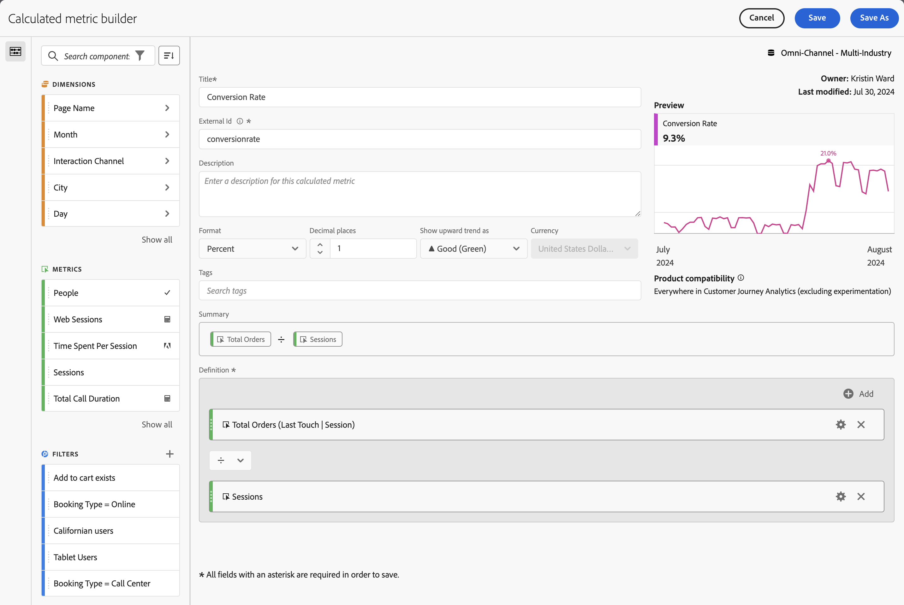

# Créer des mesures calculées {#build-metrics}

<!-- markdownlint-disable MD034 -->

>[!CONTEXTUALHELP]
>id="components_calculatedmetrics_productcompatibility"
>title="Compatibilité des produits"
>abstract="Indique l’endroit où cette mesure calculée peut être utilisée dans Customer Journey Analytics, par exemple dans Analysis Workspace, Report Builder, etc. Certaines mesures calculées ne peuvent pas être utilisées avec l’expérimentation."
>additional-url="https://experienceleague.adobe.com/fr/docs/analytics-platform/using/cja-workspace/panels/experimentation#use-in-experimentation" text="Utiliser les mesures calculées dans l’expérimentation"

<!-- markdownlint-enable MD034 -->

<!-- markdownlint-disable MD034 -->

>[!CONTEXTUALHELP]
>id="components_calculatedmetrics_externalid"
>title="ID externe"
>abstract="La modification de l’ID externe peut avoir une incidence sur la manière dont la mesure calculée apparaît dans des sources externes, telles que les outils de Business Intelligence."

<!-- markdownlint-enable MD034 -->

Customer Journey Analytics fournit une zone de travail où vous pouvez faire glisser et déposer des dimensions, des mesures, des segments et des fonctions permettant de créer des mesures personnalisées en fonction de la logique de hiérarchie des conteneurs, des règles et des opérateurs. Grâce à cet outil de développement intégré, vous pouvez créer et enregistrer des mesures calculées simples ou complexes.

## Commencer à créer une mesure calculée

Vous pouvez utiliser le créateur de mesures calculées pour créer ou modifier des mesures calculées. Une fois créées de cette manière, les mesures calculées sont disponibles dans la liste des composants et peuvent ensuite être utilisées dans les projets de l’ensemble de votre organisation. Vous pouvez également créer rapidement une mesure calculée qui n’est disponible que pour le projet dans lequel elle a été créée, comme décrit dans la section [Création de mesures calculées pour un seul projet](/help/components/apply-create-metrics.md#create-calculated-metrics-for-a-single-project) dans [Mesures](/help/components/apply-create-metrics.md).

Accédez au créateur de mesures calculées pour commencer à créer une mesure calculée disponible dans la liste des composants.

1. Accédez au créateur de mesures calculées de l’une des manières suivantes :

   * Dans Analysis Workspace, ouvrez un projet et sélectionnez **[!UICONTROL Composants]** > **[!UICONTROL Créer une mesure]**.
   * Dans Analysis Workspace, ouvrez un projet, puis sélectionnez l’icône **Plus** en regard de la section [!UICONTROL **Mesures**] dans le rail de gauche.
   * Dans [!DNL Customer Journey Analytics], accédez à **[!UICONTROL Composants]** > **[!UICONTROL Mesures calculées]**, puis sélectionnez **[!UICONTROL + Ajouter]** en haut de la page Mesures calculées.

1. Continuez avec [Zones du créateur de mesures calculées](#areas-of-the-calculated-metrics-builder).

## Zones du créateur de mesures calculées

La boîte de dialogue du **[!UICONTROL Créateur de mesures calculées]** permet de créer ou de modifier des mesures calculées existantes. La boîte de dialogue s’intitule **[!UICONTROL Nouvelle mesure calculée]** ou **[!UICONTROL Modifier la mesure calculée]** pour les mesures calculées que vous créez ou gérez à partir du [[!UICONTROL gestionnaire de mesures calculées]](/help/components/calc-metrics/cm-workflow/cm-manager.md).

>[!BEGINTABS]

>[!TAB Créateur de mesures calculées]

>[!TAB Créer ou modifier une mesure calculée]

>[!ENDTABS]

1. Spécifiez les détails suivants ( est obligatoire) :

   | Élément | Description |
   | --- | --- |
   | **[!UICONTROL Vue de données]** | Vous pouvez sélectionner la vue de données de la mesure calculée.  La mesure calculée que vous définissez est disponible dans les projets Workspace en fonction de la vue de données sélectionnée. |
   | **[!UICONTROL Mesure Projet uniquement]** | Une boîte de dialogue d’informations s’affiche en haut de cette boîte de dialogue lorsque vous modifiez une mesure calculée qui a été créée pour un seul projet, comme décrit dans la section [Créer des mesures calculées pour un seul projet](/help/components/apply-create-metrics.md#create-calculated-metrics-for-a-single-project). 
Si vous souhaitez que cette mesure calculée soit disponible pour tous les projets, sélectionnez l’option **[!UICONTROL Rendre cette mesure disponible pour tous vos projets et l’ajouter à votre liste de composants]**.
 |
   | **[!UICONTROL Titre]**  | Nommez la mesure calculée, par exemple `Conversion Rate`. |
   | **[!UICONTROL ID externe]**  | Nom de la mesure calculée lors de l’utilisation d’un outil BI externe et de l’extension BI. La valeur est automatiquement définie comme `undefined_xxx`, sauf si vous la remplacez. |
   | **[!UICONTROL Description]** | Fournissez une description du segment, par exemple, `Calculated metric to define the conversion rate.`. Il n’est pas nécessaire de décrire la formule de la mesure calculée, car la formule est déjà automatiquement disponible dans [!UICONTROL Résumé]. |
   | **[!UICONTROL Format]** | Sélectionnez un format pour la mesure calculée : vous pouvez choisir entre **[!UICONTROL Décimale]**, **[!UICONTROL Heure]**, **[!UICONTROL Pourcentage]** et **[!UICONTROL Devise]**. |
   | **[!UICONTROL Nombres de décimales]** | Spécifiez le nombre de décimales pour le format sélectionné. Activé uniquement lorsque le format sélectionné est Décimal, Devise et Pourcentage. |
   | **[!UICONTROL Afficher la tendance à la hausse sous forme de]** | Indiquez si une tendance à la hausse de la mesure calculée s’affiche sous la forme ▲ **[!UICONTROL Bon (Vert)]** ou ▼ **[!UICONTROL Mauvais (Rouge)]**. |
   | **[!UICONTROL Devise]** | Spécifiez la devise de la mesure calculée. Activé uniquement lorsque le format sélectionné est Devise. |
   | **[!UICONTROL Étiquettes]** | Organisez la mesure calculée en créant ou en appliquant une ou plusieurs balises. Commencez à saisir du texte pour rechercher les balises existantes que vous pouvez sélectionner. Ou appuyez sur **[!UICONTROL ENTRÉE]** pour ajouter une nouvelle balise. Sélectionnez  pour supprimer une étiquette. |
   | **[!UICONTROL Aperçu]** | La prévisualisation couvre les 90 derniers jours et permet de déterminer si vous avez correctement défini votre mesure. |
   | **[!UICONTROL Résumé]** | Affiche un résumé de la définition de la mesure calculée.  Par exemple :  **[!UICONTROL Nombre total de commandes]**   **[!UICONTROL Sessions]**. |
   | **[!UICONTROL Définition]**  | Définissez votre segment à l’aide du [créateur de définitions](#definition-builder). |

1. Pour vérifier si votre définition de mesure calculée est correcte, utilisez la **[!UICONTROL Prévisualisation]** des résultats de la mesure calculée mise à jour en permanence. La **[!UICONTROL Prévisualisation]** couvre les 90 derniers jours et évalue en continu la définition de votre mesure calculée.

   Le **[!UICONTROL Compatibilité des produits]** indique si la mesure calculée peut être utilisée dans l’expérimentation. Les valeurs possibles sont les suivantes :
   * **[!UICONTROL Partout dans Customer Journey Analytics]** : la mesure calculée peut être utilisée dans l’ensemble de Customer Journey Analytics.
   * **[!UICONTROL Partout dans Customer Journey Analytics (à l’exclusion de l’expérimentation)]** : la mesure calculée peut être utilisée dans tout Customer Journey Analytics, sauf dans le panneau Expérimentation.

1. Sélectionnez :
   * **[!UICONTROL Enregistrez]** pour enregistrer la mesure calculée.
   * **[!UICONTROL Enregistrez sous]** pour enregistrer une copie de la mesure calculée.
   * **[!UICONTROL Annulez]** pour annuler toute modification apportée à une mesure calculée ou annuler la création d’une mesure calculée.

## Créateur de définitions

Utilisez le créateur de définitions pour faire glisser et déposer des dimensions, des mesures, des segments et des fonctions permettant de créer des mesures personnalisées en fonction de la logique de hiérarchie des conteneurs, des règles et des opérateurs. Dans cette construction, vous pouvez utiliser des mesures standard, des mesures définies par Adobe, des mesures calculées, des segments, des dimensions et des fonctions. Tous ces composants sont disponibles à partir du panneau des composants dans le créateur de mesures calculées. De plus, vous pouvez utiliser des opérateurs et des conteneurs dans la définition.

Seules les mesures sont définies comme des composants uniques dans la zone **[!UICONTROL Définition]**. Tous les autres composants sont définis comme un conteneur, des mesures d’encapsulation ou d’autres conteneurs. Consultez [Conteneurs](#containers) pour plus d’informations.

### Mesures

Pour ajouter une mesure, procédez comme suit :

* Faites glisser et déposez un composant  **[!UICONTROL Mesures]** du panneau Composants sur **[!UICONTROL Faites glisser et déposez ici des mesures, des dimensions, des éléments de dimension, des segments et/ou des fonctions]**. Vous pouvez utiliser la fonction  dans la barre des composants pour rechercher des composants spécifiques.

Lorsque vous utilisez une mesure calculée dans le cadre de votre définition, la mesure calculée est développée.

Pour modifier une mesure, procédez comme suit :

1. Sélectionnez  dans un composant de mesure dans la zone **[!UICONTROL Définition]**.
1. Dans la boîte de dialogue contextuelle, vous pouvez définir le type de mesure et un modèle d’attribution. Consultez [Type de mesure et attribution](m-metric-type-alloc.md).

Pour supprimer une mesure, procédez comme suit :

* Sélectionnez  dans la mesure.

### Opérateurs

Les opérateurs vous permettent de spécifier l’opérateur entre les composants ou les conteneurs. Les opérateurs apparaissent automatiquement entre :

* deux mesures ou plus dans un conteneur ;
* deux conteneurs ou plus dans un conteneur :
* une ou plusieurs mesures et un ou plusieurs conteneurs dans un conteneur.

Vous pouvez sélectionner :

| Symbole | Opérateur |
|:---:|---|
|  | Diviser (par défaut) |
|  | Multiplication |
|  | Soustraction |
|  | Ajouter |

### Nombre statique

Vous pouvez ajouter un nombre statique à votre définition de mesure calculée. Pour ajouter un nombre statique, procédez comme suit :

* Sélectionnez  **[!UICONTROL Ajouter]** depuis un conteneur.
* Sélectionnez **[!UICONTROL Nombre statique]**. Un conteneur de nombre statique s’affiche.
* Sélectionnez [!UICONTROL *Cliquez pour ajouter une valeur*] puis saisissez-en une.

### Conteneurs

Vous ajoutez des dimensions, des segments et des fonctions en tant que conteneurs à une définition de mesure calculée. Vous pouvez également ajouter un conteneur générique. Les conteneurs fonctionnent comme une expression mathématique et déterminent la séquence des opérations. Tout ce qui se trouve dans un conteneur est traité avant le composant ou conteneur suivant.

#### Conteneur de segment

Le concept de conteneur de segment permet de créer une [mesure segmentée](metrics-with-segments.md). Vous pouvez créer un conteneur de segment à l’aide d’un segment, ou à l’aide d’un segment que vous créez à partir d’une dimension.

* Pour ajouter un conteneur de segment à partir d’une dimension, procédez comme suit :

   1. Faites glisser et déposez un composant  **[!UICONTROL Dimensions]** du panneau Composants sur **[!UICONTROL Faites glisser et déposez ici des mesures, des dimensions, des éléments de dimension, des segments et/ou des fonctions]**. Vous pouvez utiliser la fonction  dans la barre des composants pour rechercher des composants spécifiques.
   1. Dans la fenêtre contextuelle **[!UICONTROL Créer un segment à partir de Dimension]**, définissez la condition du segment. Sélectionnez dans la liste des opérateurs une valeur ou saisissez-en une. Par exemple, **[!UICONTROL Mois]** **[!UICONTROL est égal à]**  `Sep 2024`.
   1. Sélectionnez **[!UICONTROL Terminé]**. Un conteneur de segment est ajouté à la **[!UICONTROL Définition]**.

* Pour ajouter un conteneur de segment à partir d’un segment, procédez comme suit :

   * Faites glisser et déposez un composant  **[!UICONTROL Segments]** du panneau Composants sur **[!UICONTROL Faites glisser et déposez ici des mesures, des dimensions, des éléments, des segments et/ou des fonctions]**. Vous pouvez utiliser la fonction  dans la barre des composants pour rechercher des segments spécifiques.
Un conteneur de segment est automatiquement ajouté à la **[!UICONTROL définition]** à l’aide du nom du segment.

   * Faites glisser et déposez un composant  **[!UICONTROL Segment]** du panneau Composants vers un conteneur générique. Le conteneur est modifié en conteneur de segment.

   * Sélectionnez  **[!UICONTROL Ajouter]** depuis un conteneur :

      1. Sélectionnez **[!UICONTROL Segment]**. Un conteneur de segment est ajouté à la **[!UICONTROL Définition]**.
      1. Dans le nouveau conteneur de segments, sélectionnez un segment dans le menu déroulant [!UICONTROL *Sélectionner...*].

  >[!TIP]
  >
  >Vous pouvez ajouter plusieurs segments à un conteneur.

  Les segments du conteneur sont nommés en fonction du composant de segment. Par exemple,  **[!UICONTROL Sessions web]**. Sélectionnez  pour afficher une fenêtre contextuelle contenant plus de détails sur le segment. Dans la fenêtre contextuelle, sélectionnez  pour modifier la définition du segment.

Pour supprimer un segment d’un conteneur, procédez comme suit :

* Sélectionnez  en regard du nom du segment.

Voir [Mesures segmentées](metrics-with-segments.md) pour plus d’informations et d’exemples.

#### Conteneur de fonction

Pour ajouter un conteneur de fonction, vous pouvez utiliser ce qui suit :

* Faire glisser et déposer :

   1. Faites glisser et déposez un composant  **[!UICONTROL Fonctions]** du panneau Composants sur **[!UICONTROL Faites glisser et déposez ici des mesures, des dimensions, des éléments, des segments et/ou des fonctions]**. Vous pouvez utiliser la fonction  dans la barre des composants pour rechercher des fonctions spécifiques.
   1. Un conteneur de fonction est automatiquement ajouté à la **[!UICONTROL Définition]** à l’aide du nom de la fonction.

* Sélectionnez  **[!UICONTROL Ajouter]** depuis un conteneur :

   1. Sélectionnez **[!UICONTROL Fonction]**.
   1. Dans le conteneur, sélectionnez une fonction dans le menu déroulant [!UICONTROL *Sélectionner...*].

Le conteneur de fonction est nommé selon le composant de fonction. Par exemple,  **[!UICONTROL RACINE CARRÉE (mesure)]**. Sélectionnez  pour afficher une fenêtre contextuelle contenant plus de détails sur la fonction. Sélectionnez **[!UICONTROL En savoir plus]** pour plus d’informations sur la fonction.

Consultez [Utiliser des fonctions](cm-using-functions.md) pour plus d’informations sur l’utilisation des fonctions et sur les fonctions disponibles pour créer une mesure calculée.

#### Conteneur générique

Pour ajouter un conteneur générique, procédez comme suit :

* Sélectionnez  **[!UICONTROL Ajouter]** depuis un conteneur.
* Sélectionnez **[!UICONTROL Conteneur]**. Un nouveau conteneur générique vide est ajouté à la **[!UICONTROL Définition]**. Vous pouvez utiliser un conteneur générique pour imbriquer ou créer une hiérarchie dans la définition de votre mesure calculée.

#### Supprimer un conteneur

Pour supprimer un conteneur, sélectionnez  au niveau du conteneur.

>[!MORELIKETHIS]
>
>[Utilisation des fonctions](cm-using-functions.md)
>[Segments ](/help/components/filters/filters-overview.md)
>

