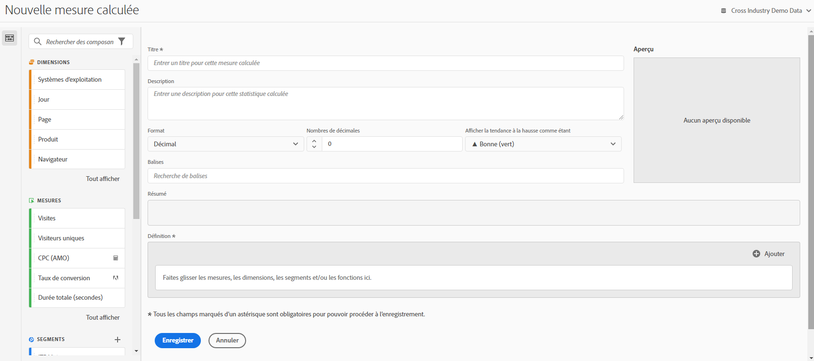

# Création de mesures

Le créateur de mesures calculées fournit un canevas où faire glisser et déposer des dimensions, des mesures, des filtres et des fonctions permettant de créer des mesures personnalisées en fonction de la logique de hiérarchie des conteneurs, des règles et des opérateurs. Grâce à cet outil de développement intégré, vous pouvez créer et enregistrer des mesures calculées simples ou des mesures calculées avancées complexes.

Il existe plusieurs manières d’afficher le créateur de mesures calculées :

* Dans Analysis Workspace, ouvrez un projet et cliquez sur **[!UICONTROL + Nouveau]** > **[!UICONTROL Créer une mesure]**.
* Dans [!DNL Analytics], accédez à **[!UICONTROL Composants]** > **[!UICONTROL Mesures calculées]**.

* Cliquez sur **[!UICONTROL + Ajouter]** dans la partie supérieure du [Gestionnaire de mesures calculées](/help/components/calc-metrics/cm-workflow/cm-manager.md) ou

* Accédez à **[!UICONTROL Analytics]** > **[!UICONTROL Rapports]**, ouvrez un rapport, cliquez sur l’icône Mesures  pour afficher le rail Mesures, puis cliquez sur **[!UICONTROL Ajouter]**.

## Composants de l’interface utilisateur {#ui-components}

| Champ | Description |
| --- | --- |
| Titre | La dénomination de la mesure est obligatoire. Vous ne pouvez pas enregistrer la mesure tant qu’elle ne porte pas de nom. |
| Description | Donnez-lui une description conviviale afin d’expliquer son utilisation et pour la distinguer de mesures similaires. La description apparaît également dans le rapport. Il est préférable de NE PAS mettre la formule dans la description. A la place, décrivez ce pour quoi cette mesure doit être utilisée ou ne doit pas être utilisée. (La formule est générée lorsque vous créez la mesure, sous l’en-tête Résumé. Il n’est donc pas nécessaire d’ajouter la formule à la description.) |
| Format | Décimale, Heure, Pourcentage et Devise font partie des choix possibles. |
| Nombre de décimales | Affiche le nombre de décimales qui apparaîtra dans le rapport. Le nombre maximal de décimales que vous pouvez spécifier est 10. |
| Tendance à la hausse affichée... | Ce paramètre de polarité des mesures indique si Analytics doit considérer une tendance à la hausse dans la mesure comme un événement positif (vert) ou négatif (rouge). En conséquence, le graphique du rapport s’affiche en vert ou rouge lorsque la tendance est à la hausse. |
| Devise | Devise de base pour cette vue de données. |
| Balises | Le balisage est un moyen efficace d’organiser les mesures. Tous les utilisateurs peuvent créer des balises et en appliquer une ou plusieurs à un segment. Néanmoins, vous ne pouvez afficher les balises que pour les segments que vous possédez ou qui ont été partagés avec vous. Quels types de balises devriez-vous créer ? Vous trouverez ci-dessous quelques suggestions de balises utiles :<ul><li>Des balises basées sur des noms d’équipe, par exemple Marketing des réseaux sociaux, Marketing des appareils mobiles.</li><li>Les balises Projet (balises d’analyse), telles que l’analyse de la page d’accès.</li><li>Les balises Catégorie : Hommes ; géographie.</li><li>Les balises Processus : Sous réserve d’approbation ; Organisé pour (une unité opérationnelle spécifique).</li></ul> |
| Résumé | La formule [!UICONTROL Résumé] se met à jour chaque fois que vous apportez une modification à une définition de mesure. Cette formule s’affiche également dans le rail des mesures à gauche lorsque vous passez la souris sur une mesure et cliquez sur l’icône. |
| Définition | Il sʼagit de lʼemplacement où vous faites glisser les mesures/mesures calculées, les filtres et/ou les fonctions permettant de créer la mesure calculée. Si vous faites glisser une mesure calculée, elle développe automatiquement sa définition de mesure. Vous pouvez imbriquer des définitions dans des conteneurs. Néanmoins, à la différence des conteneurs de segments, ces conteneurs fonctionnent comme une expression mathématique et déterminent la séquence des opérations. |
| Opérateur | Lʼ[!UICONTROL opérateur de division] est lʼopérateur par défaut. Il existe également les opérateurs +, - et x. |
| Aperçu | Fournit une lecture rapide des erreurs possibles. L’aperçu couvre les 90 derniers jours. C’est une manière d’évaluer initialement si vous avez sélectionné les composants appropriés à votre mesure. Un résultat inattendu signifie que vous devez vérifier à nouveau la définition de mesure. |
| Compatibilité des produits | La compatibilité du produit indique si la mesure est compatible avec les données entièrement traitées. |
| Ajouter | Pour tous les types de mesures calculées, vous pouvez ajouter des conteneurs et des nombres statiques à la définition. Pour les mesures calculées avancées, vous pouvez également ajouter des filtres et des fonctions.<ul><li>Les conteneurs fonctionnent comme une expression mathématique et déterminent la séquence des opérations. De ce fait, tout ce que contient un conteneur sera traité avant l’opération suivante.</li><li>Le glissement d’un segment vers un conteneur segmente tout ce que contient ce conteneur. (Mesures calculées avancées uniquement)</li><li>Vous pouvez empiler plusieurs filtres dans un conteneur.</li></ul> |
| Icône représentant un engrenage (Type de mesure, Attribution) | Lorsque vous sélectionnez l’icône représentant un engrenage en regard d’une mesure, vous pouvez spécifier le type de mesure et les modèles d’attribution. |
| + Nouveau | Permet de créer un composant tel quʼun nouveau filtre (grâce auquel vous accédez au créateur de filtres). |
| Recherche de composants | Cette barre de recherche permet de rechercher des dimensions, des mesures, des segments (mesures calculées avancées uniquement) et des fonctions (mesures calculées avancées uniquement). |
| Liste des dimensions | Plutôt que de quitter le créateur de mesures calculées pour créer un filtre simple (dans le créateur de filtres), par exemple « Page = Page dʼaccueil », vous pouvez faire glisser Page et sélectionner Page dʼaccueil directement dans le créateur de mesures calculées. Le workflow de création de mesures calculées filtrées est ainsi beaucoup plus rationnel. |
| Liste des mesures | Les mesures sont réparties en 3 catégories :<ul><li>Mesures standard</li><li>Mesures calculées</li><li>Modèles de mesures - à la fin de la liste.</li></ul>Lorsque vous passez le curseur sur une mesure, vous pouvez voir lʼicône Infos à droite de celle-ci. Le fait de cliquer sur cette icône vous donne les informations suivantes :<ul><li>La formule de calcul.</li><li>Une tendance d’aperçu de la mesure.</li><li>Une icône de modification (stylo) dans la partie supérieure droite qui permet d’accéder au créateur de mesures calculées dans lequel vous pouvez modifier la mesure calculée.</li></ul> |
| Liste des filtres | (Mesures calculées avancées uniquement) Si vous êtes lʼadministrateur, cette liste affiche tous les filtres créés dans votre société de connexion. Si vous êtes un utilisateur non administrateur, cette liste affiche les filtres que vous possédez et ceux que vous partagez. |
| Liste des fonctions | (Mesures calculées avancées uniquement) Les fonctions sont divisées en deux listes :  De base (utilisée le plus souvent) et Avancée. |
| Sélecteur de vue de données  | Ce sélecteur (en haut à droite) vous permet de basculer vers une autre vue de données. |
