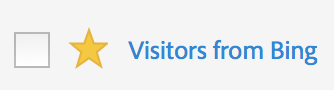

# Marquer des mesures calculées en tant que Favoris

Le marquage des mesures calculées comme favoris est une autre manière de les organiser pour en faciliter l’utilisation.

1. Dans Customer Journey Analytics, sélectionnez l’onglet **[!UICONTROL Composants]**, puis sélectionnez **[!UICONTROL Mesures calculées]**.

1. Dans le gestionnaire des mesures calculées, cochez l’étoile en regard de toute mesure calculée que vous souhaitez marquer comme favori. L’étoile devrait maintenant être jaune :

   

1. Vous pouvez également filtrer par favoris en accédant à **[!UICONTROL Filtres]** > **[!UICONTROL Autres filtres]** > **[!UICONTROL Favoris]**.
