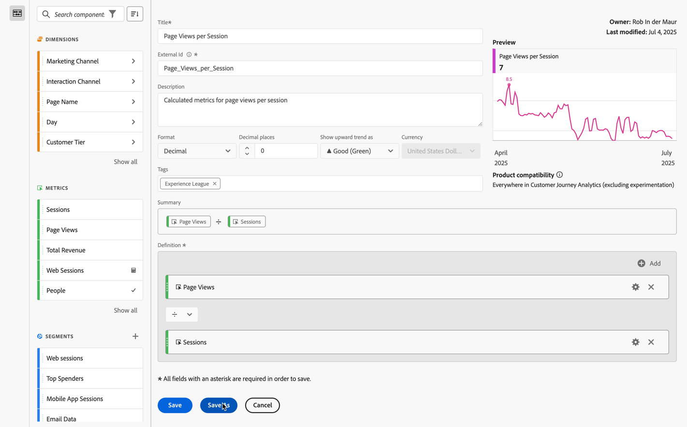

# Créer une mesure calculée simple

Les informations suivantes expliquent comment créer une mesure *Pages vues par visite* simple.

1. Commencez à créer une mesure, comme décrit dans la section [Créer des mesures](/help/components/calc-metrics/cm-workflow/cm-build-metrics.md).
1. Nommez la mesure `Page Views per Session` ou une autre mesure similaire.
1. Donnez à la mesure une **[!UICONTROL Description]** conviviale pour montrer à quoi sert la mesure.
1. Sélectionnez le **[!UICONTROL Format]** approprié. Pour cet exemple, choisissez **[!UICONTROL Décimal]**.
1. Déterminez combien de décimales vous souhaitez que le rapport affiche.
1. Dans le menu déroulant **[!UICONTROL Afficher la tendance à la hausse sous forme de]**, sélectionnez ▲ **[!UICONTROL Bon (Vert)]**.
1. Ajoutez une **[!UICONTROL Balise]** pour organiser vos mesures.
1. Pour cette mesure calculée, faites d’abord glisser **[!UICONTROL Pages vues]** des composants **[!UICONTROL Mesures]** vers la section **[!UICONTROL Définition]** de la zone de travail.
1. Faites ensuite glisser **[!UICONTROL Sessions]** à partir des composants **[!UICONTROL Mesures]** et déposez la mesure sous **[!UICONTROL Pages vues]** (attendez que la ligne bleue apparaisse avant de déposer la mesure).
1. Sélectionnez l’opérateur divide . (Il s’agit de l’opérateur par défaut.)
1. Vous pouvez afficher un **[!UICONTROL Aperçu]** de la mesure pendant que vous la créez.
1. **[!UICONTROL Compatibilité des produits]** indique si la mesure calculée est compatible partout dans Customer Journey Analytics (à l’exclusion de l’expérimentation).

   
1. Sélectionnez **[!UICONTROL Enregistrer]**.

   Notez que la formule **[!UICONTROL Résumé]** se met à jour chaque fois que vous apportez une modification à la définition de mesure.

1. (Facultatif) Pour partager, approuver, (re)baliser, renommer ou supprimer une mesure, vous pouvez accéder au [Gestionnaire de mesures calculées](/help/components/calc-metrics/cm-workflow/cm-manager.md).

