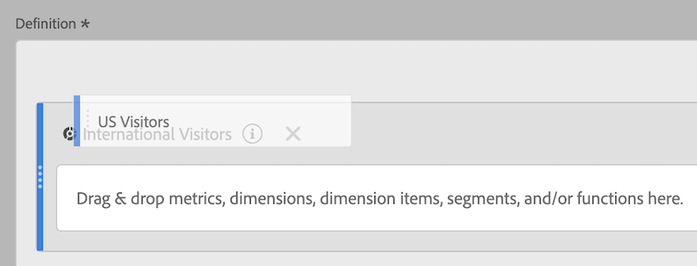

# Empilage et remplacement des filtres

Vous pouvez empiler et remplacer des filtres dans le créateur de mesures calculées.

## Empilage de filtres {#stack-filter}

1. Commencez à créer une mesure, comme décrit dans la section [Créer des mesures](/help/components/calc-metrics/cm-workflow/cm-build-metrics.md).

1. Dans le canevas Définition, déposez le nouveau filtre en regard de celui existant :

## Remplacement dʼun filtre par un autre {#replace-filter}

1. Commencez à créer une mesure, comme décrit dans la section [Créer des mesures](/help/components/calc-metrics/cm-workflow/cm-build-metrics.md).

1. Dans le canevas Définition, déposez le nouveau filtre au-dessus de celui existant :

