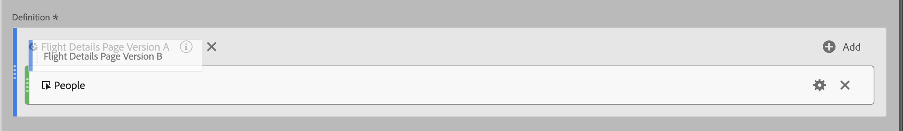

# Empilage et remplacement des segments

Vous pouvez empiler et remplacer des segments dans le créateur de mesures calculées.

## Empilement de segments {#stack-segment}

1. Commencez à créer une mesure, comme décrit dans la section [Création de mesures calculées](/help/components/calc-metrics/cm-workflow/cm-build-metrics.md).

1. Dans le canevas Définition , déposez le nouveau segment en regard de celui existant :

   

## Remplacer un segment par un autre {#replace-segment}

1. Commencez à créer une mesure, comme décrit dans la section [Créer des mesures](/help/components/calc-metrics/cm-workflow/cm-build-metrics.md).

1. Dans le canevas Définition, déposez le nouveau segment au-dessus de celui existant :

   
