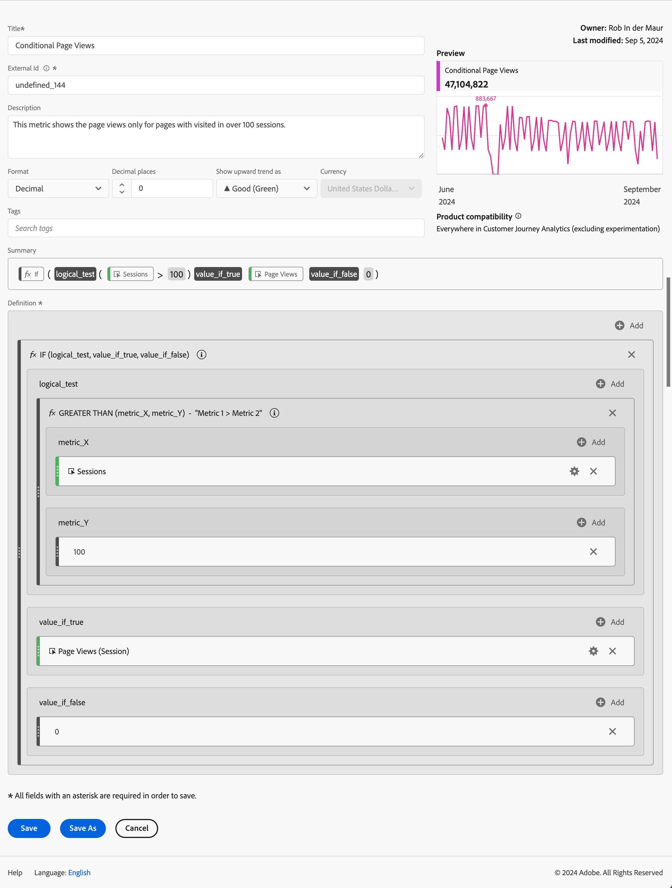

# Exemples de mesures calculées

Cet article présente des exemples de définition de mesures calculées plus avancées.

## Taux de rebond

Vous souhaitez calculer le taux de rebond.

+++ Détails

La définition d’un rebond fait l’objet d’une autre discussion, mais pour cet exemple, vous définissez un segment d’événements Rebonds où Début de session est égal à 1 et Fin de session est égal à 1. Ce segment définit le taux de sessions rebonds par rapport aux sessions.

### Segment

### Mesure calculée

### Champs dérivés

Vous pouvez également définir un [&#x200B; taux de rebond à l’aide de champs dérivés](/help/data-views/derived-fields/derived-fields.md#bounces).

Les champs dérivés font partie d’une vue de données qui a l’avantage que tous les utilisateurs et utilisatrices ne peuvent pas remplacer ou modifier la définition d’une mesure Taux de rebond . Cet avantage a également introduit une limitation. Les utilisateurs qui n’ont pas accès à une vue de données ne peuvent pas utiliser de champs dérivés et doivent avoir recours à des segments et à des mesures calculées pour définir un taux de rebond.

Pour plus d’informations sur le calcul des rebonds et du taux de rebond dans Customer Journey Analytics, consultez cet [&#x200B; article de blog &#x200B;](https://experienceleaguecommunities.adobe.com/t5/adobe-analytics-blogs/calculating-bounces-amp-bounce-rate-in-adobe-customer-journey/ba-p/706446).

+++

## Pages vues conditionnelles

Vous souhaitez définir une mesure calculée qui calcule uniquement les pages vues pour les pages qui ont été visitées au cours de plus de 100 sessions.

+++ Détails 

+++

## Pages vues pour les 30 % premières sessions

Vous souhaitez définir une mesure calculée qui calcule uniquement les pages vues pour les 30 % de sessions les plus consommatrices de ressources.

+++ Détails

+++
