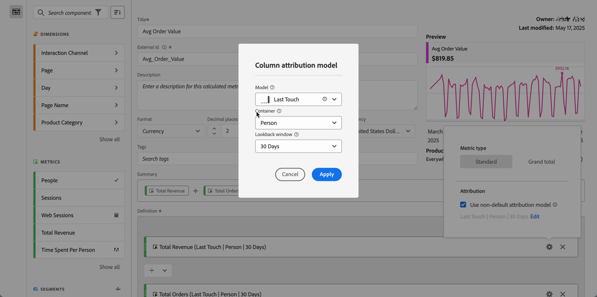

# Type de mesure et attribution

Vous pouvez configurer le type de mesure et le [modèle d’attribution](#attribution-models) pour une mesure dans une définition de mesure calculée.

1. Sélectionnez  dans le composant de mesure.
1. Dans la boîte de dialogue contextuelle, réalisez les actions suivantes :

   

   * Spécifiez le **[!UICONTROL type de mesure]** :

     | Type de mesure | Définition |
     |---|---|
     | **[!UICONTROL Standard]** | Si une formule est composée d’une seule mesure standard, elle affiche des données identiques à sa contrepartie de mesure non calculée. Les mesures standard sont utiles pour créer des mesures calculées spécifiques à chaque élément de ligne. 
Par exemple,  **[!UICONTROL Commandes]**   **[!UICONTROL Sessions]** divise les commandes de cet élément de ligne spécifique par le nombre de sessions correspondantes. |
     | **[!UICONTROL Total général]** | Utilisez le **[!UICONTROL Total général]** à la période de création de rapports de chaque élément de ligne. Si une formule est composée d’une mesure Total général, la mesure calculée affiche le même Total général sur chaque élément de ligne. Les mesures Total général sont utiles lorsque vous souhaitez créer des mesures calculées qui se comparent aux données totales. 
Par exemple,  **[!UICONTROL Commandes]**   **[!UICONTROL Nombre total de sessions]** indique la proportion de commandes par rapport à toutes les sessions, et pas seulement par rapport à l’élément de ligne spécifique. Dans cet exemple, vous spécifiez **[!UICONTROL Total général]** pour la mesure  **[!UICONTROL Sessions]** dans votre mesure calculée, qui la transformera automatiquement en  **[!UICONTROL Nombre total de sessions]**. |

   * Spécifiez **[!UICONTROL Attribution]**.

      1. Vous pouvez effectuer l’une des actions suivantes :

         * Désactivez **[!UICONTROL Utiliser un modèle d’attribution différent du modèle par défaut]** pour utiliser le modèle d’attribution de colonne par défaut, à savoir Dernière touche, avec un intervalle de recherche en amont de 30 jours.
         * Activez **[!UICONTROL Utiliser un modèle d’attribution différent du modèle par défaut]**. Dans la boîte de dialogue **[!UICONTROL Modèle d’attribution de colonne]**,

            * sélectionnez un **[!UICONTROL Modèle]** parmi les [modèles d’attribution](#attribution-models).
            * sélectionnez un **[!UICONTROL Conteneur]** parmi les options de [conteneur](#container).
            * sélectionnez un **[!UICONTROL Intervalle de recherche en amont]** dans les options d’[intervalle de recherche en amont](#lookback-window). Si vous sélectionnez **[!UICONTROL Durée personnalisée]**, vous pouvez définir la période avec un granularité allant de **[!UICONTROL minute(s)]** à **[!UICONTROL trimestre(s)]**.

      1. Sélectionnez **[!UICONTROL Appliquer]** pour appliquer le modèle d’attribution différent du modèle par défaut. Sélectionnez Annuler pour annuler.

     Si vous avez déjà défini un modèle d’attribution différent du modèle par défaut, sélectionnez **[!UICONTROL Modifier]** pour modifier la sélection.

Consultez [Exemple](#example) pour un exemple d’utilisation d’un modèle d’attribution, d’un conteneur et d’un intervalle de recherche en amont.

## Modèles d’attribution {#attribution-models}

>[!CONTEXTUALHELP]
>id="components_calculatedmetrics_nondefaultattributionmodel"
>title="Utilisation d’un modèle d’attribution différent du modèle par défaut"
>abstract="Activez un modèle d’attribution autre que celui par défaut pour la mesure sélectionnée."

>[!CONTEXTUALHELP]
>id="components_calculatedmetrics_attributionmodel"
>title="Modèle"
>abstract="Sélectionnez un modèle d’attribution pour la mesure."

>[!CONTEXTUALHELP]
>id="components_calculatedmetrics_attribution_lasttouch"
>title="Dernière touche"
>abstract="100 % du crédit est attribué à la dernière valeur de dimension vue par un visiteur ou une visiteuse."

>[!CONTEXTUALHELP]
>id="components_calculatedmetrics_attribution_firsttouch"
>title="Première touche"
>abstract="100 % du crédit est attribué à la première valeur de dimension vue par un visiteur ou une visiteuse."

>[!CONTEXTUALHELP]
>id="components_calculatedmetrics_attribution_linear"
>title="Linéaire"
>abstract="Le crédit est réparti uniformément sur toutes les valeurs de dimension."

>[!CONTEXTUALHELP]
>id="components_calculatedmetrics_attribution_participation"
>title="Participation"
>abstract="Crédit 100 % à chaque valeur de dimension vue par un visiteur ou une visiteuse. Les totaux des colonnes sont surestimés."

>[!CONTEXTUALHELP]
>id="components_calculatedmetrics_attribution_sametouch"
>title="Même touche"
>abstract="Le crédit est attribué uniquement aux valeurs de dimension survenant sur le même événement que la conversion."

>[!CONTEXTUALHELP]
>id="components_calculatedmetrics_attribution_instance"
>title="Même touche"
>abstract="Le crédit est attribué uniquement aux valeurs de dimension survenant sur le même événement que la conversion."

>[!CONTEXTUALHELP]
>id="components_calculatedmetrics_attribution_ushaped"
>title="En forme de U"
>abstract="40 % du crédit à la première valeur de dimension, 40 % à la dernière, 20 % partagés par le milieu."

>[!CONTEXTUALHELP]
>id="components_calculatedmetrics_attribution_jcurve"
>title="Courbe en J"
>abstract="60 % du crédit à la dernière valeur de dimension, 20 % à la première, 20 % partagés par le milieu."

>[!CONTEXTUALHELP]
>id="components_calculatedmetrics_attribution_jshaped"
>title="Courbe en J"
>abstract="60 % du crédit à la dernière valeur de dimension, 20 % à la première, 20 % partagés par le milieu."

>[!CONTEXTUALHELP]
>id="components_calculatedmetrics_attribution_inversej"
>title="En forme de J inversé"
>abstract="60 % du crédit à la première valeur de dimension, 20 % à la dernière, 20 % partagés par le milieu."

>[!CONTEXTUALHELP]
>id="components_calculatedmetrics_attribution_reversejshaped"
>title="En forme de J inversé"
>abstract="60 % du crédit à la première valeur de dimension, 20 % à la dernière, 20 % partagés par le milieu."

>[!CONTEXTUALHELP]
>id="components_calculatedmetrics_attribution_timedecay"
>title="Atténuation temporelle"
>abstract="Les valeurs de dimension les plus proches dans le temps d’une conversion obtiennent le plus de crédit."

>[!CONTEXTUALHELP]
>id="components_calculatedmetrics_attribution_custom"
>title="Personnalisé"
>abstract="Définissez votre propre pondération d’attribution basée sur la position."

>[!CONTEXTUALHELP]
>id="components_calculatedmetrics_attribution_positionbased"
>title="Personnalisé"
>abstract="Définissez votre propre pondération d’attribution basée sur la position."

>[!CONTEXTUALHELP]
>id="components_calculatedmetrics_attribution_algorithmic"
>title="Algorithmique"
>abstract="Le crédit est déterminé dynamiquement à l’aide d’un algorithme statistique."

{{attribution-models-details}}

## Conteneur {#container}

>[!CONTEXTUALHELP]
>id="components_calculatedmetrics_attribution_container"
>title="Conteneur"
>abstract="Sélectionnez un conteneur pour définir la portée souhaitée pour l’attribution."

{{attribution-container}}

## Intervalle de recherche en amont {#lookback-winwow}

>[!CONTEXTUALHELP]
>id="components_calculatedmetrics_attribution_lookbackwindow"
>title="Intervalle de recherche en amont"
>abstract="Ce paramètre détermine la fenêtre d’attribution des données qui sera appliquée à chaque conversion."

{{attribution-lookback-window}}

## Exemple

{{attribution-example}}

>[!MORELIKETHIS]
>
>[Paramètres des composants d’attribution](/help/data-views/component-settings/attribution.md)
>&#x200B;>[Mesure de participation](participation-metric.md)
>

