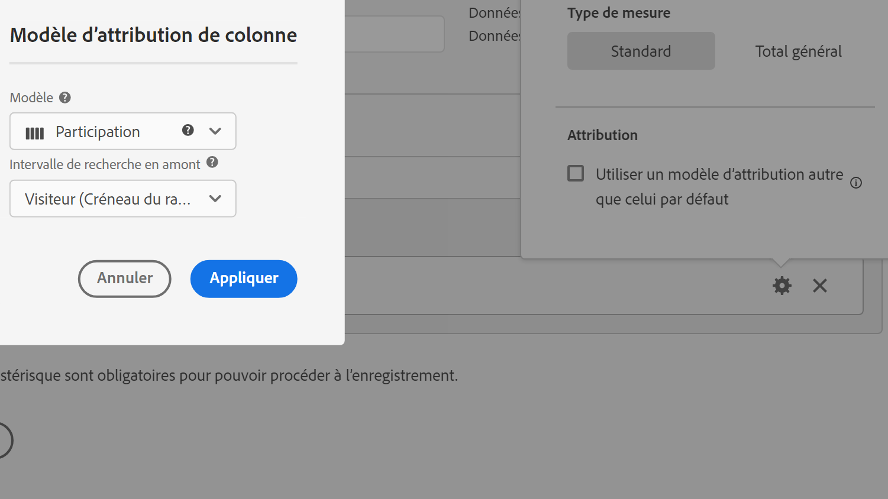

# Type de mesure et attribution

Lorsque vous sélectionnez l’icône représentant un engrenage en regard d’une mesure, vous pouvez spécifier le type de mesure et le modèle d’attribution.

## Type de mesure

| Type de mesure | Définition |
|---|---|
| Standard | Ces mesures sont les mêmes mesures que celles utilisées dans la création de rapports standard [!DNL Analytics]. Si une formule est composée d’une seule mesure standard, elle affiche des données identiques à sa contrepartie de mesure non calculée. Les mesures standard sont utiles pour créer des mesures calculées spécifiques à chaque ligne. Par exemple, [Commandes] / [Visites] utilise des commandes pour cette ligne spécifique et la divise par le nombre de visites correspondant à cette ligne spécifique. |
| Total | Utilisez le total correspondant à la période de création de rapports de chaque ligne. Si une formule est composée d’un nombre total de mesures unique, elle affiche le même nombre total sur chaque ligne. Le nombre total de mesures est utile pour la création de mesures calculées qui sont comparées au nombre total de données du site. Par exemple, [Commandes] / [Nombre total de visites] affiche la proportion des commandes par rapport à TOUTES les visites sur votre site, et non juste les visites sur la ligne spécifique objet. |
