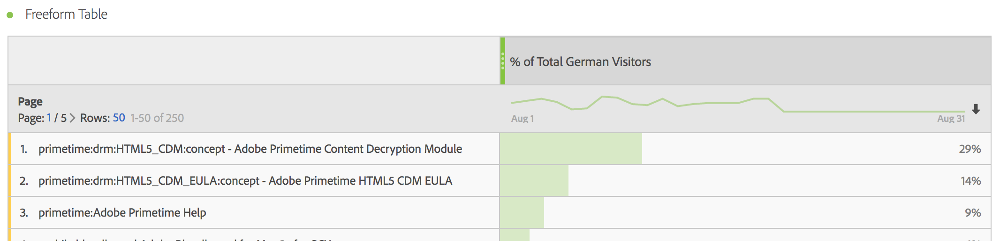

# Mesures filtrées

Dans le créateur de mesures calculées, vous pouvez appliquer des filtres dans votre définition de mesure. Cela s’avère utile si vous souhaitez extraire de nouvelles mesures afin de les utiliser dans votre analyse. Gardez à l’esprit que les définitions de filtre peuvent être mises à jour dans le Créateur de filtres. Si des modifications sont apportées, le filtre est automatiquement mis à jour partout où il est appliqué, y compris s’il fait partie d’une définition de mesure calculée.

## Création d’une mesure filtrée {#create}

Imaginons que vous souhaitiez comparer différents aspects d’un filtre &quot;Visiteurs allemands&quot; à ceux d’un filtre &quot;Visiteurs internationaux&quot;. Vous pouvez créer des mesures qui vous donneront des informations telles que :

* Qu’obtient-on en termes de comparaison du comportement de navigation du contenu entre ces deux groupes ? (Autre exemple : Comment le taux de conversion se compare-t-il entre les deux filtres ?)
* En termes de pourcentage du nombre de visiteurs total, combien de visiteurs allemands parcourent certaines pages par rapport aux visiteurs internationaux ?
* Quelles sont les différences majeures en termes de contenu accessible par ces différents filtres ?

1. Si vous ne disposez pas d’un filtre comparable, créez un segment ad hoc directement dans le créateur de mesures calculées appelé &quot;Visiteurs allemands&quot;, où &quot;Pays&quot; est &quot;Allemagne&quot;. Faites simplement glisser la dimension Pays dans le canevas Définition et sélectionnez Allemagne comme valeur :

   

   >[!NOTE]
   >
   >Vous pouvez également effectuer cette opération dans le [Créateur de filtres](/help/components/filters/create-filters.md), mais nous avons simplifié le processus en rendant les dimensions disponibles dans le créateur de mesures calculées. &quot;Adhoc&quot; signifie que le segment n’est pas visible dans la variable **[!UICONTROL Filtres]** dans le rail de gauche. Vous pouvez néanmoins le rendre public en pointant sur l’icône « i » en regard et en cliquant sur **[!UICONTROL Rendre public]**.

1. Si vous ne disposez pas d’un filtre comparable, créez un filtre appelé &quot;Visiteurs internationaux&quot; où &quot;Pays&quot; n’est pas &quot;Allemagne&quot;.
1. Créez et enregistrez une mesure appelée &quot;Visiteurs allemands&quot; en faisant glisser le filtre Allemagne dans le canevas Définition et en y faisant glisser la mesure Visiteurs uniques :

   

1. Répétez l’étape 3 avec le segment Visiteurs internationaux et la mesure Visiteurs uniques afin de créer une mesure Visiteurs internationaux.
1. Dans Analysis Workspace, faites glisser la dimension **[!UICONTROL Page]** dans un tableau à structure libre, puis faites glisser les 2 nouvelles mesures calculées l’une à côté de l’autre dans la partie supérieure :

   

Voici une présentation vidéo :

>[!VIDEO](https://video.tv.adobe.com/v/25407/?quality=12)

## Pourcentage de mesures totales {#percent-total}

Vous pouvez suivre l’exemple ci-dessus en comparant votre filtre à une population totale. Pour ce faire, créez deux mesures, « % du total des visiteurs allemands » et « % du total des visiteurs internationaux » :

1. Déposez le filtre Visiteurs allemands (ou internationaux) dans la zone de travail.
1. Déposez un autre filtre Visiteurs allemands (ou internationaux) ci-dessous. Néanmoins, cette fois-ci, cliquez sur l’icône (engrenage) de configuration pour sélectionner le type de mesure « Total ». Le format doit être « Pourcentage ». L’opérateur doit être « divisé par ». Vous terminez avec cette définition de mesure :

   

1. Appliquez cette mesure à votre projet :

   
