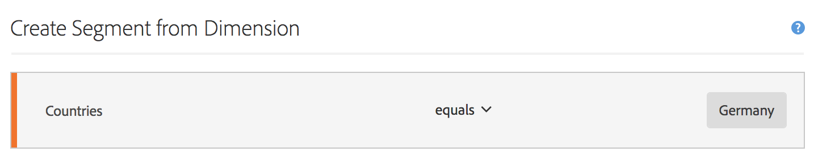

# Mesures filtrées

Dans le créateur de mesures calculées, vous pouvez appliquer des filtres dans votre définition de mesure. Cela s’avère utile si vous souhaitez extraire de nouvelles mesures afin de les utiliser dans votre analyse. Nʼoubliez pas que les définitions de filtre peuvent être mises à jour par le biais du créateur de filtres. Si des modifications sont apportées, le filtre se met automatiquement à jour là où il est appliqué, y compris sʼil fait partie dʼune définition de mesure calculée.

## Création dʼune mesure filtrée {#create}

Imaginons que vous souhaitez comparer différents aspects dʼun filtre « Visiteurs allemands » à ceux dʼun filtre « Visiteurs internationaux ». Vous pouvez créer des mesures qui vous donneront des informations telles que :

* Qu’obtient-on en termes de comparaison du comportement de navigation du contenu entre ces deux groupes ? (Un autre exemple : qu’obtient-on en termes de comparaison du taux de conversion entre ces deux filtres ?)
* En pourcentage du nombre total de personnes, combien de personnes allemandes parcourent certaines pages par rapport aux personnes internationales ?
* Quelles sont les différences majeures en termes de contenu parcouru par ces différents filtres ?

Créez et enregistrez une mesure appelée &quot;Visiteurs allemands&quot; et une mesure appelée &quot;Visiteurs internationaux&quot; :

1. Créez un filtre ad hoc dans le créateur de mesures calculées appelé &quot;Visiteurs allemands&quot;, où &quot;Pays&quot; est &quot;Allemagne&quot;. Faites glisser la dimension Pays dans le canevas Définition et sélectionnez [!UICONTROL **Allemagne**] comme valeur :

   

   >[!NOTE]
   >
   >Vous pouvez également effectuer cette opération dans le [Créateur de filtres](/help/components/filters/create-filters.md), mais nous avons simplifié le processus en rendant les dimensions disponibles dans le créateur de mesures calculées. &quot;Adhoc&quot; signifie que le filtre n’est pas visible dans la variable **[!UICONTROL Filtres]** dans le rail de gauche. Vous pouvez néanmoins le rendre public en pointant sur l’icône « i » en regard et en cliquant sur **[!UICONTROL Rendre public]**.

1. Faites glisser le filtre Allemagne dans le canevas Définition et faites glisser la mesure Visiteurs uniques à l’intérieur :

   

1. Sélectionner [!UICONTROL **Enregistrer**] pour enregistrer la mesure calculée.

1. Créez un filtre ad hoc dans le créateur de mesures calculées appelé &quot;Visiteurs internationaux&quot;, où &quot;Pays&quot; n’est pas &quot;Allemagne&quot;.

   Faites glisser la dimension Pays dans le canevas Définition, puis sélectionnez [!UICONTROL **Allemagne**] comme valeur, puis sélectionnez [!UICONTROL **n’est pas égal à**] comme opérateur.

1. Faites glisser la mesure Visiteurs uniques dans celle-ci.

1. Sélectionner [!UICONTROL **Enregistrer**] pour enregistrer la mesure calculée.

1. Dans Analysis Workspace, faites glisser la dimension **[!UICONTROL Page]** dans un tableau à structure libre, puis faites glisser les 2 nouvelles mesures calculées l’une à côté de l’autre dans la partie supérieure :

   

Voici une présentation vidéo :

>[!VIDEO](https://video.tv.adobe.com/v/25407/?quality=12)

## Pourcentage de mesures totales {#percent-total}

Vous pouvez aller plus loin avec lʼexemple ci-dessus en comparant votre filtre à une population totale. Pour ce faire, créez deux mesures, « % du total des visiteurs allemands » et « % du total des visiteurs internationaux » :

1. Déposez le filtre Visiteurs allemands (ou internationaux) dans le canevas.
1. Déposez un autre filtre Visiteurs allemands (ou internationaux) dessous. Néanmoins, cette fois-ci, cliquez sur l’icône (engrenage) de configuration pour sélectionner le type de mesure « Total ». Le format doit être « Pourcentage ». L’opérateur doit être « divisé par ». Vous terminez avec cette définition de mesure :

   

1. Appliquez cette mesure à votre projet :

   
