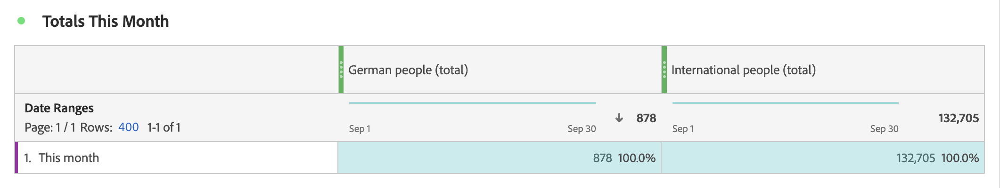

# Mesures filtrées

Dans le [créateur de mesures calculées](cm-build-metrics.md#definition-builder), vous pouvez appliquer des filtres dans votre définition de mesure. L’application de filtres s’avère utile si vous souhaitez utiliser des mesures pour un sous-ensemble de vos données dans votre analyse.

>[!NOTE]
>
>Les définitions de filtre sont mises à jour via le [Créateur de filtres](/help/components/filters/filter-builder.md). Si vous modifiez un filtre, celui-ci est automatiquement mis à jour partout où il est utilisé, y compris si le filtre fait partie d’une définition de mesure calculée.
>

Vous souhaitez comparer les mesures des personnes allemandes qui interagissent avec votre marque par rapport aux personnes hors Allemagne. Vous pouvez ainsi répondre à des questions telles que :

1. Combien de personnes allemandes ou internationales visitent vos [ pages les plus populaires](#popular-pages).
1. Combien de personnes allemandes par rapport aux personnes internationales dans [total](#totals) ont interagi en ligne avec votre marque ce mois-ci.
1. Quels sont les [pourcentages](#percentages) des Allemands et des internationaux qui ont visité vos pages populaires ?

Consultez les sections ci-dessous pour savoir comment les mesures filtrées peuvent vous aider à répondre à ces questions. Le cas échéant, des références sont faites à une documentation plus détaillée.

## Pages populaires

1. [Créez une mesure calculée](cm-workflow.md) à partir d’un projet Workspace, nommé `German people`.
1. Dans le [créateur de mesures calculées](cm-build-metrics.md), [ créez un filtre ](/help/components/filters/filter-builder.md), intitulé `Germany`, qui utilise le champ Pays CRM de vos données CRM pour déterminer d’où vient une personne.

   >[!TIP]
   >
   >Dans le créateur de mesures calculées, vous pouvez créer un filtre directement à l’aide du panneau Composants .
   >   

   Votre filtre pourrait ressembler à ça.

   

1. De retour dans le créateur de mesures calculées, utilisez le filtre pour mettre à jour la mesure calculée.

   

Répétez les étapes ci-dessus pour la version internationale de votre mesure calculée.

1. Créez une mesure calculée à partir de votre projet Workspace, intitulée `International people`.
1. Dans le créateur de mesures calculées, créez un filtre, intitulé `Not Germany`, qui utilise le champ Pays CRM de vos données CRM pour déterminer d’où provient une personne.

   Votre filtre devrait ressembler à celui-ci.

   

1. De retour dans le créateur de mesures calculées, utilisez le filtre pour mettre à jour la mesure calculée.

   

1. Créez un projet dans Analysis Workspace, où vous pourrez consulter les pages visitées par les Allemands et les Internationaux.

   

## Totaux

1. Créez deux nouveaux filtres basés sur le total général. Ouvrez chacun des filtres créés précédemment, renommez-le, définissez le **[!UICONTROL type de mesure]** pour **[!UICONTROL Personnes]** sur **[!UICONTROL Total général]** et utilisez **[!UICONTROL Enregistrer sous]** pour enregistrer le filtre en utilisant le nouveau nom. Par exemple :

   

1. Ajoutez une nouvelle visualisation de tableau à structure libre à votre projet Workspace, affichant le nombre total de pages pour ce mois-ci.

   

## Pourcentages

1. Créez deux nouvelles mesures calculées qui calculent un pourcentage à partir des mesures calculées que vous avez créées précédemment.

   

1. Mettez à jour votre projet Workspace.

   

+++ Voici une vidéo illustrant comment utiliser une mesure calculée filtrée comme mesure sans implémentation.

>[!VIDEO](https://video.tv.adobe.com/v/25407/?quality=12)

{{videoaa}}

+++
