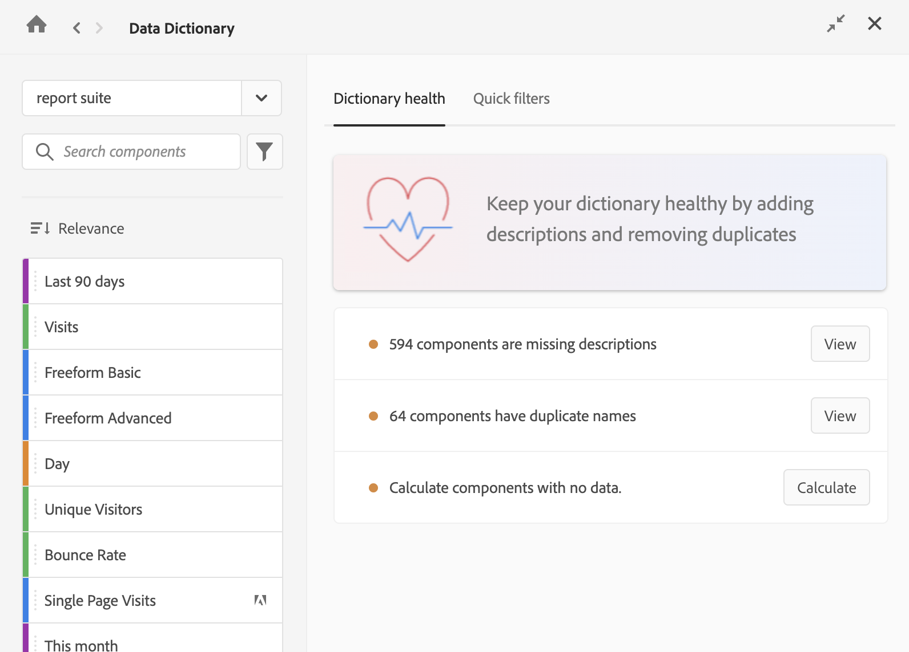

# Modifier les entrées de composant dans le dictionnaire de données

Les administrateurs de Customer Journey Analytics peuvent modifier les entrées de composant dans le dictionnaire de données pour une vue de données donnée. Toutes les modifications apportées sont visibles par tous les utilisateurs de la vue de données.

Pour modifier un composant dans le dictionnaire de données :

1. Accédez au projet Analysis Workspace qui contient le composant que vous souhaitez modifier.

1. Sélectionnez l’icône **Dictionnaire de données** dans le rail gauche d’Analysis Workspace. (Les autres méthodes d’accès au dictionnaire de données sont décrites dans « Accéder au dictionnaire de données » dans la [présentation du dictionnaire de données](/help/components/data-dictionary/data-dictionary-overview.md).)

La fenêtre Dictionnaire de données s’affiche.

1. Assurez-vous que la vue de données appropriée est sélectionnée dans le menu déroulant. Par défaut, la vue de données dans laquelle vous vous trouvez est affichée.

1. (Facultatif) Dans le champ de recherche, commencez à saisir le nom du composant à modifier.

Le type de composant peut être identifié à la fois par couleur et par icône. **Dimensions**  sont orange, **Filtres**  sont bleues, **Périodes**  sont violets et **Mesures**  sont vertes. L’icône Adobe indique soit un modèle de mesure calculée, soit un modèle de filtre, et l’icône du calculateur  indique une mesure calculée qui a été créée par un administrateur Analytics de votre entreprise.

{{dd-filter-criteria}}

1. (Facultatif) Sélectionnez le **Tri** icon , puis sélectionnez l’une des options de filtre suivantes pour trier la liste des composants :

{{components-sort-options}}

1. Dans la liste des composants, sélectionnez le composant à modifier.

1. Sélectionnez l’icône **Modifier**  en regard du nom du composant.

1. Modifiez l’une des informations suivantes sur le composant :

{{dd-component-information}}

1. Cliquez sur l’icône **Enregistrer**  pour enregistrer vos modifications.
