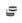

# Afficher des informations sur les composants dans le dictionnaire de données

Le dictionnaire de données vous permet d’afficher des informations sur un composant, notamment sa description, des composants similaires, les autres composants fréquemment utilisés avec lui, etc.

Pour afficher des informations sur un composant dans le dictionnaire de données :

1. Accédez au projet Analysis Workspace qui contient le composant que vous souhaitez afficher.

1. Sélectionnez l’icône [!UICONTROL **Dictionnaire de données**] dans le rail gauche d’Analysis Workspace. (Les autres méthodes d’accès au dictionnaire de données sont décrites dans « Accéder au dictionnaire de données » dans la [présentation du dictionnaire de données](/help/components/data-dictionary/data-dictionary-overview.md).)

   La fenêtre Dictionnaire de données s’affiche.

   

   <!--double-check this screenshot. I mocked the admin view up a bit to get rid of the Dictionary health tab.-->

1. Assurez-vous que la vue de données contenant le composant que vous souhaitez afficher est sélectionnée dans le menu déroulant. Par défaut, la vue de données dans laquelle vous vous trouvez est affichée.

1. (Facultatif) Dans le champ de recherche, commencez à saisir le nom du composant à afficher.

   Le type de composant peut être identifié à la fois par couleur et par icône. **Dimensions**  sont orange, **Segments**  sont bleues, **Périodes**  sont violets et **Mesures**  sont vertes. Icône Adobe  indique soit un modèle de mesure calculée, soit un modèle de segment, et l’icône du calculateur  indique une mesure calculée qui a été créée par un administrateur Analytics de votre entreprise.

{{dd-filter-criteria}}

1. (Facultatif) Sélectionnez le **Tri** icon , puis sélectionnez l’une des options de filtre suivantes pour trier la liste des composants :

   {{components-sort-options}}

1. Dans la liste des composants, sélectionnez le composant à afficher.

   Les informations suivantes sur le composant s’affichent :

   {{dd-component-information}}

1. (Facultatif) Faites glisser un composant du dictionnaire de données vers Analysis Workspace.
