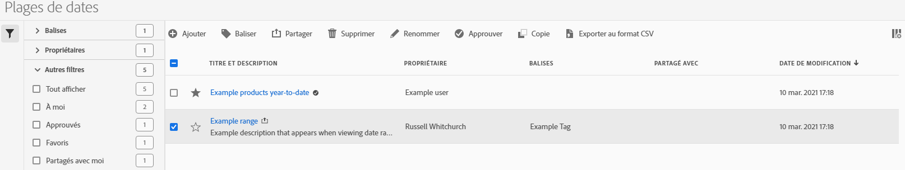

# Gestion des plages de dates

Utilisez le gestionnaire de plages de dates pour partager, renommer ou supprimer des plages de dates. Pour atteindre le gestionnaire de dates :

1. Connectez-vous à [analytics.adobe.com](https://analytics.adobe.com) à l’aide de vos informations d’identification AdobeID.
1. Navigate to [!UICONTROL Components] > [!UICONTROL Date Ranges].

## Interface

Le gestionnaire de plages de dates comprend les options suivantes :

* **Ajouter**: Créez une plage de dates. Voir [Création d’une plage](create.md) de dates pour plus d’informations.
* **Rechercher par titre**: Recherchez une plage de dates par titre. Les résultats sont filtrés en fonction du texte saisi ici.
* **Filtre**: Filtrez les plages de dates à l’aide de la colonne de gauche. Vous pouvez filtrer par balise personnalisée, propriétaire, créé par vous, vos favoris, approuvés ou partagés avec vous. Vous pouvez également rechercher des  de.
* **Favori**: Cliquez sur l’icône  en regard d’une plage de dates pour l’ajouter à vos favoris.
* **Personnaliser les colonnes**: Cliquez sur l&#39;icône  pour afficher ou masquer les colonnes dans le gestionnaire de plages de dates.

Cochez la case en regard d’une ou de plusieurs plages de dates pour afficher d’autres options.

* **Balise**: Appliquez une balise à toutes les plages de dates sélectionnées. Les balises vous aident à organiser les plages de dates et vous permettent de les filtrer à l’aide de la colonne de gauche.
* **Partager**: Partagez une balise avec d’autres utilisateurs d’Experience Cloud. Si vous êtes un administrateur de produit, vous pouvez également le partager avec l’ensemble de l’organisation ou des groupes. Les plages de dates qui sont partagées avec d’autres utilisateurs de votre organisation incluent une icône  en regard du titre.
* **Supprimer**: Supprimez définitivement les plages de dates sélectionnées.
* **Renommer**: Si une seule plage de dates est sélectionnée, vous pouvez modifier son titre.
* **Approuver**: Si vous êtes un administrateur de produit, vous pouvez ajouter un tampon d’approbation à une plage de dates. Les plages de dates approuvées informent les utilisateurs de votre organisation qu’ils sont &quot;officiels&quot;, en les différenciant des plages de dates créées par d’autres utilisateurs de votre organisation. Les plages de dates approuvées comprennent une icône  en regard du titre.
* **Désapprouver**: Si vous êtes un administrateur de produit et sélectionnez une plage de dates déjà approuvée, vous pouvez la désapprouver.
* **Copier**: Créez une copie des plages de dates sélectionnées. La copie de plages de dates s’ajoute `(Copy)` à la fin du titre de la ou des plages de dates nouvellement copiées.
* **Exporter au format CSV**: Exporte toutes les plages de dates sélectionnées dans un fichier CSV. Les colonnes du fichier CSV résultant incluent toutes les colonnes visibles dans le gestionnaire de plages de dates.
