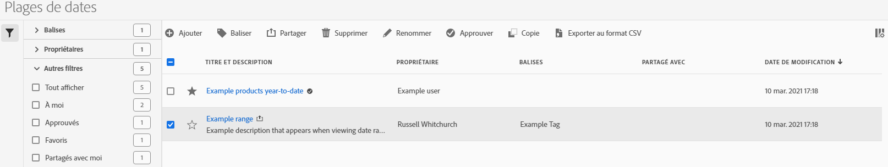

# Gestion des périodes

Vous pouvez partager, filtrer, baliser, approuver, copier, partager et supprimer des périodes et les marquer comme favorites à partir d’une interface de gestion centrale [!UICONTROL périodes]. Pour gérer les périodes :

* Sélectionnez **[!UICONTROL Composants]** dans l’interface principale, puis sélectionnez **[!UICONTROL Périodes]**.

## Gestionnaire des périodes

Le gestionnaire de périodes comporte les éléments d’interface suivants :

### Liste des périodes

La liste des périodes affiche ➊ toutes les périodes. La liste comporte les colonnes suivantes :

| Colonne | Description |
| --- | --- |
|  | Sélectionnez pour privilégier  ou ne pas privilégier  une période. |
| **[!UICONTROL Titre et description]** | Pour modifier le titre et la description, sélectionnez le lien du titre, qui ouvre le [créateur de périodes](/help/components/date-ranges/create.md#date-range-builder). |
| **[!UICONTROL Propriétaire]** | Propriétaire de la période. |
| **[!UICONTROL Balises]** | Balises pour cette période. |
| **[!UICONTROL Partagé avec]** | Individus ou groupes avec lesquels vous avez partagé la période. Sélectionnez pour ouvrir la boîte de dialogue **[!UICONTROL Partager la période]**. |
| **[!UICONTROL Date de modification]** | Affiche la date et l’heure de la dernière modification de la période. |

{style="table-layout:auto"}

Utilisez  pour spécifier les colonnes à afficher.

### Barre d’actions

Vous pouvez agir sur les périodes à l’aide de la barre d’actions ➋. La barre d’actions contient les actions suivantes :

| Icône | Action | Description |
|:---:|---|---|
|  | **[!UICONTROL Ajouter]** | Ajoutez une autre période à l’aide du [créateur de périodes](create.md#date-range-builder). |
|  | [!UICONTROL *Rechercher par titre*] | Lorsqu’aucune période n’est sélectionnée dans la liste, recherchez des périodes à l’aide de ce champ de recherche. |
|  | **[!UICONTROL Étiquette]** | Balisez les périodes sélectionnées. Dans la boîte de dialogue **[!UICONTROL Période de balise]**, sélectionnez ou désélectionnez les balises des périodes sélectionnées. Sélectionnez **[!UICONTROL Enregistrer]** pour enregistrer les balises des périodes sélectionnées. |
|  | **[!UICONTROL Partager]** | Partagez les périodes sélectionnées. Dans la boîte de dialogue **[!UICONTROL Partager la période]**, vous pouvez  *Rechercher des individus ou des groupes* ou sélectionner **[!UICONTROL Organisation]** ou **[!UICONTROL Groupes]**. Sélectionnez **[!UICONTROL Enregistrer]** pour enregistrer les détails de partage pour les périodes sélectionnées. |
|  | **[!UICONTROL Supprimer]** | Supprimez les périodes sélectionnées. Il vous est demandé de confirmer. |
|  | **[!UICONTROL Renommer]** | Renommez une seule période sélectionnée. Lorsque cette option est sélectionnée, vous pouvez renommer la période en ligne. |
|  | **[!UICONTROL Approuver]** | Valider les périodes sélectionnées. |
|  | **[!UICONTROL Copier]** | Copiez les périodes sélectionnées. De nouvelles périodes sont créées avec le même nom et le même suffixe (Copier). |
|  | **[!UICONTROL Exporter dans un fichier CSV]** | Exportez les périodes sélectionnées dans un fichier `Date ranges List.csv`. |

### Barre de filtres actifs

La barre de filtres affiche ➌ les filtres actifs (le cas échéant). Vous pouvez supprimer rapidement un filtre à l’aide de . Si plusieurs filtres sont spécifiés, utilisez **[!UICONTROL Tout supprimer]** pour supprimer tous les filtres.

### Panneau Filtrer

Vous pouvez filtrer les périodes à l’aide du ➍ du panneau de gauche **[!UICONTROL Filtrer]**. Le panneau de filtrage affiche le type de filtre et le nombre de périodes qui respectent le filtre. Sélectionnez  pour afficher ou masquer le panneau Filtrer.

Pour filtrer la liste des filtres :

1. Sélectionnez  pour ouvrir le panneau Filtres. Si vous avez besoin d’espace supplémentaire pour la liste des filtres, vous pouvez sélectionner à nouveau  pour fermer le panneau.
1. Vous pouvez filtrer les périodes à l’aide de l’une des [sections de filtre](#filter-sections) disponibles.

   >[!INFO]
   >
   >*Éléments* font référence aux éléments de période affichés dans la [liste Périodes](#date-ranges-list).
   > 

#### Sections de filtrage

{{tagfiltersection}}
{{ownerfiltersection}}
{{otherfiltersfiltersection}}

La [liste des périodes](#date-ranges-list) est automatiquement mise à jour en fonction de la configuration de votre filtre. Vous pouvez voir les filtres configurés dans la [Barre des filtres actifs](#active-filter-bar).

## Modifier les périodes

Vous pouvez modifier une période de deux manières :

* Dans un projet Workspace, utilisez l’icône [Informations sur le composant](/help/components/use-components-in-workspace.md#component-info).

* Dans la liste [[!UICONTROL Périodes] , choisissez ](#date-ranges-list) titre de la période.

Utilisez le [créateur de périodes](/help/components/date-ranges/create.md#date-range-builder) pour modifier la période.Utilisez le [gestionnaire de périodes](/help/components/date-ranges/manage.md) pour partager, renommer ou supprimer des périodes.

<!--

## Interface

The date range manager includes the following options:

* **Add**: Create a new date range. See [create a date range](create.md) for more information.
* **Search by title**: Search for a date range by title. Results are filtered based on text entered here.
* **Filter**: Filter date ranges using the left column. You can filter by custom tag, owner, created by you, your favorites, approved, or shared with you. You can also search for desired filters.
* **Favorite**: Click the  icon next to a date range to add it to your favorites.
* **Customize columns**: Click the  icon to show or hide columns in the date range manager.

Click the checkbox next to one or more date ranges for more options.

* **Tag**: Apply a tag to all selected date ranges. Tags help you organize date ranges, and let you filter them using the left column.
* **Share**: Share a date range to other CX Enterprise users. If you are a product administrator, you can also share to the entire organization or groups. Date ranges that are shared to other users in your organization include a  icon next to the title.
* **Delete**: Permanently delete the selected date range(s).
* **Rename**: If a single date range is selected, you can change its title.
* **Approve**: If you are a product admin, you can add a stamp of approval to a date range. Approved date ranges inform users in your organization that they are 'official', differentiating them from date ranges created by other users in your organization. Approved date ranges include a  icon next to the title.
* **Unapprove**: If you are a product admin and select a date range that is already approved, you can unapprove it.
* **Copy**: Create a copy of the selected date range(s). Copying date ranges appends `(Copy)` to the end of the title of the newly copied date range(s).
* **Export to CSV**: Exports all selected date ranges into a CSV file. Columns in the resulting CSV file include all visible columns in the date range manager.
-->