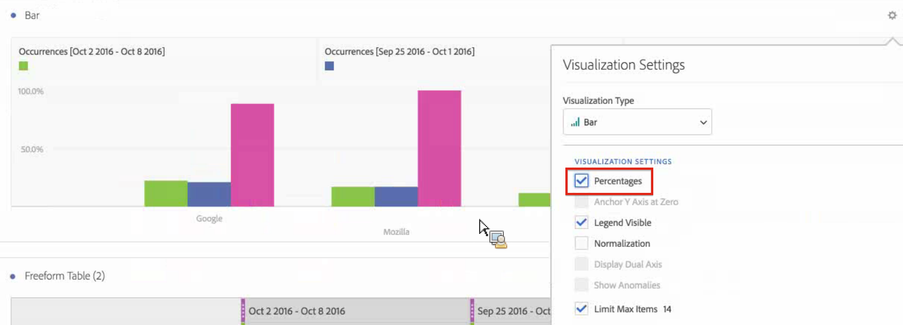

# Comparaison des dates

Dans Analysis Workspace, appliquez une comparaison des dates commune à partir de n’importe quelle colonne contenant une période, par exemple : année par année, trimestre par trimestre, mois par mois, etc.

## Comparaison de périodes

Une analyse ne peut pas avoir lieu sans contexte. Il arrive souvent que ce contexte découle d’une période précédente. Par exemple, la question « Où nous situons-nous par rapport à la même date l’an dernier ? Mieux ou pire ? » est essentielle pour bien comprendre vos activités. La comparaison des dates inclut automatiquement une colonne « différence », qui présente le pourcentage de changement par rapport à une période donnée.

1. Créez un tableau à structure libre, avec les dimensions et mesures à comparer sur une certaine période.
1. Cliquez avec le bouton droit sur une ligne de tableau et sélectionnez **[!UICONTROL Comparer des périodes]**.

   

   >[!NOTE]
   >
   >Cette option contextuelle est désactivée pour les lignes de mesures, de périodes et de dimension temporelle.

1. Selon la façon dont sont définies les périodes du tableau, les options de comparaison suivantes sont disponibles :

   | Option | Description |
   |---|---|
   | **[!UICONTROL Semaine/Mois/Trimestre/Année précédent(e) à cette période]** | Compare les données à la semaine/au mois/etc. précédant immédiatement cette plage de dates. |
   | **[!UICONTROL Cette semaine/ce mois/ce trimestre/cette année l’an dernier à cette période]** | Compare les données à la même période il y a un an. |
   | **[!UICONTROL Période personnalisée à cette période]** | Permet de sélectionner une période personnalisée. |

   >[!NOTE]
   >
   >Lorsque vous sélectionnez un nombre de jours personnalisé (par exemple, du 7 au 20 octobre, soit 14 jours), seules deux options sont proposées : **[!UICONTROL 14 jours précédant cette période]** et **[!UICONTROL Période personnalisée jusqu’à cette période]**.

1. La comparaison qui en résulte ressemble à ceci :

   

   Les lignes dans la colonne Pourcentage de changement sont en rouge pour les valeurs négatives et en vert pour les valeurs positives.

1. (Facultatif) Comme dans n’importe quel autre projet Analysis Workspace, vous pouvez créer des visualisations en fonction de ces comparaisons temporelles. Voici par exemple un graphique en barres :

   

   Pour afficher le pourcentage de changement dans ce graphique en barres, le paramètre [!UICONTROL Pourcentages] doit être activé dans les [!UICONTROL Paramètres de visualisation].

## Ajout d’une colonne de périodes à la comparaison

Vous pouvez désormais ajouter une période à chaque colonne d’un tableau, ce qui permet d’ajouter une période différente de celle configurée pour votre calendrier. Cette fonctionnalité offre un autre moyen de comparer les dates.

1. Cliquez avec le bouton droit sur une colonne du tableau et sélectionnez **[!UICONTROL Ajouter une colonne de période]**.

   

1. Selon la façon dont sont définies les périodes du tableau, les options de comparaison suivantes sont disponibles :

   | Option | Description |
   |---|---|
   | **[!UICONTROL Semaine/Mois/Trimestre/Année précédent(e) à cette période]** | Ajoute une colonne avec la semaine/le mois/etc. précédant immédiatement cette plage de dates. |
   | **[!UICONTROL Cette semaine/ce mois/ce trimestre/cette année l’an dernier à cette période]** | Ajoute la même période il y a un an. |
   | **[!UICONTROL Période personnalisée à cette période]** | Permet de sélectionner une période personnalisée. |

   >[!NOTE]
   >
   >Lorsque vous sélectionnez un nombre de jours personnalisé (par exemple, du 7 au 20 octobre, soit 14 jours), seules deux options sont proposées : **[!UICONTROL 14 jours précédant cette période]** et **[!UICONTROL Période personnalisée jusqu’à cette période]**.

1. La période sera insérée en haut de la colonne sélectionnée :

   

1. Vous pouvez ajouter autant de colonnes que vous le souhaitez, et mélanger et associer différentes périodes :

   

1. Vous pouvez également trier chaque colonne, ce qui change l’ordre des jours selon la colonne utilisée pour le tri.

## Harmonisation des dates de colonnes pour qu’elles commencent sur la même ligne {#section_5085E200082048CB899C3F355062A733}

Vous pouvez aligner les dates de chaque colonne afin qu’elles commencent toutes sur la même ligne.

Par exemple, lorsque vous harmonisez les dates, si vous effectuez une comparaison d’un mois à l’autre entre octobre et septembre 2016, la colonne de gauche commence au 1er octobre et la colonne de droite au 1er septembre :

>[!NOTE]
>
>Tenez compte des points suivants lorsque vous utilisez cette option :
>
>* Ce paramètre est activé par défaut pour tous les nouveaux projets.
>
>* Ce paramètre s’applique à l’ensemble du tableau. Par exemple, si vous modifiez ce paramètre pour une ventilation dans le tableau, le paramètre sera modifié pour l’ensemble du tableau.
>

Pour activer ce paramètre, s’il n’est pas déjà activé :

1. Dans le tableau dans lequel vous souhaitez aligner les dates des colonnes, sélectionnez l’icône **Paramètres** dans l’en-tête du tableau.

1. Dans l’onglet [!UICONTROL **Paramètres**], sélectionnez **[!UICONTROL Aligner les dates de chaque colonne pour qu’elles commencent toutes sur la même ligne (s’applique à l’ensemble du tableau)]**.

