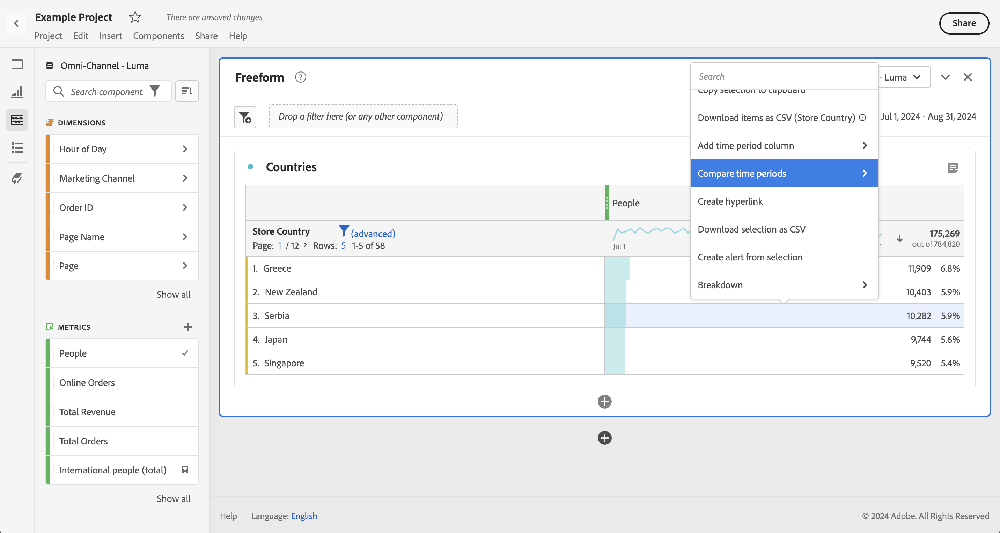
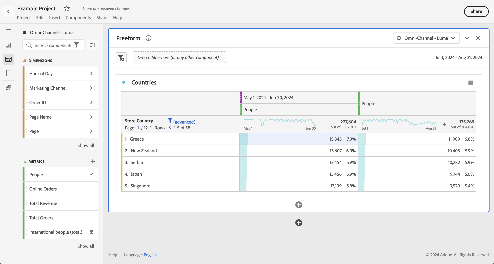
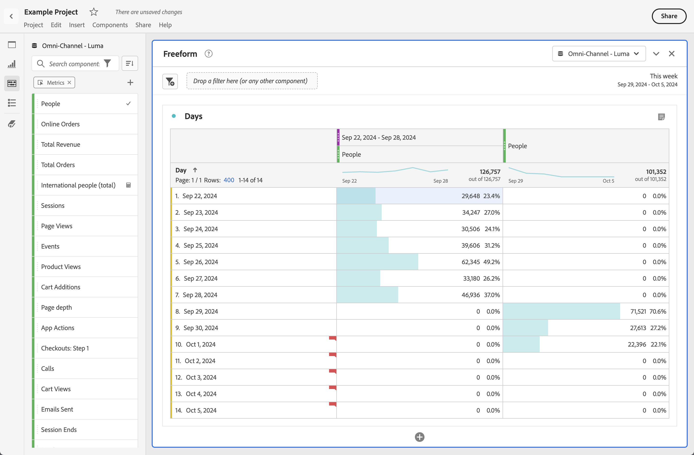

# Comparaison des dates

Dans Analysis Workspace, la comparaison de dates vous permet de prendre n’importe quelle colonne contenant une période et de créer une comparaison de dates commune, par exemple : année par année, trimestre par trimestre, mois par mois, etc.

## Comparer des périodes

Une analyse ne peut pas avoir lieu sans contexte. Il arrive souvent que ce contexte découle d’une période précédente. Par exemple, la question *Dans quelle mesure votre situation s’est-elle améliorée ou détériorée par rapport à la même période l’an dernier ?* est essentiel à la compréhension de votre entreprise. La comparaison des dates inclut automatiquement une colonne *différence*, qui présente le pourcentage de changement par rapport à une période donnée.

1. Créez un [tableau à structure libre](/help/analysis-workspace/visualizations/freeform-table/freeform-table.md), avec les dimensions et mesures à comparer sur une certaine période.
1. Définissez la période sur le panneau ou la colonne pour déterminer la période de comparaison, et s’il s’agit d’une comparaison de temps fixe ou flottante.

   Pour créer une comparaison de temps flottante, définissez la période du panneau ou de la colonne sur une période flottante (par exemple, **[!UICONTROL 7 derniers jours]**, **[!UICONTROL 30 derniers jours]**, etc.).

   Pour créer une comparaison de temps fixe, définissez la période du panneau ou de la colonne sur une période personnalisée.

1. Ouvrez le menu contextuel d’une ligne de tableau et sélectionnez **[!UICONTROL Comparer des périodes]**.

   

   >[!NOTE]
   >
   >Cette option de menu contextuelle est désactivée pour les lignes de mesures, de périodes et de dimension temporelle.

1. Selon la façon dont sont définies les périodes du tableau, les options de comparaison suivantes sont disponibles :

   | Option | Description |
   |---|---|
   | **[!UICONTROL *x* semaines/mois/trimestres/années précédant cette période]** | Compare à la période sélectionnée immédiatement avant cette période. |
   | **[!UICONTROL Ces x semaines/mois/trimestres/années l’an dernier à cette période]** | Compare les données à la même période il y a un an. |
   | **[!UICONTROL Période personnalisée à cette période]** | Permet de définir une période personnalisée. |

   >[!NOTE]
   >
   >Lorsque vous sélectionnez un nombre de jours personnalisé (par exemple, du 7 au 20 octobre, soit 14 jours), seules deux options sont proposées : **[!UICONTROL 14 jours précédant cette période]** et **[!UICONTROL Période personnalisée à cette période]**.

1. La comparaison qui en résulte ressemble à ceci :

   

   Les lignes dans la colonne Pourcentage de modification sont en rouge pour les valeurs négatives et en vert pour les valeurs positives.

## Ajouter une colonne de périodes à la comparaison

Vous pouvez désormais ajouter une période à chaque colonne d’un tableau, ce qui permet d’ajouter une période différente de celle configurée pour votre calendrier.

1. Cliquez avec le bouton droit de la souris dans le tableau, puis sélectionnez **[!UICONTROL Ajouter une colonne de périodes]**.

   

1. Selon la façon dont sont définies les périodes du tableau, les options de comparaison suivantes sont disponibles :

   | Option | Description |
   |---|---|
   | **[!UICONTROL *x* semaines/mois/trimestres/années précédant cette période]** | Ajoutez une colonne avec la semaine/le mois/etc. juste avant cette période. |
   | **[!UICONTROL Ces *x* semaines/mois/trimestres/années l’année dernière à cette période]** | Ajoute la même période il y a un an. |
   | **[!UICONTROL Période personnalisée à cette période]** | Permet de créer une période personnalisée. |

   >[!NOTE]
   >
   >Lorsque vous sélectionnez un nombre de jours personnalisé (par exemple, du 7 au 20 octobre, soit 14 jours), seules deux options sont proposées : **[!UICONTROL 14 jours précédant cette période]** et **[!UICONTROL Période personnalisée à cette période]**.

1. La période est insérée en haut de la colonne sélectionnée :

   

1. Vous pouvez ajouter autant de colonnes que vous le souhaitez, et mélanger et associer différentes périodes :

1. Vous pouvez également trier chaque colonne, ce qui change l’ordre des jours selon la colonne utilisée pour le tri.

## Aligner les dates de colonnes pour commencer sur la même ligne

Vous pouvez également aligner les dates de chaque colonne afin qu’elles commencent à partir de la même ligne.

Par exemple, vous effectuez une comparaison jour par jour pour la dernière semaine (se terminant le 5 octobre 2024) et la semaine précédente. Par défaut, la colonne de gauche commence par le 22 septembre et la colonne de droite par le 29 septembre.

Vous pouvez activer l’option **[!UICONTROL Aligner les dates de chaque colonne pour qu’elles commencent toutes sur la même ligne]** dans [Paramètres](/help/analysis-workspace/visualizations/freeform-table/freeform-table.md#settings-1) pour que la visualisation du tableau à structure libre aligne les dates des colonnes pour qu’elles commencent sur la même ligne.

Tenez compte des points suivants lorsque vous utilisez cette option :

* Ce paramètre est activé par défaut pour tous les nouveaux projets.

* Ce paramètre s’applique à l’ensemble du tableau. Par exemple, si vous modifiez ce paramètre pour une répartition au sein du tableau, le paramètre est appliqué pour l’ensemble du tableau.

