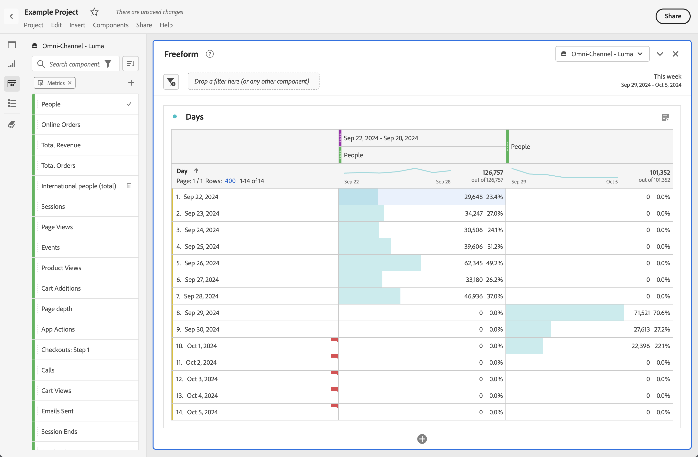

# Comparaison des dates

Dans Analysis Workspace, appliquez une comparaison des dates commune à partir de n’importe quelle colonne contenant une période, par exemple : année par année, trimestre par trimestre, mois par mois, etc.

## Comparaison de périodes

Une analyse ne peut pas avoir lieu sans contexte. Il arrive souvent que ce contexte découle d’une période précédente. Par exemple, la question *Combien de mieux ou de pire faites-vous maintenant par rapport à la même période l&#39;année dernière ?* est essentiel pour comprendre votre entreprise. La comparaison des dates inclut automatiquement une colonne *différence* qui présente le pourcentage de changement par rapport à une période donnée.

1. Créez une [table à structure libre](/help/analysis-workspace/visualizations/freeform-table/freeform-table.md), avec toutes les dimensions et mesures à comparer sur une période donnée.
1. Ouvrez le menu contextuel d’une ligne de tableau et sélectionnez **[!UICONTROL Comparer les périodes]**.

   

   >[!NOTE]
   >
   >Cette option de menu contextuel est désactivée pour les lignes de mesure, de période et de dimension temporelle.

1. Selon la façon dont sont définies les périodes du tableau, les options de comparaison suivantes sont disponibles :

   | Option | Description |
   |---|---|
   | **[!UICONTROL *x* semaines/mois/trimestres/années antérieurs à cette période]** | Comparer à la période sélectionnée juste avant cette période. |
   | **[!UICONTROL Ces x semaines/mois/trimestres/années l’an dernier jusqu’à cette période]** | Comparez à la même période il y a un an. |
   | **[!UICONTROL Période personnalisée à cette période]** | Permet de définir une période personnalisée. |

   >[!NOTE]
   >
   >Lorsque vous sélectionnez un nombre de jours personnalisé (par exemple, du 7 au 20 octobre, soit 14 jours), seules deux options sont proposées : **[!UICONTROL 14 jours précédant cette période]** et **[!UICONTROL Période personnalisée jusqu’à cette période]**.

1. La comparaison qui en résulte ressemble à ceci :

   

   Les lignes de la colonne Pourcentage de changement apparaissent en rouge pour les valeurs négatives et en vert pour les valeurs positives.

## Ajout d’une colonne de périodes à la comparaison

Vous pouvez désormais ajouter une période à chaque colonne d’un tableau, ce qui vous permet d’ajouter une période différente de celle définie pour votre calendrier.

1. Cliquez avec le bouton droit sur une colonne du tableau et sélectionnez **[!UICONTROL Ajouter une colonne de période]**.

   

1. Selon la façon dont sont définies les périodes du tableau, les options de comparaison suivantes sont disponibles :

   | Option | Description |
   |---|---|
   | **[!UICONTROL *x* semaines/mois/trimestres/années antérieurs à cette période]** | Ajoutez une colonne avec la semaine/le mois/etc. précédant immédiatement cette plage de dates. |
   | **[!UICONTROL Ces *x* semaines/mois/trimestres/années l&#39;an dernier jusqu&#39;à cette période]** | Ajoutez la même période il y a un an. |
   | **[!UICONTROL Période personnalisée à cette période]** | Permet de créer une période personnalisée. |

   >[!NOTE]
   >
   >Lorsque vous sélectionnez un nombre de jours personnalisé (par exemple, du 7 au 20 octobre, soit 14 jours), seules deux options sont proposées : **[!UICONTROL 14 jours précédant cette période]** et **[!UICONTROL Période personnalisée jusqu’à cette période]**.

1. La période est insérée au-dessus de la colonne que vous avez sélectionnée :

   

1. Vous pouvez ajouter autant de colonnes que vous le souhaitez, et mélanger et associer différentes périodes :

1. En outre, vous pouvez trier chaque colonne, ce qui change l’ordre des jours en fonction de la colonne sur laquelle vous effectuez un tri.

## Harmonisation des dates de colonnes pour qu’elles commencent sur la même ligne

Vous pouvez aligner les dates de chaque colonne afin qu’elles commencent toutes sur la même ligne.

Par exemple, vous effectuez une comparaison quotidienne pour la dernière semaine (se terminant le 5 octobre 2024) et la semaine précédente. Par défaut, la colonne de gauche commencera le 22 septembre et la colonne de droite le 29 septembre.

Vous pouvez activer l’option **[!UICONTROL Aligner les dates de chaque colonne pour qu’elles commencent toutes sur la même ligne]** dans [Paramètres](/help/analysis-workspace/visualizations/freeform-table/freeform-table.md#settings-1) pour que la visualisation de tableau à structure libre aligne les dates de colonne pour qu’elles commencent sur la même ligne.

Tenez compte des points suivants lorsque vous utilisez cette option :

* Ce paramètre est activé par défaut pour tous les nouveaux projets.

* Ce paramètre s’applique à l’ensemble du tableau. Par exemple, si vous modifiez ce paramètre pour une ventilation dans le tableau, le paramètre est appliqué à l’ensemble du tableau.

