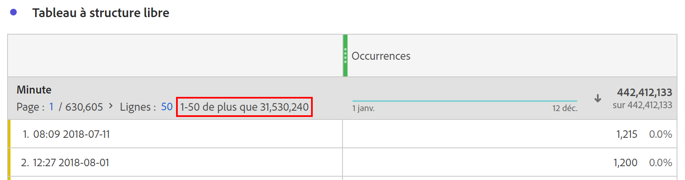

# Dimensions à cardinalité très élevée

Customer Journey Analytics (CJA) nʼimpose pas de limites au nombre de valeurs uniques ou dʼéléments de dimension pouvant faire lʼobjet dʼun compte rendu des performances dans une seule dimension. Cependant, dans certaines circonstances, les dimensions présentant un très grand nombre dʼéléments uniques, également appelées dimensions à cardinalité élevée, peuvent avoir un impact sur ce qui peut faire lʼobjet dʼun compte rendu des performances.

## Limites

En fonction du nombre dʼévénements dans une connexion CJA spécifique, les deux limites suivantes peuvent survenir en association avec des dimensions à cardinalité élevée :

### 1. Le décompte de lignes peut ne pas être comptabilisé avec précision

Le décompte de lignes sur les dimensions à cardinalité élevée peut ne pas être comptabilisé avec précision. Dans ce cas, les tableaux à structure libre fournissent une indication, comme illustré ci-dessous :

### 2. Les mesures calculées peuvent utiliser des estimations pour certaines fonctions et pour lʼordre de tri

Lorsquʼelles sont utilisées avec des dimensions à cardinalité élevée, certaines fonctions des mesures calculées peuvent renvoyer des estimations, notamment : Max. colonne, Min. colonne, Décompte de lignes, Moyenne, Médiane, Percentile, Quartile, Écart type, Variance, Fonctions de régression et Fonctions T et Z.

De plus, le tri dʼune colonne de tableau à lʼaide dʼune mesure calculée peut être basé sur une estimation et ne reflète pas toujours lʼordre de tri exact. Un message dʼavertissement sʼaffiche pour vous avertir que des estimations ont peut-être été utilisées.

Gardez à lʼesprit que même si les mesures calculées peuvent parfois renvoyer des estimations, les totaux des colonnes sont toujours exacts et ne sont jamais basés sur des estimations. De même, lorsque vous utilisez des mesures standard, les estimations ne sont jamais utilisées et reflètent toujours les ordres de tri exacts.

### Lorsque toutes les valeurs des dimensions sont prises en compte

Même sʼil y a des limites à certaines mesures calculées et aux décomptes des lignes des dimensions, gardez à lʼesprit que les fonctionnalités suivantes tiennent toujours compte de toutes les valeurs uniques dans une dimension, quʼelle soit à cardinalité élevée ou non :

* Attribution des mesures et affectation des dimensions
* Recherches par lignes appliquées à un tableau à structure libre
* Filtres utilisant des dimensions ou des éléments de dimension
* Fonction Nombre distinct approximatif dans les mesures calculées
* Logique Inclure/Exclure appliquée à une mesure ou dimension dans une vue de données
* Jeux de données de recherche ajoutés à une connexion

## Recommandations relatives à lʼutilisation des dimensions à cardinalité élevée

Afin dʼéliminer les avertissements ou les estimations qui peuvent survenir lors de lʼutilisation de dimensions à cardinalité élevée, nous vous recommandons de réduire le nombre de lignes prises en compte dans votre rapport via lʼune des méthodes suivantes :

* Ajoutez un filtre à la colonne ou au panneau concerné.
* Appliquez une recherche à votre tableau à structure libre.
* Appliquez une ventilation aux lignes dʼintérêt ou utilisez la dimension à cardinalité élevée comme dimension de répartition.
* Ajoutez des critères dʼinclusion/exclusion à la configuration de la vue de données de la dimension afin de réduire le nombre de valeurs uniques présentes dans la dimension.

Lʼutilisation de ces techniques permet souvent dʼéliminer les estimations ou les avertissements indésirables que vous rencontrez lors de lʼutilisation de dimensions à cardinalité élevée.
