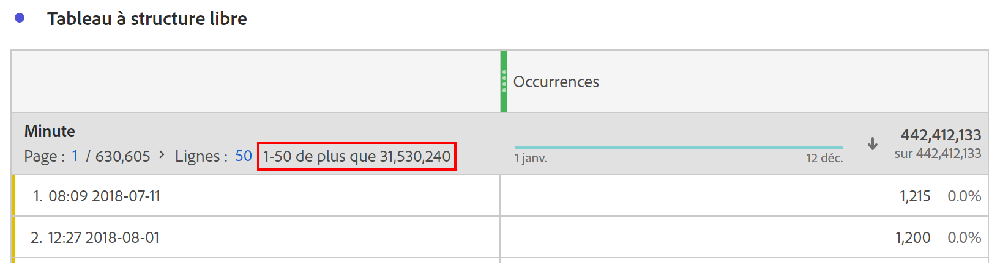

# Dimensions de cardinalité élevée

Lorsque vous utilisez une dimension qui contient de nombreuses valeurs uniques, le rapport qui en résulte peut contenir trop d’éléments de dimension uniques à afficher ou à calculer. Les résultats sont tronqués en supprimant les éléments de dimension jugés les moins importants. Ces optimisations sont effectuées pour maintenir les performances du projet et du produit.

Lorsque vous demandez un rapport contenant une dimension avec trop de valeurs uniques, Analysis Workspace affiche un indicateur dans l’en-tête de la dimension indiquant que tous les éléments de la dimension ne sont pas inclus. Par exemple, **[!UICONTROL Lignes : 1-50 sur plus de 22 343 156]**. Le mot-clé **[!UICONTROL more than]** indique qu’une optimisation a été appliquée au rapport pour renvoyer les éléments de dimension les plus importants.

## Détermination des éléments de dimension à afficher

Customer Journey Analytics traite les rapports au moment de leur exécution et distribue le jeu de données combiné à plusieurs serveurs. La taille de la demande de données et la quantité de matériel Adobe disponible sont deux des nombreux facteurs qui permettent de déterminer le nombre de serveurs affectés au traitement d’un rapport. Dans la mesure où les serveurs sont affectés dynamiquement et non visibles dans l’interface, il n’existe aucun moyen d’afficher ou de contrôler le nombre de serveurs qui traitent un rapport.

Les données par serveur de traitement sont regroupées par ID de personne, ce qui signifie qu’un seul serveur de traitement contient toutes les données pour une personne donnée. Une fois le traitement terminé, un serveur transmet son sous-ensemble de données traitées à un serveur d’agrégation. Tous les sous-ensembles de données traitées sont combinés et renvoyés sous la forme d’un rapport d’espace de travail.

Si un serveur traite des données qui dépassent un seuil unique, il tronque les résultats avant de renvoyer le sous-ensemble de données traité. Les éléments de dimension tronqués sont déterminés en fonction de la mesure utilisée pour le tri.

Si la mesure de tri est une mesure calculée, le serveur utilise les mesures de la mesure calculée pour déterminer les éléments de dimension à tronquer. Les mesures calculées pouvant contenir plusieurs mesures d’importance variable, les résultats peuvent être moins précis. Par exemple, lors du calcul des « Revenus par personne », le montant total des revenus et le nombre total de personnes sont renvoyés et agrégés avant d&#39;effectuer la division. Par conséquent, chaque serveur de traitement individuel choisit les éléments à supprimer sans savoir comment leurs résultats affectent le tri global.

Bien que certains éléments de dimension individuels puissent être absents des rapports à cardinalité élevée, les totaux des colonnes sont précis et ne sont pas basés sur des données tronquées. La fonction de mesure calculée [[!UICONTROL Nombre approximatif d’éléments distincts]](/help/components/calc-metrics/cm-adv-functions.md#approximate-count-distinct) n’est pas non plus affectée par les éléments de dimension tronqués.

## Bonnes pratiques pour les dimensions à cardinalité élevée

La meilleure façon de prendre en charge les dimensions à cardinalité élevée consiste à limiter le nombre d’éléments de dimension traités par un rapport. Tous les rapports étant traités au moment où ils sont demandés, vous pouvez ajuster les paramètres de rapport pour obtenir des résultats immédiats. Adobe recommande l’une des optimisations suivantes pour les dimensions à cardinalité élevée :

* Utilisez un [segment](/help/components/segments/seg-create.md). Les segments s’appliquent au moment où chaque serveur traite un sous-ensemble de données.
* Utilisez une recherche. Les éléments Dimension exclus du terme de recherche sont supprimés des résultats du rapport, ce qui rend plus probable l’affichage des éléments de dimension souhaités.
* Utilisez une dimension du jeu de données de recherche. Les dimensions des jeux de données de recherche combinent les éléments de dimension des jeux de données d’événement, ce qui limite le nombre de valeurs uniques retournées.
* Utilisez le paramètre de composant [Inclure/exclure](/help/data-views/component-settings/include-exclude-values.md) dans le gestionnaire de vues de données.
* Raccourcissez la période de la requête. Si de nombreuses valeurs uniques s’accumulent au fil du temps, le raccourcissement de la période du rapport Workspace peut limiter le nombre de valeurs uniques à traiter par les serveurs.
* Envisagez d’utiliser [Exportation de table complète](/help/analysis-workspace/export/export-cloud.md) pour renvoyer toutes les lignes du tableau.
* Si le nombre de valeurs uniques est le principal objectif, utilisez la fonction de mesure calculée [[!UICONTROL Nombre approximatif d’éléments distincts]](/help/components/calc-metrics/cm-adv-functions.md#approximate-count-distinct).
