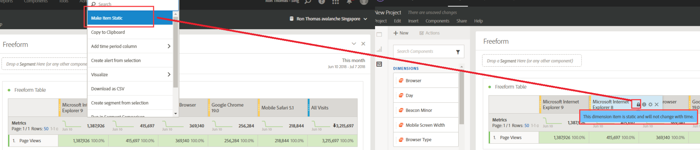

# Aperçu des dimensions

Vous pouvez utiliser les [informations sur le composant](/help/components/use-components-in-workspace.md#component-info) pour un composant afin d’afficher les principaux éléments d’une dimension.

<!--
Now, by default, we show dynamic values instead of static ones, with the option to turn them into static values. Other things to note:

* As your data updates, the dynamic dimension columns will update to show the current 5/15 dimension items.
* A dynamic dimension column that is copied or moved will become static.
* When hovering a static dimension column you will see a lock icon, indicating that the dimension is static.

-->

## Affichage des éléments de dimension

Lorsque vous sélectionnez  pour une dimension dans le panneau Composants, une liste de ses éléments de dimension s’affiche. La liste des éléments de dimension affiche généralement les principaux éléments au cours des 30 derniers jours. Lorsque d’autres éléments sont disponibles, en dehors de la période sélectionnée pour le panneau, sélectionnez le lien pour afficher d’autres éléments. Par exemple, **[!UICONTROL Afficher les éléments du mois dernier]**.

