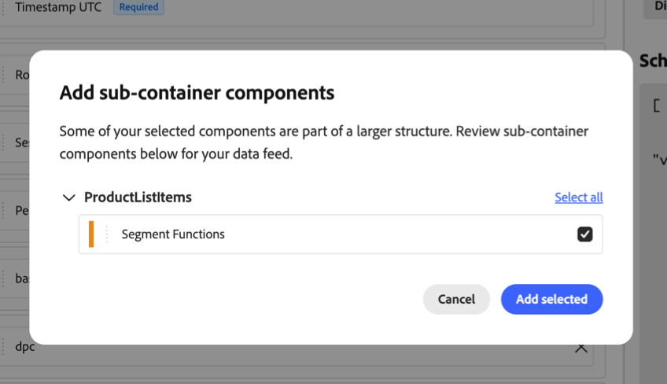

# Composants de sous-conteneur dans les flux de données

{{release-limited-testing}}

Les composants de sous-conteneur sont des dimensions et des mesures basées sur les champs d’un tableau ou d’un mappage dans votre schéma XDM. Ils vous permettent d’analyser les données à un niveau plus granulaire que le niveau de l’événement, comme les produits individuels d’un achat. Pour plus d’informations sur l’utilisation de ces données dans les segments, voir [Sous-événements](/help/components/segments/sub-event.md).

Utilisez les informations suivantes pour comprendre comment les composants de sous-conteneur des champs de tableau et de mappage apparaissent dans vos flux de données Customer Journey Analytics.

## Présentation des composants de sous-conteneur

### Composants de sous-conteneur dans le schéma XDM

Dans le schéma XDM, chaque élément d’un tableau (un tableau de chaîne ou un tableau d’objets) est un sous-conteneur. Chaque entrée d’un champ de mappage est également un sous-conteneur, comme décrit dans la section [Mapper des champs dans les flux de données](#map-fields-in-data-feeds). Les dimensions et les mesures basées sur les champs d’un sous-conteneur sont des composants de sous-conteneur.

Pour afficher les sous-conteneurs dans le schéma XDM dans Adobe Experience Platform, sélectionnez [!UICONTROL **Schémas**], puis développez un événement contenant des sous-conteneurs.

Dans l’exemple suivant, `Product list items` est un tableau d’objets contenant divers composants de sous-conteneur.


### Différences de sous-conteneurs entre Analysis Workspace et les flux de données

Les composants de sous-conteneur sont représentés différemment entre Analysis Workspace et les flux de données dans Customer Journey Analytics.

| Emplacement | Représentation des composants de sous-conteneur |
| --- | --- |
| **Analysis Workspace (dans Customer Journey Analytics)** | Sélectionnable en tant que composants individuels, séparés de toute hiérarchie visible. |
| **Flux de données (dans Customer Journey Analytics)** | Représentés sous la forme d’un groupe, avec leur hiérarchie intacte. |

### Différences de sous-conteneurs entre Adobe Analytics et Customer Journey Analytics

Les données de sous-conteneur (comme plusieurs détails de produit dans un seul événement d’achat) s’affichent différemment dans les flux de données Customer Journey Analytics que dans les flux de données Adobe Analytics. Le tableau suivant compare la manière dont chaque produit représente les données de sous-conteneur.

| Product | Affichage des données de sous-conteneur dans les flux de données | Exemple : liste de produits |
| --- | --- | --- |
| **Adobe Analytics** | Aplati en une chaîne délimitée dans une seule colonne. | Une liste de produits contient plusieurs produits regroupés dans une seule chaîne :<p>`Power Tools;Cordless Drill;1;129.99,Power Tools;Drill Battery Pack;2;39.98` <!--screenshot of what this looks like: product lists, list vars. --></p> |
| **Customer Journey Analytics** | Les composants de sous-conteneur conservent la hiérarchie définie dans votre schéma XDM. Bien que regroupés dans la même colonne, ils affichent leur hiérarchie relationnelle par rapport à leur événement parent et aux sous-conteneurs frères. | Une liste de produits conserve sa hiérarchie définie dans le schéma XDM sous la forme d’un tableau :<p>`[{"category":"Power Tools","product":"Cordless Drill","quantity":1,"revenue":129.99},{"category":"Power Tools","product":"Drill Battery Pack","quantity":2,"revenue":39.98}]` <!--screenshot of what this looks like: product lists, list vars. --></p> |

{style="table-layout:auto"}

### Exemple de sous-conteneur : Produits dans un événement d’achat

Un client achète deux produits en une seule commande : une perceuse sans fil et deux packs de batteries de perceuse. Votre implémentation envoie un seul événement d’achat qui inclut les deux produits dans le tableau d’objets `productListItems` :

```json
{
  "eventType": "commerce.purchases",
  "timestamp": "2026-09-16T14:32:07.512Z",
  "commerce": {
    "purchases": { "value": 1 }
  },
  "productListItems": [
    { "SKU": "CD-2000", "name": "Cordless Drill", "quantity": 1, "priceTotal": 129.99 },
    { "SKU": "BP-2000", "name": "Drill Battery Pack", "quantity": 2, "priceTotal": 39.98 }
  ]
}
```

Cet événement contient deux sous-conteneurs, un pour chaque objet du tableau `productListItems`. Le tableau suivant indique les champs qui appartiennent à l&#39;événement et ceux qui appartiennent à ses sous-conteneurs.

| Niveau | Champs | Description des champs |
| --- | --- | --- |
| **Événement** | `eventType`, `timestamp`, `commerce.purchases.value` | L’achat dans son ensemble. Chaque champ comporte une valeur pour l’événement. La mesure **Commandes** compte `1` pour cet événement, quel que soit le nombre de produits qu’il contient. |
| **Sous-conteneur** | `SKU`, `name`, `quantity`, `priceTotal` dans chaque objet `productListItems` | Un produit individuel dans l’achat. Chaque champ comporte une valeur par produit. Par exemple, `quantity` est `1` pour la perceuse sans fil et `2` pour le bloc-batterie de perceuse. |

{style="table-layout:auto"}

>[!NOTE]
>
>Les sous-conteneurs incluent uniquement les données envoyées avec l’événement. Customer Journey Analytics ne reconstruit pas le contenu du panier à partir d’événements précédents, tels que des ajouts au panier ou des passages en caisse. Pour que les produits apparaissent en tant que sous-conteneurs d’un événement d’achat, votre implémentation doit les inclure dans les `productListItems` de cet événement d’achat.

## Ajouter des composants de sous-conteneur à un flux de données

Lorsque vous ajoutez un composant de sous-conteneur à un flux de données, une boîte de dialogue vous invite à ajouter les autres composants du même sous-conteneur.



Les champs du même sous-conteneur apparaissent sur la zone de travail sous la forme d’un groupe imbriqué réductible plutôt que d’un élément plat.


Ce groupe reflète la structure de données sous-jacente.

Dans la sortie du flux de données, tous ces composants apparaissent sous la forme d’un tableau imbriqué dans une seule colonne.

Pour plus d’informations sur l’ajout de composants, y compris des composants de sous-conteneur, à un flux de données, voir [Création d’un flux de données](/help/components/exports/cja-data-feeds/create-feed.md).

## Requête sur les données de sous-conteneur dans la sortie du flux de données

Comme les données de sous-conteneur [apparaissent différemment dans les flux de données Customer Journey Analytics](#sub-container-differences-between-adobe-analytics-and-customer-journey-analytics), les requêtes que vous utilisez pour ces données diffèrent de celles que vous utilisez pour les flux de données Adobe Analytics.

Les exemples suivants montrent comment rechercher des événements qui incluent un produit spécifique. Les exemples utilisent la syntaxe BigQuery Google. D’autres entrepôts de données, tels que Snowflake et Databricks, prennent en charge la même approche avec des différences de syntaxe mineures.

+++ Requête sur les données de produit dans les flux de données Customer Journey Analytics

Dans les flux de données Customer Journey Analytics, les deux mêmes produits apparaissent sous la forme d’un tableau d’objets dans la colonne `product_list_items`. Aucune analyse du délimiteur n’est requise :

```json
{
  "row_id": "01K3F2M9-...-4821",
  "timestamp_utc": "2026-09-16T14:32:07.512000Z",
  "product_list_items": [
    { "category": "Power Tools", "product": "Cordless Drill", "quantity": 1, "revenue": 129.99,
      "events": {"event1": 1}, "merchandising": {"eVar10": "DrillBundle"} },
    { "category": "Power Tools", "product": "Drill Battery Pack", "quantity": 2, "revenue": 39.98,
      "events": {"event1": 1}, "merchandising": {"eVar10": "DrillBundle"} }
  ]
}
```

Le mode d’écriture de la requête varie selon que vous souhaitez une ligne par événement ou une ligne par produit correspondant.

**Renvoie une ligne par événement**

Pour filtrer les événements sans modifier le nombre de lignes, utilisez `UNNEST` dans une sous-requête `EXISTS` :

```sql
SELECT row_id, timestamp_utc, product_list_items
FROM `project.dataset.cja_data_feed` AS f
WHERE EXISTS (
  SELECT 1
  FROM UNNEST(f.product_list_items) AS item
  WHERE item.product = 'Cordless Drill'
);
```

Cette requête renvoie une ligne pour chaque événement correspondant, avec le tableau `product_list_items` complet intact, quel que soit le nombre de produits dans le tableau qui correspondent.

**Renvoie une ligne par produit correspondant**

Pour renvoyer une ligne pour chaque produit correspondant, déplacez-`UNNEST` dans la clause de `FROM` externe :

```sql
SELECT f.row_id, f.timestamp_utc, item.product, item.quantity, item.revenue
FROM `project.dataset.cja_data_feed` AS f,
     UNNEST(f.product_list_items) AS item
WHERE item.product = 'Cordless Drill';
```

Un événement avec plusieurs produits correspondants s’affiche sur plusieurs lignes et les colonnes de l’événement, telles que `row_id`, se répètent sur chaque ligne. N’utilisez cette approche que lorsque vous avez besoin de détails au niveau du produit. Pour comptabiliser les événements dans les résultats, utilisez `COUNT(DISTINCT row_id)` au lieu de comptabiliser les lignes.

Cette approche s’applique à tout champ de tableau de votre schéma XDM, et pas seulement aux produits.

+++

+++ Requête sur les données de produit dans les flux de données Adobe Analytics

Dans les flux de données Adobe Analytics, un événement avec deux produits achetés ensemble s’affiche sous la forme d’une chaîne délimitée unique dans la colonne `product_list` :

```text
Power Tools;Cordless Drill;1;129.99;event1=1;eVar10=DrillBundle,Power Tools;Drill Battery Pack;2;39.98;event1=1;eVar10=DrillBundle
```

Pour rechercher des événements qui incluent une exploration sans fil, vous analysez cette chaîne avec une expression régulière :

```sql
SELECT hitid_high, hitid_low, post_evar10
FROM aa_hit_data
WHERE REGEXP_CONTAINS(product_list, r'(^|,)[^;]*;Cordless Drill;')
```

+++

## Utilisation des champs de mappage dans les flux de données

Mappez les champs de votre schéma XDM pour stocker les paires clé-valeur. Les flux de données exportent chaque mappage sous la forme d’un tableau d’objets, de la même manière que les autres [données de sous-conteneur](#query-sub-container-data-in-data-feed-output). Chaque objet contient la clé de mappage et sa valeur sous la forme de champs distincts.

Les noms des champs dans la sortie proviennent des identifiants de composant que vous configurez pour le flux de données, et non de noms fixes tels que `key` ou `value`. Les exemples de cette section utilisent des ID de composant d’exemple.

<!-- Confirm with Nate before publishing: how the outer array column is named in the output (for example, `survey_responses`). -->

### Mappages simples

Les mappages simples sont le type de mappage que vous pouvez créer dans votre propre schéma. Chaque clé est une chaîne et chaque valeur est une chaîne ou un entier.

Par exemple, une carte de questionnaire stocke chaque question comme clé et la réponse comme valeur :

```json
{
  "_yourtenant": {
    "surveyResponses": {
      "How did you hear about us?": "Search engine",
      "How likely are you to recommend us?": 9
    }
  }
}
```

Dans la sortie du flux de données, `survey_question` et `survey_answer` sont les identifiants des composants pour la clé et la valeur :

```json
{
  "survey_responses": [
    { "survey_question": "How did you hear about us?", "survey_answer": "Search engine" },
    { "survey_question": "How likely are you to recommend us?", "survey_answer": 9 }
  ]
}
```

### Mappage d’identités

Chaque identité du champ [`identityMap`](https://experienceleague.adobe.com/en/docs/experience-platform/xdm/field-groups/profile/identitymap) est exportée sous la forme d’un seul objet . L’objet contient l’espace de noms d’identité (la clé), ainsi que l’identifiant, l’état authentifié et l’indicateur principal. L’espace de noms se répète pour chaque identité de cet espace de noms.

Seuls les attributs de mappage d’identités qui existent en tant que dimensions dans votre vue de données et que vous ajoutez au flux de données sont exportés.

```json
{
  "identity_map": [
    { "identity_namespace": "ECID", "identity_id": "83290187457380573620940587193016478103", "authenticated_state": "ambiguous", "is_primary": true },
    { "identity_namespace": "CRMID", "identity_id": "C-1048576", "authenticated_state": "authenticated", "is_primary": false }
  ]
}
```

### Mappages imbriqués

Certains champs définis par Adobe, tels que `segmentMembership`, sont des mappages de cartes. Les flux de données aplatissent ces éléments en un seul tableau, avec la clé de premier niveau et la clé de deuxième niveau comme champs distincts dans chaque objet. La clé de premier niveau se répète dans chaque objet auquel elle s’applique, de sorte qu’aucune donnée ou relation n’est perdue.

Par exemple, `segment_namespace` et `segment_id` sont les identifiants des composants pour la clé de premier niveau et la clé de deuxième niveau :

```json
{
  "segment_membership": [
    { "segment_namespace": "ups", "segment_id": "04a81716-43d6-4e7a-a49c-f1d8b3129ba9", "status": "realized" },
    { "segment_namespace": "ups", "segment_id": "53cba6b2-a23b-454a-8069-fc41308f1c0f", "status": "exited" }
  ]
}
```


