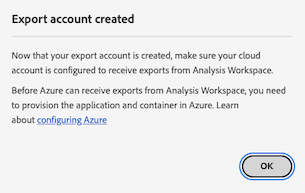

# Configuration des comptes d’exportation cloud

{{release-limited-testing}}

Avant de pouvoir exporter des rapports Customer Journey Analytics vers une destination cloud comme décrit dans [Exportation des rapports des Customer Journey Analytics dans le cloud](/help/analysis-workspace/export/export-cloud.md), vous devez ajouter et configurer la destination vers laquelle les données doivent être envoyées.

Ce processus consiste à ajouter et configurer le compte (par exemple, Amazon S3, Google Cloud Platform, etc.) comme décrit dans cet article, puis à ajouter et configurer l’emplacement dans ce compte (par exemple, un dossier dans le compte) comme décrit dans la section [Configuration des emplacements d’exportation cloud](/help/components/exports/cloud-export-locations.md).

Pour plus d’informations sur la gestion des comptes existants, notamment l’affichage, la modification et la suppression de comptes, voir [Gestion des emplacements et des comptes d’exportation dans le cloud](/help/components/exports/manage-export-locations.md).

## Commencer à créer un compte d’exportation dans le cloud

1. Dans Customer Journey Analytics, sélectionnez [!UICONTROL **Composants**] > [!UICONTROL **Exportations**].
1. Sur le [!UICONTROL Exportations] , sélectionnez [!UICONTROL **Comptes d’emplacement**] .
1. Sélectionner [!UICONTROL **Ajouter un compte**].

   

   La boîte de dialogue Ajouter un compte s’affiche.

1. Dans le [!UICONTROL **Nom du compte d’emplacement**] , indiquez un nom pour le compte d’emplacement. Ce nom apparaît lors de la création d’un emplacement.

1. Dans le [!UICONTROL **Description du compte d’emplacement**] , fournissez une brève description du compte pour l’aider à le différencier des autres comptes du même type de compte.

1. Dans le [!UICONTROL **Type de compte**] , sélectionnez le type de compte cloud vers lequel vous exportez. Les types de compte disponibles sont Amazon S3 Role ARN, Google Cloud Platform, Azure SAS, Azure RBAC, Snowflake et AEP Data Landing Zone.

1. Passez à la section ci-dessous qui correspond au [!UICONTROL **Type de compte**] vous avez sélectionné.

   * [Zone d’entrée des données AEP](#adobe-experience-platform)

   * [Amazon S3 Role ARN](#amazon-s3-role-arn)

   * [Google Cloud Platform](#google-cloud-platform)

   * [SAS Azure](#azure-sas)

   * [RBAC Azure](#azure-rbac)

   * [Snowflake](#snowflake)

### Zone d’entrée des données AEP

>[!IMPORTANT]
>
>Lors de l’exportation de rapports Customer Journey Analytics vers la zone d’entrée des données Adobe Experience Platform, veillez à télécharger les données dans les 7 jours, puis supprimez-les dans la zone d’entrée des données AEP. Au bout de 7 jours, les données sont automatiquement supprimées de la zone d’entrée des données AEP.

1. [Commencer à créer un compte d’exportation dans le cloud](#begin-creating-a-cloud-export-account), comme décrit ci-dessus.

1. Sélectionnez [!UICONTROL **Enregistrer**].

   La variable [!UICONTROL **Compte d’exportation créé**] s’affiche.

   

1. Copiez le contenu de la [!UICONTROL **URI SAS**] dans le presse-papiers. Utilisez cet URI SAS pour accéder aux données exportées depuis Analysis Workspace à partir de la zone d’entrée AEP.

1. Sélectionner [!UICONTROL **OK**].

1. Passez à la [Configuration des emplacements d’exportation cloud](/help/components/exports/cloud-export-locations.md).

### Amazon S3 Role ARN

1. [Commencer à créer un compte d’exportation dans le cloud](#begin-creating-a-cloud-export-account), comme décrit ci-dessus.

1. Dans le [!UICONTROL **Propriétés du compte**] de la [!UICONTROL **Ajouter un compte**] , spécifiez les informations suivantes :

   | Champ | Fonction |
   |---------|----------|
   | [!UICONTROL **ARN du rôle**] | Vous devez fournir un Rôle ARN (nom de ressource Amazon) que l’Adobe peut utiliser pour accéder au compte Amazon S3. Pour ce faire, vous créez une stratégie d’autorisation IAM pour le compte source, vous la joignez à un utilisateur, puis vous créez un rôle pour le compte de destination. Pour plus d’informations, voir [cette documentation AWS](https://aws.amazon.com/premiumsupport/knowledge-center/cross-account-access-iam/). |

   {style="table-layout:auto"}

1. Sélectionnez [!UICONTROL **Enregistrer**].

   La variable [!UICONTROL **Compte d’exportation créé**] s’affiche.

   

1. Copiez le contenu de la [!UICONTROL **Informations sur l’utilisateur**] dans le presse-papiers. Le User ARN (nom de ressource Amazon) est fourni par Adobe. Vous devez associer cet utilisateur à la stratégie que vous avez créée dans l’outil d’apprentissage des rôles Amazon S3.

1. Sélectionner [!UICONTROL **OK**].

1. Passez à la [Configuration des emplacements d’exportation cloud](/help/components/exports/cloud-export-locations.md).

### Google Cloud Platform

1. [Commencer à créer un compte d’exportation dans le cloud](#begin-creating-a-cloud-export-account), comme décrit ci-dessus.

1. Dans le [!UICONTROL **Propriétés du compte**] de la [!UICONTROL **Ajouter un compte**] , spécifiez les informations suivantes :

   | Champ | Fonction |
   |---------|----------|
   | [!UICONTROL **Identifiant du projet**] | Identifiant de projet Google Cloud que vous copiez depuis votre compte Google Cloud. Voir [Documentation de Google Cloud sur l’obtention d’un ID de projet](https://cloud.google.com/resource-manager/docs/creating-managing-projects#identifying_projects). |

   {style="table-layout:auto"}

1. Sélectionnez [!UICONTROL **Enregistrer**].

   La variable [!UICONTROL **Compte d’exportation créé**] s’affiche.

   

1. Copiez le contenu de la [!UICONTROL **Principal**] dans le presse-papiers, puis assurez-vous que vous accordez l’autorisation à l’entité de sécurité de charger des fichiers dans ce compartiment dans Google Cloud Platform. <!-- add link to Google Cloud docs on how to do this -->

1. Sélectionner [!UICONTROL **OK**].

1. Passez à la [Configuration des emplacements d’exportation cloud](/help/components/exports/cloud-export-locations.md).

### SAS Azure

1. [Commencer à créer un compte d’exportation dans le cloud](#begin-creating-a-cloud-export-account), comme décrit ci-dessus.

1. Dans le [!UICONTROL **Propriétés du compte**] de la [!UICONTROL **Ajouter un compte**] , spécifiez les informations suivantes :

   | Champ | Fonction |
   |---------|----------|
   | [!UICONTROL **ID d’application**] | Copiez cet identifiant de l’application Azure que vous avez créée. Dans Microsoft Azure, ces informations sont situées sur la page **Présentation** dans votre application. Pour plus d’informations, voir [Documentation Microsoft Azure sur la façon d’enregistrer une application avec la plateforme d’identité Microsoft](https://learn.microsoft.com/en-us/azure/active-directory/develop/quickstart-register-app). |
   | [!UICONTROL **ID de cliente ou client**] | Copiez cet identifiant de l’application Azure que vous avez créée. Dans Microsoft Azure, ces informations sont situées sur la page **Présentation** dans votre application. Pour plus d’informations, voir [Documentation Microsoft Azure sur la façon d’enregistrer une application avec la plateforme d’identité Microsoft](https://learn.microsoft.com/en-us/azure/active-directory/develop/quickstart-register-app). |
   | [!UICONTROL **URI du coffre de clés**] | <p>Chemin d’accès au jeton SAS dans Azure Key Vault.  Pour configurer Azure SAS, vous devez stocker un jeton SAS en tant que secret à l’aide du Key Vault Azure. Pour plus d’informations, voir [Documentation de Microsoft Azure sur la définition et la récupération d’un secret à partir d’Azure Key Vault](https://learn.microsoft.com/en-us/azure/key-vault/secrets/quick-create-portal?source=recommendations).</p><p>Une fois l’URI de coffre-fort de clé créé, ajoutez une stratégie d’accès à Key Vault afin d’accorder l’autorisation sur l’application Azure que vous avez créée. Pour plus d’informations, voir [Documentation de Microsoft Azure sur l’affectation d’une stratégie d’accès Key Vault](https://learn.microsoft.com/en-us/azure/key-vault/general/assign-access-policy?tabs=azure-portal).</p> |
   | [!UICONTROL **Nom secret du coffre de clés**] | Le nom du secret que vous avez créé lors de l’ajout du secret au Key Vault Azure. Dans Microsoft Azure, ces informations se trouvent dans le Key Vault que vous avez créé, sur la page **Key Vault** des pages de paramètres. Pour plus d’informations, voir [Documentation de Microsoft Azure sur la définition et la récupération d’un secret à partir d’Azure Key Vault](https://learn.microsoft.com/en-us/azure/key-vault/secrets/quick-create-portal?source=recommendations). |
   | [!UICONTROL **Clé du compte d’emplacement**] <!-- nothing for us to have them do on the second screen. Just need to permission the container if they haven't --> | Copiez le secret de l’application Azure que vous avez créée. Dans Microsoft Azure, ces informations sont situées sur la page **Certificats et secrets** dans votre application. Pour plus d’informations, voir [Documentation Microsoft Azure sur la façon d’enregistrer une application avec la plateforme d’identité Microsoft](https://learn.microsoft.com/en-us/azure/active-directory/develop/quickstart-register-app). <!-- need to grant permission to the bucket. Jun will send info on where that is documented) --> |

   {style="table-layout:auto"}

1. Sélectionnez [!UICONTROL **Enregistrer**].

   La variable [!UICONTROL **Compte d’exportation créé**] s’affiche.

   

1. Si ce n’est déjà fait, assurez-vous d’accorder des autorisations au compartiment dans Azure SAS. <!-- add link to Google Cloud docs on how to do this -->

1. Sélectionner [!UICONTROL **OK**].

1. Passez à la [Configuration des emplacements d’exportation cloud](/help/components/exports/cloud-export-locations.md).

### RBAC Azure

1. [Commencer à créer un compte d’exportation dans le cloud](#begin-creating-a-cloud-export-account), comme décrit ci-dessus.

1. Dans le [!UICONTROL **Propriétés du compte**] de la [!UICONTROL **Ajouter un compte**] , spécifiez les informations suivantes :

   | Champ | Fonction |
   |---------|----------|
   | [!UICONTROL **ID d’application**] | Copiez cet identifiant de l’application Azure que vous avez créée. Dans Microsoft Azure, ces informations sont situées sur la page **Présentation** dans votre application. Pour plus d’informations, voir [Documentation Microsoft Azure sur la façon d’enregistrer une application avec la plateforme d’identité Microsoft](https://learn.microsoft.com/en-us/azure/active-directory/develop/quickstart-register-app). |
   | [!UICONTROL **ID de cliente ou client**] | Copiez cet identifiant de l’application Azure que vous avez créée. Dans Microsoft Azure, ces informations sont situées sur la page **Présentation** dans votre application. Pour plus d’informations, voir [Documentation Microsoft Azure sur la façon d’enregistrer une application avec la plateforme d’identité Microsoft](https://learn.microsoft.com/en-us/azure/active-directory/develop/quickstart-register-app). |
   | [!UICONTROL **Clé du compte d’emplacement**] | Copiez le secret de l’application Azure que vous avez créée. Dans Microsoft Azure, ces informations sont situées sur la page **Certificats et secrets** dans votre application. Pour plus d’informations, voir [Documentation Microsoft Azure sur la façon d’enregistrer une application avec la plateforme d’identité Microsoft](https://learn.microsoft.com/en-us/azure/active-directory/develop/quickstart-register-app). |

   {style="table-layout:auto"}

1. Sélectionnez [!UICONTROL **Enregistrer**].

   La variable [!UICONTROL **Compte d’exportation créé**] s’affiche.

   

1. Si ce n’est déjà fait, assurez-vous d’accorder des autorisations au compartiment dans Azure RBAC. <!-- add link to Google Cloud docs on how to do this -->

1. Sélectionner [!UICONTROL **OK**].

1. Passez à la [Configuration des emplacements d’exportation cloud](/help/components/exports/cloud-export-locations.md).

### Snowflake

1. [Commencer à créer un compte d’exportation dans le cloud](#begin-creating-a-cloud-export-account), comme décrit ci-dessus.

1. Dans le [!UICONTROL **Propriétés du compte**] de la [!UICONTROL **Ajouter un compte**] , spécifiez les informations suivantes :

   | Champ | Fonction |
   |---------|----------|
   | [!UICONTROL **Identifiant du compte**] | Identifie de manière unique un compte de Snowflake au sein de votre organisation, ainsi que dans le réseau global de plateformes cloud et de régions cloud prises en charge par les Snowflake. <p>Vous devez obtenir l’identifiant de compte à partir de votre compte de Snowflake, puis coller les informations ici.</p><p>Pour savoir où obtenir ces informations, reportez-vous au [Page Identifiants de compte dans la documentation du Snowflake](https://docs.snowflake.com/en/user-guide/admin-account-identifier).</p> |
   | [!UICONTROL **Utilisateur**] | Nom de connexion de l’utilisateur qui sera utilisé pour la connexion. Nous vous recommandons de créer un nouvel utilisateur qui sera utilisé spécifiquement pour Adobe. Indiquez le nom ici, puis créez un utilisateur portant le même nom dans Snowflake. Vous pouvez créer un utilisateur dans Snowflake à l’aide de la variable `CREATE USER` .  <p>Pour plus d’informations, voir [Commandes d’utilisateur, de rôle et de privilège](https://docs.snowflake.com/en/sql-reference/commands-user-role).</p> |
   | [!UICONTROL **Rôle**] | Rôle qui sera attribué à l’utilisateur. Nous vous recommandons de créer un nouveau rôle qui sera utilisé spécifiquement pour l’Adobe. Indiquez le rôle ici, puis créez un rôle dans Snowflake portant le même nom et attribuez-le à l’utilisateur. Vous pouvez créer un rôle dans Snowflake à l’aide du `CREATE ROLE` . <p>Pour plus d’informations, voir [Commandes d’utilisateur, de rôle et de privilège](https://docs.snowflake.com/en/sql-reference/commands-user-role).</p> |

   {style="table-layout:auto"}

1. Sélectionnez [!UICONTROL **Enregistrer**].

   La variable [!UICONTROL **Compte d’exportation créé**] s’affiche.

   

1. Copiez le contenu de la [!UICONTROL **Clé publique**] dans le presse-papiers. La Clé publique est fournie par Adobe.

   Utilisez la clé publique de Snowflake pour vous connecter à votre compte de Snowflake. Vous devez associer l’utilisateur que vous avez créé à cette clé publique.

   Par exemple, en Snowflake, spécifiez la commande suivante :

   ```
   CREATE USER <your_adobe_user> RSA_PUBLIC_KEY = '<your_public_key>';
   ```

   Pour plus d’informations, voir [Authentification des paires de clés et rotation des paires de clés dans la documentation du Snowflake](https://docs.snowflake.com/en/user-guide/key-pair-auth).

1. Sélectionner [!UICONTROL **OK**].

1. Passez à la [Configuration des emplacements d’exportation cloud](/help/components/exports/cloud-export-locations.md).
