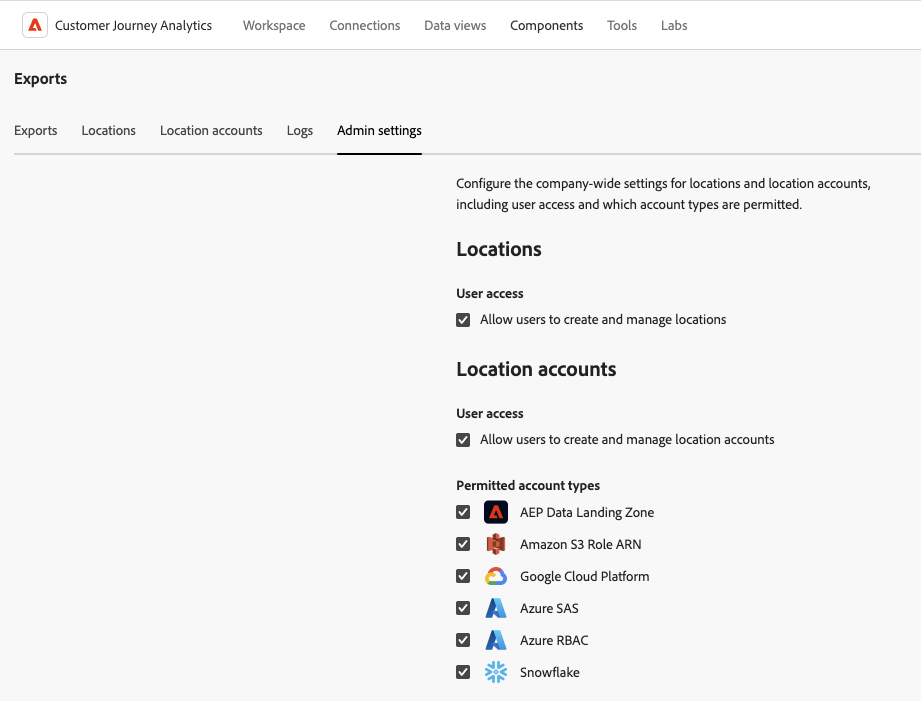

# Gestion des emplacements et des comptes d’exportation cloud

Vous pouvez afficher, modifier et supprimer des emplacements d’exportation dans le cloud.

Pour plus d’informations sur la création d’un emplacement, voir [Configuration des emplacements d’exportation dans le cloud](/help/components/exports/cloud-export-locations.md).

## Filtrer et rechercher des emplacements

Pour trouver les informations dont vous avez besoin, vous pouvez soit filtrer sur la liste des emplacements, soit rechercher un emplacement.

### Filtrer la liste des emplacements

1. Dans Customer Journey Analytics, sélectionnez [!UICONTROL **Composants**] > [!UICONTROL **Exports**].

1. Sélectionnez l’onglet [!UICONTROL **Emplacements**].

1. Sélectionnez l’icône **Filtrer**.

   <!-- add screenshot -->

   Vous pouvez filtrer selon les critères suivants :

   | Filtre | Description |
   |---------|----------|
   | [!UICONTROL **Type d’emplacement**]<!--should this be changed to Account type?--> | Type de compte auquel l’emplacement est associé. Les types de compte suivants peuvent être disponibles : <ul><li>[!UICONTROL **Zone de destination des données AEP**]</li><li>[!UICONTROL **Amazon S3 Role ARN**]</li><li>[!UICONTROL **Azure SAS**]</li><li>[!UICONTROL **RBAC Azure**]</li><li>[!UICONTROL **Google Cloud Platform**]</li><li>[!UICONTROL **Snowflake**]</li></ul> |
   | [!UICONTROL **Compte**] | Nom du compte auquel l’emplacement est associé. |
   | [!UICONTROL **Créé par**] | Adresse e-mail de l’utilisateur qui a créé l’emplacement. |

   {style="table-layout:auto"}

### Rechercher des emplacements

1. Dans Customer Journey Analytics, sélectionnez [!UICONTROL **Composants**] > [!UICONTROL **Exports**].

1. Sélectionnez l’onglet [!UICONTROL **Emplacements**].

1. (Conditionnel) Si vous êtes un administrateur système, vous pouvez activer l’option [!UICONTROL **Afficher les emplacements pour tous les utilisateurs**] pour afficher les emplacements créés par tous les utilisateurs de votre organisation.

1. Dans le champ de recherche, commencez à saisir toutes les informations associées à l’emplacement que vous recherchez. Vous pouvez rechercher des données à partir de n’importe quelle colonne disponible dans le tableau.

## Modifier les emplacements

Un emplacement ne peut être modifié que par l’utilisateur qui l’a créé ou par un administrateur système.

Pour modifier un emplacement :

1. Dans Customer Journey Analytics, sélectionnez [!UICONTROL **Composants**] > [!UICONTROL **Exports**].

1. Sélectionnez l’onglet [!UICONTROL **Emplacements**].

1. (Conditionnel) Si vous êtes un administrateur système, vous pouvez activer l’option [!UICONTROL **Afficher les emplacements pour tous les utilisateurs**] pour afficher les emplacements créés par tous les utilisateurs de votre organisation.

1. Sélectionnez l’emplacement à modifier.

   

1. Sélectionnez [!UICONTROL **Modifier**].

1. Apportez les modifications souhaitées, puis sélectionnez [!UICONTROL **Enregistrer**].

## Supprimer des emplacements

Si vous supprimez un emplacement, toutes les exportations qui utilisent l’emplacement sont également supprimées. Vérifiez la boîte de dialogue de confirmation lors de la suppression pour vous assurer qu’aucune exportation n’est associée à l’emplacement.

Pour supprimer un emplacement :

1. Dans Customer Journey Analytics, sélectionnez [!UICONTROL **Composants**] > [!UICONTROL **Exports**].

1. Sélectionnez l’onglet [!UICONTROL **Emplacements**].

1. (Conditionnel) Si vous êtes un administrateur système, vous pouvez activer l’option [!UICONTROL **Afficher les emplacements pour tous les utilisateurs**] pour afficher les emplacements créés par tous les utilisateurs de votre organisation.

1. Sélectionnez un ou plusieurs emplacements à supprimer.

   

1. Sélectionnez [!UICONTROL **Supprimer**].

   La boîte de dialogue Supprimer l’emplacement s’affiche.

1. Dans la boîte de dialogue Supprimer l’emplacement , assurez-vous que l’emplacement n’est associé à aucune exportation avant de confirmer la suppression.

   

1. Sélectionnez à nouveau [!UICONTROL **Supprimer**] pour confirmer.

## Modifier les comptes

Un compte ne peut être modifié que par l’utilisateur qui l’a créé ou par un administrateur système.

Pour modifier un compte :

1. Dans Customer Journey Analytics, sélectionnez [!UICONTROL **Composants**] > [!UICONTROL **Exports**].

1. Sélectionnez l’onglet [!UICONTROL **Comptes d’emplacement**].

   

1. (Conditionnel) Si vous êtes un administrateur système, vous pouvez activer l’option [!UICONTROL **Afficher les comptes de tous les utilisateurs**] pour afficher les emplacements créés par tous les utilisateurs de votre organisation.

1. Sélectionnez [!UICONTROL **Afficher les détails**] sur le compte que vous souhaitez modifier.

1. Apportez les modifications souhaitées, puis sélectionnez [!UICONTROL **Enregistrer**].

## Afficher les clés de compte

Après avoir créé un compte, vous pouvez afficher toutes les clés de compte associées à ce compte. Vous devrez peut-être consulter ces informations si vous n’avez pas terminé la configuration du compte avec votre fournisseur de cloud [lors de la configuration initiale du compte](/help/components/exports/cloud-export-accounts.md).

Pour afficher les clés associées à un compte d’exportation :

1. Dans Customer Journey Analytics, sélectionnez [!UICONTROL **Composants**] > [!UICONTROL **Exports**].

1. Sélectionnez l’onglet [!UICONTROL **Comptes d’emplacement**].

   

1. (Conditionnel) Si vous êtes un administrateur système, vous pouvez activer l’option [!UICONTROL **Afficher les comptes de tous les utilisateurs**] pour afficher les emplacements créés par tous les utilisateurs de votre organisation.

1. Sélectionnez l’icône en forme de 3 points sur le compte à modifier, puis sélectionnez [!UICONTROL **Clés du compte**].

## Supprimer des comptes

1. Dans Customer Journey Analytics, sélectionnez [!UICONTROL **Composants**] > [!UICONTROL **Exports**].

1. Sélectionnez l’onglet [!UICONTROL **Comptes d’emplacement**].

   

1. (Conditionnel) Si vous êtes un administrateur système, vous pouvez activer l’option [!UICONTROL **Afficher les comptes de tous les utilisateurs**] pour afficher les emplacements créés par tous les utilisateurs de votre organisation.

1. Sélectionnez l’icône en forme de 3 points sur le compte à modifier, puis sélectionnez [!UICONTROL **Supprimer le compte**].

1. Sélectionnez à nouveau [!UICONTROL **Supprimer**] dans la boîte de dialogue de confirmation.

## Configurer les paramètres à l’échelle de l’entreprise (administrateurs uniquement)

Les administrateurs système peuvent empêcher les utilisateurs de créer des comptes et des emplacements, ou ils peuvent limiter les types de comptes que les utilisateurs peuvent créer et utiliser.

### Configurer si les utilisateurs peuvent créer et modifier des comptes

Par défaut, tous les utilisateurs de l’organisation peuvent créer des comptes et modifier les comptes qu’ils créent dans votre environnement Customer Journey Analytics, comme décrit dans la section [configuration des comptes d’exportation dans le cloud](/help/components/exports/cloud-export-accounts.md).

Vous pouvez empêcher des utilisateurs de créer des comptes. Dans ce cas, les utilisateurs peuvent toujours utiliser les comptes qu’ils ont déjà créés, mais ils ne peuvent plus les modifier. Vous pouvez supprimer les comptes créés par les utilisateurs, comme décrit dans la section [Supprimer un compte](#delete-an-account).

Pour empêcher tous les utilisateurs de créer et de modifier des comptes :

1. Dans Customer Journey Analytics, sélectionnez **[!UICONTROL Composants]** > **[!UICONTROL Exports]**, puis sélectionnez l’onglet [!UICONTROL **Paramètres d’administration**].

1. Dans la section [!UICONTROL **Comptes d’emplacement**], désélectionnez l’option [!UICONTROL **Autoriser les utilisateurs à créer et gérer des comptes d’emplacement**].

1. Sélectionnez [!UICONTROL **Enregistrer**].

1. (Facultatif) Supprimez les comptes que les utilisateurs ont créés et que vous ne souhaitez plus qu’ils utilisent, comme décrit dans la section [Supprimer un compte](#delete-an-account).

### Configurer si les utilisateurs peuvent créer et modifier des emplacements

Par défaut, tous les utilisateurs de l’organisation peuvent créer des emplacements et modifier les emplacements qu’ils créent dans votre environnement Customer Journey Analytics, comme décrit dans la section [configurer des emplacements d’exportation dans le cloud](/help/components/exports/cloud-export-locations.md).

Vous pouvez empêcher les utilisateurs de créer des emplacements. Dans ce cas, les utilisateurs peuvent toujours utiliser les emplacements qu’ils ont déjà créés, mais ils ne peuvent plus les modifier. Vous pouvez supprimer les emplacements créés par les utilisateurs, comme décrit dans la section [Supprimer des emplacements](#delete-a-location).

Pour empêcher tous les utilisateurs de créer et de modifier des emplacements :

1. Dans Customer Journey Analytics, sélectionnez **[!UICONTROL Composants]** > **[!UICONTROL Exports]**, puis sélectionnez l’onglet [!UICONTROL **Paramètres d’administration**].

1. Dans la section [!UICONTROL **Emplacements**], désélectionnez l’option [!UICONTROL **Autoriser les utilisateurs à créer et gérer des emplacements**].

1. Sélectionnez [!UICONTROL **Enregistrer**].

1. (Facultatif) Supprimez les emplacements créés par les utilisateurs et que vous ne souhaitez plus que ceux-ci utilisent, comme décrit dans la section [Supprimer un emplacement](#delete-a-location).

### Limiter les types de comptes que les utilisateurs peuvent créer et utiliser

Vous pouvez limiter les types de compte que voient les utilisateurs dans les cas suivants :

* Lors de la [création de nouveaux comptes](/help/components/exports/cloud-export-accounts.md).
* Lors du choix des comptes à utiliser lors de l’exportation de fichiers à l’aide de [exportation de table complète](/help/analysis-workspace/export/export-cloud.md).

Lorsque vous limitez des types de compte, comme décrit dans cette section, les comptes du type que vous limitez ne sont plus visibles par les utilisateurs. Cela signifie que les nouveaux comptes de ce type ne peuvent pas être créés et que les comptes existants de ce type ne peuvent pas être utilisés lors de l’exportation de fichiers à l’aide de l’exportation de table complète.

Toutefois, les comptes existants configurés pour des exportations planifiées doivent être supprimés si vous souhaitez empêcher leur utilisation.

#### Vérifiez que les comptes ne sont pas utilisés pour les exportations planifiées

Lorsque vous limitez des types de compte, les comptes existants sont masqués et non supprimés.

Si les plannings sont déjà configurés pour envoyer des données à un compte du type que vous limitez, les plannings continueront à s’exécuter même après la limitation du type de compte et les données continueront à être envoyées au compte. Par exemple, si une exportation de table complète est planifiée pour envoyer des données à un type de compte que vous limitez, la planification continuera à s’exécuter.

Si vous devez vous assurer que des comptes d’un certain type ne sont pas utilisés dans les exportations planifiées, vous pouvez supprimer les comptes avant de [limiter les types de comptes](#limit-the-account-types-that-are-available-to-users).

Pour supprimer des comptes :

1. Recherchez les comptes du type de compte que vous prévoyez de limiter et qui sont utilisés pour les exportations planifiées.

1. Supprimez les comptes, comme décrit dans la section [Supprimer un compte](#delete-an-account).

1. Passez à la section suivante, [Limitation des types de comptes disponibles pour les utilisateurs](#limit-the-account-types-that-are-available-to-users).

#### Limiter les types de compte disponibles pour les utilisateurs

Pour limiter les types de compte disponibles pour les utilisateurs lors de la création et de l’utilisation de comptes :

1. Dans Customer Journey Analytics, sélectionnez **[!UICONTROL Composants]** > **[!UICONTROL Exports]**, puis sélectionnez l’onglet [!UICONTROL **Paramètres d’administration**].

1. Recherchez la section [!UICONTROL **Types de compte autorisés**].

   Par défaut, les types de compte suivants sont disponibles pour les utilisateurs. Désélectionnez l’un des types de compte que vous souhaitez empêcher les utilisateurs d’utiliser.

   * [!UICONTROL **Zone de destination des données AEP**]

   * [!UICONTROL **Amazon S3 Role ARN**]

   * [!UICONTROL **Google Cloud Platform**]

   * [!UICONTROL **Azure SAS**]

   * [!UICONTROL **RBAC Azure**]

   * [!UICONTROL **Snowflake**]

1. Sélectionnez [!UICONTROL **Enregistrer**].
