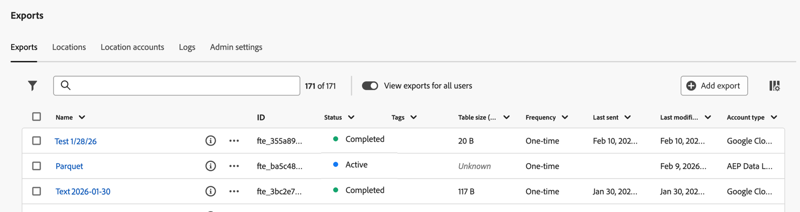

# Gérer des exports

Après avoir exporté une table complète comme décrit dans [Exporter des rapports Customer Journey Analytics vers le cloud](/help/analysis-workspace/export/export-cloud.md), les exportations sont disponibles dans l’onglet [!UICONTROL Exports] de la page [!UICONTROL Exports].

Seules les exportations que vous créez s’affichent. Les administrateurs peuvent visualiser toutes les exportations en activant l’option **[!UICONTROL Afficher les exportations pour tous les utilisateurs]**.

## Filtrer et rechercher des exportations

Pour trouver les informations dont vous avez besoin, vous pouvez filtrer la liste des exportations ou rechercher une exportation.

### Filtrer la liste des exports

1. Dans Customer Journey Analytics, sélectionnez [!UICONTROL **Composants**] > [!UICONTROL **Exports**].

1. Sélectionnez l’onglet [!UICONTROL **Exports**].

   

1. Sélectionnez l’icône **Filtrer** .

   Vous pouvez filtrer selon les critères suivants :

   | Filtre | Description |
   |---------|----------|
   | [!UICONTROL **Type de compte**] | Type de compte auquel l’exportation est associée. Les types de compte disponibles sont les suivants : <ul><li>[!UICONTROL **Zone de destination des données AEP**]</li><li>[!UICONTROL **Amazon S3 Role ARN**]</li><li>[!UICONTROL **Azure SAS**]</li><li>[!UICONTROL **RBAC Azure**]</li><li>[!UICONTROL **Google Cloud Platform**]</li><li>[!UICONTROL **Snowflake**]</li></ul>. |
   | [!UICONTROL **Statut**] | Statut de l’exportation. Les statuts suivants sont disponibles : <ul><li>[!UICONTROL **Actif**] : indique qu’une exportation planifiée n’a pas encore expiré ou qu’une exportation ponctuelle n’est pas encore terminée. </li><li>[!UICONTROL **Terminé**] : indique qu’une exportation a été effectuée avec succès. Pour les exportations planifiées, cela indique que le planning a expiré.</li><li>[!UICONTROL **Échec**]
Les situations suivantes peuvent entraîner l’échec d’une exportation. Passez la souris sur le statut [!UICONTROL **Échec**] pour afficher les détails de l’échec. <ul><li>Expiration de l’exportation planifiée</li><li>Limite de lignes atteinte pour l’exportation planifiée </li></ul><li>[!UICONTROL **Expiré**] : indique que l’exportation a expiré.</li></ul> |
   | [!UICONTROL **Créé par**] | L’utilisateur qui a créé l’exportation.
Cette option est disponible uniquement pour les administrateurs lorsque l’option **[!UICONTROL Afficher les exportations pour tous les utilisateurs]** est activée. |
   | [!UICONTROL **Fréquence**] | Fréquence d’exportation. Les fréquences disponibles sont les suivantes : <ul><li>[!UICONTROL **Une fois**]</li><li>[!UICONTROL **Quotidien**]</li><li>[!UICONTROL **Hebdomadaire**]</li><li>[!UICONTROL **Mensuel**]</li><li>[!UICONTROL **Annuel**]</li></ul> |

   {style="table-layout:auto"}

### Rechercher des exports

1. Dans Customer Journey Analytics, sélectionnez [!UICONTROL **Composants**] > [!UICONTROL **Exports**].

1. Sélectionnez l’onglet [!UICONTROL **Exports**].

   

1. Dans le champ de recherche, commencez à saisir toutes les informations associées à l’exportation que vous recherchez. Vous pouvez rechercher des données à partir de n’importe quelle colonne disponible dans le tableau.

## Modification d’un export

Vous pouvez modifier les propriétés, le format, la planification et les informations d’emplacement d’une exportation.

1. Dans Customer Journey Analytics, sélectionnez [!UICONTROL **Composants**] > [!UICONTROL **Exports**].

1. Sous l’onglet [!UICONTROL **Exports**], cochez la case en regard de l’exportation que vous souhaitez modifier.

   Cette option n’est pas disponible lors de la sélection de plusieurs exportations.

1. Sélectionnez [!UICONTROL **Modifier**].

   La boîte de dialogue [!UICONTROL **Exporter le tableau complet**] s’affiche.

1. Mettez à jour l’une des options disponibles. Pour plus d’informations sur chaque option, voir [ Exporter des tables complètes depuis Analysis Workspace ](/help/analysis-workspace/export/export-cloud.md#export-full-tables) dans [ Exporter des rapports Customer Journey Analytics vers le cloud](/help/analysis-workspace/export/export-cloud.md).

## Renouveler une exportation

Vous pouvez renouveler une ou plusieurs exportations planifiées avant ou après leur expiration. Les exportations sont renouvelées pour 1 an à compter de la date de leur renouvellement.

1. Dans Customer Journey Analytics, sélectionnez [!UICONTROL **Composants**] > [!UICONTROL **Exports**].

1. Dans l’onglet [!UICONTROL **Exports**], cochez la case en regard d’un ou de plusieurs exports que vous souhaitez renouveler.

1. Sélectionnez [!UICONTROL **Renouveler**].

   La boîte de dialogue [!UICONTROL **Exporter le tableau complet**] s’affiche. <!--check process from here. -->

1. Mettez à jour l’une des options disponibles. Pour plus d’informations sur chaque option, voir [ Exporter des tables complètes depuis Analysis Workspace ](/help/analysis-workspace/export/export-cloud.md#export-full-tables) dans [ Exporter des rapports Customer Journey Analytics vers le cloud](/help/analysis-workspace/export/export-cloud.md).

## Dupliquer une exportation

Vous pouvez dupliquer une exportation existante.

1. Dans Customer Journey Analytics, sélectionnez [!UICONTROL **Composants**] > [!UICONTROL **Exports**].

1. Dans l’onglet [!UICONTROL **Exports**], cochez la case en regard de l’exportation à dupliquer.

   Cette option n’est pas disponible lors de la sélection de plusieurs exportations.

1. Sélectionnez [!UICONTROL **Dupliquer**].

   Un duplicata de l’exportation est créé. Le nom de la nouvelle exportation correspond au nom de l’exportation d’origine, avec _[!UICONTROL - Copie]_ ajouté au nom du fichier.

1. (Facultatif) [Modifiez la nouvelle exportation](#edit-an-export), y compris le nom du fichier et toute autre propriété que vous souhaitez modifier.

## Lancement manuel d’une exportation

Vous pouvez lancer manuellement une exportation, soit pour une exportation planifiée, soit pour une exportation ponctuelle qui s’est précédemment terminée.

1. Dans Customer Journey Analytics, sélectionnez [!UICONTROL **Composants**] > [!UICONTROL **Exports**].

1. Dans l’onglet [!UICONTROL **Exports**], cochez la case en regard de l’exportation à exécuter.

   Cette option n’est pas disponible lors de la sélection de plusieurs exportations.

1. Sélectionnez [!UICONTROL **Exporter maintenant**].

## Balisage d’une exportation

Lorsque vous appliquez des balises à une exportation, vous pouvez les afficher dans la colonne [!UICONTROL Balises] de la page [!UICONTROL Exports]. Voir [Configurer les colonnes](#configure-columns-on-the-exports-page) pour plus d’informations.

1. Dans Customer Journey Analytics, sélectionnez [!UICONTROL **Composants**] > [!UICONTROL **Exports**].

1. Dans l’onglet [!UICONTROL **Exports**], cochez la case en regard d’une ou de plusieurs exportations à baliser.

1. Sélectionnez [!UICONTROL **Modifier les balises**].

1. Dans la boîte de dialogue [!UICONTROL **Exportation de balises**], saisissez le nom d’une balise pour créer une balise, ou choisissez une balise existante dans le menu déroulant.

   Toutes les balises communes aux exportations sélectionnées s’affichent dans la boîte de dialogue des balises.

1. Sélectionnez [!UICONTROL **Appliquer des balises**].

## Suppression d’un export

Vous pouvez supprimer des exports à partir de la page Exports . La suppression d’un export le supprime de la page des exports. Les exportations planifiées qui sont supprimées sont annulées et ne sont plus envoyées.

1. Dans Customer Journey Analytics, sélectionnez [!UICONTROL **Composants**] > [!UICONTROL **Exports**].

1. Dans l’onglet [!UICONTROL **Exports**], cochez la case en regard d’une ou de plusieurs exportations à supprimer.

1. Sélectionnez [!UICONTROL **Supprimer**], puis sélectionnez [!UICONTROL **Supprimer**] lorsque le message de confirmation s’affiche.

## Configurer les colonnes de la page [!UICONTROL Exports]

Vous pouvez ajouter ou supprimer des colonnes sur l’onglet [!UICONTROL Exports] pour configurer les informations affichées.

Sélectionnez un en-tête de colonne pour trier les exportations en fonction de cette colonne. Par défaut, les exportations sont triées en fonction de la date et de l’heure de la dernière modification de l’exportation.

1. Dans Customer Journey Analytics, sélectionnez [!UICONTROL **Composants**] > [!UICONTROL **Exports**].

1. Dans l’onglet [!UICONTROL **Exports**], sélectionnez l’icône **Personnaliser le tableau**  dans le coin supérieur droit de la page [!UICONTROL Exports].

   Les colonnes suivantes sont disponibles :

   | Colonne disponible | Description |
   |---------|----------|
   | Nom | Nom de l’exportation. Les utilisateurs nomment les exports au moment de leur création, comme décrit dans la section [Exporter des rapports Customer Journey Analytics vers le cloud](/help/analysis-workspace/export/export-cloud.md). |
   | ID | ID automatiquement attribué à l’exportation lors de sa création. <!-- True? --> |
   | Nom de la vue de données | Nom de la vue de données associée à l’exportation. Les utilisateurs peuvent sélectionner la vue de données lors de la création de l’exportation, comme décrit dans la section [Exporter des rapports Customer Journey Analytics vers le cloud](/help/analysis-workspace/export/export-cloud.md). |
   | État | Statut de l’exportation. Les statuts disponibles sont [!UICONTROL Actif], [!UICONTROL Terminé] et [!UICONTROL Échec].
 **Remarque :** pour plus d’informations sur la résolution des problèmes d’exportations ayant échoué, voir [Résolution des problèmes d’exportations ayant échoué](/help/components/exports/troubleshoot-exports.md).
 |
   | Balises | Affiche toutes les balises appliquées à l’exportation. Pour plus d’informations sur l’application de balises à une exportation, voir [Baliser une exportation](#tag-an-export). |
   | Taille du tableau (dernier envoi) | Taille de l’exportation la dernière fois qu’elle a été envoyée. |
   | Créé par | L’utilisateur qui a créé l’exportation. |
   | Créé | Date et heure de création de l’exportation. <!-- true? --> |
   | Emplacement | Emplacement sur le compte où les données ont été exportées. |
   | Compte | Compte sur lequel les données ont été exportées. |
   | Fréquence | Fréquence d’envoi de l’export. Les options disponibles sont [!UICONTROL Une fois], [!UICONTROL Quotidien], [!UICONTROL Hebdomadaire], [!UICONTROL Mensuel par jour de la semaine], [!UICONTROL Mensuel par jour du mois], [!UICONTROL Annuel par jour du mois] et [!UICONTROL Annuel par date spécifique]. |
   | Heure d’envoi | Heure à laquelle l’exportation a été envoyée. |
   | Dernier envoi | Dernière fois que l’exportation a été envoyée. |
   | Dernière modification | Dernière fois que l’exportation a été modifiée. Les éléments de la page Exports sont triés par défaut selon cette colonne. |
   | Type de compte | Type de compte cloud sur lequel les données ont été exportées. Les types de compte disponibles sont les suivants : [!UICONTROL Amazon S3 Role ARN], [!UICONTROL Google Cloud Platform], [!UICONTROL Azure SAS], [!UICONTROL Azure RBAC], [!UICONTROL Snowflake] et [!UICONTROL AEP Data Landing Zone]. |

   {style="table-layout:auto"}

1. Assurez-vous que toutes les colonnes que vous souhaitez afficher sont sélectionnées. Les colonnes sélectionnées s’affichent sur la page Exportations et affichent les informations pertinentes.

## Créer un export à partir de la page Exports

Vous pouvez effectuer une exportation à partir d’Analysis Workspace, comme décrit dans la section [ Exporter des tables complètes vers le cloud ](/help/analysis-workspace/export/export-cloud.md) ou à partir de la page Exports, comme décrit dans cette section.

Pour commencer à créer une exportation à partir de la page Exportations :

1. Dans Customer Journey Analytics, sélectionnez [!UICONTROL **Composants**] > [!UICONTROL **Exports**].

1. Dans l’onglet [!UICONTROL **Exports**], sélectionnez **[!UICONTROL Ajouter un export]**.

1. Renseignez les champs disponibles pour créer votre exportation. Pour plus d’informations sur chaque champ, ainsi que sur les composants, les fonctions de mesures calculées et les autres fonctionnalités prises en charge, consultez la section [ Exporter des tables complètes vers le cloud](/help/analysis-workspace/export/export-cloud.md).

