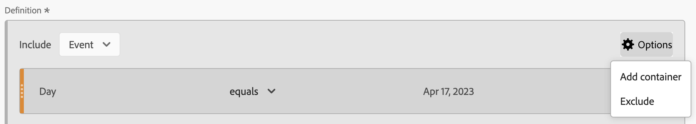

# Créateur de filtres

Le [!UICONTROL Créateur de filtres] vous permet de créer des filtres simples ou complexes qui identifient les attributs et actions des visiteurs entre les visites et les événements. Il fournit un canevas permettant de faire glisser et de déposer des dimensions de mesure, des événements ou d’autres filtres afin de filtrer les visiteurs selon une logique de hiérarchie, des règles et des opérateurs.

Pour plus d’informations sur la création de filtres rapides qui s’appliquent uniquement au projet dans lequel ils sont créés, voir [Filtres rapides](/help/components/filters/quick-filters.md).

## Accès au créateur de filtres

Vous pouvez accéder au Créateur de filtres de l’une des manières suivantes :

* **Navigation supérieure d’Analytics**: Cliquez sur **[!UICONTROL Analytics]** > **[!UICONTROL Composants]** > **[!UICONTROL Filtres]**.
* **[!UICONTROL Analysis Workspace]**: Avec un projet ouvert dans Analysis Workspace, sélectionnez **[!UICONTROL + Composants]** > **[!UICONTROL Créer un filtre]**.
* **[!UICONTROL Reports &amp; Analytics]**: Cliquez sur **[!UICONTROL Analytics]** > **[!UICONTROL Rapports]**, ouvrez un rapport existant et cliquez sur le bouton **Filtrer** dans le volet de navigation de gauche, puis cliquez sur **[!UICONTROL Ajouter]**.
* **[!UICONTROL Report Builder]**: [Ajout ou modification de filtres dans Report Builder](https://experienceleague.adobe.com/docs/analytics/analyze/report-builder/data-requests/segmentation.html?lang=fr).

## Présentation des critères du créateur {#section_F61C4268A5974C788629399ADE1E6E7C}

Vous pouvez ajouter des définitions de règle et des conteneurs pour définir vos filtres. (Pour plus d’informations sur l’accès au créateur de filtres, voir [Accès au créateur de filtres](#access-the-filter-builder).)

1. **[!UICONTROL Titre]**: Nommez le filtre.
1. **[!UICONTROL Description]**: Fournissez une description du filtre.
1. **[!UICONTROL Balises]**: [Balisage du filtre](/help/components/filters/manage-filters.md) vous créez en effectuant une sélection depuis une liste de balises existantes ou en créant une nouvelle balise.
1. **[!UICONTROL Définitions]**: C&#39;est là que vous vous trouvez [création et configuration de filtres](/help/components/filters/filters-overview.md), ajoutez des règles et imbriquez et séquencez des conteneurs.
1. **[!UICONTROL Afficher]** : (Sélecteur Conteneur supérieur.) Permet de sélectionner le niveau supérieur [container](/help/components/filters/filters-overview.md) ( [!UICONTROL Personne], [!UICONTROL Session], [!UICONTROL Événement]). Le conteneur de niveau supérieur par défaut est le conteneur Événement .
1. **[!UICONTROL Options]** : icône (engrenage)

   * **[!UICONTROL + Ajouter un conteneur]**: Permet d’ajouter un nouveau conteneur (sous le conteneur de niveau supérieur) à la définition de filtre.
   * **[!UICONTROL Exclure]**: Permet de définir le filtre en excluant une ou plusieurs dimensions, filtres ou mesures.

1. **[!UICONTROL Dimensions]** : les composants sont glissés et déposés depuis la liste Dimensions (barre latérale orange).
1. **[!UICONTROL Opérateur]** : vous pouvez comparer et contraindre des valeurs en utilisant certains opérateurs.
1. **[!UICONTROL Valeur]**: Valeur que vous avez saisie ou sélectionnée pour la dimension, le filtre ou la mesure.
1. **[!UICONTROL Modèles d’attribution]**: Disponibles uniquement pour les dimensions, ces modèles déterminent les valeurs d’une dimension à filtrer. Les modèles de Dimension sont particulièrement utiles dans les filtres séquentiels.

   * **[!UICONTROL Répétitif]** (défaut) : inclut des instances et des valeurs persistantes pour la dimension.
   * **[!UICONTROL Instance]** : inclut des instances pour la dimension.
   * **[!UICONTROL Instances non répétitives]** : inclut des instances uniques (non répétées) pour la dimension. Il s’agit du modèle appliqué dans le flux lorsque les instances de répétition sont exclues.

   

   **Exemple : Filtre d’événement où eVar1 = A**

   | Exemple | A | A | A (persistante) | B | A | C |
   |---|---|---|---|---|---|---|
   | Répétitif | X | X | X | - | X | - |
   | Instance | X | X | - | - | X | - |
   | Instance non répétitive | X | - | - | - | X | - |
1. **[!UICONTROL And/Or/Then]** : affecte les opérateurs [!UICONTROL AND/OR/THEN] entre des conteneurs ou règles. L’opérateur THEN permet de [définition de filtres séquentiels](/help/components/filters/filters-overview.md).
1. **[!UICONTROL Mesure]** : (barre latérale verte) qui a été glissée-déposée depuis la liste Mesures.
1. **[!UICONTROL Opérateur de comparaison]** : vous pouvez comparer et contraindre des valeurs en utilisant certains opérateurs.
1. **[!UICONTROL Valeur]**: Valeur que vous avez saisie ou sélectionnée pour la dimension, le filtre ou la mesure.
1. **[!UICONTROL X]**: (Supprimer) Permet de supprimer cette partie de la définition de filtre.
1. **[!UICONTROL Publication Experience Cloud]**: La publication d’un filtre Adobe Analytics sur l’Experience Cloud vous permet d’utiliser le filtre correspondant à l’activité marketing dans [!DNL Audience Manager] et dans d’autres canaux d’activation. [En savoir plus...](https://experienceleague.adobe.com/docs/analytics/components/segmentation/segmentation-workflow/seg-publish.html?lang=fr)
1. **[!UICONTROL Bibliothèque d’audiences]**: Les services d’audience d’Adobe gèrent la traduction des données de visiteur en filtres d’audience. Ainsi, la création et la gestion des audiences sont similaires à la création et à l’utilisation de filtres, avec la possibilité de partager le filtre d’audience avec l’Experience Cloud. [En savoir plus...](https://experienceleague.adobe.com/docs/core-services/interface/audiences/audience-library.html?lang=fr)
1. **[!UICONTROL Rechercher]**: Permet d’effectuer une recherche dans la liste des dimensions, filtres ou mesures.
1. **[!UICONTROL Dimensions]** : (Liste) cliquez sur l’en-tête pour développer la liste.
1. **[!UICONTROL Mesures]** : cliquez sur l’en-tête pour développer la liste.
1. **[!UICONTROL Filtres]**: Cliquez sur l’en-tête pour développer la liste.
1. **[!UICONTROL Sélecteur de vue de données]**: Permet de sélectionner la suite de rapports sous laquelle ce filtre sera enregistré. Vous pouvez toujours utiliser le filtre dans toutes les vues de données.
1. **[!UICONTROL Aperçu du filtre]**: Vous permet de prévisualiser les mesures clés afin de vérifier si votre filtre est valide et de déterminer sa largeur. Représente la ventilation du jeu de données que vous pouvez vous attendre à voir si vous appliquez ce filtre. Affiche 3 cercles concentriques et une liste afin d’afficher le nombre et le pourcentage de correspondances pour [!UICONTROL Événement], [!UICONTROL Personne], et [!UICONTROL Session] pour une exécution de filtre par rapport à un jeu de données. Ce graphique est mis à jour immédiatement une fois que vous avez créé ou apporté des modifications à votre définition de filtre.
1. **[!UICONTROL Compatibilité des produits]**: Fournit une liste des produits Adobe Analytics (Analysis Workspace, [!UICONTROL Reports &amp; Analytics], Data Warehouse) avec lequel le filtre que vous avez créé est compatible. La plupart des filtres sont compatibles avec tous les produits. Néanmoins, tous les opérateurs et dimensions ne sont pas compatibles avec l’ensemble des produits Analytics, notamment   [Data Warehouse](https://experienceleague.adobe.com/docs/analytics/components/segmentation/segment-reference/seg-compatibility.html). Ce graphique est mis à jour immédiatement une fois que vous avez apporté des modifications à votre définition de filtre.
1. **[!UICONTROL Enregistrer]** ou **[!UICONTROL Annuler]**: Enregistre ou annule le filtre. Après avoir cliqué sur **[!UICONTROL Enregistrer]**, vous accédez au Gestionnaire de filtres où vous pouvez gérer le filtre.

Les filtres avec plages de dates incorporées fonctionnent toujours différemment dans Analysis Workspace par rapport aux filtres [!UICONTROL Reports &amp; Analytics]: Dans Workspace, un filtre avec une plage de dates incorporée remplace la plage de dates du panneau. En revanche, [!UICONTROL Reports &amp; Analytics] indique l’intersection de la plage de dates du rapport et de la plage de dates incorporée du filtre.

## Création d’un filtre {#build-filters}

1. Faites simplement glisser une Dimension, un filtre ou un événement de mesure du volet de gauche vers le [!UICONTROL Définitions] champ .

   

1. Définissez l’[opérateur](https://experienceleague.adobe.com/docs/analytics/components/segmentation/segment-reference/seg-operators.html?lang=fr) dans le menu déroulant.
1. Saisissez ou sélectionnez une valeur pour l’élément sélectionné.
1. Ajoutez des conteneurs supplémentaires, le cas échéant, en utilisant les règles **[!UICONTROL AND]**, **[!UICONTROL OR]** ou **[!UICONTROL THEN]**.
1. Après avoir placé les conteneurs et défini les règles, consultez les résultats du filtre dans le graphique de validation en haut à droite. Le programme de validation indique le pourcentage et le nombre absolu de pages vues, de visites et de visiteurs uniques qui correspondent au filtre que vous avez créé.
1. Sous **[!UICONTROL Balises]**, [tag](/help/components/filters/manage-filters.md) le conteneur en sélectionnant une balise existante ou en en créant une.
1. Cliquez sur **[!UICONTROL Enregistrer]** pour enregistrer le filtre.

   Vous accédez au [Gestionnaire de filtres](/help/components/filters/manage-filters.md), où vous pouvez baliser, partager et gérer votre filtre de plusieurs manières.

## Ajout d’un conteneur {#section_1C38F15703B44474B0718CEF06639EFD}

Vous pouvez [créer une structure de conteneurs](/help/components/filters/filters-overview.md) et y placer des règles logiques et des opérateurs.

1. Cliquez sur **[!UICONTROL Options > Ajouter un conteneur]**.

   Une nouvelle [!UICONTROL **Événement**] le conteneur s’ouvre sans [!UICONTROL **Événement**] (Page vue) identifiée.

   

1. Modifiez le type de conteneur, le cas échéant.
1. Faites glisser une Dimension, un filtre ou un événement du panneau de gauche vers le conteneur.
1. Continuez à ajouter des conteneurs à partir du bouton de niveau supérieur **[!UICONTROL Options]** > **[!UICONTROL Ajouter un conteneur]** situé en haut de la définition ou ajoutez des conteneurs depuis un conteneur pour imbriquer la logique.

   **OU**

   Sélectionnez une ou plusieurs règles, puis cliquez sur **[!UICONTROL Options]** > **[!UICONTROL Ajouter un conteneur d’après la sélection]**. Votre sélection devient ainsi un conteneur distinct.

## Utilisation de périodes {#concept_252A83D43B6F4A4EBAB55F08AB2A1ACE}

Vous pouvez créer des filtres qui contiennent des périodes flottantes afin de répondre aux questions sur les campagnes ou les événements en cours.

Par exemple, vous pouvez facilement créer un filtre qui inclut &quot;toutes les personnes qui ont effectué un achat au cours des 60 derniers jours&quot;.

Vous créez un conteneur Session et, dans celui-ci, ajoutez le conteneur [!UICONTROL 60 derniers jours] période et mesure [!UICONTROL Les commandes sont supérieures ou égales à 1], avec un opérateur ET.

Voici une vidéo sur l’utilisation de périodes flottantes dans les filtres :

>[!VIDEO](https://video.tv.adobe.com/v/25403/?quality=12)

## Empilage de filtres {#task_58140F17FFD64FF1BC30DC7B0A1B0E6D}

L&#39;empilement de filtres fonctionne en combinant les critères de chaque filtre à l&#39;aide d&#39;un opérateur &quot;et&quot;, puis en appliquant les critères combinés. Vous pouvez le faire dans un projet Workspace directement ou dans le créateur de filtres.

Par exemple, l’empilement d’un filtre &quot;utilisateurs de téléphone mobile&quot; et d’un filtre &quot;géographie États-Unis&quot; renvoie des données uniquement pour les utilisateurs de téléphone mobile aux États-Unis.

Considérez ces filtres comme des blocs de création ou des modules que vous pouvez inclure dans une bibliothèque de filtres pour que les utilisateurs les utilisent à leur guise. Ainsi, vous pouvez réduire considérablement le nombre de filtres nécessaires. Supposons, par exemple, que vous ayez 40 filtres :

* 20 pour les utilisateurs de téléphone mobile dans différents pays (États-Unis_mobile, Allemagne_mobile, France_mobile, Brésil_mobile, etc.)
* 20 pour les utilisateurs de tablette dans différents pays (États-Unis_tablette, Allemagne_tablette, France_tablette, Brésil_tablette, etc.)

En utilisant l’empilement des filtres, vous pouvez réduire votre nombre de filtres à 22 et les empiler selon vos besoins. Vous devez créer les filtres suivants :

* un filtre pour les utilisateurs mobiles ;
* un filtre pour les utilisateurs de tablette
* 20 filtres pour les différents pays

>[!NOTE]
>
>Lors de l’empilement de deux filtres, ils sont par défaut associés à une instruction AND. qui ne peut pas être changée en instruction OR.

1. Accédez au Créateur de filtres.

1. Indiquez un titre et une description pour le filtre.

1. Cliquez sur **[!UICONTROL Afficher les filtres]** pour afficher la liste des filtres dans le volet de navigation de gauche.

1. Faites glisser les filtres à empiler vers le canevas de définition de filtre.

1. Sélectionnez [!UICONTROL **Enregistrer**].

## Filtrer les modèles {#concept_5098446CC78D441E93B8E4D1D1EA6558}

Les modèles de filtre sont fournis pour les cas d’utilisation de filtre courants, tels que &quot;Premières visites&quot; ou &quot;Visites depuis des périphériques mobiles&quot;. Elles sont disponibles dans les projets Workspace et dans le Créateur de filtres en tant que blocs de création pour les nouveaux filtres.

Les modèles sont identifiés par le logo « A » d’Adobe. Vous trouverez ci-dessous un exemple des modèles :

<table id="table_98B87D807E9344C9BEBF072C65D87B1B"> 
 <thead> 
  <tr> 
   <th colname="col1" class="entry"> Nom du modèle </th> 
   <th colname="col2" class="entry"> Définition </th> 
  </tr> 
 </thead>
 <tbody> 
  <tr> 
   <td colname="col1"> Abandonner le panier </td> 
   <td colname="col2">Affiche les données concernant les visiteurs qui ont ajouté des éléments à leur panier mais n’ont rien commandé. Dans la définition de filtre, le conteneur est Visite. La règle de ce filtre séquentiel est la suivante : 
 l’option Ajouts au panier n’a pas la valeur nulle 
 
Alors 
 
Les commandes sont égales à 0. 
 </td> 
  </tr> 
  <tr> 
   <td colname="col1"> Premières visites </td> 
   <td colname="col2">Affiche des données concernant les visiteurs qui ont visité le site au maximum une [1] fois. Dans la définition de filtre, le conteneur est Visite. La règle est la suivante : 
Nombre de visites = 1. 
 </td> 
  </tr> 
  <tr> 
   <td colname="col1"> Non-acheteurs </td> 
   <td colname="col2">Affiche les données concernant les visiteurs qui n’ont pas participé à un événement de commande. Dans la définition de filtre, le conteneur est Visiteur. Ce filtre utilise la logique Exclure . La règle est la suivante : 
Les commandes n’ont pas la valeur nulle. 
 </td> 
  </tr> 
  <tr> 
   <td colname="col1"> Hors visite sur une seule page (sans rebonds) </td> 
   <td colname="col2">Affiche les données concernant les visiteurs qui ont effectué plus d’une visite. Dans la définition de filtre, le conteneur est Visiteur. Ce filtre utilise la logique Exclure . La règle est la suivante : 
L’accès unique n’a pas la valeur nulle. 
 </td> 
  </tr> 
  <tr> 
   <td colname="col1"> Référencement payant </td> 
   <td colname="col2">Affiche les données concernant les visiteurs provenant d’une recherche payante. Dans la définition de filtre, le conteneur est Visite. La règle est la suivante : 
Recherche payée = 1. 
 </td> 
  </tr> 
  <tr> 
   <td colname="col1"> Acheteurs </td> 
   <td colname="col2">Affiche les données concernant les visiteurs qui ont participé à un événement de commande. Dans la définition de filtre, le conteneur est Visiteur. La règle est la suivante : 
Les commandes n’ont pas la valeur nulle. 
 </td> 
  </tr> 
  <tr> 
   <td colname="col1"> Visites renouvelées </td> 
   <td colname="col2">Affiche les données concernant les visiteurs qui ont effectué au moins une visite. Dans la définition de filtre, le conteneur est Visite. La règle est la suivante : 
Nombre de visites supérieur à 1. 
 </td> 
  </tr> 
  <tr> 
   <td colname="col1"> Visites de page unique </td> 
   <td colname="col2"> Affiche les données provenant de visites dans lesquelles vous consultez une seule valeur de page, même si vous pouvez soumettre plusieurs pages vues au cours de cette visite. Les visites de page unique avec des événements de lien de sortie sont incluses dans le filtre. Dans la définition de filtre, le conteneur est Visite. La règle est la suivante : 
Visites de page unique = 1. 
 </td> 
  </tr> 
  <tr> 
   <td colname="col1"> Produit affiché non ajouté au panier </td> 
   <td colname="col2">Affiche les données concernant les visiteurs qui ont affiché des produits mais sans les ajouter au panier. Dans la définition de filtre, le conteneur est Visite. La règle de ce filtre séquentiel est la suivante : 
Les consultations produits n’ont pas la valeur nulle 
 
Alors 
 
 Les ajouts au panier sont égaux à 0. 
 </td> 
  </tr> 
  <tr> 
   <td colname="col1"> Visites à partir de la campagne </td> 
   <td colname="col2">Affiche les données concernant les visiteurs venus par l’entremise des campagnes. Dans la définition de filtre, le conteneur est Visite. La règle est la suivante : 
Le code de suivi n’a pas la valeur nulle. 
 </td> 
  </tr> 
  <tr> 
   <td colname="col1"> Visites depuis des périphériques mobiles </td> 
   <td colname="col2">Affiche les données concernant les visiteurs utilisant des périphériques mobiles. Dans la définition de filtre, le conteneur est Visite. La règle est la suivante : 
Périphérique mobile différent de zéro. 
 </td> 
  </tr> 
  <tr> 
   <td colname="col1"> Visites depuis la recherche naturelle </td> 
   <td colname="col2">Affiche les données concernant les visiteurs ne provenant pas d’une recherche payante. Dans la définition de filtre, le conteneur est Visite. La règle est la suivante : 
Recherche payée = 0. 
 </td> 
  </tr> 
  <tr> 
   <td colname="col1"> Visites à partir de périphériques non mobiles </td> 
   <td colname="col2">Affiche les données concernant les visiteurs n’utilisant pas de périphériques mobiles. Dans la définition de filtre, le conteneur est Visite. Ce filtre utilise la logique Exclure . La règle est la suivante : 
Type de périphérique mobile = Téléphone mobile 
 
OU 
 
Type de périphérique mobile = Tablette. 
 </td> 
  </tr> 
  <tr> 
   <td colname="col1"> Visites à partir de téléphones </td> 
   <td colname="col2">Affiche les données concernant les visiteurs utilisant des téléphones. Dans la définition de filtre, le conteneur est Visite. La règle est la suivante : 
Type de périphérique = Téléphone mobile. 
 </td> 
  </tr> 
  <tr> 
   <td colname="col1"> Visites à partir de moteurs de recherche </td> 
   <td colname="col2">Affiche les données concernant les visiteurs venus par l’entremise des moteurs de recherche. Dans la définition de filtre, le conteneur est Visite. La règle est la suivante : 
Type de référent = Moteurs de recherche 
 </td> 
  </tr> 
  <tr> 
   <td colname="col1"> Visites depuis les sites sociaux </td> 
   <td colname="col2">Affiche les données concernant les visiteurs venus par l’entremise des sites sociaux. Dans la définition de filtre, le conteneur est Visite. La règle est la suivante : 
Type de référent = Réseaux sociaux. 
 </td> 
  </tr> 
  <tr> 
   <td colname="col1"> Visites à partir de tablettes </td> 
   <td colname="col2">Affiche les données concernant les visiteurs utilisant des tablettes. Dans la définition de filtre, le conteneur est Visite. La règle est la suivante : 
Type de périphérique = Tablette. 
 </td> 
  </tr> 
  <tr> 
   <td colname="col1"> Visites avec cookie d’identifiant visiteur </td> 
   <td colname="col2">Affiche les données concernant les visiteurs de votre site, où un cookie persistant est requis. Dans la définition de filtre, le conteneur est Visite. La règle est la suivante : 
Cookie persistant = 1. 
 </td> 
  </tr> 
 </tbody> 
</table>