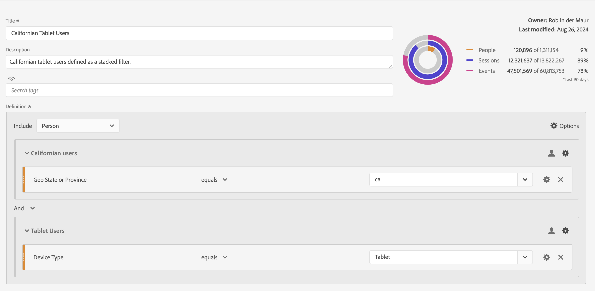

# Création de segments {#build-segments}

<!-- markdownlint-disable MD034 -->

>[!CONTEXTUALHELP]
>id="components_filters_createaudience"
>title="Créer une audience"
>abstract="Les audiences peuvent être créées à partir d’un segment et partagées avec Adobe Experience Platform pour activation."

>[!CONTEXTUALHELP]
>id="components_filters_datapreview"
>title="Prévisualisation des données"
>abstract="Compare les données de ce segment aux données de la vue de données. Le pourcentage de prévisualisation est basé sur le nombre total dans la vue de données des **90 derniers jours**.  Si la prévisualisation ne se charge pas, il se peut que votre connexion soit encore en train de remplir les données."

La boîte de dialogue **[!UICONTROL Créateur de segments]** permet de créer des segments ou de modifier des segments existants. La boîte de dialogue est intitulée **[!UICONTROL Nouveau segment]** ou **[!UICONTROL Modifier le segment]** pour les segments que vous créez ou gérez à partir du gestionnaire [[!UICONTROL Segment]](/help/components/filters/manage-filters.md).

>[!BEGINTABS]

>[!TAB Créateur de segments]

>[!TAB Créer ou modifier un segment]

>[!ENDTABS]

1. Spécifiez les détails suivants ( est obligatoire) :

   | Élément | Description |
   | --- | --- |
   | **[!UICONTROL Vue de données]** | Vous pouvez sélectionner la vue de données du segment.  Le segment que vous définissez est disponible sous la forme d’un segment dans l’onglet [Paramètres](/help/data-views/create-dataview.md#settings-filters) d’une vue de données. |
   | **[!UICONTROL Segment de projet uniquement]** | Une zone d’informations expliquant que le segment n’est visible que dans le projet dans lequel il est créé et que le segment ne sera pas ajouté à votre liste de composants. Activez **[!UICONTROL Rendre ce segment disponible pour tous vos projets et l’ajouter à votre liste de composants]** pour modifier ce paramètre. Cette zone d’informations n’est visible que lorsque vous créez un [segment rapide](quick-filters.md) et que vous convertissez le segment rapide en segment standard à l’aide de l’interface **[!UICONTROL Ouvrir le créateur]** à partir de l’[!UICONTROL Segment rapide]. |
   | **[!UICONTROL Titre]**  | Nommez le segment, par exemple `Last month mobile customers`. |
   | **[!UICONTROL Description]** | Fournissez une description du segment, par exemple : `Segment to define the mobile customers for the last month`. |
   | **[!UICONTROL Étiquettes]** | Organisez le segment en créant ou en appliquant une ou plusieurs balises. Commencez à saisir du texte pour rechercher les balises existantes que vous pouvez sélectionner. Ou appuyez sur **[!UICONTROL ENTRÉE]** pour ajouter une nouvelle balise. Sélectionnez  pour supprimer une étiquette. |
   | **[!UICONTROL Définition]**  | Définissez votre segment à l’aide du [créateur de définitions](#definition-builder). |

   {style="table-layout:auto"}

1. Pour vérifier si votre définition de segment est correcte, utilisez l’aperçu constamment mis à jour des résultats du segment en haut à droite.
1. Pour créer une audience à partir du segment et la partager avec Experience Platform, sélectionnez **[!UICONTROL Créer une audience à partir d’un segment]**. Consultez [Création et publication d’audiences](/help/components/audiences/publish.md) pour plus d’informations.
1. Sélectionnez :
   * **[!UICONTROL Enregistrer]** pour enregistrer le segment.
   * **[!UICONTROL Enregistrer sous]** pour enregistrer une copie du segment.
   * **[!UICONTROL Supprimer]** pour supprimer le segment.
   * **[!UICONTROL Annuler]** pour annuler les modifications apportées au segment ou annuler la création d’un segment.

## Créateur de définitions

Le créateur de définitions permet de créer votre définition de segment. Dans cette construction, vous utilisez des composants, des conteneurs, des opérateurs et une logique.

Vous pouvez configurer le type et l’étendue de votre définition :

1. Pour spécifier le type de votre définition, indiquez si vous souhaitez que la définition soit inclusive ou exclusive. Sélectionnez  **[!UICONTROL Options]** et dans le menu déroulant **[!UICONTROL Inclure]** ou **[!UICONTROL Exclure]**.
1. Pour spécifier la portée de votre définition, choisissez dans le menu déroulant **[!UICONTROL Inclure]** ou **[!UICONTROL Exclure]** si vous souhaitez que la portée de la définition soit **[!UICONTROL Événement]**, **[!UICONTROL Session]**, **[!UICONTROL Personne]**, **[!UICONTROL Compte global]** [!BADGE B2B edition]{type=Informative url="https://experienceleague.adobe.com/fr/docs/analytics-platform/using/cja-overview/cja-b2b/cja-b2b-edition" newtab=true tooltip="Customer Journey Analytics B2B Edition"}, **[!UICONTROL Account]** [!BADGE B2B edition]{type=Informative url="https://experienceleague.adobe.com/fr/docs/analytics-platform/using/cja-overview/cja-b2b/cja-b2b-edition" newtab=true tooltip="Customer Journey Analytics B2B Edition"}, **[!UICONTROL Opportunity]** [!BADGE B2B edition]{type=Informative url="https://experienceleague.adobe.com/fr/docs/analytics-platform/using/cja-overview/cja-b2b/cja-b2b-edition" newtab=true tooltip="Customer Journey Analytics B2B Edition"} ou **[!UICONTROL Groupe d’achat]** [!BADGE B2B edition]{type=Informative url="https://experienceleague.adobe.com/fr/docs/analytics-platform/using/cja-overview/cja-b2b/cja-b2b-edition" newtab=true tooltip="Customer Journey Analytics B2B Edition"}

Vous pourrez toujours modifier ces paramètres ultérieurement.

### Composants

Une partie essentielle de la construction de votre définition de segment consiste à utiliser des dimensions, des mesures, des segments et des périodes existants. Tous ces composants sont disponibles à partir du panneau des composants dans le créateur de segments.

{width=100%}

Pour ajouter un composant :

1. Faites glisser et déposez un composant du panneau Composants sur **[!UICONTROL Faites glisser et déposez ici les mesures, les segments et/ou les dimensions]**. Vous pouvez utiliser la fonction  dans la barre des composants pour rechercher des composants spécifiques.
1. Spécifiez les détails du composant. Par exemple, sélectionnez une valeur dans **[!UICONTROL Sélectionner la valeur]**. Ou Saisissez une valeur. Le contenu et la manière dont vous pouvez spécifier une ou plusieurs valeurs dépendent du composant et de l’opérateur.
1. Modifiez éventuellement l’opérateur par défaut. Par exemple, de **[!UICONTROL égal]** à **[!UICONTROL égal à n’importe lequel]**. Consultez [Opérateurs](operators.md) pour une présentation détaillée des opérateurs disponibles.

Pour ajouter un composant, procédez comme suit :

* Sélectionnez un nouvel opérateur pour le composant dans le menu déroulant opérateur .
* Sélectionnez ou spécifiez une autre valeur pour l’opérateur, le cas échéant.
* Si le type de composant est une dimension, vous pouvez définir le modèle d’attribution. Consultez [Modèle d’attribution](#attribution-models) pour en savoir plus.

Pour ajouter un composant, procédez comme suit :

* Sélectionnez  dans un composant.

### Conteneurs

Vous pouvez regrouper plusieurs composants dans un ou plusieurs conteneurs et définir une logique au sein des conteneurs et entre ceux-ci. Les conteneurs vous permettent de créer des définitions complexes pour votre segment.

{Width=100%}

* Pour ajouter un conteneur, sélectionnez **[!UICONTROL Ajouter un conteneur]** dans  **[!UICONTROL Options]**.
* Pour ajouter un composant existant au conteneur, faites-le glisser dans le conteneur.
* Pour ajouter un autre composant au conteneur, faites glisser un composant du panneau des composants et déposez-le dans le conteneur. Utilisez la ligne d’insertion bleue comme guide.
* Pour ajouter un autre composant à l’extérieur du conteneur, faites glisser un composant depuis le panneau des composants à l’extérieur du conteneur, mais à l’intérieur du conteneur de définition principal. Utilisez la ligne d’insertion bleue comme guide.
* Pour modifier la logique entre les composants d’un conteneur, entre les conteneurs ou entre un conteneur et un composant, sélectionnez les opérateurs **[!UICONTROL Et]**, **[!UICONTROL Ou]** et **[!UICONTROL Alors]** appropriés. Lorsque vous sélectionnez Ensuite, vous transformez le segment en segment séquentiel. Voir [Créer un segment séquentiel](seg-sequential-build.md) pour plus d’informations.
* Pour changer de niveau de conteneur, sélectionnez  **[!UICONTROL Compte global]** [!BADGE B2B Edition]{type=Informative url="https://experienceleague.adobe.com/fr/docs/analytics-platform/using/cja-overview/cja-b2b/cja-b2b-edition" newtab=true tooltip="Customer Journey Analytics B2B Edition"},  **[!UICONTROL Compte]** [!BADGE B2B Edition]{type=Informative url="https://experienceleague.adobe.com/fr/docs/analytics-platform/using/cja-overview/cja-b2b/cja-b2b-edition" newtab=true tooltip="Customer Journey Analytics B2B Edition"},  **[!UICONTROL Opportunité]** [!BADGE B2B Edition]{type=Informative url="https://experienceleague.adobe.com/fr/docs/analytics-platform/using/cja-overview/cja-b2b/cja-b2b-edition" newtab=true tooltip="Customer Journey Analytics B2B Edition"},  **[!UICONTROL Groupe d’achat]** [!BADGE B2B Edition]{type=Informative url="https://experienceleague.adobe.com/fr/docs/analytics-platform/using/cja-overview/cja-b2b/cja-b2b-edition" newtab=true tooltip="Customer Journey Analytics B2B Edition"},  **[!UICONTROL Événement]**,  **[!UICONTROL Session]** ou  **[!UICONTROL Personne]**.

Vous pouvez utiliser  dans un conteneur pour les actions suivantes :

| Action du conteneur | Description |
|---|---|
| **[!UICONTROL Ajouter un conteneur]** | Ajoutez un conteneur imbriqué au conteneur. |
| **[!UICONTROL Exclure]** | Excluez le résultat du conteneur dans la définition de segment. Une fine barre rouge à gauche identifie un conteneur d’exclusion. |
| **[!UICONTROL Inclure]** | Incluez le résultat du conteneur dans la définition de segment. L’inclusion est le paramètre par défaut. Une fine barre grise à gauche identifie un conteneur d’inclusion. |
| **[!UICONTROL Nommer le conteneur]** | Renommez le conteneur à partir de sa description par défaut. Saisissez un nom dans le champ de texte. Si vous ne fournissez aucune entrée, la description par défaut est utilisée. |
| **[!UICONTROL Supprimer le conteneur]** | Supprimez le conteneur de la définition. |

## Périodes

Vous pouvez créer des segments qui contiennent des périodes flottantes. Vous pouvez ainsi répondre aux questions sur les campagnes ou les événements en cours. Par exemple, vous pouvez créer un segment qui comprend *toute personne ayant effectué un achat en ligne au cours des 60 derniers jours*.

>[!BEGINSHADEBOX]

Consultez  [Périodes flottantes dans les segments](https://video.tv.adobe.com/v/25403/?quality=12&learn=on){target="_blank"} pour une vidéo de démonstration.

>[!ENDSHADEBOX]

## Empilement de segments {#stack}

Vous pouvez créer un segment à l’aide de segments. Lorsque vous utilisez des segments dans un segment, vous pouvez optimiser le segment et réduire la complexité.

Imaginez que vous souhaitiez effectuer une segmentation sur la combinaison du type d’appareil (2) et des états américains (50). Vous pouvez créer 100 segments, chacun pour la combinaison unique de type d’appareil (téléphone mobile ou tablette) et d’état des États-Unis. Pour obtenir les utilisateurs de la tablette en Californie, vous devez utiliser l’un des 100 segments :

Vous pouvez également définir 52 segments : 50 segments pour les États américains, un pour le téléphone mobile et un pour la tablette. Empilez ensuite les segments pour obtenir les mêmes résultats. Pour obtenir les utilisateurs de tablettes en Californie, vous devez empiler deux segments :

## Attribution {#attribution}

>[!CONTEXTUALHELP]
>id="components_filters_attribution_repeating"
>title="Répétitif"
>abstract="Inclut des instances et des valeurs persistantes pour la dimension."

>[!CONTEXTUALHELP]
>id="components_filters_attribution_instance"
>title="Instance"
>abstract="Inclut des instances et des valeurs persistantes pour la dimension."

>[!CONTEXTUALHELP]
>id="components_filters_attribution_nonrepeatinginstance"
>title="Instance non répétitive"
>abstract="Inclut des instances uniques (non répétées) pour la dimension."

Lorsque vous utilisez une dimension dans le créateur de segments, vous disposez des options permettant de spécifier le modèle d’attribution pour cette dimension. Le modèle d’attribution que vous sélectionnez détermine si les données sont admissibles pour la condition que vous avez spécifiée pour le composant de dimension.

Sélectionnez  dans le composant de dimension, puis sélectionnez l’un des modèles d’attribution dans la fenêtre contextuelle :

| Modèles | Description |
|---|---|
| **[!UICONTROL Modèle répétitif (par défaut)]** | Incluez l’instance et les valeurs persistantes pour la dimension afin de déterminer la qualification. |
| **[!UICONTROL Instance]** | Incluez uniquement des valeurs d’instance pour la dimension afin de déterminer la qualification. |
| **[!UICONTROL Instance non répétitive]** | Incluez des valeurs d’instance uniques (non répétitives) pour la dimension afin de déterminer la qualification. |

### Exemple

Dans le cadre d’une définition de segment, vous avez spécifié la condition suivante : Le nom de page est égal à Femmes. Similaire à l’exemple ci-dessus. Vous répétez cette définition de segment à l’aide des deux autres modèles d’attribution. Vous disposez donc de trois segments ayant chacun leur propre modèle d’attribution :

* Page Femmes - Attribution - Répétition (par défaut)
* Page Femmes - Attribution - Instance
* Page Femmes - Attribution - Instance non répétitive

Le tableau ci-dessous explique, pour chaque modèle d’attribution, les événements entrants qualifiés  pour cette condition.

| Page Femmes - Attribution -  *Modèle d’attribution* | Événement 1 :  Nom de page égal Femmes | Événement 2 :  Nom de page égal  Hommes | Événement 3 :  Nom de page égal Femmes | Événement 4 :  Nom de page égal Femmes (persistant) | Événement 5 :  Nom depage égal Passage en caisse | Événement 6 :  Nom de page égal Femmes | Événement 7 :  Nom de page égal Accueil |
|---|:---:|:---:|:---:|:---:|:---:|:---:|:--:|
| Répétition (par défaut) |  |  |  |  |  |  |  |
| Instance |  |  |  |  |  |  |  |
| Instance non répétitive |  |  |  |  |  |  |  |

Un exemple de rapport sur les événements utilisant les trois segments se présente comme suit :

<!-- markdownlint-enable MD034 -->