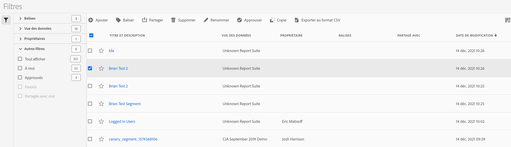

# Gestion des filtres

Le Gestionnaire de filtres offre plusieurs manières d’organiser les filtres, par exemple le partage, le balisage, l’approbation, la copie, la suppression et le marquage comme favoris.

Le Gestionnaire de filtres vous présente tous les filtres que vous possédez et qui ont été partagés avec vous. Les utilisateurs de niveau administrateur peuvent consulter tous les filtres de l’entreprise. Cet aperçu présente l’interface utilisateur et les fonctionnalités du Gestionnaire de filtres.

Accédez au Gestionnaire de filtres en cliquant sur **[!UICONTROL Customer Journey Analysis]** > **[!UICONTROL Components]** > **[!UICONTROL Filters]** dans le volet de navigation supérieur.

## Interface utilisateur du Gestionnaire de filtres

| # | Fonction de l’interface utilisateur | Description |
|---|---|---|
| 1 | Barre d’outils du Gestionnaire de filtres | Une fois que vous avez coché un filtre, cette barre d’outils s’affiche. La plupart des tâches de gestion peuvent être réalisées depuis cette barre. |
| 2 | Cases à cocher | Cochez un filtre pour le gérer. |
| 4 | Favoris | En cliquant sur l’étoile à côté d’un filtre, l’étoile devient jaune et le filtre est marqué comme favori. |
| 5 | Titre et description | Fournis dans le Créateur de filtres. Pour modifier le titre et la description, cliquez sur le lien du titre : cela vous ramène au Créateur de filtres. |
| 6 | Suites de rapports | Cette colonne indique dans quelle suite de rapports le filtre été enregistré en dernier. |
| 7 | Propriétaire | Indique qui possède le filtre. En tant que non administrateur, vous ne pouvez consulter que les filtres que vous possédez ou ceux qui ont été partagés avec vous. |
| 8 | Balises (non cochées dans le sélecteur de colonnes, de ce fait, la colonne n’apparaît pas) | Les balises qui ont été appliquées au filtre, soit par vous, soit par des personnes qui ont partagé le filtre avec vous. |
| 9 | Partagé avec | Répertorie les individus ou les groupes (administrateur uniquement) ou toutes les personnes (administrateur uniquement) avec lesquelles vous avez partagé le filtre. |
| 10 | Date de modification | Affiche la date de la dernière modification du filtre. |
| 11 | Sélecteur de colonnes | (En haut à droite) Permet de sélectionner les colonnes à afficher dans le Gestionnaire de filtres. |
| 12 | Icône Partagé | Indique que ce filtre est partagé par ou avec vous. |
| 13 | Icône Approuvé | Indique que ce filtre a été approuvé par un administrateur. |
| 14 | Autres filtres | Permet d’afficher les filtres par Balises, Suites de rapports, Propriétaires et Autres (Afficher tout, À moi, Partagé avec moi, Approuvés, Favoris). |

## Planification des filtres

Si vous consacrez du temps à la planification des filtres, vous augmentez les chances qu’ils soient utiles à votre entreprise et que leur nombre soit surveillé.

* Prenez l’audience en considération : qui va l’utiliser ? Avec qui allez-vous le partager ? Quels groupes de personnes utiliseront ce filtre et comment dois-je le baliser en conséquence ? Cela signifie fournir également une description adéquate du filtre. Au minimum, la description doit répondre aux questions suivantes :

   * Quel est l’objet de ce filtre ?

   * Quand dois-je utiliser ce filtre ?

* Déterminez la portée du filtre. Quel [conteneur de filtre](/help/components/filters/filters-overview.md) représente le mieux sa portée ? Utilisez le plus petit conteneur possible.

* Déterminez les éléments à inclure dans la définition du filtre ainsi que les valeurs.

* Déterminez comment vous souhaitez que votre processus d’approbation se déroule. Est-ce qu’une seule personne consultera et approuvera les filtres ou s’agira-t-il d’une décision en comité ?

* Définissez vos filtres avec une vue sur une bibliothèque de filtres qui permet aux utilisateurs d’empiler et de réutiliser, de manière modulaire, des parties ou composants de filtres. Quels « modules » devez-vous définir pour faire de cette bibliothèque une réalité ?

### Balisage de filtres

Dans le Gestionnaire de filtres, le balisage de filtres permet de les organiser. Tous les utilisateurs peuvent créer des balises pour les filtres et en appliquer une ou plusieurs à un filtre. Néanmoins, vous ne pouvez afficher les balises que pour les filtres que vous possédez ou qui ont été partagés avec vous.

Quels types de balises devriez-vous créer ? Vous trouverez ci-dessous quelques suggestions de balises utiles :

* Des balises basées sur des noms d’équipe, par exemple Marketing des réseaux sociaux, Marketing des périphériques mobiles.

* Les balises Projet (balises d’analyse), telles que l’analyse de la page d’accès.

* Les balises Catégorie : Hommes ; géographie.

* Les balises Processus : Sous réserve d’approbation ; Organisé pour (une unité opérationnelle spécifique).

Pour baliser un filtre :

1. Dans le Gestionnaire de filtres, cochez la case en regard du filtre que vous souhaitez baliser. La barre d’outils de gestion des filtres apparaît.

1. Cliquez sur **[!UICONTROL Tag]** et soit

   * effectuez une sélection parmi les balises existantes, soit

   * saisissez un nouveau nom de balise et appuyez sur **[!UICONTROL Enter]**.

1. Cliquez à nouveau sur **[!UICONTROL Tag]** pour baliser le filtre.

La balise doit à présent apparaître dans la colonne Balises. (Cliquez sur l’icône en forme d’engrenage dans la partie supérieure droite pour gérer vos colonnes.)
Vous pouvez également filtrer par balises en accédant à **[!UICONTROL Filters > Tags]**.

### Approbation de filtres

Dans le Gestionnaire de filtres, vous pouvez configurer un processus qui inclut l’approbation de filtres pour différents niveaux d’application, pour des services ou des groupes spécifiques, en toute cohérence avec les règles de création de rapports.

Procédez comme suit pour marquer un filtre comme approuvé :

1. Dans le Gestionnaire de filtres, cochez la case à gauche du titre du titre du filtre.

1. Cliquez sur **[!UICONTROL Approve]** dans la barre de tâche de la gestion des filtres.

1. Envisagez de partager le filtre approuvé avec votre entreprise.

1. Cliquez sur **[!UICONTROL OK]**.

   Remarquez l’icône d’approbation en regard du filtre dans la liste :

   

1. Vous pouvez également annuler l’approbation d’un filtre approuvé en cliquant sur **[!UICONTROL Unapprove]**.

### Partage de filtres

Selon vos autorisations, vous pouvez partager des filtres avec l’ensemble de l’entreprise, des groupes ou des utilisateurs individuels.

| Administrateur | Non administrateur |
|---|---|
| Peut partager des filtres avec l’ensemble de l’entreprise (Tous), avec des groupes et avec des utilisateurs. Voir la [documentation Admin Console](https://helpx.adobe.com/fr/enterprise/using/manage-products-and-profiles.html) pour en savoir plus. | Peut partager des filtres uniquement avec des utilisateurs individuels. |

A quel moment devriez-vous partager des filtres au niveau de l’entreprise au lieu de vous limiter à des groupes d’utilisateurs ou des individus ? Vous trouverez ci-dessous quelques bonnes pratiques que vous pouvez suivre :

* En tant qu’administrateur, partagez un filtre avec Tous s’il est utile à l’ensemble de l’entreprise et si tout le monde sait l’utiliser correctement. Dans ce cas, vous devez également envisager d’en faire un filtre approuvée.

* En tant qu’administrateur, partagez un filtre avec un profil produit si le filtre offre une valeur ajoutée intéressante à l’équipe en question. N’approuvez pas officiellement ce type de filtre.

* En tant qu’administrateur ou utilisateur individuel, le partage d’un filtre avec d’autres individus approuve et valide le filtre en question. S’il ne s’avère pas utile, il peut être ignoré. N’approuvez pas officiellement ce type de filtre.

Pour partager un filtre :

1. Dans le Gestionnaire de filtres, cochez la case en regard du filtre que vous souhaitez partager.

1. Dans la barre d’outils de la gestion des filtres, cliquez sur **[!UICONTROL Share]**.

1. Si vous êtes administrateur, vous pouvez sélectionner Tous ou effectuer une sélection dans les Groupes et Utilisateurs de votre entreprise. En tant que non administrateur, vous ne pouvez consulter que les utilisateurs individuels. Utilisez le champ Rechercher pour rechercher des groupes ou des utilisateurs. Cliquez sur **[!UICONTROL Share]**. L’icône Partagé s’affiche en regard du filtre : 

1. Vous pouvez filtrer les filtres partagés avec vous en accédant à Filtres > Autres filtres > Partagé avec moi.

### Marquage de filtres comme favoris

Le marquage des filtres comme que favoris est une autre manière de les organiser pour en faciliter l’utilisation.

1. Dans le Gestionnaire de filtres, cochez l’étoile en regard du filtre que vous souhaitez marquer comme favori. L’étoile devient jaune lorsque vous la sélectionnez.

1. Vous pouvez également filtrer par favoris en accédant à Filtres > Autres filtres > Favoris.

